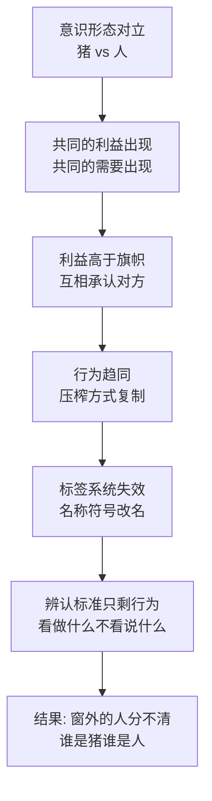
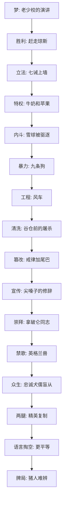

# 18｜最后一幕的牌局：我们如何辨认今天的「猪」？

> 猪和人坐到一张牌桌上，两张黑桃 A 同时甩出来——窗外的动物为什么再也分不清谁是谁？

---

## 一、先说结论

《动物农庄》的最后一幕是一场晚宴：猪邀请附近的人类农场主来农舍做客，喝酒、致辞、打牌。皮尔金顿先生在祝酒词里夸拿破仑「把下等动物管理得井井有条」——他羡慕的不是革命理想，是更低的口粮和更长的工时；拿破仑回敬，宣布废除「同志」称呼、旗帜去掉蹄角、农庄改回原名「曼诺农庄」。然后打牌，人和猪同时甩出一张黑桃 A——牌局里只有一张黑桃 A，两张同时出现，说明两边都在作弊。窗外围观的动物把脸从猪移到人、从人移到猪，「已经分不清谁是猪，谁是人了」。奥威尔的终局答案是：**辨认暴政不能看旗帜、名称和口号，只能看行为——当新统治者和旧统治者坐到一张桌上出千时，革命就白打了。**

## 二、我们先理解一个问题

先注意牌桌上坐的是谁。

皮尔金顿是福克斯伍德农庄的农场主，弗雷德里克是平彻菲尔德农庄的农场主——两个人类邻居，从革命第一天起就是动物农庄的死对头。他们传播过「动物农庄闹饥荒」的谣言，弗雷德里克还真刀真枪打过来，炸掉了风车。「人」在七诫里被定义为唯一的、永远的敌人。

可现在，敌人坐在农舍的餐桌边，和猪碰杯、互夸、打牌。而动物们——革命的参加者、风车的建造者——被允许做的唯一一件事，是趴在窗外看。

如果旗帜、名称、「谁是敌人」这些标识全部失效了，一个人还能拿什么来判断：我面对的到底是不是暴政？

## 三、作者到底提出了什么观点？

书中写道，这场晚宴的每个环节都是一次身份确认。

皮尔金顿的致辞先挑明了人的立场：他承认过去对动物农庄有「误解」，现在他放心了——因为这里的猪「把下等动物管理得井井有条」，劳动时间更长、口粮配给更低。这句话揭了底：人类农场主怕的从来不是动物有猪领导，怕的是动物革命传染给自己的牲畜；一旦发现猪农庄的压榨效率比人还高，敌意立刻变成敬意。

拿破仑的回敬更彻底：废除「同志」称呼——革命话语清算；老少校的头骨不再陈列——革命图腾下架；旗帜上的蹄角去掉——革命符号摘除；农庄名字从「动物农庄」改回「曼诺农庄」——革命本身从地名上注销。他在完成一次彻底的复辟，而且用的是「新时代」的措辞。

高潮在牌桌上：打到最后，皮尔金顿和拿破仑同时甩出一张黑桃 A——牌局里只有一张黑桃 A，两张同时出现，说明两边都在作弊。争吵爆发，而窗外的动物看着这一张张脸——先是人脸，再是猪脸——「已经分不清谁是猪，谁是人了」。

奥威尔认为，这一幕影射的是战时同盟：意识形态对立的双方为了共同利益坐到一张桌上，又在分赃时立刻翻脸。而「猪人难辨」是他留给全书的最后判词：暴政的辨认标准是行为，不是物种。

## 四、把这个观点翻译成人话

用大白话说：**鉴定统治者的成色，别看他打什么旗，看他干哪些事。**

动物们从头到尾都在用「标签」判断世界：四条腿是好的，两条腿是坏的；动物是同志，人是敌人；蹄角旗是正义的，新名字是解放的。可最后一幕把这套标签体系全部作废——猪穿人的衣服、住人的房子、跟人称兄道弟、连作弊的手法都一模一样。标签还在，标签下的东西已经换完了。

「分不清谁是猪谁是人」的意思不是脸长得像，而是**行为集合完全重合**：同样的特权、同样的鞭子、同样的压榨效率、同样的出千手法。当牌桌上的两方用同一种作弊方式抢同一张 A，你数腿已经没有意义了——要辨认压迫，唯一的办法是列行为清单：谁占有产出，谁免除劳动，谁垄断暴力，谁改写规则。清单一样，就是同一种东西。

## 五、为什么会这样？

为什么意识形态的死敌能坐到一张桌上？奥威尔的逻辑是这样的：

这条链上两个环节最关键。

第一是「利益对意识形态的溶解力」。皮尔金顿致辞里那句「井井有条」是题眼：他赞扬猪农庄，是因为它提供了「更低的口粮和更长的工时」——人类农场主从猪身上学到的不是革命，是管理技术。仇恨在利益面前融化的速度，比风车倒塌还快。影射到历史中，这对应着战时同盟的权宜本质：昨天还是死敌，今天为了分一张牌桌就能碰杯。

第二是「辨认标准的迁移」。全书暗藏着动物们辨认方式的退化史：最初靠物种（腿的数量），后来靠戒律（墙上的字），再后来靠名称（同志、旗帜、农庄名）——被一项项废除后，只剩无法伪装的行为。当一切标签失效，你还剩下行为清单。

## 六、举一个现实生活中的例子

想一想那家换了三任领导的公司。

第一任是「老派家长」：威严、层级分明、开会听他一个人讲，员工终于把他盼走了。第二任是「改革派」：上来就喊扁平化、喊「我们是伙伴不是雇佣」——半年后 KPI 加码、汇报线翻倍，打卡都多了两道。第三任是「务实派」：不谈情怀只谈狼性，做的事和第一任一模一样：压成本、提指标、换汤不换药的奖惩表。

三任领导，三种口号，三套旗帜——员工后来总结出一个朴素的发现：名字换了，旗换了，KPI 没变，汇报线没变，压榨方式没变。你在工位上的每一天，感受的是行为清单而不是口号清单；而那份行为清单，三任长得一模一样。

这就是窗外动物的视角：三任领导在同一张桌上打同一副牌，出千的姿势都没换。辨认压迫的标准从来不是「他宣称他是什么」，是「他分配了什么、豁免了什么、垄断了什么」。

## 七、回到书中重新理解

回到书里，这一幕的历史坐标很清晰。皮尔金顿和弗雷德里克影射的是资本主义阵营的邻居，猪与人在农舍的晚宴影射的是德黑兰会议式的战时同盟：意识形态的对立在共同利益面前暂时搁置，而两张黑桃 A 同时甩出，则预言了同盟的脆弱——合作是因为眼下要分的赃一致，翻脸是迟早的事。

但奥威尔的目光越过了历史影射。他安排动物们「从窗外看」，这个视角本身就是判词：被排除在牌桌之外，反而能看清牌桌上的一切——被统治者看不懂规则、念不出戒律，但认得出动作。当外在标识全部混淆，剩下的辨别力只有一种：看动作。

所以这本书最后留下的不是一个绝望画面，而是一套辨认方法：曼诺农庄的名字改回去了，旗帜改了，称呼改了——一切可改的都改了，唯一没改也改不了的是那张行为清单：谁占有产出、谁拿鞭子、谁在出千。

## 八、这个观点背后还有什么？

第一，注意致辞里「井井有条」的信息量。皮尔金顿羡慕的指标是「更低的口粮、更长的工时」——人类农场主把动物农庄看成了「管理创新样本」。这解释了为什么压迫体制能赢得外部尊重：压迫者之间认的不是意识形态，是绩效。当你的压榨效率成了同行的榜样，意识形态对立就只剩表演功能。

第二，拿破仑的改革清单——废「同志」、摘蹄角、改回原名——有个共同方向：全是符号，没有一条触及实质。配给没变、鞭子没变、特权没变。政权的「转向」总是先在符号层完成，因为符号最便宜。这也是辨认的陷阱：如果你只跟踪名字和旗帜，你会把「曼诺农庄」误读成「新时代」。

第三，窗外的动物「分不清」还有一层原因：他们是从下面看的。被统治者辨认压迫者从来不是看脸，是看仰角——从下往上看，所有拿鞭子的背影都差不多。趴着窗看，就是奥威尔示范的正确机位：永远从被统治者的视角辨认统治者。

## 九、这个观点有问题吗？

说服力在哪：「以行为而非标签辨认暴政」是这个寓言最经得起时间检验的部分。意识形态会过期，旗帜会换新，名称会改回去——但「谁占有产出、谁垄断暴力、谁豁免规则」这张清单在任何时代都通用。奥威尔用一场牌局把「敌我识别」从站队问题还原成观察问题，方法论的清晰度至今没过时。

争议在哪：第一，「猪人难辨」可能被读成「一切统治者都一样」的虚无结论——但奥威尔本人是民主社会主义者，他否定的是打着平等旗号的专制，不是取消统治之间的差别；读成「反正都一样」恰好是本杰明的台词。第二，两张黑桃 A 的「双方都在作弊」是否公平？一些学者认为这暗示「各打五十大板」——但也可以读作奥威尔只对「权力的共性」下判词，不对「体制的差别」下判词。

哪里过度简化：寓言把「辨认」压缩成一次隔窗观看，但现实中的辨认是长期工程——行为清单需要信息、需要记忆、需要比较对象，而书里动物们之所以最后只能「看脸」，恰恰是因为这些信息通道早就被掐断了。结尾的辨认方法成立，但它的前提条件书里已经展示过多么难凑齐。

还有哪些其他解释：一种解释从心理而非政治出发——分不清猪和人，写的是「看久了就习惯」的适应机制，暴力被日常化后压迫者自动「去妖魔化」；另一种解释从文学结构出发——猪人难辨是全书环形结构的封口：开头动物听琼斯农庄的故事，结尾趴着看猪农庄的晚宴，画面一样，只是窗里的人换了。

## 十、今天再看这个观点

以下部分是基于作者思想的现代延伸，不是作者原话。

「分清猪和人」今天比书里更难，因为伪装技术迭代了。书里猪还要学两条腿穿衣服，今天的「猪」直接继承全套合法外观：合规架构、体面宣言、专业公关。行为清单的辨认法因此更重要——你不能只看发布会上的蹄子，要看考勤表上的鞭痕。

牌局也在天天上演。死对头突然合作，昨天互撕的双方今天联合声明——利益对旗帜的溶解从不需要意识形态先和解。两张黑桃 A 教我们看的不是「他们怎么会合作」，而是「他们在抢同一张牌」：牌桌上的合作都是分赃，窗外的观众才是代价。

奥威尔留下的真正作业不是「认出猪」，是承认自己多半站在窗外：你看清了牌局，你分不清脸，但你看得清动作——而动作清单，是任何窗户都挡不住的。

## 十一、这一篇真正应该记住什么？

1. 辨认暴政看行为不看标签：名称、旗帜、称呼都能一夜换掉，行为清单换不掉。
2. 利益溶解意识形态：皮尔金顿夸的不是革命是绩效——压迫者之间只认效率。
3. 转向永远先改符号：废称呼、摘标志、改名字最便宜，配给和鞭子纹丝不动。
4. 观察位置在窗外：从下往上看，所有拿鞭子的背影都差不多——被统治者的视角才是正确机位。

## 十二、留一个问题

如果辨认压迫只能靠行为清单，那你身边那张牌桌上，此刻坐着谁？你能列出他的行为清单吗——他占有了什么，豁免了什么，垄断了什么，又改掉了哪些名字来掩护这些不变？

这个问题不再留给下一篇，书到这里已经讲完——它要留给你。

## 系列收束

还记得这个系列最开始的地方吗——一头老猪临死前的那个梦。《英格兰兽》唱的是「所有动物终将自由」，那是整条河的源头：先有人把痛苦翻译成理论，才有人敢造反。

然后我们看到了这条河怎么流：梦变成胜利和立法，立法挡不住特权，特权引来内斗、暴力、工程和清洗，清洗之后是篡改、宣传和崇拜，崇拜容不下当年的歌。禁歌之后轮到众生登场——忠诚者累死，犬儒者沉默，盲从者喊口号，反抗者饿死，投机者舒服。再往后猪站了起来，墙上只剩一句悖论，窗外的动物再也分不清牌桌上的脸。

这条线最冷的地方在于：它不是一条下行线，而是一个环——终点的曼诺农庄，和起点的曼诺农庄，是同一个名字。梦最后回到了它被讲出来的地方，只是做梦的人换了一批，听梦的人换了一批，梦的内容一个字没变。

但奥威尔没有把门关死，他把最后一格留给了窗外的动物——也就是留给了读者。那双眼睛是全书唯一没被收编的位置：看不懂戒律，喊不齐口号，但看得见动作，数得出鞭子。从一场演讲开始，到一双眼睛结束，这本书传递的不是绝望，是辨认力的遗产。

现在轮到你了：合上这本书，你准备怎么辨认你的牌桌？
