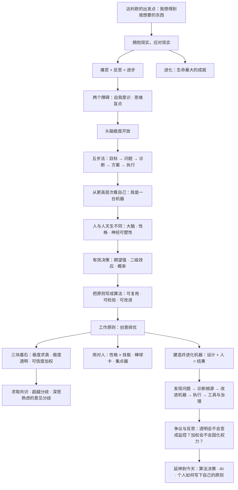

# 《原则：生活和工作》深度解读系列

## 系列简介

瑞·达利欧（Ray Dalio）是桥水基金（Bridgewater Associates）的创始人。这家公司从 1975 年一间两居室公寓起步，后来成为全球规模最大的对冲基金，管理资产一度超过 1500 亿美元。达利欧把这一切归因于一件听起来很朴素的东西——**原则**。

书中所谓「原则」，不是道德口号，而是一套**经过反复验证的决策规则**：遇到某类情况，我按什么标准判断、采取什么行动。达利欧认为，人和组织之所以反复被同样的坑绊倒，往往不是因为不够聪明，而是因为从未把「自己是怎么做决定的」写清楚。

这本书分三部分：**我的历程**（他如何在一次次失败中提炼出原则）、**生活原则**（如何与自己相处、如何思考与决策）、**工作原则**（如何与人合作，把组织打造成一台不断进化的机器）。全书包含 21 条高层次原则、139 条中层次原则和 365 条分原则。

本系列不按原书目录复述，而是重建一条认知链：先弄清「原则是什么、为什么需要它」，再走进达利欧那些代价高昂的失败与反思，然后依次拆解生活原则与工作原则的核心机制——极度求真、极度透明、可信度加权、创意择优、把组织当机器，最后回到最重要也最诚实的一步：**这套体系哪里靠得住，哪里值得怀疑，以及你该如何写下自己的原则。**

---

## 全书核心问题

| 层次 | 问题 |
|---|---|
| 定义问题 | 「原则」到底是什么？为什么没有原则的人，其实也在被别人的原则支配？ |
| 起点问题 | 为什么达利欧把「拥抱现实」放在一切方法的开端？ |
| 心理问题 | 为什么我们明明想成功，却总是回避真相、掩盖错误、拒绝批评？ |
| 方法问题 | 如何把「解决问题」拆成一套可重复执行的流程？ |
| 组织问题 | 一个组织如何既容纳分歧、又快速达成正确决策？ |
| 工具问题 | 为什么达利欧坚持把决策「算法化」，甚至给所有会议录音？ |
| 反思问题 | 极度透明、可信度加权、严格的爱，边界在哪里？代价是什么？ |
| 终极问题 | 如果原则可以写下来、被检验、被改进，那么普通人该如何建立自己的原则？ |

一句话版本：

> **当现实不会因为你的愿望而改变时，你该用什么标准做决定，又该如何不断修正这些标准？**

---

## 全书知识地图



再压缩成一句话：

```text
现实不可协商
  → 谁更接近真相，谁就更容易得到想要的结果
  → 而人最大的敌人是自己（自我 + 盲点）
  → 所以要极度开放 → 五步法 → 把自己和组织当机器
  → 用极度求真 + 极度透明 + 可信度加权，实现创意择优
  → 最后：原则不是信条，而是可以被推翻和升级的算法
```

---

## 全系列目录

### 第一部分：先弄清「原则」是什么

#### 01｜为什么一本「失败者的笔记」，会变成全球畅销的管理书？

核心问题：一位对冲基金创始人写的工作手册，为什么能同时打动比尔·盖茨、普通职员和创业者？

核心观点：《原则》之所以流行，不是因为它提供了成功公式，而是因为它做了一件反常识的事：把「人如何做决策」这件事本身，当作一个可以研究、可以写下来、可以迭代的系统。达利欧的起点不是「我很成功」，而是「我犯过代价极大的错，所以我必须把判断标准写清楚」。

理解难度：★★☆☆☆

关键词：桥水、原则的由来、可复用的决策规则

---

#### 02｜到底什么是「原则」？为什么没有原则的人，也在被别人的原则支配？

核心问题：原则与价值观、目标、做事方法，究竟有什么区别？

核心观点：价值观是「你认为什么重要」，原则是「遇到情况时你按什么标准做决定」。达利欧的定义是：原则是应对现实、从而得到你想要的东西的有效方式。关键在于——如果你没有明确的、属于自己的原则，你就只能临时凭情绪判断，或默认接受他人的原则。**不选择，也是一种选择。**

理解难度：★★☆☆☆

关键词：价值观 vs 原则、显性规则、默认规则

---

#### 03｜为什么「拥抱现实」是一切方法的原点？

核心问题：为什么达利欧把「拥抱现实，应对现实」放在生活原则的第一条？这不就是句常识吗？

核心观点：达利欧所说的拥抱现实，包含几层反直觉主张：现实是客观的、不会因你的愿望而改变；痛苦是现实在给你反馈，而不是需要被逃避的信号；**自然规律（进化、竞争、周期）比个人好恶更根本**。承认现实，是一切有效行动的前提。

理解难度：★★★☆☆

关键词：拥抱现实、客观现实、自然规律、进化

---

#### 04｜痛苦 + 反思 = 进步：为什么痛苦是进化的信号？

核心问题：为什么达利欧把「痛苦」当作必须被欢迎的东西，而不是应该被避免的东西？

核心观点：人在遇到痛苦时有两种反应——逃避痛苦，或者直面并反思。前者换来暂时的舒适，后者换来能力的提升。达利欧把这条等式当成人生最重要的元规则之一：痛苦是信号，说明现实与期望出现了落差；反思是把落差转化为原则的唯一途径。

理解难度：★★★☆☆

关键词：痛苦+反思=进步、落差、元规则

---

### 第二部分：失败如何塑造原则

#### 05｜1982 年的那次误判：一次「几乎破产」如何造就了极度谦逊？

核心问题：达利欧一生最惨的失败，为什么反而被他称为「最好的事」？

核心观点：1982 年，达利欧公开预测美国经济将陷入萧条，结果市场迎来大牛市，他几乎赔光了一切，被迫辞退所有员工，向父亲借了 4000 美元。这次教训让他从「我相信我是对的」转向「**我怎么知道我是不是对的**」，并开始把决策标准逐条写下来——这正是《原则》的种子。**谦逊不是性格，而是被现实教育出来的结论。**

理解难度：★★★☆☆

关键词：1982 年危机、墨西哥债务违约、极度谦逊、原则的起源

---

#### 06｜为什么最难看清的人，其实是自己？——两个障碍

核心问题：为什么聪明人也会犯大错，还坚信自己没错？

核心观点：达利欧提出两个普遍的心理障碍：**自我意识障碍**（ego barrier）——我们本能地维护「我是对的」，把批评当成攻击；**思维盲点障碍**（blind spot barrier）——每个人都只能看到自己脑子擅长看到的东西，看不到别人的视角。这两个障碍不会因为智商高而消失，反而常被聪明放大。

理解难度：★★★☆☆

关键词：自我意识障碍、思维盲点障碍、防御机制

---

#### 07｜头脑极度开放：为什么它比聪明更重要？

核心问题：既然智力不能保证正确，「极度开放」具体要怎么做？

核心观点：极度开放不是礼貌地听别人说完，而是**真正去追问「我怎么知道我是对的」「你可能是对的那部分在哪里」**。达利欧把开放程度、能力、决心并列为成功的三个要素。要做到开放，必须区分「我的观点」与「我的价值」——可以否定观点，而不必否定自己。

理解难度：★★★☆☆

关键词：极度开放、追问、我可能错在哪里、观点与自我分离

---

### 第三部分：生活原则——把人生当成可改进的系统

#### 08｜五步法（上）：目标、问题、诊断

核心问题：为什么实现任何人生愿望，都可以被拆成五个固定步骤？

核心观点：达利欧的五步流程是：① 设定清晰目标 ② 找出并「不容忍」阻碍目标的问题 ③ 诊断问题、找到根本原因 ④ 设计方案 ⑤ 坚决执行。前两步的关键是**分清愿望与目标**，并拒绝把问题「合理化」掉。找不到问题，就不会有任何改进。

理解难度：★★★☆☆

关键词：五步流程、清晰目标、不容忍问题、根本原因

---

#### 09｜五步法（下）：方案与执行，以及「弱点不重要，方案才重要」

核心观点：达利欧提醒，五个步骤必须**按顺序、一次只做一种思考**：定目标时就只定目标，不要同时纠结可行性；诊断时就只找原因，不要急着开药方。更重要的是，他不认为要「补齐所有短板」——弱点本身不致命，**没有应对弱点的方案才致命**。

核心问题：为什么很多人明明诊断出了原因，最后还是一事无成？

理解难度：★★★☆☆

关键词：设计方案、执行到底、弱点与方案、一次做一种思考

---

#### 10｜从更高层次看自己：把自己当成一台机器

核心问题：什么叫「站到更高一层看自己」？这会不会让人变得冷漠机械？

核心观点：达利欧主张把自己拆成两部分：**设计者（designer）与工作者（worker）**。当你遇到失败时，不是问「我怎么这么差」，而是像工程师一样问：「是设计的问题，还是执行的问题？我该怎么改设计？」这不是把人变成机器，而是用机器隐喻，把自我评价从「我好不好」转换成「系统该怎么改」。

理解难度：★★★★☆

关键词：设计者视角、机器隐喻、设计 vs 执行、高于自己

---

#### 11｜为什么「懂人」是成功的关键？——大脑、性格与神经可塑性

核心问题：如果人与人天生不同，我们该认命，还是该改变？

核心观点：达利欧的生活原则第四条是「理解人与人大不相同」：不同的人大脑处理信息的方式、擅长的角色天然有别，用错人比用错方法更致命。但同时，神经科学表明大脑具有**可塑性**——习惯与思维方式可以通过训练改变。**差异是事实，固化不是宿命。**

理解难度：★★★★☆

关键词：神经可塑性、性格差异、大脑分工、团队搭配

---

#### 12｜学习如何有效决策：期望值、二级效应与概率

核心问题：为什么大多数人的决策方式，本质上是在「碰运气」？

核心观点：达利欧的决策方法核心是：**把决策当作概率问题，而不是对错问题**；关注期望值而非单次结果；优先看「二级、三级效应」，因为第一层效应往往与直觉一致、却与长期结果相反。此外，他主张用「简化」对抗信息过载——抓住少数关键变量。

理解难度：★★★★☆

关键词：期望值、二级效应、概率思维、简化

---

#### 13｜把决策写成算法：原则为什么必须能被检验？

核心问题：为什么达利欧坚持把原则写得如此具体，甚至不惜让计算机来帮忙执行？

核心观点：口头原则无法被检验，也无法被继承。一旦把「遇到什么情况、按什么标准、采取什么行动」明确写成规则，它就可以被回测、被讨论、被推翻、被升级。这正是桥水敢把大量决策交给系统与指标的原因。**原则的价值不在于作者多权威，而在于它是否可验证。**

理解难度：★★★★☆

关键词：决策算法、可检验、系统化、计算机辅助

---

### 第四部分：工作原则——创意择优

#### 14｜创意择优：为什么它既不是民主，也不是独裁？

核心问题：一个组织如何在「人人都有发言权」和「快速做对决定」之间找到平衡？

核心观点：达利欧拒绝两条路：民主（一人一票，容易被平庸的平均意见拖累）和独裁（一个人说了算，容易被个人盲点毁掉）。他提出第三条路——**创意择优**：让最好的想法胜出，而不是让最有权力或人数最多的一方胜出。它由三块基石支撑：极度求真、极度透明、可信度加权的决策。

理解难度：★★★★☆

关键词：创意择优、反民主也反独裁、最好想法胜出

---

#### 15｜极度求真：真相为什么必须先被说出来？

核心问题：如果说出真相会让人难受、会引发冲突，为什么还要坚持？

核心观点：达利欧认为，组织最大的成本不是争吵，而是**问题被藏起来、真相被过滤**。因此他要求把问题和分歧摆上桌面，禁止「背后议论」式的办公室政治。真相让人不舒服，但它至少是可被处理的；被掩盖的问题则会在无人知晓处生长。

理解难度：★★★☆☆

关键词：极度求真、问题浮出水面、反对私下抱怨

---

#### 16｜极度透明：一家把会议全部录音的公司

核心问题：把几乎所有会议都录音、对全员开放，这样做合理吗？

核心观点：桥水要求对会议进行录音，员工可以随时调取。达利欧的逻辑是：透明让事实可追溯、让责任更清晰、让阴谋无处藏身，也让新人能直接学习公司的思考方式。书中记载，这一措施在律师的反对声中坚持了下来。但透明不是免费的——它制造了持续的心理压力，也是本书争议最大的部分之一。

理解难度：★★★★☆

关键词：会议录音、透明、可追溯、心理压力

---

#### 17｜可信度加权：为什么要听专家的话，但不迷信权威？

核心问题：既然每个人的判断力不同，为什么不直接听最有能力的人？

核心观点：达利欧提出「可信度加权」：在决策时，对在相关领域有连续成功记录、能清楚说明推理过程的人，给予更高的投票权重。它区分了两件事——**权威（职位）与可信度（实绩）**。但这一机制也带来难题：谁来定义可信度？过去的成功能否预测未来？

理解难度：★★★★☆

关键词：可信度加权、实绩 vs 职位、连续性成功、权重争议

---

#### 18｜深思熟虑的意见分歧：聪明人该如何「吵架」？

核心问题：为什么两个人的观点越对立，越有可能接近真相？

核心观点：达利欧区分了「愚蠢的分歧」和「深思熟虑的意见分歧」：前者是各说各话、争输赢；后者是双方都假设「我可能错」，并一起寻找证据和更高层次的共识。他甚至鼓励把分歧当成一种探矿——如果两个可信度高的人激烈对立，那说明这里有值得深挖的信息。

理解难度：★★★★☆

关键词：深思熟虑的意见分歧、求取共识、寻找更高层次答案

---

#### 19｜组织就是一部机器：设计 + 人 = 结果

核心问题：为什么达利欧说，管理者的工作不是「做事」，而是「改进机器」？

核心观点：工作原则第三部分的核心比喻是：**结果 = 设计 + 人**（Outcomes = Design + People）。目标没达成，要么是设计有问题，要么是人不合适，要么两者都有。管理者的职责不是亲自下场，而是像工程师一样，持续对照目标与产出、诊断偏差、改进设计与人员配置。

理解难度：★★★★☆

关键词：机器隐喻、设计+人、对照目标、改进系统

---

#### 20｜问题日志与「不容忍问题」：如何让错误变成资产？

核心问题：为什么桥水把「记录错误」当成一项制度，而不是一次检讨？

核心观点：达利欧要求「发现问题，且不容忍问题」，并把它制度化：**问题日志（Issue Log）** 记录每一个问题，追查根本原因，并确保它被解决而不是被绕过。这背后是一个判断——错误本身不可怕，重复的错误才可怕；组织真正的资产不是从不犯错，而是能把每次错误转化为一条新原则。

理解难度：★★★☆☆

关键词：问题日志、不容忍问题、诊断根源、错误即资产

---

#### 21｜严格的爱：为什么说真话才是真正的关心？

核心问题：坦诚到近乎残酷的反馈，和真正的关怀，可以共存吗？

核心观点：达利欧用「严格的爱」（tough love）描述桥水的相处方式：真正的关心不是让对方舒服，而是让他看清真相、变得更强。他强调「有意义的工作」和「有意义的人际关系」是比赚钱更高的目标。但这条原则最容易走偏——**批评的意图是否真诚，取决于接收者是否真的被当作伙伴。**

理解难度：★★★☆☆

关键词：严格的爱、有意义的工作、有意义的关系、反馈的边界

---

#### 22｜用对人：为什么「性格比技能重要」？——棒球卡与集点器

核心问题：招人时看能力还是看性格？达利欧为什么说「谁来做」比「做什么」更重要？

核心观点：达利欧主张，选人时**价值观与性格比技能更关键**，因为技能可以培训，性格难以改造。桥水用工具把「人」也变得可观测：**棒球卡（Baseball Cards）** 记录每个人的特质与实绩；**集点器（Dot Collector）** 让会议参与者对彼此发言实时打分；**分歧解决器（Dispute Resolver）** 处理投票僵局。这套工具把「评价人」从印象变成了数据。

理解难度：★★★★☆

关键词：用对人、性格>技能、棒球卡、集点器、持续评估

---

#### 23｜诊断根源：如何避免「头痛医头」？

核心问题：为什么大部分「解决问题」的努力，其实只是在压制症状？

核心观点：达利欧把「诊断」单独列为机器运转的关键环节：发现问题之后，不要急着改，而要**先向下追问到根本原因**。一个反复出现的问题，往往不是执行不力，而是设计缺陷、岗位错配或文化问题。诊断的质量，决定了后面所有改进动作是否有效。

理解难度：★★★★☆

关键词：诊断根源、症状 vs 病因、设计与人的归因

---

### 第五部分：反思与延伸

#### 24｜达利欧的体系有问题吗？——争议与批评

核心问题：一套被反复宣称「有效」的方法，可能在哪里失效？

核心观点：批评主要集中在几处：**极度透明可能演变为监控与高压文化**；**可信度加权可能固化既有权力与光环效应**；**「机器」隐喻可能过度简化人的复杂性**；**成功者的后见之明难以区分「方法有效」与「时代与运气」**；此外，桥水的文化高度依赖达利欧本人，**个人化的体系能否被继承和复制，本身就存在疑问**。达利欧的体系值得学习，但不应被当作普适真理。

理解难度：★★★★☆

关键词：监控文化、权力固化、机器隐喻的局限、幸存者偏差、可继承性

---

#### 25｜当「原则」遇上 AI：算法化决策的今天与未来

核心问题：达利欧二十年前主张的「决策算法化」，在 AI 时代意味着什么？

核心观点：达利欧的核心主张——把判断标准写清楚、让数据说话、用系统辅助决策——与今天的大模型、Agent 和数据驱动管理高度同源。但差异也很关键：AI 不会因为「极度透明」而痛苦，也不会因为「严格的爱」而成长；**算法能放大可信度加权，却也可能放大偏差**。达利欧原则在 AI 时代的真正问题是：当决策越来越自动化，人该保留什么？

理解难度：★★★★★

关键词：决策算法、AI 辅助决策、Agent、偏差放大、人的位置

---

#### 26｜最后：你该如何写下自己的原则？

核心问题：如果不照抄达利欧，一个普通人该如何建立自己的原则体系？

核心观点：达利欧真正的贡献不是那 365 条原则，而是**方法论**：从真实经历中提炼规则 → 写下来 → 在现实中检验 → 允许被推翻 → 反复升级。写下自己的原则，本质上是一次对「我到底相信什么、我凭什么是这样想的」的诚实审查。它不需要多，五条经过痛苦检验的原则，胜过一百条抄来的格言。

理解难度：★★★☆☆

关键词：个人原则、提炼、检验、迭代、诚实

---

## 推荐阅读顺序

```text
第一板块｜地基：什么是原则
  01 一本失败者笔记的逆袭
  02 什么叫「有自己的原则」
  03 拥抱现实
  04 痛苦+反思=进步

第二板块｜人是怎样骗自己的
  05 1982 年的误判
  06 两个心理障碍
  07 头脑极度开放

第三板块｜可操作的方法
  08 五步法（上）
  09 五步法（下）
  10 从更高层次看自己
  11 人与人为何不同
  12 有效决策
  13 把决策写成算法

第四板块｜组织：创意择优
  14 创意择优
  15 极度求真
  16 极度透明
  17 可信度加权
  18 深思熟虑的意见分歧
  19 组织即机器
  20 问题日志
  21 严格的爱
  22 用对人
  23 诊断根源

第五板块｜反思与延伸
  24 争议与批评
  25 原则遇上 AI
  26 写下你自己的原则
```

优先关系：

> 03、04 是理解全书所有方法的地基——先承认现实与痛苦的正面价值，五步法才有意义；
> 05、06、07 是一条递进链：失败 → 认识自己的两个障碍 → 用极度开放对抗它们，这也是工作原则中「极度求真」的心理前提；
> 08、09 是生活原则的操作核心，10、11、12、13 则分别回答「视角」「人」「判断」「系统」四个维度的问题，建议按序读；
> 第四板块高度依赖第三板块：没有五步法的诊断逻辑，就读不出「问题日志」和「诊断根源」的价值；没有「两个障碍」，就理解不了为什么需要极度透明；
> 24、25、26 是价值层，只有读完前面所有内容，才有资格讨论「这套体系哪里靠不住」。

---

## 与原书结构的对照

| 原书脉络 | 对应文章 |
|---|---|
| 第一部分 我的历程（1949—2017，共 8 章） | 01、05，并散见于 06、07 |
| 第二部分 生活原则 ① 拥抱现实，应对现实 | 03、04 |
| 第二部分 生活原则 ② 用五步流程实现人生愿望 | 08、09 |
| 第二部分 生活原则 ③ 做到头脑极度开放 | 06、07 |
| 第二部分 生活原则 ④ 理解人与人大不相同 | 10、11 |
| 第二部分 生活原则 ⑤ 学习如何有效决策 | 12、13 |
| 第三部分 工作原则 · 打造良好的文化（1—6） | 14、15、16、17、18 |
| 第三部分 工作原则 · 用对人（7—9） | 21、22 |
| 第三部分 工作原则 · 建造并进化你的机器（10—16） | 19、20、23，并交汇于 24 |
| 「将工作原则融会贯通」与工具附录 | 13、22、25 |
| 中文版序：来自中国读者的提问 | 02、26 |

> 说明：达利欧在《原则》之后还出版了《债务危机》《原则：应对变化中的世界秩序》，涉及经济与地缘政治的判断框架，那属于**后续著作的延伸**，不在本书范围内。本系列若要触及相关内容，会在文中明确标注「这是基于达利欧思想的现代延伸，而非本书观点」。

---

## 下一步

全系列 26 篇已按本目录完成（01–26）。如需调整，可以指定 **「把第 X 篇讲得更简单」** 或 **「第 X 篇深入一点」**，我会在保留核心观点的前提下重写该篇。
