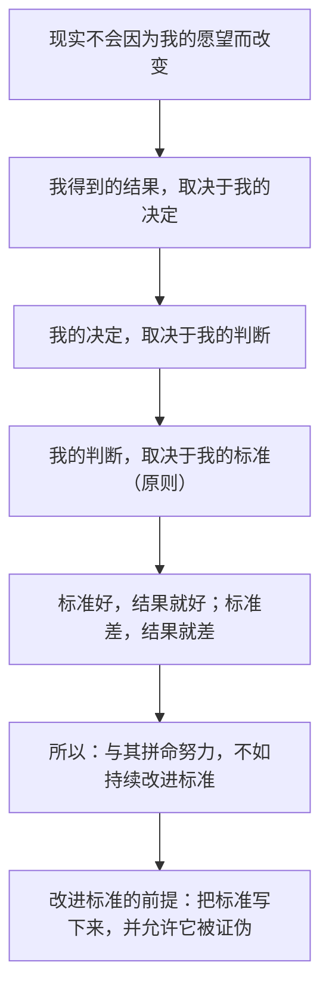

# 01｜为什么一本「失败者的笔记」，会变成全球畅销的管理书？

> 一本从破产边缘写起的工作手册，凭什么打动全世界的管理者和普通人？

---

## 一、先说结论

《原则》之所以能流行，不是因为它给出了一套成功公式，而是因为它做了一件很少有人认真做的事：**把「人是怎么做决定的」这件事本身，当成一个可以研究、可以记录、可以不断修改的系统。**

达利欧的出发点不是「我很成功，所以听我的」，而是「我犯过一次几乎让我彻底出局的错，所以我必须把判断标准一条条写下来，免得再犯」。这本书的方法论内核只有一句：**与其相信某个人的聪明，不如相信一套经过检验、还能被推翻重写的规则。**

---

## 二、我们先理解一个问题

先看一个有点奇怪的现象。

世界上每年出版几万本商业书，绝大多数在三年内就没人提了。而《原则》在 2017 年出版后，迅速登上《纽约时报》非虚构类榜首，被比尔·盖茨、Netflix 创始人哈斯汀、摩根大通 CEO 戴蒙等人反复推荐，中文版也在中国卖成了现象级畅销书。

更奇怪的是：这本书里的大部分内容，在出版之前就已经免费挂在桥水基金的官网上，被下载了三百多万次。也就是说，**很多人早就读过它，却还是愿意再买一本纸质书。**

那么问题来了：

> 一本由对冲基金老板写的、内容只是「我遇到事情一般怎么处理」的手册，为什么会有这种穿透力？它到底触动了人们什么？

---

## 三、作者到底提出了什么观点？

达利欧给出的答案，可以概括成三句话。

**第一，人和组织的失败，多数不是因为不够聪明，而是因为没把「判断标准」说清楚。**

我们大多数人是这样过日子的：昨天凭感觉做了一个决定，今天凭另一种感觉做了相反的决定，然后告诉自己「具体问题具体分析」。达利欧认为，这不是灵活，这是没有系统。**没有系统的人，每次都要从零开始犯错。**

**第二，那些真正有用的判断标准，往往是从痛苦里长出来的，而不是从书上抄来的。**

达利欧在书里反复讲 1982 年的那次惨败——他公开预测美国经济会陷入萧条，结果市场大涨，他几乎赔光了一切。正是在那之后，他开始把「我为什么这么判断」一条条写下来，然后拿到市场里去检验对错。这些笔记，慢慢长成了后来的《原则》。

**第三，「原则」不是信条，而是可检验、可修改的工具。**

这是全书最容易被忽略、也最重要的一点。达利欧说的原则不是「做人要诚信」这种口号，而是像「当某人连续在某个领域做对过很多次，且能说清推理过程时，我就给他的意见更高的权重」这种可以操作、可以被验证、可以被推翻的规则。

---

## 四、把这个观点翻译成人话

我们用一个特别日常的场景来理解。

假设你是个总在减肥失败的人。你每次失败后的反应通常是：懊恼、自责、然后过两天又忍不住吃夜宵。下一次，你依然会重蹈覆辙。

达利欧的做法会是这样：

第一步，他不问「我这个人是不是意志力差」，而问「是什么触发了这次破戒？」，比如答案是「加班到十一点之后」。

第二步，他把这个发现写成一条规则：「**只要加班超过十点，我就提前把第二天的早餐准备好，并且不在回家路上经过便利店。**」

第三步，下一次加班，他执行这条规则，然后观察：有效吗？如果有效，保留；如果没用，就修改规则，比如发现真正的问题是「下午没吃东西」，那就改成「下午四点加一顿」。

你看，区别在哪里？

普通人的改进方式是「**下次一定注意**」——而这是一句没有任何约束力的话。
达利欧的改进方式是「**把这次的教训变成一条具体的、下次可以直接调用的规则**」。

**原则就是这种规则的集合。** 它把「一次痛苦的经历」，变成了「一条以后会自动生效的判断标准」。

---

## 五、为什么会这样？

达利欧的推理链条其实非常朴素：

把这条链子讲得更直白一些：

- 如果我的判断经常出错，那么无论我多勤奋，结果都不会好；
- 而我的判断之所以出错，往往是因为我的标准本身有缺陷，或者我根本没有标准；
- 标准藏在脑子里，就无法被检查——我甚至不知道自己是凭什么得出这个结论的；
- 所以我必须把它写出来，让它暴露在阳光下，接受数据的检验；
- 一旦它经不起检验，我就修改它。**这个过程重复几十年，就会积累出一套比任何单个人的直觉都可靠的判断系统。**

这也解释了为什么达利欧如此强调「写下来」。写下来不是为了好看，而是因为**只有被写下来的东西，才能被迭代。**

---

## 六、举一个现实生活中的例子

再用一个职场场景。

小王连续两次绩效考核不理想。他的反应是：抱怨「领导不懂我」「公司政治复杂」「我运气不好」。

同一个部门的小李，绩效也不算好，但他的做法不一样。他把这次考核当成一次「故障排查」：

1. 记录事实：这两次考核里，被扣分的具体事项是什么？（不是「领导不喜欢我」，而是「三个项目都延期了」）
2. 追查原因：为什么延期？（不是「我能力差」，而是「我习惯在自己不擅长的环节硬扛，没有及时求助」）
3. 写成规则：以后凡是遇到我不熟悉的模块，**在第二天开工前必须先找一个做过的人聊二十分钟**。
4. 下次执行，再观察这条规则有没有用。

半年后，小王还在原来的情绪里循环，小李已经有了十几条属于自己的「工作原则」。

达利欧的整本书，本质上就是在教小李这种动作，并且把它从个人经验，扩展到一整个组织。

---

## 七、回到书中重新理解

现在再回头看达利欧在《原则》开头那段经常被引用的话，就会明白它在说什么。

他说，他把这些原则写出来，是希望读者「自行判断，觉得有用就拿去用，觉得没用就丢掉」。很多人把这句话当成一句客套。

其实不是。**这句话本身就是他的核心观点：原则的价值不在于作者多有权威，而在于它能不能经得起你自己的检验。**

他也说，这本书一部分是他的自传，一部分是行动指南。这两部分必须放在一起读——因为那些看起来枯燥的条款，每一条背后都对应着他人生中一次真实的疼痛。**脱离了痛苦的来源，原则就退化成了鸡汤；连着来源一起看，原则才是经验。**

---

## 八、这个观点背后还有什么？

**隐含前提一：现实是可被认识的。**

如果世界本质上不可预测、纯粹靠运气，那么总结原则就没有意义。达利欧显然相信，虽然未来无法精确预知，但某些因果关系是稳定的、可以被反复利用的。

**隐含前提二：人有能力改变自己的判断方式。**

这需要大脑具备可塑性——这一点他在「理解人与人大不相同」一章里专门讨论过。

**隐含前提三：记录和检验需要付出成本，但长期回报更高。**

写原则、记日志、做复盘，短期看都是「不产生收益的额外工作」。达利欧的赌注是：**这些成本会在长期以复利的方式返还。** 这也是他反复强调「进化」的原因。

**与后文的关系：** 这一篇是全书的门口。接下来我们会看到，为什么「拥抱现实」是这一切的起点（第 03 篇），以及为什么人最大的敌人其实是自己（第 06 篇）。

---

## 九、这个观点有问题吗？

有。至少有三处值得怀疑。

**第一，幸存者偏差。**

我们看到的是一套「帮助达利欧成功了」的方法。但世界上可能有很多人用了类似的方法，只是运气不好。**我们无法从结果反推方法一定有效。** 达利欧自己的回应是：他关心的是决策的质量，而不是单次结果——但这依然是个难以证伪的说法。

**第二，「写下来」的门槛被低估了。**

把判断标准写成可检验的规则，需要极高的抽象能力和自我诚实。大多数人写出来的「原则」，其实是事后包装过的说辞。**能写出好原则，本身就是一种稀缺能力。**

**第三，个人化的方法未必能移植到别人身上。**

达利欧的原则是两居室公寓里的达利欧、经历了 1982 年的达利欧总结出来的。你把它照抄到另一个人、另一家公司、另一个行业，未必适用。他自己也承认这一点——这正是他强调「读者自行判断」的实际含义。

所以更准确的说法是：**这本书提供了一个方法论，而不是一套真理。**

---

## 十、今天再看这个观点

达利欧写这本书的时候，还没有今天的大模型。但他在书里提出的核心主张——**把判断标准明确化，让系统辅助甚至代替部分人工决策**——正是今天 AI 领域在做的事情。

想一想我们今天的生活：

- 推荐算法本质上就是「基于历史行为提炼出的一条条原则」；
- 各种效率 App 里的自动化规则，就是把你「遇到 X 就做 Y」的判断固化下来；
- 大模型做决策时，很大程度上是在执行一套被写下来的、可被评估的规则。

达利欧在二十年前就预演了这套逻辑。但这也带来一个新问题（我们会在第 25 篇详细讨论）：**当决策可以越来越多地交给系统时，人的不可替代性在哪里？**

需要说明的是，「用 AI 放大原则」是**基于达利欧思想的现代延伸**，而不是他书中的原话。

---

## 十一、这一篇真正应该记住什么？

1. **《原则》的内核不是成功公式，而是「把判断标准系统化」的方法论。**
2. **人和组织反复失败，往往不是因为不够聪明，而是因为没有把判断标准写清楚。**
3. **原则要来自真实经历的痛，而不是从别人那里抄来的格言。**
4. **原则不是信条，而是可检验、可修改、可升级的工具。**
5. **写下来，是让一个判断能够被迭代的唯一前提。**

---

## 十二、留一个问题

> 如果「把判断标准写下来」真的这么有效，为什么绝大多数人一辈子都没写过一条？
>
> 是因为懒，还是因为——**我们其实并不真的想知道自己是怎么做决定的？**
>
> 下一篇，我们从最基本的问题开始——**「原则」到底是什么，为什么没有原则的人，其实也在被别人的原则支配。**
