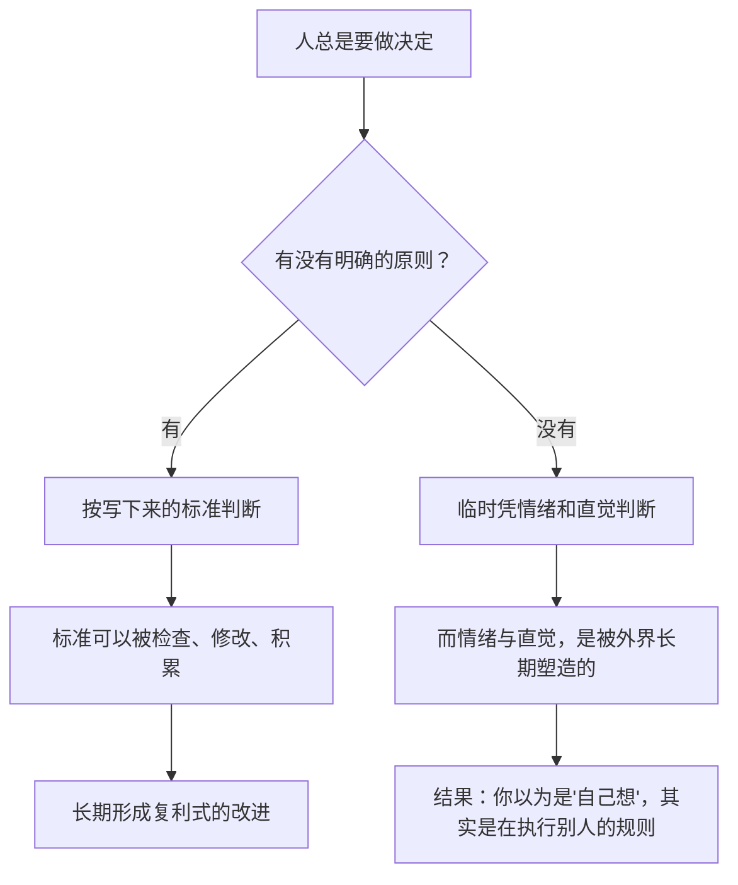

# 02｜到底什么是「原则」？为什么没有原则的人，也在被别人的原则支配？

> 如果「原则」不是道德口号，那它到底是什么？为什么说「不选择」本身也是一种选择？

---

## 一、先说结论

在达利欧的用法里，原则既不是道德教条，也不是人生理想，而是一句可以被操作的句式：

> **「当遇到某类情况时，我按什么标准判断、采取什么行动。」**

价值观回答「我认为什么重要」，目标回答「我想要什么」，而原则回答的是**「我怎么做决定」**。达利欧说得很直接：原则是「应对现实、从而得到你想要的东西的有效方式」。

而这一篇真正要说的反直觉结论是：**你不可能没有原则。** 如果你没有主动写出自己的原则，你就一定在临时凭情绪决定，或者默认接受别人（公司、算法、流行观念）的原则。**不选择，本身就是一种选择。**

---

## 二、我们先理解一个问题

先做一个小测试，看看你分不分得清下面这几句话属于哪一类：

A. 「家庭比事业重要。」
B. 「我想在四十岁之前财务自由。」
C. 「凡是涉及钱的决定，我只在冷静了二十四小时之后再拍板。」
D. 「做人要诚实。」

很多人的第一反应是：这不都是「原则」吗？

其实不是。A 是**价值观**，B 是**目标**，C 是**原则**，D 更像一句**道德规范**（它没有告诉你「什么情况下该怎么做」）。

问题就在这里：

> 为什么我们很容易说清自己的价值观和目标，却几乎说不清自己的原则？

---

## 三、作者到底提出了什么观点？

达利欧关于「什么是原则」的论述，可以拆成四个要点。

**第一，原则是「现实」与「目标」之间的桥梁。**

现实不会因为你的愿望而改变，而你想要的又不会自动出现。原则就是那个中间环节——它告诉你，在现实给定的条件下，怎么做才更可能得到你想要的。

**第二，原则必须是「可操作」的。**

「我要成为一个更好的人」不是原则，因为它无法被执行。「每次我想指责别人之前，先写下对方可能的三个理由」才是原则。

**第三，原则要按层次组织。**

达利欧把桥水的原则分为三层：高层次原则（大方向，如「极度求真」）、中层次原则（具体方面）、分原则（最细的操作）。这种结构的意义在于——**大方向要稳定，操作细节要灵活。** 一个组织不能天天改大方向，但必须天天改细节。

**第四，也是最重要的一点：不主动选择原则，就等于被动接受原则。**

达利欧认为，人们其实一直在使用原则，只是没有意识到。你临时凭感觉做的每一个判断，背后都隐含某条规则，只是这条规则没有被写出来、没有人检查过、你也说不清楚。

---

## 四、把这个观点翻译成人话

我们换一个最能说清问题的领域：**刷手机。**

你可能会说：「我刷手机没什么原则，就是随手刷刷。」

但事实是，你正在使用一套原则——只不过那套原则是**平台替你写的**。

平台的原则大致是这样的：

- 只要内容能让你多停留 3 秒，就继续推类似的；
- 优先推让你产生强烈情绪的内容（愤怒、爽、焦虑），因为情绪最留人；
- 永远给你「下一条」，因为「下一条」比「停下来」更有价值。

这套原则极其高效，它被写成了代码，每天都在执行。

而你的「原则」是什么呢？如果你从没写过，那答案就是：**没有。于是平台的原则，就成了你的行为准则。**

这就是达利欧那句话的真正含义。不是「你必须拥有原则」，而是——**你已经在服从某套原则了，问题只在于，那套原则是谁写的。**

同理：

- 你没有自己的消费原则，广告和分期付款会替你写；
- 你没有自己的时间原则，各种 App 的推送节奏会替你写；
- 你没有自己的情绪原则，社交媒体上最会表达的人会替你写。

---

## 五、为什么会这样？

这背后的机制可以用一张图讲清楚：

关键在中间那个「没有」的分支。

人在没有明确标准时，并不会进入「真空状态」，而是会自动调用两种东西：**当下的情绪**，和**早已内化的社会默认值**。

- 情绪来自本能，它服务于短期舒适，不服务于长期目标；
- 社会默认值来自你所在的圈子、平台、行业、时代——它是一种「别人替你选好的原则」。

所以，「凭感觉做决定」并不等于自由。恰恰相反，**它是把决定权交给了最不稳定的东西和最不负责的人。**

达利欧的整个体系，本质上就是要把这个权力收回来——用一套你自己写、你自己负责、你自己改进的标准，替代情绪和默认值。

---

## 六、举一个现实生活中的例子

我们看一个特别常见的职场案例：**加班。**

关于加班，有三种人的「原则」。

**第一种人：没有原则。**
他的行为完全取决于当天的状态和周围的气氛。领导在，他就留着；同事走了，他也走；项目紧，他就熬夜；今天心情好，他就早点溜。他不是在违反原则，他是根本没有原则——他只是被环境推着走。

**第二种人：有别人的原则。**
他信奉的是「加班等于努力，努力等于好员工」，这是他从上一份工作、从父母、从社会评价里内化的默认原则。他会一直加班，甚至可能在低效地加班，却不觉得有问题。

**第三种人：有自己的原则。**
他写下过这样几条：

1. 身体状态是长期产出的底线，连续熬夜超过两天就必须否决；
2. 加班必须服务于一个明确的问题，不知道问题是什么时就先停工；
3. 我拒绝的不是工作，而是「没有问题的忙碌」。

注意第三个人和第二个人的区别：他们可能都加班，但第三个人是**在按自己的标准**加班，而且这个标准是可以被检验和修改的。如果发现自己因为原则太硬而错失了关键机会，他会调整；第二个人则永远无法调整，因为他压根不知道自己在遵循什么。

达利欧说的「有自己的原则」，指的是第三种人。

---

## 七、回到书中重新理解

现在回到书里，达利欧开头那句经常被忽略的话就变得清晰了。

他说，他写原则的动机之一是：他发现「**很多人从未想过自己为什么这么做事**」。他们用的是从父母、老师、同事那里继承来的、从未被审视过的标准，然后抱怨结果不好。

他还特意强调，自己的原则「不是要大家照做」，而是希望大家**去思考自己的原则是什么**。这句话如果只当作谦辞，就完全读漏了——它其实是整本书的邀请函：

> **这本书不是一本答案书，而是一本「让人意识到自己需要答案」的书。**

也正因为如此，他在中文版序里对读者的建议是：先理解原则背后的逻辑，再想想哪些适合自己。这个顺序很重要——**先建立「什么值得成为原则」的判断力，再谈具体条款。**

---

## 八、这个观点背后还有什么？

**隐含前提：不同的原则，会导向截然不同的命运。**

这是整本书最深的赌注。如果原则对结果没什么影响，那么「写不写原则」就是个自我安慰的游戏。达利欧相信的显然是：**长期来看，判断标准的差异会被时间放大成结果的巨大差异。**

**深层逻辑：原则其实是一种「反脆弱」的结构。**

把标准写下来，等于给你的判断加装了一个可替换的零件。今天这个零件出问题了，换一个就行，不必推翻整个自己。而没有原则的人，每次失败都要面对一个模糊的、无法修理的「我不行」，只能靠情绪消化。

**与其他观点的联系：**
- 与第 04 篇「痛苦 + 反思 = 进步」相连：**反思的产物，就是新的一条原则**；
- 与第 13 篇「把决策写成算法」相连：**原则写到足够具体，就可以程序化**；
- 与第 15 篇「极度求真」相连：**求真本质上是让原则接受现实的检验**。

---

## 九、这个观点有问题吗？

有，而且这个问题相当尖锐。

**第一，不是所有领域都适合「原则化」。**

爱情、友谊、审美，这些领域如果也被写成规则，会不会变得机械、冷酷？「什么情况下该安慰朋友」如果有一张表，那还叫关心吗？达利欧的回应是「原则不是让你不近人情，而是让你更清楚自己在做什么」——但这条界线很难画。

**第二，「有原则」不等于「原则对」。**

一个用错误原则坚持了三十年的人，可能比一个没原则的人更惨。达利欧的系统里，「原则可以被检验和修改」是关键的保险栓——但如果一个人拒绝修改呢？那他手里那把枪就是上了膛的。

**第三，「被别人的原则支配」这个论述可能太绝对。**

我们不可能对每件事都有独立原则，多数时候依赖常识、惯例和信任，其实是高效且理性的。把一切都要求「自己写原则」，既不现实，也可能造成大量内耗。

所以更准确的表述可能是：**原则化的方法，最适合那些「反复出现、且后果重大」的领域**——投资、用人、职业选择、金钱、健康。在这些地方不写原则，代价最高。

---

## 十、今天再看这个观点

如果说二十年前「没有原则的人被别人支配」还只是一种说法，那么今天它已经变成了**可测量的事实**。

- 短视频平台的原则，正在大规模地替代用户自己的注意力原则；
- 电商的推荐与分期原则，正在替代用户的消费原则；
- 各类 AI 助手开始替我们做越来越多的判断——从写什么，到买什么，到信什么。

在这种环境下，达利欧的观点反而变得更锋利了：**当外部的「原则系统」比任何时候都强大时，一个没有自己原则的人，几乎不可能不被牵引。**

需要区分的是：这是**基于达利欧思想的现代延伸**，不是他在书中讨论的内容。他写作的对象是投资与管理，而不是注意力经济。

---

## 十一、这一篇真正应该记住什么？

1. **价值观是「什么重要」，目标是「想要什么」，原则是「怎么做决定」。**
2. **原则必须是可操作的，否则它只是愿望的另一种说法。**
3. **你不可能没有原则；没有写出来的原则，就是别人的原则。**
4. **凭感觉不等于自由，它是把决定权交给情绪和默认值。**
5. **原则最适合用在反复出现、后果重大的领域，而不是生活的每一处。**

---

## 十二、留一个问题

> 如果「没有自己的原则，就在被别人的原则支配」，那么请想一下：
>
> 你最近一次重大决定，到底是按谁的标准做的？那个标准，你看过它长什么样吗？
>
> 下一篇，我们来看达利欧把什么放在了所有原则的最前面——**为什么「拥抱现实」是一切的起点。**
