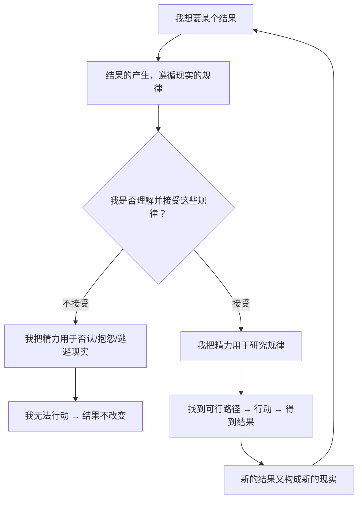

# 03｜为什么「拥抱现实」是一切方法的原点？

> 「接受现实」听起来像句废话，为什么达利欧把它放在生活原则的第一条？

---

## 一、先说结论

达利欧的第一条生活原则是「拥抱现实，应对现实」。这句话之所以不是废话，是因为它包含三个反直觉的主张：

1. **现实是客观的，不会因为你的愿望、痛苦或愤怒而改变；**
2. **痛苦不是需要逃避的东西，而是现实给你的反馈信号；**
3. **在「你认为世界该怎样」和「世界实际怎样」之间，永远选择后者**——因为只有后者可以被利用。

一句话：**不是你想要的现实，而是真实的现实，才能带你到你想去的地方。**

---

## 二、我们先理解一个问题

先看一个几乎每个人都经历过的场景。

你被一个信任的人背叛了。

你的反应大概会是：愤怒、委屈、无法接受——「他怎么可以这样？我们明明是朋友。」

这种反应太正常了，正常到我们从不觉得它有问题。

但请停下来想一想：

> 在你愤怒的这段时间里，那个背叛你的人变了吗？你损失的东西回来了吗？你后面的处境变好了吗？

都没有。你的愤怒没有改变任何一个事实——它只是让你在事实之上，额外承受了一份痛苦。

这就引出了达利欧问题的核心：

> 为什么人在面对不如意的现实时，第一反应往往是「拒绝它」，而不是「使用它」？

---

## 三、作者到底提出了什么观点？

达利欧的「拥抱现实」，可以拆成四层。

**第一层：现实是客观的，且通常是「有效」的。**

他不讨论现实「好不好」，只讨论现实「是什么」。他在书中反复说：**自然规律和现实法则不会因为你觉得不公平就网开一面。** 你想要的东西，必须在现实允许的路径上获得。

**第二层：自然规律是「残酷的」，但也是「可依赖的」。**

达利欧不美化现实。他承认进化机制里有大量淘汰、竞争、痛苦和不公。但他同时强调：正因为规律是稳定的，所以它可被研究、可被利用。**抱怨规律不公平，就像抱怨重力太强一样，毫无用处。**

**第三层：痛苦是信号，不是终点。**

他把痛苦看成「现实与期望之间的落差」。落差越大，痛感越强，说明这里有值得学习的东西。这个观点会在下一篇（第 04 篇）展开。

**第四层：「更高层次的思考」是拥抱现实的姿势。**

达利欧说他学会了「从更高层面看问题」——把自己当成宇宙演化过程中的一个环节，而不是宇宙的中心。这个视角听起来很冷，但它带来一种奇怪的平静：**当你不再要求现实为你让路时，你反而更有力量。**

---

## 四、把这个观点翻译成人话

我们用最通俗的方式说一遍。

想象你在打一款非常难的游戏。

游戏的规则是固定的：Boss 的血量是 10000，它有特定弱点，你的操作有冷却时间。这些规则不会因为你骂游戏不公平就改变。

现在有两种玩家：

**第一种玩家**花大量时间抱怨——「这 Boss 太变态了」「这游戏设计有毛病」「我运气不好」。他的愤怒是真心的，但 Boss 的血量还是 10000。

**第二种玩家**接受了规则，然后开始研究：它的攻击间隔是多少秒？哪个动作是破绽？我该在什么时候输出？

一年后，第一种玩家还在论坛上发帖骂游戏，第二种玩家已经通关了。

**达利欧说的「拥抱现实」，就是第二种玩家对待游戏规则的态度。**

注意，这不是「认命」。第一种玩家也不是不想要好结果，他只是把力气花在了要求规则改变上。第二种玩家没有少要，他只是选择在规则内行动。

再换个说法：

> **现实不是你的对手，而是你的棋盘。抱怨棋盘不会让你赢，只有理解棋盘才能让你赢。**

---

## 五、为什么会这样？

达利欧的推理链条是这样的：

关键在 C → D → E 这条岔路上。

为什么「拒绝现实」这么常见？因为它在短期内是**有用**的。

否认现实能立刻降低痛苦感。怪罪别人能立刻保护自尊。幻想「其实没那么糟」能立刻让人舒服一点。这是一种心理止痛药，见效很快。

但它的代价是——**你停在原地了。** 而现实不会停在原地，它会继续往前走。于是你和现实的距离越拉越大，止痛药需要的剂量也越来越大。

达利欧的赌注是长周期的：**忍受短期的痛，换取长期的进步。**

---

## 六、举一个现实生活中的例子

我们看一个投资和管理之外、但更贴近普通人的案例：**一家餐饮店。**

小王开了家面馆，生意一般。他有三条路：

**路线一（拒绝现实）：**
「是这条街人流不行。」「是隔壁新开的店抢生意。」「现在经济不好，大家都不消费。」——他每天继续开店，继续在朋友圈抱怨，半年后关店。

**路线二（选择性接受现实）：**
他承认客流少这个事实，但只在「不涉及自己」的层面接受。比如他愿意承认选址有问题，但坚决不承认自己的面不好吃。于是他去研究怎么引流、怎么搞促销，却唯独不肯改配方。生意依然没有起色。

**路线三（拥抱现实）：**
他做了几件事：

1. 记录一周内每个时段进了多少人、多少人点了餐、多少人是回头客；
2. 请几个老顾客如实评价口味——**并且禁止自己辩解**；
3. 发现真正的问题不是人流，而是「客人吃一次就不再来了」；
4. 调整口味，重新追踪回头客比例。

三个人的区别不在聪明程度，而在**他们愿不愿意把「现实是什么」放在「我希望现实是什么」之前**。

达利欧说的拥抱现实，就是第三条路。它不浪漫，甚至有点难堪——但它是唯一能起作用的路。

---

## 七、回到书中重新理解

现在回头看达利欧在书里的原始表述。

他写道，他之所以能走到今天，「不是因为我预测到了未来，而是因为我在犯错后能迅速看清现实并调整」。注意这句话的结构：**不是「我看得准」，而是「我看错了也能很快回到现实」。**

他还说，他学到的最重要的一课是：**「痛苦 + 反思 = 进步」**，而痛苦之所以能变成进步，前提是你不逃避那个痛苦——也就是不逃避那个它所要告诉你的事实。

他还提出了一个很有画面感的要求：**像一个科学家看待自己的失败一样看待它。** 科学家不会因为实验失败而觉得「我自己被否定了」，他们只会想「假设错了，哪里错了，重新设计」。

这就是「拥抱现实」最难的部分——**把「事实错了」和「我这个人错了」分开。**

---

## 八、这个观点背后还有什么？

**隐含前提一：现实有稳定的规律。**

如果世界纯随机，拥抱现实也就没有了意义。达利欧相信因果关系是可重复的，虽然复杂。

**隐含前提二：人有能力承受短期的痛苦。**

这一点其实不是所有人都具备。长期处于高压、焦虑或抑郁状态的人，可能根本没有余力去「拥抱现实」。**达利欧的方法隐含了一个前提：你有基本的安全感。** 这一点值得读者自己判断。

**隐含前提三：更了解现实，就能更有效地行动。**

这依赖一个假设：现实是可被利用的。达利欧的整个投资生涯建立在这一点上。

**与其他观点的联系：**
- 第 04 篇「痛苦 + 反思 = 进步」是这一条的直接延伸；
- 第 06 篇「两个障碍」解释了**为什么人做不到拥抱现实**——因为自我和盲点在拦路；
- 第 15 篇「极度求真」是把这一条从个人扩展到组织。

---

## 九、这个观点有问题吗？

有。至少有四个值得追问的地方。

**第一，「接受现实」有时会被用来为不公辩护。**

「现实就是这样，你要接受」这句话，历史上被无数次用来压制正当的诉求。达利欧的意思更准确，应该是「**先接受事实是什么，再决定要不要改变它**」——但这两者的界线很容易被滥用。

**第二，现实并不总是「已经确定」的。**

达利欧的表述会让你以为现实是固定的、静止的。但很多所谓的现实，其实是别人暂时制造的，是可以被改变的。**把「暂时状态」当成「永恒规律」，本身就是在拒绝一部分现实。**

**第三，「认清现实」需要信息，而信息是不对称的。**

普通人未必有达利欧那样的资源去了解真相。让一个信息匮乏的人「拥抱现实」，有时是一种不公平的要求。

**第四，情绪不是纯粹的障碍。**

达利欧几乎把情绪定位成需要被管理的干扰项。但现代心理学指出，情绪本身也是信息，它常常在提醒你一些理性没注意到的东西。**完全理性化的态度，可能会让你漏掉重要信号。**

所以更平衡的说法是：**拥抱现实是一种需要练习的能力，而不是一道简单的道德命令。**

---

## 十、今天再看这个观点

达利欧的「拥抱现实」在今天有一个特别讽刺的处境：**我们生活在信息最丰富的时代，却可能比任何时候都更容易活在「定制现实」里。**

算法为你筛选你爱看的内容，社交媒体把你放进观点相同的圈子，AI 可以生成完全符合你预期的内容。**现实正在被大规模地「按你的喜好改造」，而这恰恰是达利欧最反对的那种状态。**

所以在今天，「拥抱现实」的含义可能要加一条：**主动去寻找那些让你不舒服、但与事实相符的信息。** 因为默认状态下，你只会看到你想看到的。

这属于**基于达利欧思想的现代延伸**，是他没有直接讨论但逻辑上一致的内容。

---

## 十一、这一篇真正应该记住什么？

1. **拥抱现实，是承认「现实是什么」优先于「我希望现实是什么」。**
2. **现实不因愿望而改变，但可以被理解、被利用——这是它最有价值的地方。**
3. **拒绝现实能立刻减轻痛苦，代价是永久停在原地。**
4. **关键的分界线不是「事实错了」还是「我对了」，而是能否把「事实错了」和「我这个人错了」分开。**
5. **越是信息定制化的时代，主动接触不舒服的真相就越重要。**

---

## 十二、留一个问题

> 请你想一想：过去一年里，有没有哪件事，你其实早就知道了真相，却一直不愿意承认？
>
> 如果承认了，你会做什么不同的事？
>
> 下一篇，我们来拆解达利欧那句被引用最多、也最容易被误读的话——**为什么痛苦是好事，「痛苦 + 反思 = 进步」到底在说什么。**
