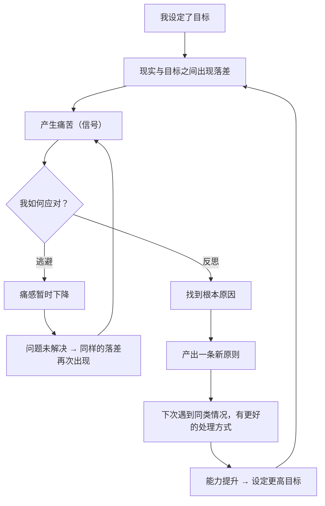

# 04｜痛苦 + 反思 = 进步：为什么痛苦是进化的信号？

> 为什么达利欧把「痛苦」当成必须被欢迎的东西，而不是应该被消灭的东西？

---

## 一、先说结论

达利欧有一句被引用最多的话：**痛苦 + 反思 = 进步。**

它的意思不是「吃苦就会成功」——那只是鸡汤。它真正的意思是：

> **痛苦是一个信号，说明「现实与你的期望之间」出现了落差。落差不处理，痛苦会重复；落差被反思，就变成一条新的原则。**

所以，痛苦本身毫无价值。**只有「痛苦 + 反思」才有价值，而少了反思的那一半，痛苦就只是痛苦。**

这条等式之所以重要，是因为它把「痛苦」从一个需要逃避的东西，改造成了一个可以使用的**数据源**。

---

## 二、我们先理解一个问题

先看一个所有人都会遇到的循环：

你下决心要健身。第一周很兴奋，第三周开始累，第五周因为一次加班中断，第七周彻底放弃。然后你陷入自责：「我怎么这么没毅力。」

三个月后，你又一次下决心健身。这一次的剧本几乎一模一样。

问题来了：

> 为什么同样的痛苦，会一次又一次地重复？为什么「长了教训」，却好像没有真的长记性？

---

## 三、作者到底提出了什么观点？

达利欧关于痛苦的观点，可以拆成四条。

**第一，痛感 = 落差信号。**

达利欧认为，当你感到痛苦时，通常意味着「你想要的东西」和「你实际得到的东西」之间出现了差距。这种痛感本身是中性的，它只是在报告一个事实：**这里有问题。**

**第二，人有两种本能反应，只有一种有用。**

- **逃避型反应**：转移注意力、麻痹自己、怪别人、假装没事。它让痛感立刻下降，但问题没解决。
- **面对型反应**：停下来，问「这个痛在告诉我什么」，然后找出原因，写出规则。

达利欧认为，这两种反应的分岔，长期看会把人分成完全不同的两类。

**第三，反思必须有「产出物」。**

这是达利欧和一般「复盘」说法的区别。反思不只是「想明白了」，而是**产出一条新的原则**——下次遇到同类情况，我按什么标准做。

**第四，痛感会随能力提升而减少，但永远不会消失。**

因为当你成长后，你会设定更高的目标，于是又会出现新的落差。**痛苦不是能力的症状，而是成长的副产品。**

---

## 四、把这个观点翻译成人话

我们用一个特别贴近生活的场景。

假设你今天做了一场演讲，结果中途大脑空白、冷场，非常丢脸。回家的路上你极难受。

现在，这个「痛苦」可以被处理成两种不同的结果。

**处理方式 A（逃避）：**
你回家刷了两小时短视频，感觉好了一点。第二天你也尽量不去想它。三个月后又有一次演讲机会，你本能地想推掉——因为那种痛感还留在身体里。

**处理方式 B（反思）：**
你让自己难受一晚上，但第二天坐下来，问几个具体的问题：

- 我卡在了哪一句？——「讲到第三个要点时。」
- 为什么会卡？——「因为我用的是书面稿，没有口语化的记忆锚点。」
- 上次是不是也这样？——「是的，上次也卡在类似的地方。」
- 如果下次遇到同样的情况，我该怎么做？——「演讲前把每个要点改写成一句自己的话，并且只带关键词上台。」

最后这一句，就是这次痛苦**换来的东西**。

请注意，B 并没有让痛苦消失——你在做 B 的时候同样难受。区别在于：**A 把痛苦变成了一次不愉快的回忆，B 把痛苦变成了一条可以反复使用的规则。**

达利欧的等式说的就是这个：痛苦不是要被消灭的，痛苦是要被**兑换**的。

---

## 五、为什么会这样？

从机制上看，这条等式背后有一个冷静的推论：

注意这两条路径的形态：

- **回避路径是一个闭环。** 同一个痛苦会一圈一圈地回来，而且因为年龄、机会、退路在减少，每一圈的代价更大。
- **反思路径是一条螺旋。** 每一圈都会比上一圈高一点——**目标更高，落差更大，但能力也更强。**

达利欧在书里用了「进化」这个词。进化不是舒服地长大，而是**不断地遇到问题、解决问题、把解决方案固化成本能**。

还有一个关键点：**反思必须发生在痛苦之后、情绪平静之时。**

人在痛感最强烈的当下，是很难反思的，因为那时大脑处于应激状态。达利欧建议的做法是：先冷静下来，甚至可以请冷静、有见识的人一起看。**「在气头上做的判断」和「平静后做的判断」，质量完全不同。**

---

## 六、举一个现实生活中的例子

我们看一个团队层面的例子：**一家创业公司丢了一个大客户。**

丢单当天，团队群里的讨论大致是这样的：

- 「他们太不讲信用了。」
- 「价格战打不过，没办法。」
- 「销售太菜了。」
- 「算了，往前看吧。」

这些都是典型的回避型反应——它们有一个共同点：**把原因指向无法改变的东西**（对方人品、市场环境、某个人的能力）。因为指向不可改变的东西，就等于承认「这件事我无能为力」，于是也就不用改了。

达利欧式团队会做的是另一件事：开一次「诊断会」，但**规则是先事实、后解释、不追责**。

1. 事实层：客户在哪个环节开始犹豫？他们的原话是什么？我们的报价和对手差多少？
2. 原因层：他们真正在意的是价格，还是交付风险？如果是交付风险，那说明我们的流程有问题——**这是一个可以修的问题。**
3. 原则层：这次是不是因为我们对「交付风险」这一项从来没有量化过？如果是，以后所有大客户提案，都必须附一份交付风险清单。
4. 执行层：把这条写进提案模板。

你会发现，这一整轮下来，最值钱的产出不是「下次小心点」，而是**最后那条被写进模板的规则**。这条规则会在未来每一次提案时自动生效。

这就是达利欧把「痛苦 + 反思」制度化的方式：**不是靠人的自觉，而是靠流程，让每一次痛苦都强制兑换出一条原则。**

---

## 七、回到书中重新理解

现在回头看达利欧的原话，就会明白他为什么说得那么重。

他写道（大意）：**「我相信，与痛苦相伴的是成长的机会，而我学会了把痛苦当作信号去迎接它。」** 这句话常被读作一种励志姿态，其实它非常技术化——「信号」两个字是关键词。信号是要被接收、被解读的，不是被感谢的。

他还讲了一个更具体的观察：**人在面对批评时，会产生和面对身体疼痛时类似的生理反应。** 这解释了一件事——为什么我们「明明知道对方说得对，还是忍不住想反驳」。那是身体在防御。

所以他强调，要把这种反应当成可以训练的东西。**不是不许自己有情绪，而是不让情绪替你做完最后的判断。**

他还提到自己的做法：每当他感到痛苦时，他会试着问：「这个痛苦里，有没有一部分是我该负责的？」这不是自责，而是**把责任从「不可改变的世界」收回到「可改变的自己」手里**。

---

## 八、这个观点背后还有什么？

**隐含前提一：痛苦的原因是可分析的。**

有些痛苦有明确原因（比如方法不对），有些则来自重大变故、疾病、丧失——**后者并不适合用「反思出原则」来处理。** 达利欧的公式有它的适用边界。

**隐含前提二：反思能被转化成规则。**

如果你的问题每次都不一样，反思就难以沉淀。达利欧的体系需要「反复出现的同类问题」才有复利。

**隐含前提三：人能在痛苦中保持行动能力。**

这需要基本的心理资源和外部支持。对处在长期压力下的人来说，「反思」可能是一件奢侈品。

**与其他观点的联系：**
- 第 03 篇「拥抱现实」是这一条的前提——不承认落差，就无从反思；
- 第 05 篇会展示达利欧**自己**如何用这条公式处理 1982 年的惨败；
- 第 20 篇的「问题日志」，就是这条公式的**组织化版本**。

---

## 九、这个观点有问题吗？

有，而且这一条特别容易被误用。

**第一，它可能变成「苦难崇拜」。**

「痛苦 = 进步」如果理解成「受的苦越多越进步」，那就完全跑偏了。达利欧说的是痛苦提供了**信息**，而不是痛苦本身有**价值**。无谓的苦、重复的苦、被别人施加的苦，都不值得感谢。

**第二，它可能滑向「凡事怪自己」。**

达利欧强调「从自己身上找原因」，这是有效的，但如果推到极端，就变成了对结构性问题、系统性问题视而不见，把所有责任都压在个体身上。**有些痛苦的原因确实不在你身上。**

**第三，情绪处理被过度工具化。**

达利欧的方法非常偏重「把痛苦变成产出」。但人有时需要的是被理解、被安慰，而不是立刻把痛苦兑换成规则。**把所有情绪都当成待处理的数据，可能让人失去与自己的连接。**

**第四，「反思」很容易变成「事后编故事」。**

人在解释过去的失败时，很容易构建一个听起来合理的因果链，但它未必是真的。**没有外部反馈的反思，可能只是在自我安慰。**

所以更完整的说法是：**痛苦 + 诚实的反思 + 外部检验 = 进步。** 达利欧的版本里，其实隐含了「极度开放」这个条件——这也是为什么他在后面专门用一整章讲它。

---

## 十、今天再看这个观点

在今天，这条等式有了一个全新的应用场景：**AI 与自动化系统也在「痛苦 + 反思」。**

- 一个推荐系统每次收到用户「不感兴趣」的反馈，就调整一次参数；
- 一个 Agent 执行任务失败后，会根据错误重试并修改策略；
- 一个模型在训练中，就是靠「预测错误」这个信号不断调整自己。

从某种意义上说，**达利欧描述的是一个通用的学习机制**——不只是人，任何能持续改进的系统，都需要一个「痛感信号」和一个「反思回路」。

这对人提出一个反讽的问题：**机器在不断地从错误中学习，而我们很多人却连一条自己写下的原则都没有。** 谁更像进化中的系统，一望便知。

需要说明，这是**基于达利欧思想的现代延伸**，他书中并未讨论 AI 的学习机制。

---

## 十一、这一篇真正应该记住什么？

1. **痛感是落差信号，不是需要被消灭的敌人。**
2. **痛苦本身没有价值，只有「痛苦 + 反思」才有价值。**
3. **反思的产出物不是「想明白了」，而是一条可以下次直接调用的新原则。**
4. **逃避痛苦能立刻见效，代价是同一个坑反复踩；反思很慢，但每一圈都在抬高起点。**
5. **反思要在情绪平静后进行，并且最好经过外部的检验。**

---

## 十二、留一个问题

> 回忆一下你最近一次感到难受的经历。
>
> 如果它必须「兑换」出一条以后能用的原则——那条原则会是什么？
>
> 下一篇，我们来看达利欧自己是怎么用这条等式的：**1982 年的那次误判，为什么被他称为一生中最重要的事？**
