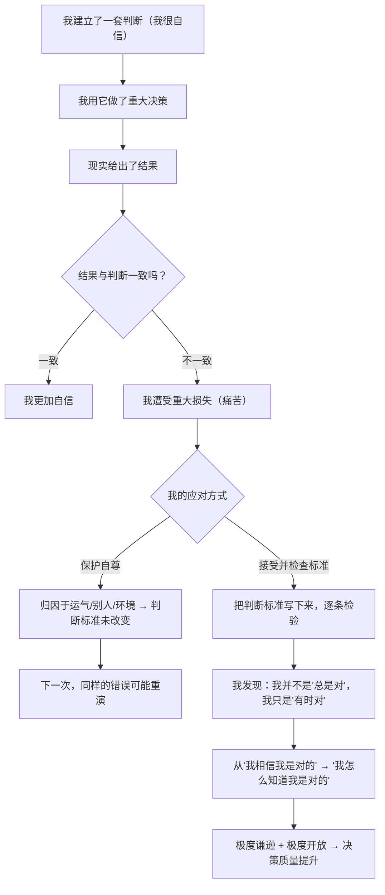

# 05｜1982 年的那次误判：一次「几乎破产」如何造就了极度谦逊？

> 达利欧一生中最惨的失败，为什么被他称为「发生在我身上最好的事」？

---

## 一、先说结论

1982 年，达利欧公开预测美国经济将陷入大萧条，结果市场迎来了一轮大牛市。他几乎赔光了所有资产，公司只剩他一个人，连工资都发不出来，只能向父亲借了 4000 美元生活。

但正是这次失败，完成了对他最关键的一次改造：

> **他从「我相信我是对的」，转向了「我怎么知道我是不是对的」。**

这个转变带来两个直接结果：**第一，他变得极度谦逊**——不是因为性格变好了，而是因为被现实打过；**第二，他开始把每一次判断的标准写下来**——因为只有这样，他才能在下一次检查自己到底错在哪。

《原则》这本书的种子，就埋在这次失败里。

---

## 二、我们先理解一个问题

先看一个更普遍的现象。

一个人越是聪明、越是成功，往往越难承认自己可能错。这很奇怪——按理说，聪明人应该更容易理解「人都会犯错」。

但现实常常相反。而且更麻烦的是：

> 当一个聪明人真的错了，他造成的损失，往往比普通人更大。为什么？

---

## 三、作者到底提出了什么观点？

达利欧讲这段经历时，真正的重点不在「我破产了」，而在于他从中提炼出的几条判断。

**第一，自信和能力是两件不同的事。**

1982 年的达利欧在专业能力上并不差。他的问题不是不懂经济，而是**把自己的判断当成了事实**。他在电视上、在客户面前公开宣称萧条必然到来，甚至准备好了迎接这个结果——结果证明他错得离谱。

**第二，过度自信会让人不做「如果错了怎么办」的准备。**

达利欧后来反思：他当时根本没有认真考虑另一种可能性。**一个判断如果只有「对」这一条路径，那它在结构上就是脆弱的。** 这直接对应了他后来强调的「期望值」「概率思维」（第 12 篇）。

**第三，失败把他从「我」拉到了「我 + 我的判断」的分裂视角。**

他后来说，那次经历让他学会了**从更高层次看自己**：那个在电视上讲话的达利欧，只是「达利欧这台机器」的一个输出结果，输出错了，要改的是机器，而不是用自尊去保护输出。

**第四，也是最有操作性的一条：他开始把判断标准写下来。**

他意识到，如果判断只存在脑子里，就没有办法被检查。于是他开始把「我在什么情况下、会怎么判断、为什么」记录下来，然后拿真实结果去校对。**这就是「原则」最初的形态——它不是人生感悟，而是决策日志。**

---

## 四、把这个观点翻译成人话

我们用最容易理解的场景说一遍。

假设你是一个很会看人的朋友。你曾经精准判断过好几个人的性格，因此在这件事上很有自信。

现在有个朋友要跟一个你「一眼就觉得不行」的人结婚。你非常笃定地劝他：「这人不靠谱，你千万别嫁。」

两年后，他们过得很幸福。

这时候会出现两种人：

**第一种人会说**：「是我看错了。」
**第二种人会说**：「那我不管了，你们自己的事。」

但还有第三种人——也就是达利欧在 1982 年之后变成的那种人。他会做的是：

- **承认结果**：我判断错了，这是事实，不解释、不找台阶。
- **回看过程**：我当时是凭什么判断的？是「他说话时眼神飘」，还是「我对某类人有刻板印象」？
- **检查标准**：我这条「看人标准」的准确率到底有多少？我有没有样本偏差？（我只记得我看对的那些，忘了我看错的那些。）
- **修改标准**：以后我可以说「我不太喜欢这个人」，但**不再把它升级成结论**；或者我要求自己给出至少三条可验证的具体观察，才允许下判断。
- **写下来**：把这条新标准记下。

你看，这个过程最后产出的，不是「我以后再也不乱说话了」这种模糊的自我约束，而是**一条可以被反复使用的、具体的判断标准**。

达利欧在 1982 年所做的，就是这个动作——只不过他赌上的是一座公司。

---

## 五、为什么会这样？

达利欧的这次转折，可以用一张图来理解：

这里有一个非常关键的心理机制：

**「一致」和「不一致」这两条路，都可以让人更自信——只不过方向相反。**

- 一直成功的人，会积累一种「我的直觉很准」的自信；
- 而被现实打过、并且认真检查过标准的人，会积累一种「**我知道我的直觉会在哪里出错**」的自信。

达利欧要的是第二种。他在书里说得很直白：**他后来最大的优势，不是看市场看得更准，而是他更清楚自己什么时候可能不准。**

这也是为什么他反复强调「极度谦逊」——**谦逊在他这里不是美德，而是一个由失败强制安装的保险装置。**

---

## 六、举一个现实生活中的例子

我们再举一个职场里非常常见的例子：**一个能力很强的管理者，第一次带团队翻车。**

背景：这位管理者是从顶尖业务岗升上来的，个人业绩一直第一，非常有自信。第一次带 8 人团队，他把自己的方法复制给每个人，要求所有人照做。

半年后，团队业绩下滑，三个人离职。

有两种后续版本。

**版本 A（保护自尊）：**
他得出结论：「是这批人不行，招得太差。」「是公司给的资源不够。」于是他要求换人、要资源。下一次带团队，他大概会重复相似的模式——因为在他的解释里，问题始终在外部。

**版本 B（检查标准）：**
他做的是这几件事：

1. 承认结果：不管什么原因，我带的团队垮了，这是我的责任。
2. 回看标准：我默认「我的方法对所有人适用」——这个假设有依据吗？
3. 找反证：那些做得好的人，是不是本来就跟我的风格接近？那些离开的人，具体卡在哪里？
4. 修改标准：把「复制我的方法」改成「先判断每个人适合什么角色，再匹配方法」。
5. 写下来，并且下次用。

几年后，版本 A 的人可能会说：「带团队这事我确实不行，还是做业务吧。」而版本 B 的人，会有一条自己的管理原则，而且是被一次真实的失败验证过的。

**达利欧的整个体系，本质上就是把版本 B 变成一种习惯——而且是对每一件事都使用的习惯。**

---

## 七、回到书中重新理解

现在回头看，达利欧在《我的历程》这一部分花了大量篇幅讲自己的错误，而不是讲自己的成功。很多读者觉得这部分是「铺垫」或者「自传」，读得快。

但如果你理解了这一篇，就会知道**那部分才是全书的地基**。

他在书里说，那次失败之后，他改变了自己的目标顺序：**从「我要证明我是对的」，变成「我要找出真相」。** 因为如果目标是「证明我对」，那么每次发现自己错了，都是对自尊的打击，我会本能地去防御；但如果目标是「找出真相」，那么发现自己错了就是收获。

这个转变听起来只是换个说法，但它带来的行为差异是巨大的：

| | 目标 = 证明我对 | 目标 = 找出真相 |
|---|---|---|
| 遇到反对意见 | 反驳、寻找支持自己的证据 | 好奇：他看到了什么我没看到的 |
| 被证明错了 | 自尊受挫、找台阶 | 收获：我的地图被修正了一块 |
| 是否接受批评 | 视心情而定 | 视其是否有助于接近真相 |
| 长期结果 | 判断标准停滞 | 判断标准持续升级 |

达利欧说，正是这个转变，让他后来能建立起一个「**让最聪明、最可信的人来挑战我**」的环境。如果他还停留在「证明我对」的阶段，桥水里那些著名的坦诚文化根本不可能存在——他会被活活气死。

---

## 八、这个观点背后还有什么？

**隐含前提一：失败可以被「提取」成经验。**

达利欧的叙事默认了「失败 → 反思 → 经验」这条链是通的。但现实中，很多失败的原因是随机的、不可重复的，提取不出经验。**能提取经验的失败，才是真正的「学费」。**

**隐含前提二：人有足够的内在承受力。**

不是每个人在一次重大失败后都能回到理性状态。达利欧当时虽然破产，但仍有专业技能、有行业人脉、有家庭支持（父亲借给他钱）。**「失败是好事」这句话，背后其实站着一堆隐形的安全网。**

**隐含前提三：外部世界会给第二次机会。**

达利欧能重新站起来，是因为投资行业允许他重来。很多行业的失败是一次性的。**这也是他的经验难以普遍化的地方。**

**与其他观点的联系：**
- 第 04 篇的「痛苦 + 反思 = 进步」在这里有了完整案例；
- 第 06 篇将解释**为什么大多数人做不到**这样反思——因为两个心理障碍；
- 第 07 篇的「极度开放」，本质上就是这次转折的**方法论版本**。

---

## 九、这个观点有问题吗？

有，至少有四点值得冷静看待。

**第一，叙事的选择性。**

达利欧讲这个故事时，已经成功了。**成功者的失败故事总是特别有说服力，因为结局已经被改写。** 我们可以想象另一种结局：一个同样在 1982 年判断错误、同样认真反思、但后来依然没能东山再起的投资者——他的故事不会出现在任何畅销书里。

**第二，「失败是好事」不构成对失败的美化。**

达利欧并不是说失败本身好，而是说他**从失败中提取出的东西**好。把这句话简化成「多经历失败就会成长」，是对他最糟糕的误读。

**第三，他的反思方式高度依赖「可量化反馈」。**

投资的好处是：对错很快会有数字告诉你。但在管理、教育、人际关系这些领域，反馈往往延迟、模糊、充满解释空间——**「我怎么知道我是不是对的」这个问题，在这些领域要难回答得多。**

**第四，极度谦逊也可能被过度包装。**

一个已经站在金字塔顶端的人说「我很谦逊」，和一个月薪三千的人被要求「接受自己的局限」，处境完全不同。**谦逊的价值，取决于它被用在什么位置。**

---

## 十、今天再看这个观点

在 AI 时代，达利欧这次转折有了一层新的意味。

今天最强大的 AI 系统，本质上也在做他当年做的事：**不断预测、不断被结果打脸、不断修改自己的参数。** 它们从不「维护自尊」，因此修改得比人快得多。

这带来一个微妙的问题：**如果机器的「谦逊」是免费的、廉价的，那么人的「谦逊」还有没有价值？**

达利欧的答案（如果我们顺着他的逻辑推）可能是：机器会更快地改进**已有规则**，但发现「该用哪套规则」「什么才是真正重要的目标」，仍然需要人。**人的价值，可能正在从「做出判断」转移到「决定该问什么问题、该优化什么」。**

这一段属于**基于达利欧思想的现代延伸**，书里并没有讨论 AI。

---

## 十一、这一篇真正应该记住什么？

1. **1982 年的惨败，把达利欧从「我相信我是对的」改造成「我怎么知道我是不是对的」。**
2. **过度自信最大的危险，是让人不再考虑「如果错了怎么办」。**
3. **被现实检验过的判断标准，比「我的直觉很准」可靠得多。**
4. **把目标从「证明我对」换成「找出真相」，是这一切的行为起点。**
5. **失败不是好事，能被提取成规则的失败才是。**

---

## 十二、留一个问题

> 达利欧说自己最大的优势，是「更清楚自己什么时候可能不准」。
>
> 那么请问：**你最可能在哪个领域高估自己？如果让你写下一条判断，你有多大的把握它是对的？**
>
> 下一篇，我们来看为什么人这么难承认自己可能错——**达利欧说的「两个障碍」，究竟是怎么运作的。**
