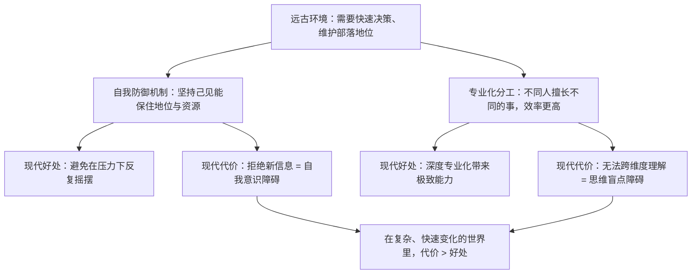

# 06｜为什么最难看清的人，其实是自己？——两个障碍

> 聪明人也会犯大错，而且犯了还坚信自己没错——达利欧说，这是因为人有两个与智商无关的障碍。

---

## 一、先说结论

达利欧提出，阻碍人看清现实的有两个普遍障碍：

- **自我意识障碍（ego barrier）**：我们本能地维护「我是对的」，把批评当成对自我的攻击；
- **思维盲点障碍（blind spot barrier）**：每个人都只能在自己擅长的维度里看见东西，在别人擅长的维度里，我们甚至意识不到自己看不到。

这两个障碍的可怕之处在于：**它们不会因为一个人聪明而消失，反而常常被聪明放大**——因为聪明的人更擅长为自己的判断找出漂亮的理由。

---

## 二、我们先理解一个问题

先看一个几乎所有人都经历过的瞬间。

你和别人争论一个问题，你明明感觉到对方的某个点说得有道理，甚至隐约觉得自己可能站不住脚了。但就在那一瞬间，你说出口的话却是：「但是……」「你这不成立……」「你不懂实际情况……」

为什么？

你其实已经看到了对方的证据，为什么身体却在自动拒绝它？

更奇怪的是，事后冷静下来，你可能私下承认「他说得有道理」。**那当场那个坚决的你，是谁？**

---

## 三、作者到底提出了什么观点？

达利欧把这个问题拆成两个独立的机制。

**机制一：自我意识障碍。**

达利欧说，人对「自己的想法被否定」的反应，在生理上和对身体疼痛的反应有相似之处。这不是比喻，而是一种本能防御。

它有几个典型表现：

- 把「我的观点被质疑」当成「我被攻击」；
- 争论中重点从「什么是对的」转移到「谁是对的」；
- 越是被公开指出错误，越固执；
- 事后虽然承认错了，但下次遇到同样情境，反应还是一样。

**机制二：思维盲点障碍。**

这一条更少被讨论，但达利欧认为它更隐蔽。

他举的例子大致是这样的：有些人天生擅长宏观、想象大图景，却看不见细节；有些人极度擅长细节，却看不见全局；有人对人际关系敏感但对数字迟钝；有人精于逻辑却读不懂情绪。

问题不是「有人强有人弱」，而是——**你看不到的那个维度，你不但看不见，而且不知道自己看不见。** 就像天生色盲的人，如果没有人告诉他，他会以为所有人都看到同样的颜色。

**机制三：两个障碍会互相喂养。**

自我意识障碍让你抗拒批评，思维盲点障碍让你根本不知道该往哪里看。结果就是：**你既看不到自己的盲区，又拒绝别人告诉你。**

---

## 四、把这个观点翻译成人话

我们用职场里最常见的场景说清楚。

**自我意识障碍的例子：**

会议上，老板当着所有人说：「你这个方案有问题。」

你的第一反应是什么？大概率不是「哪里有问题」，而是脸发热、心跳加快，然后立刻开始找理由——「那是因为时间不够」「是另一个部门没配合」。

请注意，你其实**还没有听到具体问题是什么**，就已经开始防守了。

这就是自我意识障碍在动作：它把「方案被质疑」自动翻译成「我被否定」，于是启动了防守。

**思维盲点障碍的例子：**

同一个会议上，同事说：「你这个方案忽略了客户的实际使用场景。」

你可能完全听不懂这句话在说什么——**因为你天生就更容易从「逻辑是否自洽」的角度看问题，而很难自然地切换到「用户视角」。** 你的方案逻辑可能完美无缺，但你压根没往那个方向想。

而且关键在这里：**你不会觉得自己漏了什么，你只会觉得「这不是重点」。** 因为对盲区里的东西，你是真的看不见。

用一句话概括区别：

> **自我意识障碍让你「拒绝看见」，思维盲点障碍让你「看不见」。**

前者是门被关上了，后者是那扇门根本不存在。

---

## 五、为什么会这样？

从进化角度看，这两个机制都不是「缺陷」，而是**曾经的生存优势**。

**关于自我意识障碍：** 在远古的小群体里，一个总是改变主张的人会被视为不可靠，地位会下降。所以「坚持己见」曾经是生存优势。但在今天，坚持一个错误判断的成本，可能是一家公司倒闭。

**关于思维盲点障碍：** 大脑本来就分工明确，这是效率的来源。一个人不可能在所有维度上都敏锐，否则大脑的负荷无法承受。但代价是——**当你需要跨维度看问题时，你的直觉会骗你。**

达利欧的结论是：这两个障碍在原始环境下帮助我们生存，**但在现代社会，它们是我们最大的敌人。**

而且他特别强调：**聪明不能免疫。**

恰恰相反——

- 聪明人更擅长为自己的立场构建精致的论证，所以更难被说服；
- 聪明人往往在自己的维度上极其出色，因此更信任自己的直觉，更不去看别的维度。

**这就是为什么达利欧说，他见过的最大的错误，通常来自最聪明的人。**

那么怎么办？

达利欧的答案不是「变得不自我、没有盲区」——那不可能。他的答案是**承认它们的存在，然后建立机制来对抗它们**。这个机制就是下一篇要讲的「头脑极度开放」。

---

## 六、举一个现实生活中的例子

我们看一个真实感很强的案例：**一家公司要决定要不要开拓一个新市场。**

会议上有两个人。

**A 总**：从数字角度看，新市场的用户增速和客单价都很漂亮，ROI 算得通。他非常确信应该进。
**B 总**：从组织和人员角度看，公司目前的团队根本没有能力支撑跨区域运营，进去就是消耗。他也非常确信不该进。

两个人都很聪明，都有扎实的理由。他们争论了两小时，谁也没说服谁。

现在看他们会怎么处理这次分歧。

**如果两个人都被两个障碍支配：**
争论变成「谁更权威」，最后 A 总赢了——因为他职位高。决定进入新市场。半年后公司果然被拖垮，A 总说：「战略是对的，是执行不到位。」B 总私下说：「我早就说了。」

**如果他们能克服这两个障碍：**
他们会先做一件事——**承认两个人可能都是对的，只是看到的维度不同。**

- A 看到的维度：**机会是真实的**；
- B 看到的维度：**能力是不足的**。

这两个结论并不矛盾。真正的问题不是「进不进」，而是：

> **如果我们认为这个机会值得抓，那我们有没有办法在能力不足的情况下，仍然抓住它？**

比如：先派一个小分队试水、找本地合作伙伴、用外部资源补能力短板。

你看，**分歧在原来的框架里是无解的，但一旦承认「我看不全」，它就可能变成一个更好的第三方案。**

达利欧有一句非常关键的话，大致意思是：**如果你和另一个人都很有能力，却得出相反的结论，那么真相很可能在你们两个人之间，而不是在你们各自的立场里。**

---

## 七、回到书中重新理解

现在回头看达利欧的原始论述，就能读出它的分量。

他写道，人生中最难做到的事之一是「**在不认同别人的时候，仍然认真考虑对方可能是对的**」。这句话看起来只是礼貌，其实是一个极其反本能的动作——因为自我意识障碍正在你体内大叫「他在攻击你」。

他还说，他要努力做到「**让自己的判断标准可以被质疑**」。这就是为什么桥水会搞出那么多看起来夸张的制度——比如给会议打分、比如把分歧公开记录。**这些制度不是为了让人舒服，而是为了对抗那两个与生俱来的障碍。**

还有一点容易被忽略：达利欧把这一条放在了「生活原则」的第 3 条，紧跟在「拥抱现实」和「五步法」之后。

这个位置是有讲究的：

> **「拥抱现实」是目标，「五步法」是方法，但如果你连「我可能看不见真相」都不承认，前面两条就全都执行不了。**

所以「头脑极度开放」，其实是把「拥抱现实」从一句态度，变成了一个必须训练的能力。

---

## 八、这个观点背后还有什么？

**隐含前提一：人的局限是可以通过机制弥补的。**

达利欧相信，虽然个人无法消除盲区，但可以通过引入他人、设计流程来补足。这本质上是一种「制度乐观主义」。

**隐含前提二：其他人愿意说真话。**

如果周围的人都在说你想听的，那「开放」也听不到真相。这直接引出了工作原则里的「极度求真」。

**隐含前提三：知道两个障碍存在，就能对抗它。**

这一点其实有争议。知道自己有偏见，并不总能消除偏见——心理学上叫「偏见盲点」。达利欧的做法是**把它流程化**，而不是指望自己记得。

**与其他观点的联系：**
- 第 03、04 篇提供了「为什么要看清现实」；
- 第 07 篇给出对抗这两个障碍的**具体方法**；
- 第 16、17 篇把「对抗个人盲区」扩展到「组织如何做决策」。

---

## 九、这个观点有问题吗？

有，主要在三处。

**第一，自我意识不完全是坏事。**

达利欧倾向于把自我意识整体定位成障碍。但一个完全没有自我意识的人，可能缺乏行动的决心和承担失败的勇气。**健康的自我，是行动力的来源。** 问题不是「有自我」，而是「自我垄断了判断权」。

**第二，「思维盲点」这个说法可能被滥用。**

「这是我的盲区，不是我的错」——如果一个人用这个说法来逃避责任，那就成了新的护身符。**承认盲区是为了找人来补，不是为了免责。**

**第三，极度开放可能让人失去立场。**

如果一个人对每个观点都开放，他可能永远无法做出果断的决定，甚至可能被更强势、更会表达的人牵着走。这里需要区分「开放地接收信息」和「开放地放弃判断」——**接收信息之后，仍然要自己拍板。**

**第四，这一套在权力不对等的环境里很难运作。**

在一个「上层的意见不能被挑战」的组织里，谈极度开放几乎是空话。**达利欧的方案，前提是组织愿意重新分配「说话的权利」。** 这也是它难以被广泛复制的原因之一。

---

## 十、今天再看这个观点

如果说达利欧针对的是「人类天生的两个盲区」，那么今天的 AI 给这件事加了一个新维度。

**AI 恰好在这两个方向上与人相反：**

- 它没有自我意识，所以不会因为「被指出错误」而防御（虽然它会「附和」用户，那更像是训练带来的倾向）；
- 它在某些维度上的「视野」是人的盲区的补充——比如处理海量数据、同时考虑很多变量。

但 AI 也有它自己的「盲区」：它看不到真实世界的具体情境，读不懂隐含的权力关系与情感，也无法为判断承担后果。

于是出现一个有意思的分工：

> **人负责提供目标和承担责任，AI 负责扩大视野和挑战偏见。**

「用 AI 当你的对手，来逼出你自己看不到的东西」，是**基于达利欧思想的现代延伸**——他没有讨论 AI，但他的逻辑指向这个方向。

---

## 十一、这一篇真正应该记住什么？

1. **阻碍人看清现实的两个障碍：自我意识障碍（拒绝看见）和思维盲点障碍（看不见）。**
2. **这两个障碍与智商无关，反而常常被聪明放大。**
3. **它们曾经是进化优势，但在复杂世界里变成了最大的成本。**
4. **当两个可信的人结论相反时，真相往往在两者之间。**
5. **对抗它们不能靠「提醒自己」，而要靠在制度上引入别人。**

---

## 十二、留一个问题

> 请诚实回答：**上一次有人指出你的问题时，你的第一反应是「他看到了什么」，还是「他凭什么」？**
>
> 如果答案是后者——那么知道这两个障碍的存在，真的能改变什么吗？
>
> 下一篇，我们来看达利欧给出的具体答案——**什么叫「头脑极度开放」，以及它为什么比聪明更重要。**
