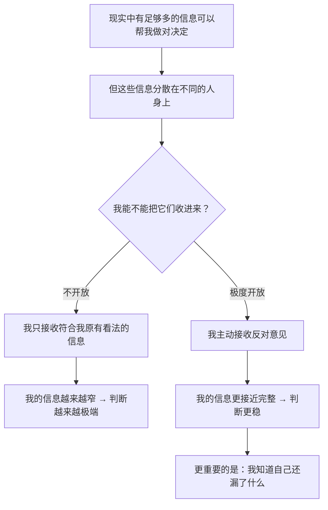

# 07｜头脑极度开放：为什么它比聪明更重要？

> 既然智力不能保证正确，「极度开放」具体要怎么做？它和「好脾气地听人说完」有什么区别？

---

## 一、先说结论

达利欧说的「头脑极度开放」，不是一种礼貌，而是一种**主动的、带有攻击性的求真方法**：

> **不是「我听你说完」，而是「我要去找出你可能是对的那部分，以及我可能错在哪里」。**

他把开放程度、能力、决心并列为决定成功的三个要素。更具体地说，他认为极度开放是一种可以刻意训练的能力，它包含三个动作：**主动寻找反对意见、把「我的观点」和「我的自我」分开、用可信度而不是亲疏来决定听谁的。**

一句话：**极度开放不是没有主见，而是把主见的来源从「我的直觉」换成「经过检验的信息」。**

---

## 二、我们先理解一个问题

先看一个很奇怪的现象。

一个人可以同时做到两件事：

- 在工作中，他能理智地承认「这个方案可能有问题」；
- 在争论自己的专业观点时，他绝对听不进反对意见。

同一个人，为什么在 A 场合开放，在 B 场合封闭？

顺着这个现象再往下问一个更奇怪的问题：

> **一个人越是在某个领域有经验、有成绩，为什么越可能在这个领域不开放？**

这不符合常识——按说经验多的人，应该更懂「我也可能错」才对。

---

## 三、作者到底提出了什么观点？

达利欧关于极度开放的论述，可以归纳成五条。

**第一，开放的对象是「信息」，不是「情绪」。**

极度开放不是让所有人都开心地发言，而是让**最接近真相的信息**能进入你的判断。为此，他甚至愿意被最尖锐地质疑。

**第二，开放的前提是承认「我更想找出真相，而不是证明我对」。**

这是第 05 篇那次转折的延续。如果目标是证明自己对，那么开放只会让你难受；如果目标是找出真相，那么每个反对意见都可能是礼物。

**第三，开放不等于没有观点。**

达利欧明确说过：你当然要有自己的判断，否则你无法行动。区别在于——**你的观点要随时准备被更好的证据替换。** 开放不是空白，而是可更新。

**第四，开放是有「收益曲线」的。**

他提出一个判断：**在能力已经足够的情况下，开放程度往往比能力本身更能决定结果。** 因为能力决定你能看到多少，开放决定你能接收多少——而大多数人的问题不是看不到，而是不接收。

**第五，开放需要「可信度」的筛选。**

极度开放不等于对所有人的意见一视同仁。否则你会被噪音淹没。达利欧的配套机制是「可信度加权」（第 17 篇）：**对在相关领域有连续成功记录的人的反对意见，给予更高的关注。**

---

## 四、把这个观点翻译成人话

我们用一个非常具体的场景来对比。

你和合伙人要决定要不要做一件事。你倾向做，他倾向不做。

**「礼貌式开放」是这样的：**
「好的，我理解你的顾虑，我们再想想。」——然后你回去继续按自己的想法推，只是措辞更委婉了。表面上听了，实际上没听。

**「无效式开放」是这样的：**
你听了所有人的意见，最后什么都没决定，或者谁的嗓门大听谁的。

**「极度开放」是这样的：**

第一，你先问自己一个明确的问题：**「如果我错了，最可能是因为什么？」** 不是泛泛地问，而是具体地猜——「可能是低估了成本，可能是高估了用户需求。」

第二，你去找**最可能知道答案的人**，而不是最可能同意你的人。

第三，当他说出反对意见时，你的任务是：**先完整复述他的推理，直到他说「对，你就是这个意思」。** 这一步极其关键——**如果你不能准确复述对方的观点，说明你还没有理解它，你只是在准备反驳。**

第四，然后你问第二个问题：**「你的哪一部分我可能应该接受？即使我不同意结论。」** 因为对方很可能有一条你没考虑到的信息，它未必推翻你的结论，但会修改你的方案。

第五，你更新自己的判断——可能是坚持原方案、修改方案，也可能是放弃。**重点是：这个更新必须能被追溯到具体的理由。**

你看，极度开放不是态度软，而是**流程硬**。

---

## 五、为什么会这样？

达利欧的逻辑，可以用一个「信息收窄」的过程来说明：

这里有一个非常精妙的地方：

**不开放的人，不只是信息少，而是信息在系统性偏移。**

因为人有一种本能：更愿意接受符合自己观点的信息。于是时间越久，你的信息库就越像一面回音壁——你会越来越确信，因为你周围的证据都指向同一个方向。**而这个「确信」，恰恰是封闭的产物，不是真相的证明。**

达利欧还指出了一个更深的问题：**为什么越有经验的人越难开放？**

可能的解释是：**经验会带来沉没成本。** 一个人在某领域投入了十年，如果承认某个基本判断是错的，就等于否定了十年。于是自我意识障碍在这个领域格外强烈——**我们保护的不是观点，是过去投入的自己。**

这也解释了为什么达利欧强调「把观点和自我分开」：**观点不是你的一部分，它只是你目前掌握的信息的处理结果。** 换掉一个有问题的观点，不会减少你，只会升级你。

---

## 六、举一个现实生活中的例子

我们看一个很多人都经历过的场景：**一个资深工程师和一个年轻同事的技术分歧。**

资深工程师老张，做这行十五年，对某套架构非常熟悉。

年轻同事说：「我们这次的场景，其实更适合用另一种方案，原因是……」

老张的第一反应可能是：「你不懂，我们以前试过，那套东西在这个体量下会崩。」

这句话本身就是不开放——**他没有问「这次的场景和以前有什么不同」，而是直接用过去的经验覆盖了现在。**

一个极度开放的老张会怎么做？

1. 先复述：确认对方说的核心是「场景不同」还是「技术更优」；
2. 承认不确定：「你说得可能对，但我当年确实踩过坑——具体是哪一次，我们要不要对比一下？」
3. 找证据：不靠回忆吵架，而是做一次小规模压测；
4. 接受结果：哪怕结果证明他是错的。

注意，这不是「资深的人要让着年轻人」——完全不是。**如果他最后证明自己是对的，他依然是极度开放的。** 因为开放在乎的是过程，不是结论由谁提出。

反过来，一个年轻人如果遇到老张提出反对，也应该做同样的动作——**极度开放是双向的，不是下级对上级的品德要求。**

达利欧在公司里做的，就是让这个动作成为**所有人对所有人的常态**。

---

## 七、回到书中重新理解

现在回头看达利欧的原话，会更容易读懂。

他说，他见过的最常见的两种人：一种总是认为自己是对的，另一种总是害怕自己错了。他想要的是第三种——**清楚地知道自己在什么时候、哪个问题上更可能对，以及什么时候更可能错。**

他还说，极度开放需要一种「**不怕被证明是错的**」的心理状态。这句话的分量在于：**它把「被证明错了」从损失重新定义为收获。** 如果每次被证明错了，你都得到了一次修正地图的机会，那么你被证明错的次数越多，你手里的地图就越准。

他同时提醒，要做到这一点，需要一个支持它的环境——**如果一个组织里说真话会被惩罚，那么极度开放只能是个人的修养，撑不了多久。**

这句话很关键，也解释了为什么「头脑极度开放」（生活原则）和「极度求真」（工作原则）必须是配套的：**一个是个人能力，一个是组织条件。**

---

## 八、这个观点背后还有什么？

**隐含前提一：真相是存在且有价值的。**

如果所有观点都只是立场，没有更接近真相的可能，那么开放也就失去了方向。

**隐含前提二：能区分「可信度」和「嗓门」。**

极度开放需要一个筛选机制，否则会变成「谁说得激烈听谁的」。这个机制就是可信度加权。

**隐含前提三：人有能力承受「我错了」这件事。**

这一点对自尊的稳定性有要求。有些人不是不想开放，而是承受不起。

**与其他观点的联系：**
- 第 06 篇的两个障碍，是这一条的**问题来源**；
- 第 05 篇的失败，是这一条的**动机来源**；
- 第 17 篇「可信度加权」和第 18 篇「深思熟虑的意见分歧」，是这一条在组织里的**落地形式**。

---

## 九、这个观点有问题吗？

有，而且这一条在实践中特别容易走样。

**第一，「开放」可能被当成一种话术。**

「我很开放，你说」——然后对方一开口，你就用问题把对方问到自我怀疑。这其实是**开放的外壳 + 封闭的内核**。识别标志是：**他是否真的会因为对方的证据而改变自己。**

**第二，极度开放可能变成「决策瘫痪」。**

如果每个意见都值得认真对待，你就可能永远在听、永远不定。达利欧的缓解方案是「可信度加权 + 最终要有人拍板」，这两件事必须同时存在，否则开放就成了拖延。

**第三，开放的成本被低估。**

认真听、认真复述、认真检验，都要花时间和精力。达利欧能这么做，是因为桥水有资源和制度支撑。对个人来说，**选择「在哪些重要问题上开放」比「对所有事都开放」更现实。**

**第四，环境不对称。**

在一个不鼓励说真话的环境里，单方面开放的人可能吃亏——他暴露了自己的想法，却得不到真实的反馈。所以达利欧的方案与其说是个人修养，不如说是**需要被组织制度保护的能力**。

---

## 十、今天再看这个观点

极度开放这一条，在今天有一个非常具体的对手：**算法性的信息茧房。**

你越开放，算法给你的对立面可能越少——因为推荐系统的目标是让你停留，而对立观点会让你离开。

于是出现一种新的困境：

> **过去，不开放是因为人不想听；现在，不开放是因为系统不让你听。**

这使得「极度开放」从一种修养，变成了一种**需要主动争取的动作**：你得刻意去寻找那些跟你意见不同、但可信度高的人；刻意去读让你不舒服的分析；刻意去问「我可能错在哪」。

在这一点上，AI 可以有两种角色：既可以放大你的回音壁（只顺着你说），也可以当你的**反方陪练**（专门挑你的漏洞）。**选择哪一种，取决于你使用它的方式。**

这是**基于达利欧思想的现代延伸**。

---

## 十一、这一篇真正应该记住什么？

1. **极度开放不是礼貌地听完，而是主动去找「你可能是对的那部分」和「我可能错在哪」。**
2. **开放的前提，是把目标从「证明我对」换成「找出真相」。**
3. **开放不等于没有观点，观点要可更新，而不是可放弃。**
4. **越有经验的人越难开放，因为保护观点就是在保护过去的投入。**
5. **个人开放需要组织制度保护，否则它撑不了多久。**

---

## 十二、留一个问题

> 请你现在做一个小实验：选一个你最近很确信的判断，然后逼自己写出**三条「如果这个判断是错的，最可能是因为什么」**。
>
> 如果你写不出来——那是这个判断太牢固，还是你其实从没认真考虑过它会错？
>
> 下一篇，我们进入生活原则最实操的部分——**达利欧的「五步法」，为什么能处理几乎任何人生问题。**
