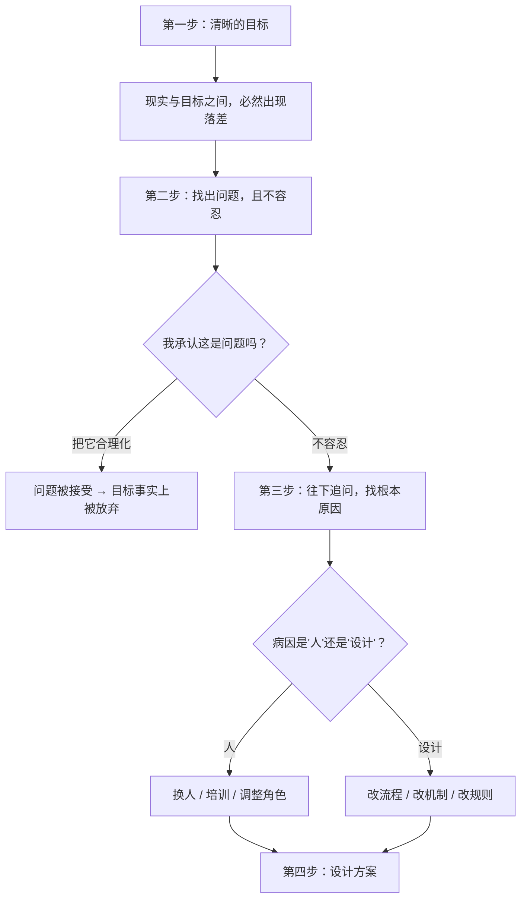

# 08｜五步法（上）：目标、问题、诊断

> 为什么实现任何人生愿望，都可以被拆成五个固定步骤？

---

## 一、先说结论

达利欧把「个人进化」的过程，拆成了一个五步循环：

1. **设定清晰的目标**
2. **找出并「不容忍」阻碍目标的问题**
3. **诊断问题，找到根本原因**
4. **设计方案**
5. **坚决执行到底**

这一篇讲前三步。它们共同的核心是：

> **把「我想要」和「我做不到」，从一个模糊的情绪状态，拆成两个可以被分别处理的对象。**

尤其第二步是关键——**大多数人不是没有问题，而是不允许自己承认问题。** 达利欧用「不容忍」这个词，是因为容忍问题等于放弃目标。

---

## 二、我们先理解一个问题

先看一个非常普遍的困境。

你可能已经「下定决心」很多次了：要减肥、要换工作、要学英语、要开始写作。

每一次的决心都是真的，每一次的放弃也是真的。而且更奇怪的是——

> 为什么我们常常在「明明知道该怎么做」的情况下，依然做不到？

是因为不知道方法吗？很多时候不是。是因为懒吗？也不完全是。

那到底发生了什么？

---

## 三、作者到底提出了什么观点？

达利欧的五步法，本质上是把「进化」这件事流程化。他有一个很重要的判断：

> **实现愿望是一种可以拆解的技能，而不是一种天赋或运气。** 如果你五个步骤都做得好，你几乎必然会成功；如果做不好其中任何一步，你就会失败。

我们逐条看前三步。

### 第一步：设定清晰的目标

达利欧强调，**目标是「你要什么」，不是「你怎么得到它」。**

很多人在定目标时就已经把可行性和方法混了进去：「我想换工作，但现在行情不好，所以还是算了。」这不是在定目标，这是在提前给自己判死刑。

他主张：**定目标时就只定目标。** 先弄清楚你到底想要什么——是更高的收入、更自由的时间、还是更有意义的工作？——然后再进入下一步。

他还提出一个反直觉的观点：**目标的优先级必须排清楚。** 你不可能什么都要。达利欧说他早年最大的教训之一，就是学会「**你几乎可以得到任何你想要的东西，但不是所有东西**」。

### 第二步：找出并「不容忍」问题

这是五步法里最容易被忽略、也最关键的一步。

达利欧用的词是 **"identify and don't tolerate"**——找出问题，并且**不容忍**它。

为什么是「不容忍」？

因为人有一种强大的能力：**把问题合理化。** 我们会说「这个行业就这样」「大家都这样」「这不是我能控制的」「其实也没那么严重」。这句话一说出口，问题就从「待解决」变成了「已接受」，天平就此倾斜。

达利欧认为，**发现问题是痛苦的事，因为它常常指向你自己的弱点。** 所以这一步天然会触发我们前面讲过的自我意识障碍。能不能过这一关，决定了五步法是否还能继续。

### 第三步：诊断问题，找到根本原因

达利欧说，诊断是最需要「**从更高层次看自己**」的一步。

它的关键在于：**区分「症状」和「病因」。**

- 症状：这个月业绩下滑了。
- 病因：可能是我在某个环节的流程设计有问题，也可能是把人放错了位置，也可能是市场真的变了。

诊断的质量，取决于你是否愿意往深挖一层。达利欧提醒，很多人在这里会不自觉地「**跳步**」——刚看到一个原因，就急着去想解决方案。**但如果你对病因的判断是错的，后面所有的方案都是在错误的地基上盖房子。**

他还强调一点：诊断时要**分清「人的问题」和「设计的问题」**。这两类问题的解法完全不同——一个是换人/培训，一个是改流程。把设计问题当作人的问题，就会不断换人却始终解决不了；把人的问题当成设计问题，就会不停地改流程却始终无效。

---

## 四、把这个观点翻译成人话

我们用一个特别生活化的目标来演示前三步：**「我想在一年内攒下五万块钱。」**

**多数人的做法：**
定下目标 → 第一个月省吃俭用攒了八千 → 第二个月有个朋友结婚随了份子 → 第三个月换了手机 → 半年后就没再提这事了 → 年底复盘时归结为「我这个人就是存不下钱」。

问题出在哪？

**第一，目标不够清晰。** 「攒钱」和「一年五万」完全不同；「一年五万」和「每个月存 4200」也不同。**清晰到可以被检验的程度，才叫目标。**

**第二，没有做「找出问题」这一步。** 如果认真看，会发现真正的阻碍可能不是「意志力」，而是「**月初完全没有预算，花钱全凭心情**」——这是一个具体的、可以解决的问题。

**第三，没有诊断到根本原因。** 再往下问：「为什么没有预算？」答案是「我从来不知道自己的钱花在哪」；「为什么不知道？」答案是「我从不看账单」。**到这里，病因才浮出来——不是「我存不下钱」，而是「我对自己的收支完全无感」。**

你看，如果没有第二、三步，你得到的结论是「我是个性如此的人」；有了第二、三步，你得到的结论是「我需要建立一个记账机制」。**前者无法行动，后者可以立刻行动。**

达利欧的整套方法，做的事就是：**把无法行动的自我评价，转换成可以行动的诊断结论。**

---

## 五、为什么会这样？

为什么这三步必须按顺序、分开做？我们用一张图说明。

关键在 D 这个岔路口。

达利欧有一个非常犀利的观察：**大多数人失败，不是因为找不到原因，而是因为在「问题」这一关就投降了。**

因为「承认有问题」往往意味着「承认我有弱点」。这让人非常难受。于是大脑会自动生成一个更舒服的版本：「这不是问题，这是客观条件。」

**问题是：一旦你把它定义为客观条件，你就永远失去了解决它的资格。**

所以「不容忍」这三个字，说的不是态度强硬，而是**拒绝在心理上给问题发通行证**。

另外一个关键点：**这三步必须分开做，不能混着做。**

- 定目标的时候，不要想「这能做到吗」，否则你只会定出保守的目标；
- 找问题的时候，不要急着想解决方案，否则你会挑那些「好解决的问题」而漏掉真正的要害；
- 诊断的时候，不要急着安慰自己，否则你会停在第一个听起来合理的原因上。

达利欧反复强调：「**一次只做一种思考。**」这不是效率问题，而是质量问题——**混在一起想，每一种思考都会变形。**

---

## 六、举一个现实生活中的例子

我们看一个职场中的例子：**一个人总是被同事抱怨「不好合作」。**

**第一步：目标。**
他想要的其实很具体：在未来一年内，成为团队里大家愿意主动合作的人（而不是泛泛的「我要改善人际关系」）。

**第二步：找出问题，且不容忍。**
如果他对自己说：「我性格就这样，不喜欢的人就懒得理。」——问题就被合理化了，链条到此终止。

如果他不容忍，他会开始记录：过去三个月里，有几次被明确抱怨？分别发生在什么场景？

**第三步：诊断根本原因。**

他可能会发现两种完全不同的病因：

- **病因 A（设计问题）**：他的工作流程让他必须在很晚的时候才把需求传给同事，同事没有缓冲时间，自然不满。
- **病因 B（人的问题）**：他在表达时习惯用「你应该……」，触发了对方的防御。

注意，这两个病因的解法完全不同。如果他误判成 A，他会去改流程，但表达方式的问题依然存在；如果他误判成 B，他会去练习话术，但流程的硬伤还在。

**这就是达利欧为什么说诊断决定了后面所有动作的成败。**

而且请注意，整个过程里，他没有一次说「我是个不好的人」。他只是在做工程式的定位：**目标是什么、落差在哪里、原因是什么。** 这正是「从更高层次看自己」的意义——**把「我好不好」的问题，换成「系统该怎么改」的问题。**

---

## 七、回到书中重新理解

现在回头看达利欧在书里对五步法的描述，就会注意到他几个容易被忽略的用词。

他说，五步法要成功，你必须**「清醒、理性地」** 进行这个过程，并且**「从更高层次俯视自己」**，还要**「极其诚实」**。

这三个要求，其实分别对应了前面几篇的内容：

- 「清醒理性」——对应第 04 篇，不要在痛苦中做判断；
- 「从更高层次俯视自己」——对应第 05、06 篇，把自己当成一台机器，而不是一个待辩护的人；
- 「极其诚实」——对应第 03、07 篇，拥抱现实 + 极度开放。

他还特别提到一个细节：**不要把「目标」和「愿望」混为一谈。** 愿望是「我希望」，目标是「我要，并且我愿意付出对应的代价」。

这句话说得非常达利欧：**目标是有价格的。** 一个不附带代价的「目标」，其实只是愿望。而愿望，是无法用五步法处理的——因为五步法的每一步都在追问：你为此做了什么？

---

## 八、这个观点背后还有什么？

**隐含前提一：目标是可以自己选择的。**

达利欧的方法假设「你知道自己要什么」。但很多人真正的困境恰恰是「不知道想要什么」。**对这类人来说，五步法的第一步就可能卡住，需要先解决「目标从哪来」的问题。**

**隐含前提二：问题是可以被诊断的。**

不是所有问题都有清晰的因果。有些问题是系统性的、多方纠缠的，用「找根本原因」的思路可能会陷入过度简化。

**隐含前提三：诊断的人有足够的信息和视角。**

**一个人往往看不到自己的根本原因。** 这也是为什么达利欧在组织层面强调，诊断最好由「可信度高、且不在问题里」的人来做——这一点在工作原则里被制度化了。

**与其他观点的联系：**
- 第 09 篇将讲第四、五步（方案与执行）；
- 第 10 篇会解释「从更高层次看自己」，也就是做诊断时需要的那个视角；
- 第 23 篇的「诊断根源」，是这一篇第三步在组织里的展开。

---

## 九、这个观点有问题吗？

有，主要是这几点。

**第一，「五步法」的顺序假设可能过于线性。**

现实中，人往往是在执行中才发现目标错了、或者问题诊断错了，需要回头。达利欧虽然说这是一个循环，但书中的表述容易给人「一次做对」的错觉。**真实的进化是螺旋加反复回头。**

**第二，「不容忍问题」可能变成对自己过度苛刻。**

如果一个人把所有落差都当成「问题」，并且不容忍任何问题存在，他会长期处于紧绷状态。**有些问题的合理处理方式是「接受并共存」，而不是「必须解决」。**

**第三，它更适合「可分解的目标」。**

攒钱、改进流程、提升某项技能，用五步法非常有效。但「我想过得幸福」「我想被人爱」这类目标，很难被拆成五个步骤。**达利欧的方法有它的适用边界。**

**第四，诊断的质量高度依赖自我认知。**

一个不了解自己的人，可能会把病因诊断错，然后用五步法非常高效地解决一个不存在的问题。**工具越锋利，方向错误时的代价越大。**

---

## 十、今天再看这个观点

五步法在今天有一个天然的对照物：**AI Agent 的「规划—执行」循环。**

现代 Agent 的工作方式其实非常像达利欧的五步法：

- 设定目标（任务定义）；
- 发现问题（执行失败的反馈）；
- 诊断原因（分析错误）；
- 设计新方案（调整策略）；
- 执行到底（重试或换路径）。

这个对照很有意思，因为它指出了五步法真正的价值：**它不只是一个「人应该如何思考」的建议，而是一个通用的解决问题结构**——只要一个系统需要不断改进，它就绕不开这五步。

同时它也提出一个反问：**如果机器能比人更高效地执行这五步，那么人的优势在哪里？**

顺着达利欧的逻辑推，人可能的优势在第一步和第三步——**决定什么是值得追求的目标，以及判断什么才是真正的根本原因。** 前者需要价值观，后者需要对情境的深度理解。

这是**基于达利欧思想的现代延伸**。

---

## 十一、这一篇真正应该记住什么？

1. **五步法：目标 → 问题 → 诊断 → 方案 → 执行；五步都做好，几乎必然成功，任何一步做不好都会失败。**
2. **定目标时就只定目标，不要提前用可行性否掉它。**
3. **关键不是「发现问题」，而是「不容忍问题」——合理化问题等于放弃目标。**
4. **诊断时要区分「人的问题」和「设计的问题」，误判会让后面的所有努力白费。**
5. **一次只做一种思考：定目标、找问题、诊断，混在一起想，每种思考都会变形。**

---

## 十二、留一个问题

> 选一个你一直没实现的愿望，现在只做前三步：
>
> 你的**目标**具体到可以被检验吗？你**最不愿意承认的那个问题**是什么？它的**根本原因**是「人的问题」还是「设计的问题」？
>
> 下一篇，我们来讲第四、五步——**为什么「诊断对了」之后，大多数人还是什么都改变不了。**
