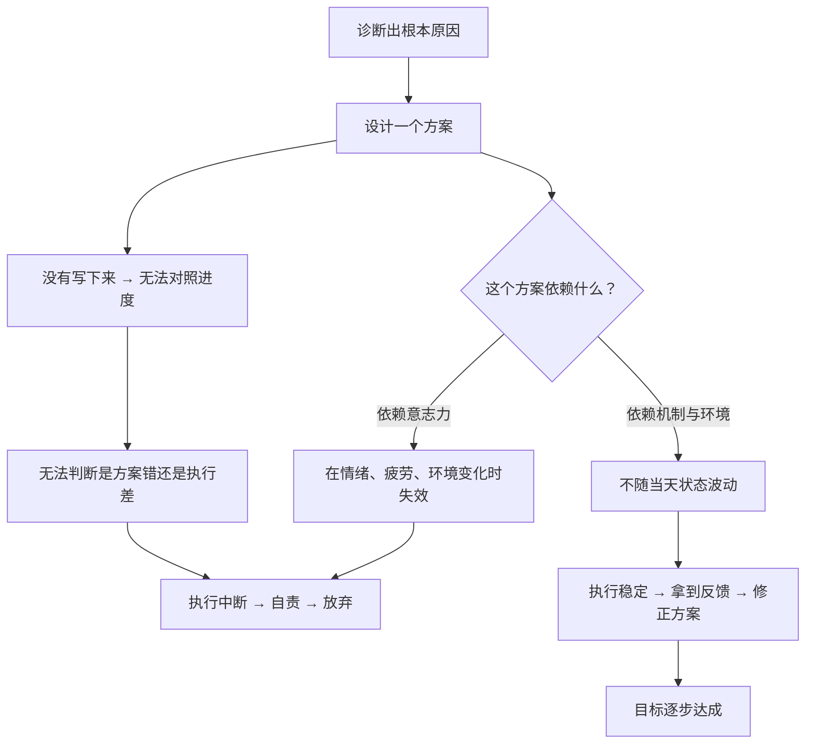

# 09｜五步法（下）：方案与执行，以及「弱点不重要，方案才重要」

> 为什么很多人已经诊断出了原因，最后却还是一事无成？

---

## 一、先说结论

五步法的后两步是：

4. **设计方案**——把诊断结论转换成一份具体的行动计划；
5. **坚决执行到底**——把计划推过终点线。

达利欧在这一段提出了两个非常重要的观点：

**第一，方案必须写成「像电影剧本一样」的东西**——谁、在什么时候、做什么，清楚到可以让别人看懂进度。

**第二，也是最反直觉的一条：弱点本身不致命，没有应对弱点的方案才致命。**

> 你不需要变成一个没有弱点的人；你只需要为你的每一个弱点，配一个应对方案。

---

## 二、我们先理解一个问题

先看一个特别常见的现象。

一个人去体检，查出问题，医生给了明确的诊断和方案。他当时很受触动，甚至当场下决心要改变。然后——半年后，他什么也没变。

在个人成长上，这个现象更普遍：

- 他知道自己拖延，也确实想改；
- 他知道自己不会拒绝别人，也确实被这件事困扰；
- 他清楚地知道原因（原生家庭、性格、过去的失败）。

**诊断已经很清楚了，方案也不难，可为什么就是执行不下去？**

---

## 三、作者到底提出了什么观点？

我们逐条看达利欧这两步的核心。

### 第四步：设计方案

达利欧关于「设计」有几个很具体的要求：

**（1）先退回去，再往前走。**

这是他的原话大意：「**go back before you go forward**」。意思是：设计之前，先回到问题的源头，重新确认你要解决的是什么。很多人一发现问题就急着开药，结果治的不是那个真正的病。

**（2）把方案想象成一部电影剧本。**

这可能是他最有画面感的建议。方案不能只写「我要变得更自律」，而要写成：

> 周一到周五，早上 6:30 起床；起床后先不看手机；7:00-8:00 写作；这个动作由我把手机放在客厅来完成。

**它必须包含：时间、动作、以及由谁（或什么机制）来保证。**

**（3）方案必须写下来，并且可以对照进度。**

达利欧认为，**只有被写下来的东西才能被检验。** 写下来的方案不再依赖你的记忆和当下的情绪，而是变成了一个客观对象，你可以问：「这一周做到了几天？」

**（4）通向目标的路径往往不止一条。**

很多人会把方案当成唯一解，一旦这条路径走不通，就认为「目标不可能」。达利欧提醒：**目标通常是可达的，只是路径需要重新设计。**

### 第五步：坚决执行到底

达利欧在这一步上说得非常朴素，但特别实在。

他说：**「good work habits are vastly underrated」（好的工作习惯被严重低估了）。** 也就是说，最后一步拼的不是灵感，而是纪律。

他还提醒：**很多人在这一步失败，不是因为方案不好，而是因为「计划得很好，但没有把自己当作一个会偷懒的人来设计」。** 好的方案必须考虑到自己的弱点，否则就是纸上谈兵。

### 关于「弱点」的那句关键话

达利欧说了一句非常能代表他风格的话，大意是：

> **如果你能发现问题，那就不是问题；你最大的问题，是你意识不到的那些。而弱点本身不重要——重要的是你能否找到绕过它的方案。**

这句话的意思是：**不要把精力花在「变成一个没有弱点的人」上，要花在「为每个弱点设计一个应对机制」上。**

不是每个人都需要成为全能选手。**一个知道自己不擅长什么、并且懂得用人和用机制来补足的人，比一个试图什么都自己做的人强大得多。**

---

## 四、把这个观点翻译成人话

我们继续用第 08 篇那个「一年攒五万」的例子，把后两步补上。

到此为止，前三步的结论是：
- 目标：一年攒五万；
- 问题：月初没有预算，花钱完全凭心情；
- 根本原因：我对自己的收支完全无感。

**现在做第四步：设计方案。**

大多数人的方案是：「以后要多记账、别乱花钱。」——这句话既没有被执行的抓手，也没有可检验的标准，等于没有方案。

达利欧式的方案会写成这样：

> **机制一**：每月 1 号，把工资到账后的 4200 元自动转到一个单独的储蓄账户（这个动作由银行自动完成，不依赖我的意志）。
> **机制二**：手机上装一个自动记账工具，绑定所有支付方式，我只需要每周日看一次汇总。
> **机制三**：如果某个月因为特殊情况没存够，下个月必须在下个月 1 号补上差额，并记录原因。
> **机制四**：如果连续两个月没做到，就把月存额降低到 3500，而不是直接放弃（给方案留一个降级选项）。

请注意这份方案的几个特征：

- 它**不依赖意志力**（自动转账）；
- 它**有明确的动作和时间点**；
- 它**可被检验**（每周看一次）；
- 它**考虑了失败的可能**（降级选项）。

**这就是「电影剧本式」的方案。**

**然后做第五步：执行到底。**

执行的关键不是「更努力」，而是**让方案尽可能少地依赖「今天的我」**。达利欧说的「好习惯被低估」，指的就是这个——**真正靠谱的执行，是把动作变成习惯和机制，而不是每做一次就要重新说服自己一次。**

现在再看那句「弱点不重要，方案才重要」：

这个人可能天生就是一个「对数字不敏感、难以自控」的人——**这个弱点他不会改掉，也不需要改掉。** 他要做的是让自动转账替代自控，让记账工具替代敏感度。**弱点是固定的，方案是设计出来的。**

---

## 五、为什么会这样？

为什么「诊断对了」还是执行不下去？我们可以用一个链条解释：

这里面有几个特别值得注意的点：

**第一，依赖意志力的方案，本质上是「把成败押在一个最不稳定的变量上」。**

人的意志力是会波动的：累的时候、压力大的时候、心情差的时候，都会下降。一个好的方案，应该假设「我会有状态不好的日子」，然后依然能运转。

**第二，不写下来，就无法区分「方案错了」和「执行不够」。**

这是很多人卡住的地方。如果方案只在脑子里，你失败后只知道「我失败了」，但完全不知道是哪一环出了问题。**而写下来的方案，是一个可以被诊断的对象。**

**第三，达利欧的设计思路里，有一个隐含的意义：把「自我改造」替换成「系统设计」。**

「我要变得更有毅力」是在改造人——极其困难。
「让存钱这个动作自动发生」是在设计系统——相对容易。

**达利欧认为，人不必去战胜自己的本性，只需要设计出能容纳本性的系统。**

---

## 六、举一个现实生活中的例子

我们看一个组织层面的例子：**一家公司想推行「每周复盘」。**

**失败的推行方式：**
老板开会宣布：「从这周开始，大家每周五下班前都要做复盘。」第一周还有人做，第二周开始有人忘，第三周变成形式主义（写两句「本周顺利」），一个月后彻底消失。

**达利欧式的推行方式：**

1. **设计（第四步）**：不是要求「复盘」，而是规定格式——
   - 本周目标是什么？
   - 实际结果是什么？
   - 差距在哪？根本原因是什么？
   - 下周要改哪一条？
2. **嵌入流程**：复盘不是额外工作，而是周五例会的前 30 分钟，主持人固定，模板固定，结论必须进入下周的任务清单。
3. **降低门槛**：如果没有明显问题，写「无异常」也算完成，避免为了复盘而编内容。
4. **可检验**：每月抽查一次，看复盘结论是否真的改变了下一周的动作。
5. **执行（第五步）**：由固定的人负责监督，与绩效考核弱绑定，先培养习惯。

这里的关键是：**这套设计并没有指望「员工突然变得热爱复盘」，而是把复盘变成了流程的一部分。** 这正是「弱点不重要，方案才重要」在组织里的版本——**不要指望人变得完美，要设计出让不完美的人也能正常运转的系统。**

---

## 七、回到书中重新理解

现在回头看达利欧的原话，会更清楚他为什么把「执行」放在一个看起来不太起眼的位置。

他其实没有把第五步写成「拼命努力」，反而写得非常平淡：**把计划推过终点线。** 因为在他的框架里，**真正难的是前三步和第四步的设计**——一旦设计对了，执行是自然而然的。

他还强调，在五步法里**「一次只做一件事」**这条规则同样适用于后两步：

- 设计的时候，不要同时开始执行；
- 执行的时候，不要再反复怀疑设计。

因为「边做边改方案」听起来很灵活，实际上往往导致方案永远无法被验证——**每次快接近结论时，你又换了新方案。**

这一点对很多人特别重要：**频繁更换方案，会让你永远无法知道自己是对是错。**

---

## 八、这个观点背后还有什么？

**隐含前提一：人无法（也很难）改变本性。**

达利欧的方案设计思路，建立在「本性难移」这一判断上。但心理学并不完全同意——习惯和思维方式是可以被长期改变的，只是很慢。**「绕开弱点」是短期理性的选择，但不应成为永不改变的借口。**

**隐含前提二：环境可以被设计。**

不是所有人都有能力设计自己的环境。一个被高强度工作的打工人，很难「设计」出一个不熬夜的系统。**达利欧的方案隐含了「你有一定的自主权」这个前提。**

**隐含前提三：方案可以快速迭代。**

如果反馈周期很长，方案的调整就会变得困难。这也是为什么投资领域特别适合这套方法——**反馈来得快。**

**与其他观点的联系：**
- 第 08 篇的前三步是这一篇的前提；
- 第 10 篇「从更高层次看自己」，是设计方案时真正需要的视角；
- 第 19、20 篇会把「设计 + 执行」这套逻辑，用到组织这台机器上。

---

## 九、这个观点有问题吗？

有，值得注意的有四点。

**第一，「机制化」可能让人失去灵活性。**

如果一个人把所有事都变成自动流程，他可能在环境变化时反应迟钝。**机制的作用是减少波动，但不能取代判断。**

**第二，「绕开弱点」有滑向「逃避成长」的风险。**

如果每一个不擅长的东西都用工具或外包来解决，人可能永远停留在原地。**有些弱点值得被正面攻克，比如沟通、情绪管理。**

**第三，把一切归因于「方案不好」，可能掩盖结构性问题。**

不是所有失败都怪方案。资源不足、环境恶劣、运气不好，都是真实存在的。**把执行失败一律诊断为「你的设计有问题」，是一种隐性的指责。**

**第四，这套方法对「单次、不可重复」的人生事件不太适用。**

婚姻、生育、亲人离世——这些事没有第二次机会让你验证方案。**五步法更适合那些会重复发生、可以迭代的领域。**

---

## 十、今天再看这个观点

达利欧在设计方案时说的「不要依赖意志力，要依赖机制」，在今天有了一个强有力的技术盟友：**自动化与 AI。**

- 想早起？用闹钟、窗帘、自动咖啡机组合出一个「不需要决心」的早晨；
- 想控制消费？用自动转账、限额提醒、甚至冻结账户的机制；
- 想坚持写作？用 Agent 替你生成初稿结构，你只负责修改和判断。

在这里，达利欧的原则和现代生产力工具的方向完全一致：**把「需要意志力的事」，转变成「不需要意志力的事」。**

但也带来一个新问题：**如果所有需要克服的困难都被系统替你消除了，你还会成长吗？** 达利欧的答案是「成长来自解决自己的问题」，但如果问题都被机器解决了，成长从哪里来？

这属于**基于达利欧思想的现代延伸**，他没有讨论过这个层面。

---

## 十一、这一篇真正应该记住什么？

1. **方案要写成「电影剧本」：谁、什么时候、做什么，清楚到可以被检验。**
2. **写下来是前提——只有被写下来的方案，才能区分「方案错」还是「执行差」。**
3. **好方案不依赖意志力，它依赖机制、环境和习惯。**
4. **弱点不重要，应对弱点的方案才重要；不要追求无弱点，要追求有对策。**
5. **执行阶段的敌人不是能力，而是「频繁更换方案」，那会让你永远无法验证对错。**

---

## 十二、留一个问题

> 你现在的方案里，有多少个动作是「依赖今天的你下决心」才能完成的？
>
> 如果能把它替换成一个不依赖情绪的机制——你会怎么设计？
>
> 下一篇，我们来讲达利欧方法里最反直觉的那个视角——**什么叫「从更高层次看自己」，为什么把自己当成一台机器，反而不会让人变得冷漠。**
