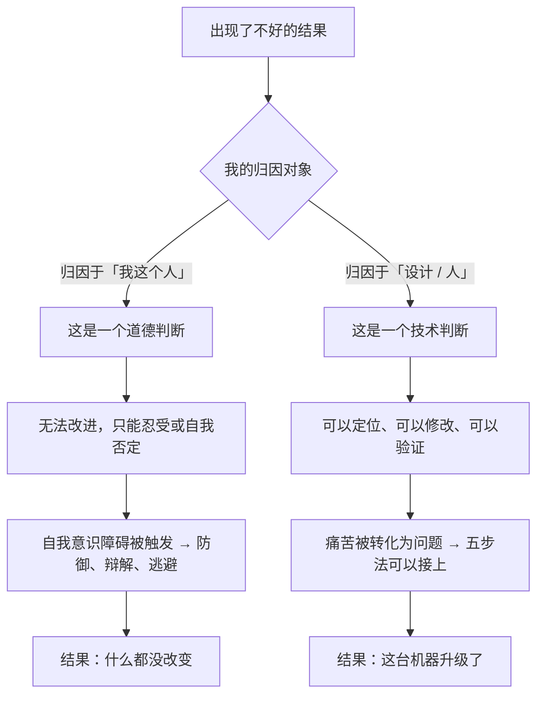

# 10｜从更高层次看自己：把自己当成一台机器

> 什么叫「站到更高一层看自己」？这会不会让人变得冷漠、机械？

---

## 一、先说结论

达利欧有一个贯穿全书的核心视角：

> **把你的人生，看成一部由「设计者」和「工作者」两个角色共同运转的机器。**

当事情出错时，不要问「我怎么这么差」，而要问「是设计的哪一环出了问题，我该怎么改设计」。当你遇到痛苦时，不要陷在「我很痛苦」里，而是退一步，站在设计者的位置看着那个正在痛苦的自己。

这不是要把人变成机器，恰恰相反：

> **它是把评价的对象，从「我这个人」换成「我运行的这套系统」——从而让改进成为可能。**

---

## 二、我们先理解一个问题

先看一个几乎所有人在低谷时都会做的动作。

考试失败、项目失败、被人拒绝之后，我们的脑子里会自动播放一句话：

> **「是不是我不行？」**

这句话特别可怕，因为它**无法被回答，也无法被改进**。你说它「是」，你就被判了死刑；你说它「不是」，你又没有证据。

而且——**它把「一件事没做好」和「我这个人没价值」，直接划上了等号。**

那么问题来了：

> 为什么我们在遇到失败时，总是忍不住把「事」升级成「人」？

---

## 三、作者到底提出了什么观点？

达利欧的「更高层次」视角，可以拆成四个主张。

**第一，把「我」拆成两个角色：设计者（designer）和工作者（worker）。**

工作者负责日常执行；设计者站在地图上方，负责看方向、改流程、配资源。**大部分人的痛苦，是因为他只有「工作者」这一个身份——工作者的失败，就等于是全部的失败。**

**第二，把人生看成一台机器。**

达利欧说，你看待自己的时候，可以用一种「工程视角」：这台机器有目标、有产出；如果产出不对，那是设计的问题，或者零件的问题，而不是「机器是个坏机器」。

这个比喻的关键作用，是**切断了「事」和「人」之间的那根自动连线。**

**第三，产出 = 设计 + 人。**

这是他在工作原则里反复使用的公式。当结果不理想时，只在两个地方找原因：**设计得不好，或人（包括你自己）放错了位置。** 这样一来，改进就有了具体的方向。

**第四，「高于自己」是为了看清自己。**

达利欧提到，他会努力做到「**从更高层面看自己**」——像看一个自然界的现象那样看自己的命运。这个视角带来的不是冷漠，而是**一种能够长期行动的平静**。

---

## 四、把这个观点翻译成人话

我们用最简单的场景说清楚。

**场景一：失败时。**

一个项目搞砸了。

- **低层次的说法**：「我太没用了。」
- **高层次的说法**：「这台机器的产出和预期不符，让我看看是哪个零件的问题。」

注意后者的措辞——它不是安慰，也不是自我欺骗。它是**把问题从「道德判断」转到「技术判断」。**

而且这个转换会带来一个立刻的差别：**「我没用」这句话没有下一步动作；「哪个零件的问题」这句话有下一步动作。**

**场景二：痛苦时。**

假设你现在特别焦虑，睡不着觉。

- **低层次**：你陷在焦虑里，越想越焦虑，然后开始自责「我怎么连情绪都控制不了」。
- **高层次**：你退一步，问「这个焦虑在报告什么？——它是因为我明天有个没准备好的会。那我这台机器今天缺的是什么？——缺的是把明天的会拆成一个清单。」

你会发现，一旦你站在设计者的位置，焦虑就从「我必须承受的折磨」，变成了「系统给出的一个待办信号」。

**这不是在消灭情绪，而是在给情绪安置一个位置。**

**场景三：评价自己时。**

很多人对自己的评价方式是：「我是个内向的人，所以我不适合做汇报。」——**这是把「一次表现」固化成了「一个身份」。**

高层次的方式是：「我在公开表达这个环节的表现，目前低于岗位要求。那么，我是改设计（比如把汇报改成书面形式，或者提前排练），还是换人（让别人来讲）？」

你看，**同一个事实，低层次得到的是一个判决，高层次得到的是一组选项。**

---

## 五、为什么会这样？

从机制上看，「把自己当机器」之所以有效，是因为它改变了**归因的对象**：

这里的核心是：**道德判断和技术判断，会导向完全不同的行为。**

- 道德判断的问题是：「我是不是个好人/聪明人/有价值的人？」
- 技术判断的问题是：「哪一环可以改？」

达利欧的方法论，本质上就是**系统性地把前者替换成后者。**

还有一个值得注意的深层原因：**归因于「我这个人」，其实是一种逃避。**

听起来很反直觉——自我否定难道不是最痛苦的惩罚吗？

是的，但它同时也是最省力的。因为一旦你确定「我这个人不行」，**你就什么都不用做了。** 你不需要熬夜改方案、不需要向人求助、不需要承认某个弱点、不需要重新学习。**自我攻击反而成了行动的最佳替代品。**

达利欧的「高层次视角」，就是要把这个舒适的出口堵上：**不给你「我这个人不行」这个选项，只给你「哪个零件可以改」。**

---

## 六、举一个现实生活中的例子

我们看一个非常有代表性的例子：**一家公司连续三个季度业绩不达标。**

**低层次的处理方式（归因于人）：**

CEO 在大会上说：「今年大家的状态不行，缺乏狼性，我们要更加拼搏。」然后换掉了两个销售总监。

结果：下个季度依然不达标。因为**「谁不努力」这个判断太模糊了，它无法变成具体的动作。**

**高层次的处理方式（归因于设计与人的匹配）：**

管理层做了这样一张表：

| 环节 | 事实 | 判断 | 动作 |
|---|---|---|---|
| 线索量 | 比去年同期少 30% | 渠道设计失效 | 重做渠道组合 |
| 转化率 | 与去年持平 | 销售能力不是瓶颈 | 暂不动人 |
| 客单价 | 下降 15% | 定价与折扣规则失控 | 收紧授权，重设折扣门槛 |
| 交付满意度 | 提升 | 团队状态良好 | 保留，作为正面样本 |

请注意这套分析里的几个特征：

- 它把「业绩不好」这个大问题，拆成了**四个可以被分别处理的零件**；
- 它明确指出**哪些环节不需要动**（销售能力、团队状态）——这避免了「一律归因于人」的常见错误；
- 每个动作都是**具体、可执行、可验证**的。

**这就是「从更高层次看自己」在组织层面的样子：不管理「人的好坏」，管理「机器的运转」。**

对个人来说，这个表格的逻辑完全可以照搬。比如一个人的年度目标没达成，也可以做一张同样的表：把目标拆成几个环节，逐项看是设计问题还是人的问题，然后只改必要的地方。

---

## 七、回到书中重新理解

现在回头看达利欧的原话，能看出他的用意。

他在书中写道，他把人生看成一场「**游戏**」，而他学会了站在游戏的上一层，看着自己在玩。这句话常被读作心灵鸡汤，但它其实是一条非常具体的方法论：**只有站上层，你才能看到规则和关卡的设计，而不只是卡在某一关里。**

他也说过，他把自己看成一个「**在进化过程中的一个例子**」——不是宇宙的中心，只是演化链条上的一个环节。这种视角让人放下「世界应该围着我转」的执念，从而能更平静地接受现实。

同时他也强调，这种视角并不意味着不投入感情。他热爱工作、在意关系、重视意义。区别在于：**当事情失败时，他不会用「我不行」来折磨自己，而会用「哪里可以改」来推进自己。**

这就是达利欧说的「**高于自己，但依然在乎**」。

---

## 八、这个观点背后还有什么？

**隐含前提一：大多数失败是可以被拆解、被改进的。**

如果一件事本质上就是不可控的，那么「改设计」就会变成徒劳的自我折腾。达利欧的方法更适合那些**努力能产生差异化结果**的领域。

**隐含前提二：人有能力客观地观察自己。**

「从更高层次看自己」需要一种分离感——一部分的你在经历，另一部分的你在观察。这是一种可以训练但不容易获得的心理能力。

**隐含前提三：系统化的生活会带来更好的结果。**

这也是一种价值观，而不是事实。有些人恰恰觉得，生活的意义在于不可预测性。

**与其他观点的联系：**
- 第 06、07 篇解释了**为什么需要**这个视角（因为两个障碍）；
- 第 08、09 篇的五步法**依赖**这个视角（诊断时必须退出自己）；
- 第 19、23 篇把这个视角扩展到组织（把公司当机器）。

---

## 九、这个观点有问题吗？

有，而且这一条的争议可能比前面几条更大。

**第一，「把人当机器」这个隐喻本身有风险。**

人不是机器。人有情绪、有尊严、有不可计算的部分。一个长期用机器隐喻看待自己和他人的人，可能会变得过度功能化——**只问「这个人有用吗」，不问「这个人怎么样」。** 达利欧本人在一些访谈中也承认，他自己也曾因为过度直率而伤害过同事。

**第二，它可能变成对结构性问题的遮蔽。**

如果一切都归因于「设计可以改」，那么就默认了「结构是公平的、可改的」。但现实中，很多限制来自外部结构，而不是你的设计。**把系统性问题当成个人设计问题，是一种残忍的错位。**

**第三，「设计者视角」需要一定的心理余量。**

一个人如果在长期的压力、焦虑或抑郁中，是很难退出来当设计者的。**这个视角本身是一种奢侈品，而不是人人都能随手调用的技能。**

**第四，它可能压抑真实的情绪。**

「把这个痛苦当作信号」是对的，但如果一个人永远不停下来好好感受一下，他可能会失去与自己的连接，甚至失去对他人痛苦的共情。

所以更平衡的说法是：**在需要改进的时候用设计者视角，在需要做人的时候回到人的位置。**

---

## 十、今天再看这个观点

达利欧的「机器隐喻」在今天的 AI 时代，几乎得到了字面意义上的实现。

- 我们已经在用「优化」「迭代」「回路」「漏斗」来描述自己的生活；
- 各种生产力系统、数据看板、习惯追踪，本质上都是在把人当机器来管理；
- Agent 和自动化系统，正在替我们执行「设计者」做出的设计。

这带来一个值得警惕的对照：**当人真的一步步把自己变成一台可优化的机器时，那些无法被优化的部分——爱、无聊、迟疑、无目的——会被放在哪里？**

达利欧的答案大概是：那些部分属于生活的目的；而机器视角属于达成目的的手段。**手段要用工程思维，目的要用人的思维。**

这是**基于达利欧思想的现代延伸**，而不是他书里的原文。

---

## 十一、这一篇真正应该记住什么？

1. **把自己当成一台机器：有目标、有产出，产出不对就改设计或改零件。**
2. **关键是切断「事没做好」和「我这个人不行」之间的自动连线。**
3. **归因于「我这个人」其实是逃避——因为它不需要任何行动。**
4. **产出 = 设计 + 人：结果不好，只在这两个地方找原因。**
5. **设计者视角是手段，不是目的；用它来改进，不要用它来取代做人。**

---

## 十二、留一个问题

> 选一件最近让你难受的事，试着用「设计者」的口吻写三句话：这台机器的产出是什么？哪个零件出了问题？下一步改什么？**
>
> 写完之后问自己：**这么想之后，痛感减轻了吗？还是你反而觉得，有些痛本来就不该被「优化」掉？**
>
> 下一篇，我们来看达利欧的另一条生活原则——**为什么理解「人与人天生不同」，是不用错人、也不用错自己的关键。**
