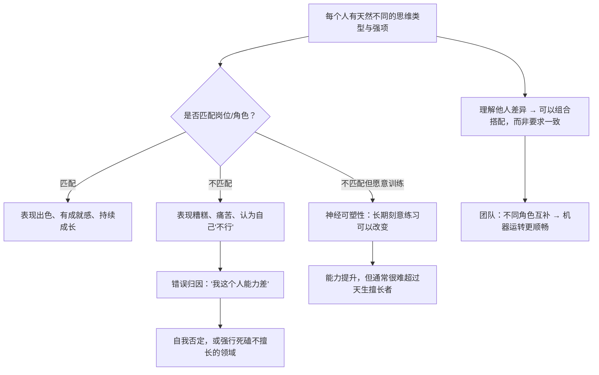

# 11｜为什么「懂人」是成功的关键？——大脑、性格与神经可塑性

> 如果人与人天生不同，我们该认命，还是该改变？

---

## 一、先说结论

达利欧的第四条生活原则是「理解人与人大不相同」。它包含两个看似矛盾的判断：

**第一，差异是真实的。** 不同的人天生擅长不同的思维类型——有人擅长宏观，有人擅长细节，有人长于创意，有人长于执行。用同一种方式要求所有人，是管理的灾难，也是对自己的误判。

**第二，差异不等于宿命。** 大脑具有**神经可塑性**——习惯、思维方式、甚至反应模式都可以通过训练改变，只是很慢、很难，需要刻意练习。

所以达利欧的真正结论是：

> **先承认差异、用对人，而不是强求所有人一样；同时，对值得改变的自己，投入长期的刻意训练。**

---

## 二、我们先理解一个问题

先看一个几乎每个人都遇到过的困惑。

为什么有的人：

- 能盯着一个复杂系统看很久，还越看越兴奋；
- 而有的人面对同样的情况，只想尽快得到一个明确的、可以立刻执行的答案。

为什么有的人：

- 面对批评能马上进入「他说得对吗」的分析状态；
- 而有的人在批评出现的瞬间，就进入了情绪防御。

如果我们把这些差异简单地归结为「修养好」或「心态差」，那就完全错了。

> **这里面有很大一部分，是硬件层面的差异——也就是大脑处理信息方式的差异。**

---

## 三、作者到底提出了什么观点？

达利欧关于「人各不同」的论述，可以归纳成几点。

**第一，大脑的不同区域负责不同的事，且它们会互相竞争。**

达利欧用比较通俗的方式解释了这一点：人的大脑里，一部分负责情绪与本能反应（比如感到威胁时立刻进入防守），一部分负责理性分析。**当情绪部分抢先启动时，理性部分就很难正常工作。** 这正好解释了上一部分讲过的「被批评时本能反驳」。

**第二，人的思维类型天然有别。**

他区分过一些常见的类型，比如：

- **概念型思考者**：先看到大图景、模式和可能性；
- **细节型思考者**：先看到具体事实、步骤和风险；
- **创造者 / 执行者 / 协调者**：有人负责提出想法，有人负责落地，有人负责把人组织起来。

这些类型没有高下之分，但**如果把人放在了不匹配的位置上，他就会表现得很差。**

**第三，人既有差异，也有可塑性。**

达利欧在这里引入了一个对很多人来说很关键的观点：**神经可塑性**。他引用研究说明，大脑可以随着训练而改变——习惯、思维方式、甚至性格中的一部分，都可以被重塑。

所以他的态度是：**差异要说清楚，但不能成为借口。**

**第四，理解他人的前提，是先理解自己在哪种人里。**

达利欧说，知道自己的类型、强项和弱点，是做出正确人生选择的基础。**因为选错了赛道，再努力也是浪费。**

---

## 四、把这个观点翻译成人话

我们用一个生活化的比喻来说明。

假设大脑是一场**接力赛**，里面有几种不同的选手：

- **警报员**：负责感知威胁，反应极快，但经常误报；
- **分析师**：负责逻辑推理，能力强，但启动慢，需要时间；
- **记录员**：负责记住细节，可靠但缺乏想象力；
- **翻墙者**：负责提出新想法，很有创造力但常常不靠谱。

现在发生了一件事：你的方案被人当面批评。

- 警报员第一个冲出来：「危险！有攻击！准备防守！」——你感到脸热、想反驳。
- 分析师慢了两秒才醒：「等等，他到底说了什么？有没有道理？」——这才是理性回应。

**这两种反应不是「修养」的差别，而是警报员的声量和分析师的启动速度的差别。**

达利欧的方法，就是让你**在警报员喊完之后，仍然给分析师足够的时间**。这也是「痛苦 + 反思」在实际操作层面的含义——**不是不许警报响，而是不让它做最后的决定。**

至于「人与人不同」，也可以这样理解：

- 有的人天生警报员特别敏感（对冲突极度不适）；
- 有的人天生翻墙者特别活跃（想法多但难落地）；
- 有的人天生记录员特别强（细节几乎不会漏）。

**这些人放在合适的岗位上都非常有用，放在不合适的位置上都极其痛苦。**

---

## 五、为什么会这样？

达利欧的论证，本质上是一个「匹配」问题：

这里有几个重要的推论：

**第一，「不行」往往不是能力问题，而是匹配问题。**

一个人在错误的岗位上表现差，很容易得出「我不行」的结论。但达利欧提醒：**可能是这台机器把你放在了错的齿轮位置。**

**第二，不同的角色需要不同的能力，而团队的价值就在于组合。**

如果一个团队全是「翻墙者」，想法很多但没人落地；如果全是「记录员」，执行可靠但缺乏方向。**真正的管理，是把不同的人配成一台能运转的机器。**

**第三，可塑性是真的，但有代价。**

达利欧承认大脑可以改变，但他没有承诺这是轻松的事。**改变一个根深蒂固的思维习惯，通常需要数年，而不是数周。** 所以他的建议是：**在关键短板上做长期投入，而不是试图把自己改造成另一个人。**

---

## 六、举一个现实生活中的例子

我们看一个特别常见的职场困境：**一个优秀的业务员被提升为管理者，然后彻底失败。**

这个业务员的特点：极强的行动力、对数字敏感、擅长单点突破、不喜欢开会。

当上管理者后，他需要的是：分配任务、倾听团队、做长期规划、处理人际冲突。

结果：他还是习惯自己冲在最前面，把下属的活都干了；开会时不耐烦；对下属的情绪问题感到无解。半年后团队散了，他自己也精疲力尽。

**低层次的解释**：「他能力不行，不适合当管理者。」

**高层次、更接近达利欧式的解释**：

1. **他是一个「执行者 + 细节型」的人**，天然更擅长自己做事，而不是通过别人做事；
2. 管理者需要的核心能力，正好在他的弱区；
3. 这不是「能力差」，而是**角色与硬件不匹配**；
4. 可能的解决方案有三种：
   - **换位置**：让他回去做业务专家，或者给他配一个擅长管理的搭档；
   - **补设计**：用制度代替他不擅长的部分，比如固定的例会模板、明确的任务分配规则；
   - **长期训练**：如果他真心想成为管理者，就接受这是一个数年期的刻意练习，而不是靠「努力」就能速成。

达利欧的方案里，这三种选择都是合法的。**他最反对的，是把「不匹配」误读成「你不行」。**

---

## 七、回到书中重新理解

现在回头看达利欧的原话，会更容易理解为什么他把「理解人与人大不相同」单独列为一条生活原则，而不是塞进工作原则。

因为它的影响范围远超工作：

- **在职业选择上**：不了解自己的类型，就会反复走进不属于自己的赛道；
- **在关系上**：不理解对方的思维类型，就会把「他和我不一样」当成「他不对」；
- **在自我评价上**：不理解自己的盲区，就会在同一个地方反复受挫，并且归因为「我就是不行」。

他还特别提到，他会用一些工具来帮助理解人——比如性格评估、团队成员的特质记录。这些工具在桥水被制度化了（我们会在第 22 篇讲「棒球卡」）。

**这一条原则的底层逻辑是：承认人是不同的硬件，然后按硬件的特性去配置任务和环境，而不是要求所有人都能跑同一套程序。**

---

## 八、这个观点背后还有什么？

**隐含前提一：性格和思维类型是相对稳定的。**

达利欧同时承认可塑性，但他的实用建议仍偏向「按类型配置人」。**这其实是在稳定性与变化性之间做了一个权衡：短期按类型配置，长期在关键短板上有选择地训练。**

**隐含前提二：类型可以被测量。**

如果无法测量，就谈不上配置。这依赖性格评估工具的有效性——**而这些工具本身就有争议。**

**隐含前提三：人愿意承认差异。**

这一点在现实中非常难，因为承认「我不擅长这个」，会对自尊造成冲击。

**与其他观点的联系：**
- 第 06 篇的「思维盲点障碍」是这一条的**认知基础**；
- 第 07 篇的「极度开放」是理解他人的**前提条件**；
- 第 22 篇的「用对人」是这一条在组织中的**落地形式**。

---

## 九、这个观点有问题吗？

有，而且这一条的争议不小。

**第一，性格类型理论本身有争议。**

MBTI 之类的工具在学术界受到不少批评（重测信度不高、类型划分过于整齐）。达利欧虽不依赖单一工具，但**用类型来配置人的做法，天然带有标签化的风险。** 把一个人固定成「细节型」，可能会限制他的发展。

**第二，可塑性的说法容易被两头利用。**

管理者用它可以说「你要成长」；被管理者用它可以说「所以你不能因为我不擅长就换掉我」。**同一句话在不同权力位置上，作用完全不同。**

**第三，「把人放对位置」这件事，普通人往往没有权力。**

达利欧是老板，他可以决定谁放在哪个位置。但对大多数员工而言，「换岗」「配搭档」都不是自己能决定的。**这条原则在组织里的实际执行力，取决于你手里有多少权力。**

**第四，它可能被用来固化不公。**

「他天生适合做执行」「她天生适合做协调」——这类判断如果被滥用，会成为性别、背景偏见的温床。**「天生不同」和「社会期待」经常被混为一谈。**

所以更负责的说法是：**承认差异的存在，但不要用它来给别人（或自己）提前关门。**

---

## 十、今天再看这个观点

达利欧关于「人各不同」的洞察，在今天有了一个全新的对照对象：**AI 与人的分工。**

一个很有价值的思路是：**把人的强项和 AI 的强项当作互补的零件来配置。**

- 人擅长定义目标、判断价值、理解情境、承担后果；
- AI 擅长处理海量信息、保持一致性、不知疲倦地执行、在特定维度上补人的盲区。

这其实就是达利欧「把不同的人配成一台机器」这个思想的延伸版本——只不过现在这台机器里，增加了新的零件类型。

反过来，这也提示了一个更现实的问题：**如果你的工作恰好是「不需要创造力、只需要重复输出」，那么你就是最容易被打包进机器的那个零件。** 达利欧的原则在这里有一个冷峻的推论：**在一个可以任意配置零件的系统里，成为不可替代的零件，比成为最努力的零件更重要。**

这是**基于达利欧思想的现代延伸**。

---

## 十一、这一篇真正应该记住什么？

1. **人与人天生不同，差异是真实的，而不是修养问题。**
2. **很多「我不行」，其实是「我站错了位置」。**
3. **大脑具有可塑性，但改变一个根深蒂固的习惯通常需要数年，而不是数周。**
4. **好的团队不是要求所有人一样，而是让不同的人互补成一台机器。**
5. **用差异来解释配置，而不是用差异给别人和自己提前关门。**

---

## 十二、留一个问题

> 想一个你反复受挫、并且已经开始怀疑自己的领域。
>
> 有没有可能，这不是「你不行」，而是「你被放在了错的位置」？**如果换一个位置、或者换一种配置方式，结果会不同吗？**
>
> 下一篇，我们进入生活原则里最「硬」的一节——**达利欧如何做决策：期望值、二级效应与概率思维。**
