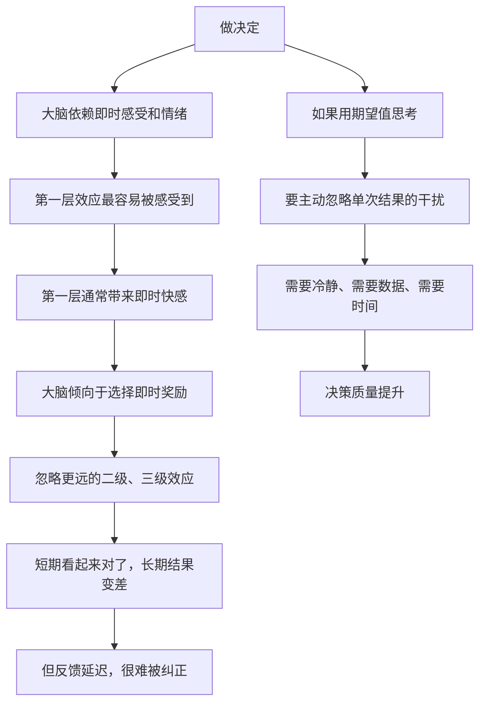

# 12｜学习如何有效决策：期望值、二级效应与概率

> 为什么大多数人的决策方式，本质上是在「碰运气」？

---

## 一、先说结论

达利欧关于决策的核心观点，可以浓缩成三句话：

1. **决策不是「对错问题」，而是「概率问题」**——你要评估的是「哪种选择在长期更划算」，而不是「我这次猜得准不准」。
2. **看期望值，而不是看单次结果。**
3. **优先考虑「二级、三级效应」**——第一层后果往往符合直觉，却常常与长期结果相反。

一句话：**好的决策者不是预测最准的人，而是「长期算账最划算」的人。**

---

## 二、我们先理解一个问题

先看一个特别反直觉的现象。

一个人每次做决定都很有把握，而且他确实经常「猜对」，但十年下来，他的整体状况并不好。

另一个人经常说「我不确定」，从不敢说自己一定对，但十年下来，他的处境越来越好。

这是怎么回事？

> 如果「做对决定」不能保证好结果，那么到底什么才能？

---

## 三、作者到底提出了什么观点？

### 观点一：决策的目标是「提高命中概率」，而不是「保证正确」

达利欧认为，大多数决策都不存在「确定正确」的答案。你面对的是不确定性，所以你要做的是**在不确定中，选择那个「期望收益更高」的选项**。

### 观点二：看期望值，而不是看单次结果

这里的关键是区分「一次的结果」和「决策的质量」。

- 一个好决策，也可能因为运气差而失败；
- 一个坏决策，也可能因为运气好而成功。

**如果用人用结果来评判决策，就会系统性地学到错误的经验。**

### 观点三：考虑二级、三级效应

达利欧说，大多数人只看到决策的**第一层后果**，而第一层后果通常是「让人感觉好的那个」。真正重要的是更深一层的效应。

举例来说：

- 想吃甜食 → 第一层：好吃、爽 → 二级：血糖波动、体重上升 → 三级：健康受损、精力下降；
- 想在争吵中赢 → 第一层：舒服、有面子 → 二级：关系受损 → 三级：信任消失，未来的合作成本暴涨。

**第一层效应和长期结果，经常是反着的。**

### 观点四：简化

达利欧认为，做决策时要**抓少数关键变量**，把复杂问题简化。他不赞成试图考虑所有因素——那会导致瘫痪。

### 观点五：把逻辑和情绪分开

他再次强调：情绪会干扰判断。所以要在冷静的时候做重要决定，要借助可信的人来检查自己的推理。

---

## 四、把这个观点翻译成人话

我们用一个所有人都懂的场景：**要不要买彩票？**

**看单次结果的思维：**
「我上次买了一张，中了五块钱！说明我是有运气的。」
「隔壁老王买了几十年，终于中了大奖，说明坚持就有希望。」

**看期望值的思维：**
一张彩票 2 元，中奖概率是千万分之一，最高奖金约 500 万。
那么这张彩票的期望值大约是：500 万 × (1 / 1000 万) ≈ **0.5 元**。

也就是说：**你花 2 元，买到的期望回报是 0.5 元。** 每买一次，长期看平均亏 1.5 元。

这就是期望值思维——**它不看这一次的结果，而看「如果这个决定重复一千次，平均会怎样」。**

现在把它用到日常生活中：

**场景：该不该接这个加班任务？**

- 第一层：接了 → 领导满意、有奖金 → 感觉不错；
- 二级：长期接 → 成为「随叫随到的人」 → 所有额外工作都来找你；
- 三级：边界彻底模糊 → 主业质量下降，且没有人认为这是你的贡献。

**场景：该不该在会议上指出领导的错误？**

- 第一层：指出 → 气氛尴尬、领导不快；
- 二级：如果处理得当 → 问题被及早修正，你被认为「靠谱、敢说」；
- 三级：长期 → 你成为组织里「说真话」的那类人，而这在达利欧的世界里是最高价值。

注意，在这两个例子里，第一层和二级/三级效应是**相反**的。

达利欧的决策方法，就是**逼自己越过第一层，看到第二、第三层。**

---

## 五、为什么会这样？

为什么人天生更容易停留在第一层？为什么「看期望值」这么难？

有几个值得注意的机制：

**第一，反馈延迟是最大的敌人。**

如果一个坏决定立刻就会得到坏结果，人很快就能学会。但很多决定的后果要几年后才显现——**这就让错误的学习几乎不可能自然发生。** 这正是达利欧要做「决策日志」的原因：**人为地把因果连起来。**

**第二，情绪的反应速度远快于理性。**

我们前面讲过，警报员的反应比分析师快。而决策往往在几秒内就完成了——**理性还没来得及介入。**

**第三，单次结果太有说服力了。**

人天生更容易被生动的、具体的结果打动，而不是抽象的概率。**这就是为什么赌场永远有生意——总有人记得自己赢的那一次。**

达利欧的对策，是把决策**从「当下的直觉」搬到「事前的计算」**：明确写下期望值、可能的路径、以及更深层的后果。**把决策变成一个可以被检查和复盘的文本。**

---

## 六、举一个现实生活中的例子

我们看一个特别贴近现实的决策：**要不要接受一份薪水更高、但加班严重的工作？**

很多人是这么决定的：看第一层——「多了 40% 的薪水，当然去。」

达利欧式的决策会做一张表：

| 维度 | 短期（1 年） | 中期（3 年） | 长期（10 年） |
|---|---|---|---|
| 收入 | +40% | +40%，但涨薪空间可能受限 | 取决于身体与能力是否被透支 |
| 技能成长 | 重复性高，可能停滞 | 竞争力下降 | 有被淘汰风险 |
| 健康 | 睡眠减少 | 慢性疲劳 | 可能触发健康问题 |
| 关系 | 时间减少 | 社交圈收窄 | 支持系统变弱 |
| 选择权 | 收入缓冲增加 | 可能被「高薪绑架」 | 若健康或技能出问题，选择权反而变少 |

这张表的关键不是「一定要拒绝」，而是**看清楚这是一个「用长期选择权换短期现金流」的交易。**

如果一个人清楚地知道这一点，并且**在合同上为自己设计了保护机制**（比如约定两年内必须调岗、或者强制储蓄出「退出基金」），那么这个决定就可以是好决定。

**达利欧强调的从来不是「选哪个」，而是「你是否看清楚了你在选什么」。**

---

## 七、回到书中重新理解

现在回头看达利欧关于「有效决策」的原文，会更容易抓住重点。

他说，**最好的决策者不是最聪明的人，而是那些能「站在更高层次」看待决策、并且能理性看待概率与结果的人。** 他也坦率地指出，很多人做决策的方式是「随机」的——他们没有清晰的原则，所以每个决定都是重新掷一次骰子。

他还强调，纯靠人的直觉是不够的，所以他大量借助**计算机和算法**来辅助决策。这在当时是很超前的——他早在几十年前就让系统去处理很多判断（我们下一篇会专门讲这一点）。

最后，他提醒了一件很实用的事：**重要决定不要在情绪激动时拍板。** 如果有人在你最激动的时候要求你立刻决定，那通常不是好时机。

---

## 八、这个观点背后还有什么？

**隐含前提一：概率可以被估计。**

期望值思维依赖「你对各种可能性的概率有一个合理估计」。但现实中，很多人根本没有足够的数据。达利欧身处投资领域，有大量的数据和快速反馈，这是他方法的优势条件。

**隐含前提二：结果可以被归因。**

如果结果和决策之间的关系搞不清楚，期望值就变成了数字游戏。**这也是为什么他需要「极度透明」和「复盘」来保证因果链清晰。**

**隐含前提三：人可以忍受「好决策也会有坏结果」。**

这一点对心理承受力要求很高。很多人做不到「我做了对的事，但结果不好」还能坚持。

**与其他观点的联系：**
- 第 04 篇的「痛苦 + 反思」是**决策复盘的方法**；
- 第 13 篇会把「期望值思维」升级成**算法**；
- 第 17 篇的「可信度加权」是**集体版的决策优化**。

---

## 九、这个观点有问题吗？

有，至少这几点。

**第一，不是所有决策都适合期望值计算。**

职业选择、婚姻、生子，这些决策往往是一次性的、不可重复的。**对一个一辈子只发生一次的选择算「期望值」，意义有限。**

**第二，过度理性化可能漏掉重要信号。**

把决策完全交给概率和表格，可能忽略那些无法量化却很重要的东西，比如「你真正想做的是什么」。

**第三，期望值思维假设「你有选择权」。**

对一个必须在两份工作里选一份维持生计的人，「看长期效应」可能是一种奢侈。**达利欧的决策方法，隐含了一定的资源与安全感。**

**第四，二级、三级效应的判断本身也很主观。**

你没有水晶球，对三级的预测可能完全是错的。**「考虑更长远」有时只是把幻想包装成理性。**

---

## 十、今天再看这个观点

达利欧的决策方法在今天的环境中，有一个非常直接的对手：**算法帮你做决定。**

今天的每一个 App 都在用期望值做决策——它不需要冷静，也不会被第一层快感迷惑，它只是在持续优化「停留时长」或「转化率」这些指标。

这里出现了一个值得我们警惕的错位：

> **算法比人更擅长「期望值计算」，但算法优化的目标，未必是你真正想要的目标。**

也就是说，决策方法本身可以外包，但**「该优化什么」这个问题，必须由人来定义。**

这恰好也是达利欧思想在今天最有用的一部分：**他提供的不是「怎么算」，而是「先想清楚你要什么」。**

这是**基于达利欧思想的现代延伸**。

---

## 十一、这一篇真正应该记住什么？

1. **决策不是对错问题，而是概率问题——追求长期期望收益，而不是单次猜中。**
2. **好决策也可能有坏结果；用单次结果评判决策，会系统性学错东西。**
3. **要越过第一层效应，看第二层、第三层——它们常常与直觉相反。**
4. **抓少数关键变量，不要试图考虑所有因素。**
5. **重要决定不要在情绪激动时拍板。**

---

## 十二、留一个问题

> 你现在正在犹豫的那个决定，把它的第一层、第二层、第三层后果分别写出来。
>
> 如果第三层后果和你现在的直觉是相反的——**你还会照直觉做吗？**
>
> 下一篇，我们来看达利欧最大胆的一个主张——**为什么他要把决策「写成算法」，甚至让机器来部分替他做判断。**
