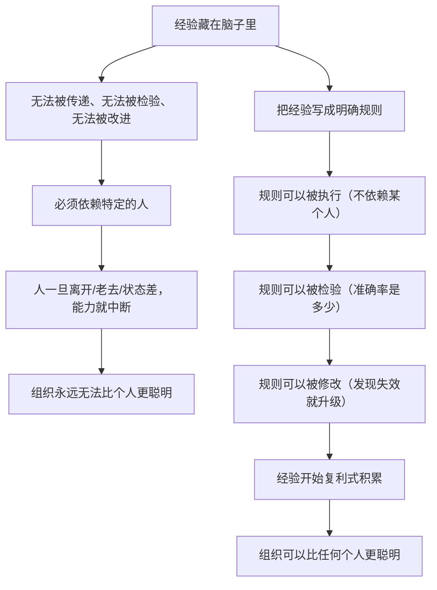

# 13｜把决策写成算法：原则为什么必须能被检验？

> 为什么达利欧坚持把原则写得如此具体，甚至不惜让计算机来帮忙执行？

---

## 一、先说结论

达利欧有一个很少被强调、但极其重要的判断：

> **没有被写下来的原则，等于没有原则；不能被检验的原则，等于信仰。**

所以他做了一件在管理人里非常罕见的事：**把决策的标准写清楚到可以交给机器执行的程度。** 他在书中坦率地说，计算机对他思考的帮助极大——如果没有它，桥水不可能达到那样的水平。

这一篇要讲的核心是：

**原则化的终极形态是「算法化」——把「遇到 X 情况，就按 Y 标准做 Z 判断」明确到可执行、可回测、可推翻。** 这不是让人变成机器，而是让人的智慧能够被继承和放大。

---

## 二、我们先理解一个问题

先看一个很普遍的现象。

一家公司的老板有一套很准的判断直觉。他凭这套直觉做了很多正确的决定。但当他老了、退了，公司很快就出问题了。

为什么会这样？

> 为什么一个人的「智慧」，这么难传给下一代人？

---

## 三、作者到底提出了什么观点？

达利欧关于「算法化」的论述，可以拆成五点。

**第一，原则必须具体到「可执行」的程度。**

「要果断」不是原则。「当信息收集到 80% 且决策可逆时，就立刻行动；当决策不可逆时，就再收集到 95%」才是原则。

**第二，具体的原则可以被检验。**

一旦写清楚，你就可以回头问：「按这条原则做的那些决策，准确率是多少？在什么情况下它失效？」

**第三，可以被检验的原则，才能被改进。**

这是达利欧体系的核心循环：**写下 → 检验 → 修改 → 再写下。** 没有这一环，原则就只是个人偏好。

**第四，决策可以被部分地交给系统。**

达利欧大量使用计算机来辅助判断。他认为，人容易受情绪、记忆偏差、疲劳影响，而系统不会。所以他倾向于把那些**已经被验证过、逻辑清晰**的判断，交给系统执行。

**第五，人的工作从「做判断」转向「设计判断标准」。**

这是最深刻的一点。当越来越多的具体判断被算法化之后，人的核心工作变成了：**决定要优化什么、设计判断的规则、以及在规则失效时意识到并修正它。**

---

## 四、把这个观点翻译成人话

我们用一个特别好懂的对比来说明。

**第一种：脑子里的原则**

一位经验丰富的医生，看病很准。你问他怎么判断，他说：「就是感觉，看多了就知道。」

这种「原则」有三个问题：
- 他退休了，判断就没了；
- 他判断错了，也没法知道错在哪；
- 他状态不好时，判断质量会下降。

**第二种：写下来但很模糊的原则**

他写成：「如果病人看起来情况不好，就进一步检查。」

这条原则写了等于没写——「看起来情况不好」是什么标准？

**第三种：可执行、可检验的原则**

他写成一份明确的规则：

> 如果病人出现以下任意两项，就立刻转入进一步检查：
> ① 静息心率 > 100；
> ② 收缩压 < 90；
> ③ 意识状态评分下降；
> ④ 近 6 小时尿量 < X。

这份规则有几个特征：

- **任何人拿到它，都能执行**（不需要那 20 年的经验）；
- **它的准确率可以被统计**（这 100 个病人里，它漏了几个？误报几个？）；
- **它可以被修改**（发现漏报多，就调整标准）；
- **在极端情况下，它可以被交给系统自动触发**。

这就是达利欧说的「把决策写成算法」——**不是把人变成机器，而是把经验变成可以被任何人使用、被数据检验的规则。**

---

## 五、为什么会这样？

这里有一个非常关键的逻辑链：

这张图解释了达利欧为什么这么执着于「写下来」。

**他的目标不是让某个人更聪明，而是让「智慧」这个东西，第一次有了可以被存储和迭代的载体。**

这里还有一个特别值得注意的隐含判断：

> **人的直觉是不可靠的，不是因为它常常错，而是因为它不可控。**

一个直觉很准的人，可能今天状态好判断准，明天失眠就判断差。**而依赖直觉的系统，波动性极高。**

相比之下，一条明确规则的表现是**稳定的**。稳定意味着可以被预测、可以被改进、可以被信任。

达利欧的赌注是：**在长期竞争中，稳定的中等水平，胜过波动的高水平。**

---

## 六、举一个现实生活中的例子

我们看一个很多人都在用的场景：**招人。**

**大多数人招人的「原则」**（如果算原则的话）：

「凭感觉，聊得投缘就行。」
「看简历，名校大厂优先。」
「面试时出一道题，答得好就要。」

这些做法的问题是：**无法复盘。** 招错人之后，你不知道是「聊得投缘」这个标准错了，还是「名校」这个标准错了。因为你根本没有清晰的标准。

**达利欧式的招人原则**（在他的工作原则里有类似的表述）：

1. 明确这个岗位最需要的**特质**是什么（不是技能，是性格与思维方式）；
2. 为每个特质设计**可观察的问题**或场景，而不是问「你觉得自己怎么样」；
3. 让多个可信的面试官**独立打分**；
4. **记录每个人入职后的表现**；
5. 定期回头**检验**：当年打分高的人，实际表现是否真的更好？

第 5 步是决定性的——**它让「招人」从一个靠运气的动作，变成了一个可以被改进的系统。**

如果发现「特质 A」的打分和实际表现完全不相关，那就删掉这条标准；如果发现「特质 B」特别准，就加大它的权重。

**这就是把决策写成算法：你仍然在看人、在判断，但你的判断标准变成了一个可以被检验、被改进的对象。**

---

## 七、回到书中重新理解

现在回头看达利欧的原话，就更能理解他为什么反复强调「写得具体」。

他说，他写这些原则时的目标是**表述准确、明确无误**——他要让读者（以及员工）能清楚地知道「在什么情况下，该按什么标准做」。

他也提到，他会用**流程图（Process Flow Diagram）** 来描述一个组织如何运转——把「谁在什么时候做什么、依据什么标准」画出来。这本质上就是把管理变成一张可检查的图。

而他关于计算机的表述，其实是最有远见的部分之一。他说计算机帮助他更好地思考，如果没有计算机，桥水不可能如此卓越。**这在 2017 年之前就写下了——比整个 AI 浪潮早了十几年。**

他真正在做的事，是**把「人的判断」逐步转换成「系统的判断」，而人退到系统的设计者位置。**

这和我们在第 10 篇讲的「从更高层次看自己」是同一件事的延伸：

> **第 10 篇说：把自己当机器，改设计而不是攻击自己。**
> **第 13 篇说：连「怎么判断」这件事，也可以被设计出来，交给系统。**

---

## 八、这个观点背后还有什么？

**隐含前提一：被算法化的领域，有清晰的目标和可测量的结果。**

投资和运营适合算法化，因为「结果好不好」可以被衡量。「我该不该跟这个人结婚」就不适合——**目标本身都没定义清楚，怎么算法化？**

**隐含前提二：世界有一定的稳定性。**

如果规则每天都在失效，算法化就没有意义。达利欧的赌注是，人性、经济周期、组织行为的规律是相对稳定的。

**隐含前提三：人愿意接受「被规则约束」。**

这需要文化支撑。在一个「老板说了算」的组织里，算法化只会变成老板意志的另一种包装。

**与其他观点的联系：**
- 第 12 篇的期望值思维，是算法的**计算内核**；
- 第 15、17 篇的极度求真与可信度加权，是算法得以运行的**数据前提**；
- 第 25 篇会专门讨论**AI 时代**这套思路的延伸与风险。

---

## 九、这个观点有问题吗？

有，而且这一条的风险很值得警惕。

**第一，算法会固化它的创造者的偏见。**

一个算法看起来中立，但它优化的目标、选择的变量、设定的权重，全部来自人的判断。**如果这些判断有偏差，算法就会把偏差大规模、自动化地放大。**

**第二，被度量的东西会挤走没被度量的东西。**

一旦组织开始用数据考核，人就倾向于优化那些能被计量的指标，而忽略那些同样重要但难以量化的东西。**这是所有管理体系都会遇到的困境。**

**第三，不可能所有重要的事都被算法化。**

信任、忠诚、创造力、直觉——这些恰恰是长期成功的关键，但很难被写成规则。**一个完全算法化的组织，可能在可测的维度上极其高效，在不可测的维度上极其脆弱。**

**第四，它需要大量的数据与反馈，而多数组织并不具备。**

达利欧能做到，是因为投资有清晰的结果和快速的反馈。**在反馈延迟、结果模糊的领域，算法化可能只是「把主观包装成客观」。**

---

## 十、今天再看这个观点

达利欧关于「把决策写成算法」的主张，在今天是**最被验证、也最需要警惕**的一条。

它的验证是显然的：今天所有的大模型、推荐系统、自动化决策系统，本质上都在做他描述的事——把判断标准明确化，然后交给系统执行。

但今天也让我们看清了它的风险：

- 当算法决定你看到什么新闻、拿到什么贷款、匹配到什么对象时，**「优化目标由谁定义」成了一个政治问题，而不仅仅是技术问题**；
- 当 AI 可以模仿你的决策风格时，**「把原则写下来」也可能意味着「把你的判断权交出去」**；
- Agent 能够自主执行决策时，**人退到设计者位置这件事，可能退得比预想中更彻底。**

所以，达利欧的问题在今天变成了一个更尖锐的版本：

> **如果决策可以被算法化，那么「人保留什么决策权」——这本身就是这个时代最重要的原则。**

这是**基于达利欧思想的现代延伸**，也是第 25 篇要展开的话题。

---

## 十一、这一篇真正应该记住什么？

1. **写在脑子里的经验，无法传递、无法检验、无法改进。**
2. **具体到可执行的原则，才能被统计学检验，进而被改进。**
3. **算法化的真正目的，不是让人变成机器，而是让智慧可以被继承和放大。**
4. **人的角色，正在从「做判断」转向「设计判断标准」以及「在标准失效时发现它」。**
5. **被度量的东西会挤走没被度量的东西——算法化越彻底，越要警惕这个代价。**

---

## 十二、留一个问题

> 挑一个你现在靠「感觉」反复做的小决定（比如要不要回一条消息、要不要接一个任务）。
>
> 试着把它写成一条规则：**在什么条件下，我就做这件事。** 然后观察一周——这条规则会让你做得更好，还是更差？
>
> 下一篇，我们进入《原则》的第三部分——**从「极度求真」开始，看达利欧如何把一个组织改造成一部自我纠错的机器。**
