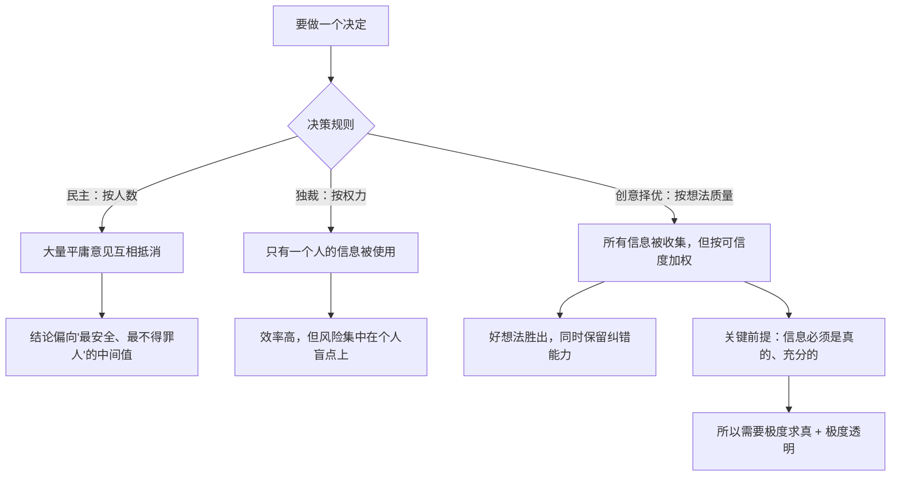

# 14｜创意择优：为什么它既不是民主，也不是独裁？

> 一个组织如何在「人人都有发言权」和「快速做对决定」之间找到平衡？

---

## 一、先说结论

面对「如何做决策」这个问题，人类只有两种主流方案：

- **民主**：一人一票，少数服从多数；
- **独裁**：一个人说了算。

达利欧认为这两种都不够好：民主容易被平庸的平均意见拖累，独裁容易被一个人的盲点毁掉。

于是他提出第三条路：**创意择优（idea meritocracy）**。

> **它的规则不是「谁人多听谁的」，也不是「谁官大听谁的」，而是「让最好的想法胜出」。**

它由三块基石支撑：**极度求真、极度透明、可信度加权的决策。** 这一篇讲创意择优本身，后面三篇分别讲这三块基石。

---

## 二、我们先理解一个问题

先看一个所有组织都会遇到的场景。

一场会议，有八个人。讨论一个问题，出现了明显分歧：

- 三个人支持 A 方案；
- 三个人支持 B 方案；
- 一个人支持 C 方案（他是团队里在这件事上最有经验的人）；
- 一个人还没想清楚。

现在要拍板了。怎么办？

- **民主的方式**：投票。A 和 B 各三票，看谁说服了那个没想清楚的人，或者干脆折中——但折中出来的方案可能谁都不满意。
- **独裁的方式**：老板当场决定。可能很快，但如果老板判断错了，全员陪着一起错。
- **「老板问了一圈，最后按自己原来的想法做」**：这是最常见的伪民主——看起来听了，其实早有答案。

问题来了：

> 有没有一种方式，既能让那个「最有经验的人」的意见真正起作用，又不至于让其他七个人的信息被浪费？

---

## 三、作者到底提出了什么观点？

达利欧的「创意择优」，可以拆成四个要点。

**第一，决策的目标是「找到最好的答案」，而不是「让每个人满意」。**

创意择优不是「照顾情绪」，而是「追求正确」。它可能会让很多人不舒服——**一个正确的决定，本来就常常不是最受欢迎的那个。**

**第二，谁的想法被采纳，由「想法的质量」决定，而不是由「提出者的身份」决定。**

这意味着：**新人的好想法可以胜过老板的老直觉。** 这在传统组织里几乎不可能，但在创意择优里是一条原则。

**第三，要区分「分歧」和「争吵」。**

创意择优鼓励分歧，因为分歧往往意味着有信息没有被充分表达；但它反对争吵，因为争吵只是争夺输赢。**它要求把分歧变成一个求真的过程。**

**第四，创意择优是一件「需要被设计出来」的事。**

它不会自然形成。因为人本能地会倾向于：听老板的、听多数人的、听让自己舒服的。**所以必须靠制度去对抗这些本能。**

---

## 四、把这个观点翻译成人话

我们用一个最日常的类比：**一群人决定去哪儿吃饭。**

**民主版**：投票。
结果可能选出一个「谁都不太想去、但谁都不反对」的餐厅。这是典型的「妥协的平庸」。

**独裁版**：发起人直接定。
如果他是美食达人，可能选得很好；如果他一心只想去自己爱吃的那家，其他人就白来了。

**伪民主版**：问一圈，然后还是去自己想去的那家。
最糟糕的一种，因为它消耗了所有人的时间，却没有任何信息被采纳。

**创意择优版**，大概会是这样：

1. 先明确标准：今晚我们优先考虑什么？——「想吃得好，但不想排队，预算人均 150」；
2. 每个人都有发言权，但要**说明理由**：不只是说「我想吃火锅」，而是说「我推荐火锅，因为这两点满足标准」；
3. 对每个人的可信度做加权：那个**对本地餐厅最了解、最近吃过最多家**的人，他的推荐权重更高；
4. 如果还有分歧，就继续追问：**分歧的根源是我们对标准的理解不同，还是对事实的判断不同？**
5. 最后拍板，并且**记录下来**：这次为什么这么选，下次可以检验。

你会发现，这个过程和「投票」最大的区别是：**它不试图统计「多少人想要」，而是试图找出「什么是对的」。**

达利欧要的就是这个转变。

---

## 五、为什么会这样？

为什么「民主」和「独裁」都不够？可以用一张图对比三者的信息流向。

这里有一个关键洞察：

**民主的假设是「多数人是对的」，独裁的假设是「那个人是对的」，而创意择优的假设是「对错和人数、权力都无关」。**

这个假设对不对？达利欧显然认为，在很多高度专业、需要判断力的领域里，它是成立的。

比如：

- 一项手术该怎么做，不该由投票决定；
- 一份投资该不该做，不该由职位最高的那个人拍脑袋；
- 一个技术架构该怎么选，不该由人数多的一方决定。

**在这些场景里，「谁更可信」比「谁人更多」更接近正确答案。**

但创意择优也有它的困难：**你怎么知道谁更可信？怎么保证信息是真的？** 这就是为什么它必须依赖三块基石——没有那三块，创意择优就会退化成「谁嗓门大听谁的」或「老板换个方式独裁」。

---

## 六、举一个现实生活中的例子

我们看一个真实感很强的场景：**一家公司要决定要不要开发一个新功能。**

参与讨论的有：

- 产品经理：认为用户很需要，且有数据支持；
- 工程师：认为技术风险很大，会拖垮下个版本的进度；
- 销售：认为已经有三个客户明确提过；
- CEO：个人非常想做，因为他觉得这是「战略方向」。

**传统公司会怎么处理？** 大概率是：CEO 想做 → 找理由支持 → 反对意见被理解为「执行层面的困难」 → 决定做。

**创意择优会怎么处理？**

1. **先确认事实层**：用户需求量到底有多少？（拿出数据，而不是印象）技术风险具体在哪一步？会拖慢多少？（拿出评估，而不是感觉）
2. **再看可信度**：谁在这类风险判断上有过成功记录？谁在用户需求判断上更准？
3. **把「分歧」具体化**：如果分歧是「用户需求」对「技术风险」，那问题就变成了——**有没有一种方案，能小成本验证需求，同时不阻塞版本？**（这就是我们第 06 篇说的「真相往往在两者之间」）
4. **拍板并记录**：假设最后决定做一个最小版本。三个月后回头检验：需求是否真实？技术风险是否如预测？**这次的判断标准，下次是加分还是减分？**

这个流程的关键不在结论，而在**它让每个人的信息都有机会进入决策，并且让「谁更可信」这件事可以被事实验证。**

达利欧认为，一个组织如果长期这样运转，它的决策质量会不断上升——**因为每一次决策，都在给「谁在哪个领域更可信」这个数据库补充数据。**

---

## 七、回到书中重新理解

现在回头看达利欧的原话，可以抓住几个容易被忽略的细节。

他说，创意择优的核心问题是：**「我们怎么知道哪个想法是对的？」** 注意，他问的不是「谁的想法」，而是「哪个想法」。这个措辞说明了他的立场——**他对「人」的关注，是为「想法」服务的。**

他还说，创意择优要求两个前提：**极度求真（说出真实想法）和极度透明（让信息自由流动）。** 这两件事在普通组织里非常罕见，所以创意择优也很难真正落地。

他还坦率地承认，这套做法在很多人看来是「不近人情」的。他自己的回应大概是：**你可以选择舒服，也可以选择正确，在他这里，他选后者。**

这就带出了《原则》一个非常鲜明的特点：**它不是一本教你如何让人喜欢的书，而是一本教你如何让判断更准的书。** 创意择优是这种价值观的集中体现。

---

## 八、这个观点背后还有什么？

**隐含前提一：在专业领域，判断力是可以被排名的。**

创意择优依赖「可信度可以区分」这个假设。如果所有人判断力都差不多，那加权就没有意义。

**隐含前提二：组织成员愿意接受「我的意见可能因为可信度低而被忽略」。**

这在文化上极其困难。它要求人把自我价值和自己意见的权重分开——**这正是第 06、07 篇讲过的那个心理能力。**

**隐含前提三：决策者愿意为结果负责。**

创意择优不保证每次都选对，所以必须有人承担「错了」的后果，并且回头看标准哪里要改。

**与其他观点的联系：**
- 极度求真（15）、极度透明（16）、可信度加权（17）是创意择优的**三块基石**；
- 第 18 篇「深思熟虑的意见分歧」是创意择优在**分歧处理**上的具体方法；
- 第 24 篇会讨论这套体系在现实中**可能失效的地方**。

---

## 九、这个观点有问题吗？

有，而且质疑非常集中。

**第一，「最好的想法胜出」需要有人判断什么是「最好」。**

在信息还不充分、结论还不明朗的时候，谁来判断哪个想法更好？**这个判断本身，仍可能被权力和关系影响。** 于是创意择优很容易回退到「事实上的独裁」。

**第二，它可能变得残酷。**

当一个组织明确地说「你的意见因为可信度低而被忽略」，对人的自尊是持续的打击。**长期在这种环境下，人可能会变得沉默、防御，或者只敢说安全的话——这恰恰杀死了创意。**

**第三，它高度依赖创始人的个人意志。**

桥水的创意择优能运行，很大程度上因为达利欧本人愿意接受挑战、并且拥有绝对的权威来推行。**换个没有这种性格的领导者，这套体系很难维持。**

**第四，「最好的想法」在现实中往往不可验证。**

如果结果要几年后才显现，那么「哪个想法更好」在当下根本无法判定。**这时候的创意择优，可能只是「包装得更精致的权力游戏」。**

所以，更冷静的结论是：**创意择优是一个值得追求的方向，但它对文化、对人的要求极高，多数组织只能部分实现。**

---

## 十、今天再看这个观点

创意择优在今天遇到了一个非常有意思的对照物：**AI 辅助决策。**

一方面，AI 确实能让「想法择优」变得更客观——它可以汇总所有人的意见、分析数据、指出逻辑漏洞，减少「嗓门大的人赢」的概率。

另一方面，AI 也带来了新的不透明：**当推荐和判断来自一个黑箱模型时，你既难质疑它，也难知道它用了什么标准。** 这比「老板说了算」更麻烦，因为老板至少还能被当面质疑。

所以，达利欧的创意择优在 AI 时代可能需要一个新前提：**决策依据必须对人可见、可讨论。** 这其实正是达利欧「极度透明」的现代版本。

这是**基于达利欧思想的现代延伸**。

---

## 十一、这一篇真正应该记住什么？

1. **创意择优既不是民主，也不是独裁——它让「最好的想法」胜出。**
2. **它关注的是「哪个想法对」，而不是「谁的想法」。**
3. **它的运行依赖三块基石：极度求真、极度透明、可信度加权。**
4. **它需要有人承担结果，并且持续回看「谁更可信」这个判断。**
5. **它的成本很高：它不追求让人舒服，只追求判断更准。**

---

## 十二、留一个问题

> 回想你最近参与的一次集体决策。最后胜出的那个方案，是因为它**最好**，还是因为它来自**权力更大、或人数更多**的一方？
>
> 如果有人告诉你，「你的意见因为可信度低而权重更低」——你能接受吗？
>
> 下一篇，我们从创意择优的第一块基石讲起——**极度求真：为什么真相必须先被说出来。**
