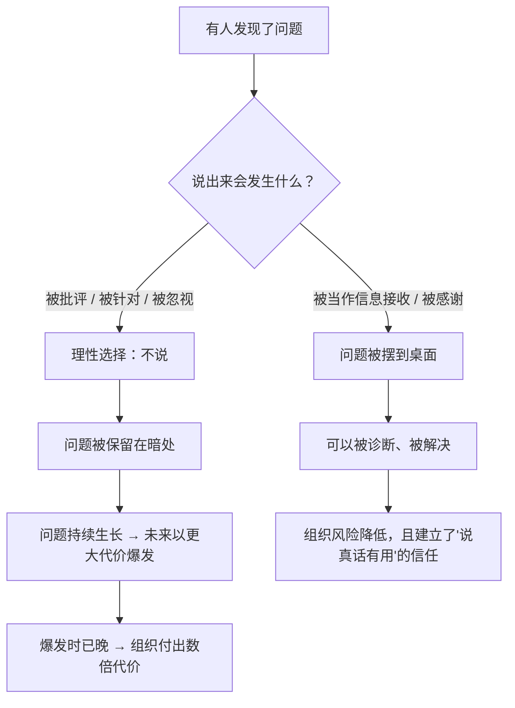

# 15｜极度求真：真相为什么必须先被说出来？

> 如果说出真相会让人难受、会引发冲突，为什么还要坚持？

---

## 一、先说结论

「极度求真」（radical truth）是桥水文化的第一块基石。它的主张很直接：

> **组织最大的成本，不是争吵，而是问题被藏起来。**

达利欧认为，真相让人不舒服，但它至少是**可被处理的**；被掩盖的问题则会在无人知晓的地方不断生长，直到以更大的代价爆发。所以他要求：把问题摆到桌面上，把分歧公开，禁止背后议论。

一句话：**极度求真不是一种道德要求，而是一种降低系统风险的技术选择。**

---

## 二、我们先理解一个问题

先看一个所有组织都熟悉的场景。

会议室里，一个方案被提出来。你一眼就看出它有个明显的漏洞，而且你知道一旦执行，三个月后会出大问题。

但你没有说话。

为什么？

你心里可能闪过这些念头：「说了也没用，反正老板想推。」「万一我说错了，显得我不懂。」「上次说话太直接，被记恨了。」「反正出问题也不是我的责任。」

**问题就在这里：这个漏洞明明有人知道，却没有人说。**

> 那么请问：一个组织的最大风险，究竟来自「没有答案」，还是来自「有答案却没人说」？

---

## 三、作者到底提出了什么观点？

达利欧关于极度求真的论述，可以拆成五条。

**第一，不要让人「过滤」信息。**

在大多数组织里，信息在向上传递的过程中会被层层过滤：坏消息被淡化，问题被修饰，风险被说成挑战。结果是——**做决定的人，看到的是一个被美化过的世界。**

**第二，要区分「真话」和「冒犯」。**

极度求真不是允许随口伤人。它要求的是**对事不对人的诚实**。达利欧承认，这一点在实际操作中很难把握，桥水自己也在不断调整。

**第三，禁止背后议论。**

这是桥水的一条硬规则：有问题当面说，不在背后说。因为背后议论会同时破坏两件事——**它既没有把信息交给需要它的人，又腐蚀了人与人之间的信任。**

**第四，让人有「说出真相」的安全感。**

这一点极其关键，也最容易被忽略。极度求真能不能运行，不取决于要求大家诚实，而取决于**一个说了真话的人，会不会被惩罚。** 如果会，那么所谓「求真」就只是口号。

**第五，求真必须包括「对自己真」。**

达利欧特别强调，最难的不是指出别人的问题，而是承认自己的。**一个人如果对自己不诚实，他对别人的诚实通常也只是攻击性的。**

---

## 四、把这个观点翻译成人话

我们用一个特别日常的类比。

想象一个家庭。孩子考试考砸了。

**第一种家庭文化**：孩子隐瞒、撒谎、或者报喜不报忧。
结果：父母不知道真实情况，无法提供帮助；孩子压力越来越大；问题在暗处积累，直到某天爆出一个更大的问题。

**第二种家庭文化**：孩子一说真话就被骂、被比较、被羞辱。
结果：孩子学会了「说真话的代价太高」，于是更加隐瞒。**表面上看这个家庭很严格，实际上是它主动关掉了信息通道。**

**第三种家庭文化**：孩子可以说出任何真实情况，父母的第一反应是「发生了什么」，而不是「你怎么这么差」。
结果：问题能及早暴露，也才有被解决的机会。

达利欧在组织里要做的，就是第三种。

再换个说法：

> **极度求真不是「有话直说」这个行为，而是「说真话不会被惩罚」这个环境。**

如果环境不允许，再多人喊「要坦诚」，也只会换来一堆漂亮的废话。

---

## 五、为什么会这样？

为什么组织天生会「藏问题」？我们用一张图说明这个机制。

核心在于 B 这个判断。

注意，**沉默往往是理性的。**

一个基层员工如果判断「说出来会得罪人、且我得不到任何好处」，那么他不说，是符合他个人利益的选择。**这不能怪他，只能怪环境让他做出了这个判断。**

所以达利欧的做法不是「呼吁大家勇敢」，而是**改变代价结构**：让说真话的收益大于风险，让隐瞒问题的代价更高。

这就是为什么极度求真必须配一整套制度——包括极度透明（第 16 篇）、可信度加权（第 17 篇）和问题日志（第 20 篇）。**它们的作用，是把「说真话」从一种品德，变成一个划算的选择。**

---

## 六、举一个现实生活中的例子

我们看一个非常典型的技术团队场景：**线上系统即将上线，一个工程师发现了潜在风险。**

**场景 A：没有求真文化的团队**

工程师小陈发现了问题，他犹豫了一下，然后想：「反正我们说过了，是产品那边坚持要上的，出事也怪不到我。」于是没再提。

系统上线，三天后崩了。复盘会上，大家才发现：**其实有两个人早就知道这个风险，只是都没说。**

**场景 B：有求真文化的团队**

小陈发现问题的当天，就在团队群里发了：

> 「我发现一个风险：在并发超过 X 时，缓存可能穿透。我不确定概率有多大，但一旦发生，会影响全部用户。我不主张推迟上线，但希望有一个应对方案。」

注意他这段话的写法：

- **说事实，不说情绪**（「缓存可能穿透」，而不是「这么干迟早出事」）；
- **承认不确定性**（「我不确定概率」）；
- **不把问题升级成人身攻击**（「不主张推迟」，而不是「产品瞎决定」）；
- **给出方向**（「希望有应对方案」）。

团队因此多花了两天做压测，发现风险确实存在，于是加了一层保护。

**这个例子的重点不是「小陈很勇敢」，而是——在场景 B 里，说真话的成本很低，而且立刻得到了正向反馈。**

达利欧要说的是：**一个好的组织，不应该靠个别勇敢的人来暴露问题，而应该让暴露问题变成一件平常的事。**

---

## 七、回到书中重新理解

现在回头看达利欧的原话，会注意到他用的词是「**radical**」——极度、彻底。

这个词的分量在哪里？

一般的「诚实」是：**别人问我，我不撒谎。**
极度求真是：**别人不问我，我也主动说；而且我连自己不想承认的部分也要说。**

一般的「坦诚」是：**对别人说实话。**
极度求真是：**对所有人都用同一套标准，包括上级、下级、和自己。**

达利欧还讲了一个很重要的点：他之所以这么坚持，是因为他相信**「痛苦 + 反思 = 进步」**，而求真就是那个「反思」的前提。如果信息是假的，反思就变成了自我安慰。

**换句话说：极度求真不是一个孤立的美德，而是整个进化机制的燃料。** 没有真实的信号，五步法、问题日志、诊断，全部失效。

---

## 八、这个观点背后还有什么？

**隐含前提一：人可以被训练成「对事不对人」。**

达利欧假设，在正确的文化和训练下，人能够把「批评我的方案」和「否定我这个人」分开。但第 06 篇说过，这是反本能的——**所以极度求真需要长期的文化建设。**

**隐含前提二：真话可以被区分出来。**

如果每个人说的都是「我认为的真相」，那么强调求真可能只是让更多主观判断被当成事实。**真话需要用证据和逻辑来支撑。**

**隐含前提三：说出真相不会带来不可控的外部风险。**

在涉及法律、隐私、商业机密时，无差别的透明可能带来实际的损害。这也是桥水内部在推行时遇到过的现实阻力。

**与其他观点的联系：**
- 第 07 篇「头脑极度开放」是极度求真的**个人版**；
- 第 16 篇「极度透明」是极度求真的**制度化保障**；
- 第 20 篇「问题日志」是极度求真的**操作工具**。

---

## 九、这个观点有问题吗？

有，而且这一条的争议在《原则》全书里可能是最大的。

**第一，「求真」很容易被用作攻击的借口。**

「我这人就是有话直说」——这句话经常被用来掩盖表达的粗暴。**真话和伤害之间的界线，说的人往往不觉得，听的人却感受很深。** 达利欧的体系对表达的技巧要求其实非常高，而这部分在书里讲得不够。

**第二，极度求真可能压制多元的表达方式。**

在一个强调直率的文化里，那些天生含蓄、谨慎、或者需要时间组织语言的人，可能会显得「不坦诚」。**这实际上是用部分人的性格标准，去评价所有人。**

**第三，它可能演变成一种「内卷式的坦诚」。**

当说真话被鼓励，人可能会争相表现自己的「敢说」，把坦诚变成一场表演，而不是真的在求真。

**第四，权力不对称让「求真」不彻底。**

下属对上级求真，和上级对下属求真，代价完全不同。**如果只要求下属坦诚，而上级不能接受被质疑，那这套文化就不成立。** 这也是判断一个组织是否真的在做极度求真的试金石。

---

## 十、今天再看这个观点

极度求真在今天有一个新的应用场景：**AI 可以成为「不许你自欺」的那个角色。**

- 你可以让 AI 扮演反方，专门质疑你的方案；
- 它可以整理出所有和数据相矛盾的地方，不照顾你的情绪；
- 它可以在你写下一段明显自我安慰的文字时，问你「证据是什么」。

在这个意义上，AI 是一个**不需要勇气就能说真话的对象**——它不会得罪你，也不会被你得罪。

但这里也有一个陷阱：**如果所有人都只跟 AI 说真话，而不再跟同事说真话，那么组织的「求真」反而会退化。** 因为真正的风险，往往不在数据里，而在人心里。

这是**基于达利欧思想的现代延伸**。

---

## 十一、这一篇真正应该记住什么？

1. **组织最大的成本不是争吵，而是问题被藏起来。**
2. **真相让人难受，但它至少可以被处理；被掩盖的问题会以更大代价爆发。**
3. **沉默往往是理性的——所以要让说真话变成划算的选择。**
4. **极度求真要求「对自己真」，而不只是对别人真。**
5. **判断一个组织是否真的求真，看它是否有能力接受对上级的质疑。**

---

## 十二、留一个问题

> 上一次你在会议上发现问题却选择沉默，是什么原因？
>
> 如果你把那个原因说出来，会发生什么？
>
> 下一篇，我们来看达利欧为了让「说真话」成为可能，做了什么更激进的事——**把几乎所有的会议都录音，向全员开放。**
