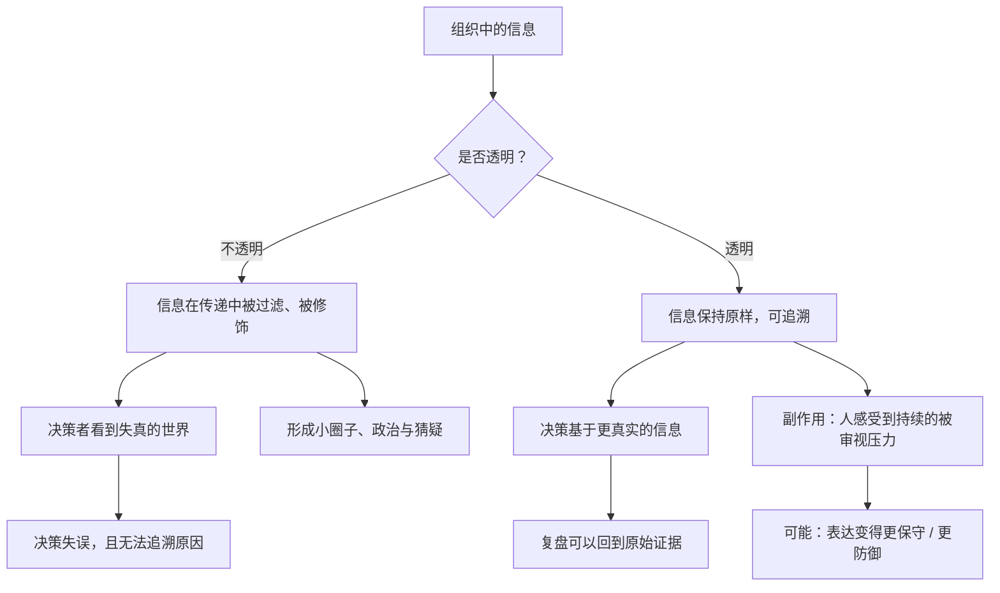

# 16｜极度透明：一家把会议全部录音的公司

> 把几乎所有会议都录音、向全员开放，这样做合理吗？

---

## 一、先说结论

极度透明是桥水最有名、也最有争议的制度。

达利欧要求对绝大多数会议进行**录音**，员工可以随时调取；重大问题、分歧、对人的评价，都尽量公开。他的逻辑是：

> **透明让事实可追溯、让责任更清晰、让阴谋无处藏身。**

但它同时意味着：

> **你在这个组织里说的每一句话，都可能被记录、被回放、被别人看到。**

所以极度透明的本质是一个交换：**用持续的心理压力，换取一个信息不被污染的系统。** 它是不是划算，取决于你把什么看得更重。

---

## 二、我们先理解一个问题

先做一个思想实验。

假设你所在的公司宣布：从下周起，**所有会议都会录音，并开放给全体同事调取。**

请诚实地想三个问题：

1. 你在会上说的话，会和以前完全一样吗？
2. 如果不一样，你改变了什么？是变得更诚实，还是变得更安全？
3. 这两种改变，分别对公司有利还是有害？

这个实验之所以有意思，是因为它暴露了一个矛盾：

> **透明既可能让人更真，也可能让人更谨慎——而这两件事，方向是相反的。**

---

## 三、作者到底提出了什么观点？

达利欧关于极度透明的论述，可以拆成四点。

**第一，透明的主要敌人是「信息失真」，不是「隐私」。**

他认为，在一个不透明的组织里，信息会被扭曲：向上报喜不报忧、平行部门互相猜疑、评价人靠印象和小道消息。**透明是为了让信息在整个系统中保持原样。**

**第二，透明让「事后追责」和「事后学习」都成为可能。**

如果会议被记录，那么当结果出来时，你可以回去看：**当时是谁、基于什么、做了什么判断。** 这让复盘不再依赖记忆和立场。

**第三，透明提高了「做坏事」的成本。**

达利欧的论证是：当一切可见时，操纵、甩锅、私下交易都变得更难。**他提到，桥水在多年里很少遭遇重大的法律诉讼和监管处罚——他把这视为透明带来的收益。**

**第四，透明需要配套，否则会变成伤害。**

光有透明不够，还要有「极度求真」的文化来保证表达方式，和「可信度加权」来保证信息被正确处理。**单独推行透明，很可能只会制造恐惧。**

---

## 四、把这个观点翻译成人话

我们用最直观的方式对比两种组织。

**不透明的组织，像一个「结果公布会」：**
你知道最后决定是什么，但不知道它是怎么来的。
于是你只能猜：老板是不是有偏好？那个部门是不是更受宠？我是不是该站队？
**猜的过程，消耗了大量本可以用于工作的精力。**

**透明的组织，像一个「全程直播的房间」：**
决定的过程、谁说了什么、理由是什么，都能被看到。
于是你不需要猜——**你只需要面对事实。**

但请注意直播的代价：

**当你知道房间里有摄像头时，你的表达会自动变成「适合被看到的样子」。** 这未必是谎言，但它可能是**更安全、更保守、更少冒险**的表达。

而这恰恰是一个组织最怕失去的东西——**真实的、冒风险的、不成熟的、但可能藏着宝藏的想法。**

这就是极度透明真正的张力所在：

> **它一边在消灭「藏」，一边可能也在消灭「野生」。**

---

## 五、为什么会这样？

我们用一张图来看透明到底改变了什么。

关键在最后两个节点。

达利欧的假设是：**压力是值得的，因为它换来一个 truthful 的系统。** 而批评者的假设是：**压力会把人变成「表演者」，而不是「求真者」。**

谁对？可能需要看条件：

- 如果组织里说真话的人**真的得到了好结果**（而不是被记恨），那透明会增强求真；
- 如果组织里说真话的人**事后被区别对待**，那透明只会让人学会「表演式坦诚」。

所以，极度透明能不能成功，**不取决于它是否被宣布，而取决于它是否被公正地执行。**

---

## 六、举一个现实生活中的例子

我们看两个场景，来理解透明的边界。

**场景一：一家创业公司的复盘会。**

创始人宣布：「以后所有复盘会都录音。」

第一个月，大家说话更谨慎了，但**会议质量确实提高了**——因为知道会被记录，大家不再随便甩锅，也开始提前准备。

第三个月，出现了一个问题：一位员工在会上坦率地说「我担心这个方向是错的，而且我有一些不太成熟的想法，可能不严谨」。录音被保存下来。半年后项目失败，这段录音被反复引用，**那位员工被贴上了「一开始就不坚定」的标签。**

从那以后，会上再也没人说不成熟的想法了。**透明杀死了冒险。**

**场景二：同样的公司，但做法不同。**

创始人在推行录音时，同时立了两条规则：

1. **记录的目的是学习，不是追责**——复盘时讨论的是「当时的判断标准哪里需要改」，而不是「谁当初说错了」；
2. **不成熟的想法被明确保护**——「提出来可能不严谨的想法」在会上被感谢，而不是被记录为立场。

结果：透明带来的「可追溯」，变成了改进的资产；而它带来的「压力」，被规则限制在合理范围内。

这两个场景的区别，恰好说明了达利欧体系的真正难点：

> **透明不是一条独立的规则，而是一整套相互配合的设计。少了保护机制，透明就会变成监控。**

---

## 七、回到书中重新理解

现在回头看达利欧的原话，会注意到几个细节。

他说，录音这件事在最初遭到了律师的**坚决反对**——理由是：一旦遇到诉讼或监管调查，这些录音可能成为对公司不利的证据。

但他坚持了下来。他的逻辑是：**如果公司平时做事是对的，录音就是保护；如果录音会伤害公司，那说明公司本身有问题。** 他提到，这一措施实行后，桥水在很长时间里没有遭遇重大的法律诉讼和监管处罚。

这个论证很有意思，因为它把透明从「道德选择」变成了「风险控制」——**不是因为透明更高尚，而是因为它更安全。**

但他也承认，诚实是要付出代价的，**他自己也经常因为过于直率而被误解。** 这说明他很清楚透明的成本，只是认为长期收益更高。

---

## 八、这个观点背后还有什么？

**隐含前提一：组织成员的心理承受力足够。**

持续被审视，对很多人来说是巨大的压力。**极度透明可能对某些性格的人友好，对另一些人则是持续消耗。**

**隐含前提二：组织里存在「说真话会被善待」的实际证据。**

如果这种证据不存在，透明只会培养出「表演者」。

**隐含前提三：信息本身是可被理解的。**

透明的前提是大家有足够的背景知识去理解看到的信息。如果只是把原始录音丢给所有人，也可能造成误读和新的猜疑。

**与其他观点的联系：**
- 第 15 篇的极度求真是**内容层面**的要求，极度透明是**通道层面**的保障；
- 第 17 篇「可信度加权」用来处理透明带来的**信息过载**；
- 第 20 篇「问题日志」是透明在**问题管理**上的具体形态。

---

## 九、这个观点有问题吗？

有，而且是全书最值得警惕的部分。

**第一，「透明」和「监控」的界线，取决于权力。**

在一个自上而下、权力不对等的组织里，透明往往意味着「上面看得见下面，下面看不见上面」。**这是监控，不是透明。** 真正的透明必须是**双向**的。

**第二，它可能对人造成真实的心理伤害。**

不是所有人都能在「随时被审视」的环境中保持健康和创造力。**要求所有人适应同一种文化，本身就是一种筛选，而筛选掉的人未必是能力差的。**

**第三，透明度没有「完全」的状态。**

完全透明会侵犯隐私、损害竞争位置、甚至违法。所以现实中，透明总是有边界的。**真正的问题不是「要不要透明」，而是「透明的边界划在哪里，由谁划」。**

**第四，「透明提高效率」这个结论，可能依赖于特定条件。**

在投资领域，信息透明确实有利于决策。但在需要保密、长周期、创意密集的领域（比如研发、艺术），过度透明可能适得其反。

**第五，这套做法高度依赖创始人个人。**

达利欧能推行，是因为他有绝对权威、长期记录、以及员工自愿加入。**换一个环境和领导者，同样的制度可能变成灾难。**

---

## 十、今天再看这个观点

极度透明在今天的处境，和达利欧写作时已经完全不同了。

**我们生活的世界，正在变得「技术上极度透明，权力上极度不透明」。**

- 平台记录着我们所有的行为；
- 通讯被留存，搜索被记录，位置被追踪；
- 但决定如何使用这些信息的人，我们几乎看不见。

这和达利欧设想的透明恰恰相反：**他要的是「所有人的可见对所有人」，而现实经常是「所有人的可见，只对少数人」。**

所以，达利欧的极度透明在今天最有价值的提醒是：**透明必须是双向的、有规则的、服务于学习的。** 一旦它只服务于控制，就会变成监控。

而在 AI 时代，这个问题会变得更迫切：**当 AI 可以记录、分析、评价你的一言一行时，你希望这套系统向你透明，还是只向你的上级透明？**

这是**基于达利欧思想的现代延伸**。

---

## 十一、这一篇真正应该记住什么？

1. **极度透明是为了让信息保持原样、可追溯、可复盘，而不是为了道德优越。**
2. **透明必须双向，单向的透明本质上是监控。**
3. **透明会同时带来「更真」和「更保守」两种效果，取决于它是否被公正执行。**
4. **没有保护机制的透明，会杀死冒险的想法——而冒险恰恰是组织最需要的。**
5. **透明的边界划在哪里、由谁划，比「要不要透明」更重要。**

---

## 十二、留一个问题

> 如果你所在的组织宣布「所有会议录音、全员可见」，你会更愿意说真话，还是更不愿意？
>
> 你的答案，取决于你相不相信——**说了真话之后，你会被怎样对待。**
>
> 下一篇，我们来看创意择优的第三块基石——**可信度加权：为什么要听专家的话，但不迷信权威。**
