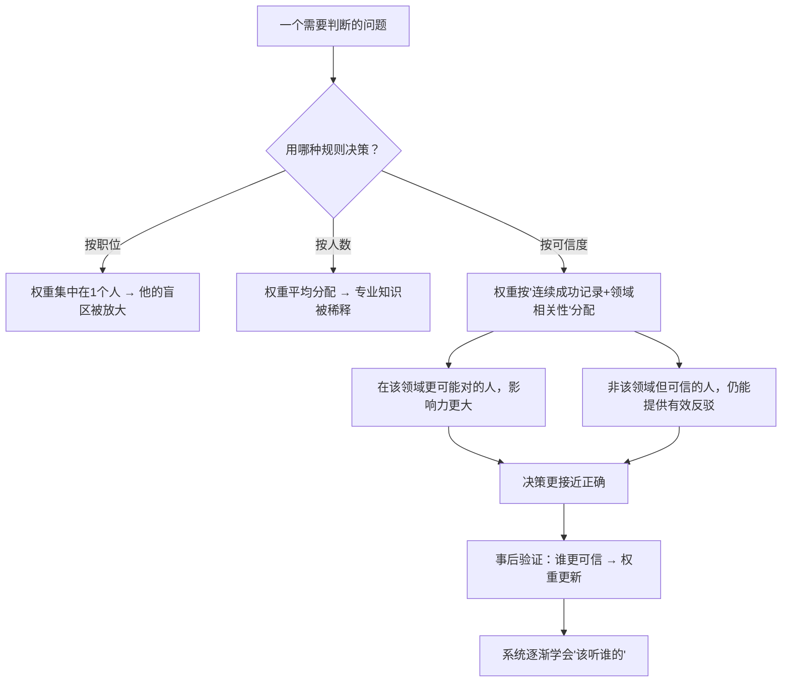

# 17｜可信度加权：为什么要听专家的话，但不迷信权威？

> 既然每个人的判断力不同，为什么不直接听最有能力的人？

---

## 一、先说结论

创意择优的第三块基石是「可信度加权」（believability-weighted decision making）。

它的规则可以概括成一句话：

> **在决策时，对在相关领域有「连续成功记录」、并且能清楚说明推理过程的人，给予更高的投票权重。**

它区分了两件经常被混为一谈的东西：

- **权威**：来自职位、资历、头衔；
- **可信度**：来自实绩、逻辑和可验证的判断记录。

达利欧的主张是：**决策时看可信度，不看职位。** 这既是它最有力的地方，也是它最难落地、最容易走偏的地方。

---

## 二、我们先理解一个问题

先看一个很常见的困境。

公司要决定一件专业问题。会议上有两种声音：

- 一位资深专家的意见；
- 三位年轻人的反对意见。

按传统方式，大概率是听专家的。但这不公平——**万一那三位年轻人是对的，而且他们看到了专家没看到的东西呢？**

但反过来，如果完全平等地投票，也没道理——**那些年轻人在这件事上的经验，确实不如专家。**

于是问题来了：

> 怎样既尊重「专家更可能对」，又不至于「专家的盲点无人能纠正」？

---

## 三、作者到底提出了什么观点？

达利欧关于可信度加权的论述，可以拆成五条。

**第一，不是所有人的意见权重都相同。**

这一点他毫不含糊。他认为，「一人一票」在需要专业判断的场景里是一种浪费。**你要听那个更可能对的人。**

**第二，可信度的来源不是职位，而是记录。**

一个人在这个领域**做过多少次判断、对了几次、能不能解释清楚推理过程**——这才是可信度的依据。

**第三，可信度是「分领域」的。**

一个人在投资上很可信，不代表他在人事上也可信。**可信度不是一个人的整体属性，而是「他 + 某个领域」的属性。**

**第四，权重不是「全听」或「不听」，而是「加权」。**

专家不是拥有否决权，而是**意见被赋予更大的分量**。如果多个不同领域的可信者都提出反对，即便不是本领域的权威，也应该被认真考虑。

**第五，可信度必须可以被验证和更新。**

如果一个人的判断一直不准，他的权重就该下降。**可信度是动态的，而不是终身制的光环。**

---

## 四、把这个观点翻译成人话

我们用一个最日常的类比：**一栋楼要装修，怎么决定方案？**

**纯粹按资历（权威）**：找最有名的那家装修公司，他们说怎么装就怎么装。风险是：有名不等于适合你的需求，而且他们可能不关心你真正要什么。

**纯粹按投票（民主）**：全家投票。风险是：家里没做过装修的人，凭想象投出的票，可能让整个方案变得平庸。而且投票的结果往往是折中——**最贵的地方省了，最该省的地方花了。**

**可信度加权**：

- 谁对「承重墙能不能动」这事最可信？→ 结构工程师，他的权重最高；
- 谁对「预算怎么分」最可信？→ 那个记过账、知道家里收支的人；
- 谁对「好不好看、住得舒不舒服」最可信？→ 住在里面的人，**这部分的权重，每一个家庭成员都很高，因为他的体验没人能替代。**

你会发现，这个方式的关键特征是：

> **不同的问题，权重分配不同；同一个人，在不同问题上的权重也不同。**

而且它不排斥任何人——**每个人在自己最懂的维度上，都有高权重。**

这就是达利欧说的可信度加权。它既不是「专家说了算」，也不是「人人平等」，而是**按「谁在这个问题上更可能对」来分配影响力。**

---

## 五、为什么会这样？

为什么可信度加权在理论上优于民主和独裁？用一张图说明。

这里最值得注意的是最后一步：**权重会被结果验证并更新。**

这意味着可信度加权不是一次性的排序，而是一个**会进化的系统**。它同时在做两件事：

- 用当前的权重做出更好的决定；
- 用这个决定的结果，去修正未来的权重。

达利欧说，桥水在很长一段时间里都在做类似的事情——**给每个人的判断建立记录，并且据此调整谁在什么事上更有发言权。**

而这个系统的前提是：**必须有真实的记录，且必须有人敢给出不同意见。** 所以它天然依赖极度求真和极度透明。

---

## 六、举一个现实生活中的例子

我们看一个家庭里特别真实的场景：**要不要给孩子报一个昂贵的培训班。**

参与决策的有：

- 妈妈：最了解孩子每天的状态和学习节奏；
- 爸爸：负责家庭财务，最清楚这笔支出对预算的影响；
- 奶奶：有丰富的育儿经验，但并不了解现在的升学情况；
- 孩子：唯一真正知道自己喜不喜欢的人。

如果按「长辈优先」，奶奶的经验权重最高——**但她的经验可能是三十年前的。**
如果按「谁出钱谁决定」，爸爸说了算——**但他可能不了解孩子的意愿。**
如果按「投票」，四票很难分出高下。

**可信度加权会这样分配：**

| 问题 | 最可信的人 |
|---|---|
| 孩子的真实意愿和感受 | 孩子（权重最高），妈妈次之 |
| 孩子的学习节奏与压力 | 妈妈 |
| 家庭能否承担这笔支出 | 爸爸 |
| 这个培训对升学有没有用 | 需要外部信息（咨询老师、其他家长）——**这部分奶奶和爸爸都不是高权重** |

看出关键了吗？

**奶奶依然应该参与讨论（她可能提醒一些被忽略的生活细节），但「升学效果」这个问题上，她的意见不该有高权重。**

这就是可信度加权最实用的价值：**它让人不必在争论中定输赢，而是让每个人在「他真正了解的部分」上说话。**

---

## 七、回到书中重新理解

现在回头看达利欧的原话，有两个措辞特别值得注意。

他说，可信度加权解决的是「**如何让最好的想法胜出**」这个问题。注意——是想法，不是人。**这意味着即便一个低可信度的人提出了一个好想法，这个想法本身也应该胜出。** 加权是对「信息来源」的判断，不是对「想法价值」的终极裁决。

另一个细节是，他非常强调**「连续的成功记录」**，而不是「一次的成功」。

这一点很聪明。因为一次成功可能只是运气，连续的、在同类问题上的成功，更可能反映真实的判断力。**这是一种对运气的校正。**

同时他也承认，可信度加权在实际操作中会面临争议——**比如「谁来定义可信度」「过去的成功能不能预测未来」。** 他没有假装这个机制是完美的，而是把它当作一个可以被持续优化的方向。

---

## 八、这个观点背后还有什么？

**隐含前提一：判断力可以被观察和记录。**

如果一个人的判断从不被记录，可信度就无从谈起。**这需要一套记录系统，也需要组织愿意做这件事。**

**隐含前提二：领域可以被清晰划分。**

现实中，问题往往是跨领域的。「这个产品该不该做」涉及用户、技术、财务、战略——**很难说谁在这个「综合问题」上更可信。**

**隐含前提三：可信度高的人愿意接受挑战。**

如果高可信度的人变得不能被质疑，那加权就变成了新的独裁。**这是它最容易退化的地方。**

**与其他观点的联系：**
- 第 14 篇的创意择优是**总目标**，可信度加权是它的**核心机制**；
- 第 15、16 篇提供了它运行所需的**真实信息和可见记录**；
- 第 22 篇的「棒球卡」「集点器」，是可信度加权在**工具层面**的实现。

---

## 九、这个观点有问题吗？

有，而且这一次的质疑可能是致命的。

**第一，谁来定义可信度？**

如果可信度由上层定义，那么这套机制只是把「权力」换了个名字叫「可信度」。**只要定义权在权力者手里，加权就可能是变相的独裁。**

**第二，光环效应与马太效应。**

一个在某领域成功过的人，会获得其他领域的「可信度溢光」；而一个没被记录过的人，永远拿不到高权重。**精英的过去会持续转化为未来的话语权，新人很难破局。**

**第三，「连续成功」可能只是「赶上了好的时代」。**

在一个快速变化的环境里，过去的成功经验恰恰可能成为最大的负担。**把权重给「过去成功的人」，在变化期可能是灾难。**

**第四，它会系统性压制少数派意见。**

如果少数派虽然看到了真相，但因为可信度低而被低权重对待，那么**很多时候最关键的那个声音会被忽略。** 而历史上，颠覆性的判断往往来自「不那么可信的人」。

**第五，可信度加权假设「判断可以被客观评分」。**

但很多判断当时无法验证，只能事后看结果。**用结果反推可信度，会受到大量的噪音干扰。**

所以，更谨慎的说法是：**可信度加权是一个有力的工具，但它需要一个同样有力的制衡机制——比如强制倾听低可信度的反方，或者定期重新定义「可信度」。** 没有制衡的加权，就是权力换了个更隐蔽的皮。

---

## 十、今天再看这个观点

可信度加权在今天有一个几乎完美的技术版本：**AI 的「加权」与「排序」。**

搜索引擎给可信来源更高权重；推荐系统给你的历史偏好更高权重；AI 助手会参考被标注为「权威」的语料。

它们都在做达利欧描述的事：**按某种标准分配影响力。**

但这也暴露了一个核心问题：**权重是谁定的？**

- 如果权重来自你的历史行为，那么它会强化你的既有偏好——**这不是可信度加权，这是偏见的复利**；
- 如果权重来自平台的规则，那么平台就在事实上定义了「谁更可信」——**这是一个巨大的权力，而它通常不透明**。

所以，达利欧可信度加权在今天最重要的启示，不是「加权有多好」，而是：

> **任何加权系统，都必须回答「谁能改权重」这个问题。否则它会安静地、高效地固化既有的不平等。**

这是**基于达利欧思想的现代延伸**。

---

## 十一、这一篇真正应该记住什么？

1. **可信度加权：按「连续成功记录 + 领域相关性」分配影响力，而不是按职位或人数。**
2. **可信度是分领域的，不是一个人的整体属性。**
3. **权重会被结果验证并更新，所以它本质上是一个进化的系统。**
4. **它最大的风险是「谁来定义可信度」——定义权在哪里，权力就在哪里。**
5. **没有制衡的可信度加权，很容易变成更隐蔽的独裁。**

---

## 十二、留一个问题

> 你所在的团队里，如果按「可信度」而不是职位来分配发言权，谁在哪些问题上的权重会明显不同？
>
> 更重要的是——**「界定可信度」这件事，在你们那里由谁说了算？**
>
> 下一篇，我们来看达利欧如何处理分歧——**什么叫「深思熟虑的意见分歧」，为什么两个人的观点越对立，越可能接近真相。**
