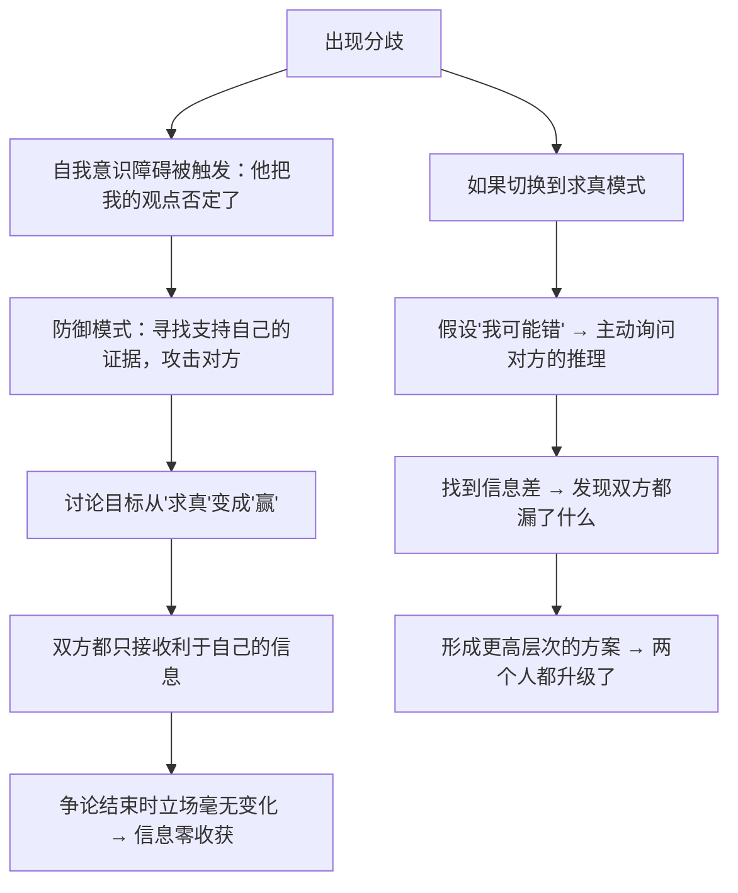

# 18｜深思熟虑的意见分歧：聪明人该如何「吵架」？

> 为什么两个人的观点越对立，越有可能接近真相？

---

## 一、先说结论

达利欧把分歧分成两类：

- **愚蠢的分歧**：各说各话，争的是输赢，目的是证明「我赢了」；
- **深思熟虑的意见分歧（thoughtful disagreement）**：双方都假设「我可能错」，共同去寻找事实和更高层次的答案。

他的核心主张是：

> **当两个可信度高、且真诚求真的人得出相反的结论时，那里往往藏着一个你还没看到的重要信息。**

所以达利欧不但不回避分歧，反而**把分歧当成一种探矿的工具**——分歧出现的地方，就是最可能有收获的地方。

---

## 二、我们先理解一个问题

先看一个几乎每次开会都会发生的场景。

两个人就一个问题争论了四十分钟。他们都很认真，都很有能力，说的也都有道理。但会议结束时，两个人的立场**一点变化都没有**。

散会后，A 说：「他根本不听我说。」B 说：「他就是不接受现实。」

于是问题来了：

> 如果两个人都足够聪明、也都想解决问题，为什么争论了四十分钟，却什么都没发生？

---

## 三、作者到底提出了什么观点？

达利欧关于分歧的论述，可以拆成五点。

**第一，要区分「观点」和「人」。**

一个成熟的争论者，会把自己的观点当成一个**可以修改的假设**，而不是自我的一部分。**观点被推翻，不等于自己被否定。**

**第二，分歧的价值在于「信息差」，而不是「谁对」。**

如果一个分歧只是偏好不同（比如喜欢红色还是蓝色），那它不值得争论。但如果两个可信的人对**同一个事实**得出不同判断，那就说明有人手上锚着别人没有的信息。**找出这个信息，比争论本身重要得多。**

**第三，分歧要往「更高层次」走。**

达利欧说，当两个人意见相反时，正确的做法不是一方说服另一方，而是**一起上升到一个更高的层次**——看看是不是你们在讨论不同的问题，或者有没有第三种可能同时容纳双方的核心关切。（这一点我们在第 06 篇讲「思维盲点」时也提过。）

**第四，要区分「高效的争辩」和「情绪化的争辩」。**

达利欧强调，理性的分歧要求你控制情绪，**把「你错了」换成「我们来看看这个推理哪里有问题」。**

**第五，要有人最终拍板。**

分歧不意味着永远不结束。达利欧的规则是：**充分求真的讨论 + 明确的决策责任人。** 讨论时充分开放，决策后全力执行。

---

## 四、把这个观点翻译成人话

我们用一个特别具体的比喻来理解。

想象两个侦探在破同一个案子。

**愚蠢的分歧是这样的：**

侦探 A 说：「凶手是管家。」
侦探 B 说：「凶手是园丁。」
然后两个人开始互相攻击对方的能力、动机、过往的错误。四十分钟后，案子一点进展都没有。

**深思熟虑的意见分歧是这样的：**

侦探 A 说：「凶手是管家，因为钥匙在他手上。」
侦探 B 说：「凶手是园丁，因为监控显示他当晚在花园里。」

然后 B 会说：「你说的钥匙这一点很重要——我没想到。你为什么会觉得钥匙是关键？」
A 会说：「因为门没有被撬，说明是用钥匙进的。但你说的监控……他没进屋，怎么可能杀人？」

两个人一起发现：**其实凶手是管家，他指使了园丁。**

你看，最后的答案，比两个人的初始立场都更好——**因为它是两个视角的合并，而不是某一方的胜利。**

达利欧说的「深思熟虑的意见分歧」，就是这种侦探式的对话。而「愚蠢的分歧」，就是那种互相攻击能力、论资历、比嗓门的争吵。

**两者的差别，不在于有没有分歧，而在于——你说的话，是在往「共同找真相」走，还是在往「压倒对方」走。**

---

## 五、为什么会这样？

为什么人这么容易从「讨论问题」滑向「争夺输赢」？用一张图来说明。

关键在于第一步：**分歧是会自动触发自我防御的。**

这不是修养问题，而是本能——我们在第 06 篇讲过，大脑对「观点被否定」的反应，和对身体疼痛的反应有相似之处。

所以，达利欧的方法不是「不要有情绪」，而是**在情绪出现之后，仍然把对话拉回求真的轨道**。这需要训练，也需要一个允许这样做不会被惩罚的环境。

还有一个关键点：**分歧之所以有价值，是因为它逼你说出推理过程。**

当没有人反对你时，你可能只说结论；当有人反对时，你必须解释：**你是怎么一步步走到这个结论的？** 而恰恰是在解释推理的过程中，你自己可能就会发现漏洞。

所以达利欧说，分歧是礼物——**它让你看见自己的推理，而这在日常的单向表达里几乎不会发生。**

---

## 六、举一个现实生活中的例子

我们看一个很多人都会遇到的场景：**一对夫妻讨论要不要买房。**

**愚蠢的分歧：**

妻子说：「现在必须买，再等就买不起了。」
丈夫说：「现在买就是接盘，明年肯定跌。」
两小时后，争论演变成「你就是不听我的」「你不懂市场」「你对家庭没责任感」。

最后，房子没买，关系还受了伤。

**深思熟虑的意见分歧：**

第一步，先确认这是不是一个「事实分歧」还是「目标分歧」：

- 妻子担心的核心是：**害怕永远上不了车**；
- 丈夫担心的核心是：**害怕背上过重的债务**。

**这其实是两个不同的担忧，并不矛盾。**

第二步，把双方的前提摊开：

- 妻子假设：房价还会涨；
- 丈夫假设：房价会跌。

这两个假设无法靠争吵解决，但可以**去找证据**：查数据、问中介、看政策。

第三步，往「更高层次」走：

> 有没有一种方案，既能降低「上不了车」的风险，又能控制「债务压力」？

比如：买更小、总价更低的房子；或者选择更灵活的贷款方案；或者约定一个明确的时间点（比如两年后）再评估。

**你看，原来「买不买」这个二选一，变成了「怎么在两种担忧之间设计一个方案」。**

这正是达利欧式分歧处理的核心：**不是让一方赢，而是让问题被真正理解，从而产生第三种可能。**

---

## 七、回到书中重新理解

现在回头看达利欧的原话，会注意到他一个很有意思的表述。

他说，他最怕的不是有人反对他，而是**没有人反对他**。因为那意味着两件事之一：要么他的想法确实已经完美，要么身边的人都不敢说。**而他更倾向于假设是后者。**

这就是为什么他会鼓励「深思熟虑的意见分歧」，甚至主动去寻找那些**最可能反对他的人**来挑战自己。

他还提出一个很实用的建议：**在分歧中，先要求自己完整复述对方的观点，直到对方说「对，我就是这个意思」。** 这不是礼貌，而是一个技术动作——**如果你无法复述对方，你就还没有理解他，你只是在准备反驳。**

他还提醒：**分歧必须有一个终点。** 充分的讨论之后，要有明确的决策者和执行者。**否则「求真」会变成「永远不决定的借口」。**

---

## 八、这个观点背后还有什么？

**隐含前提一：双方都愿意求真。**

如果一方根本不在乎真相，只想赢，那么「深思熟虑的意见分歧」就无从谈起。**这是它最脆弱的地方——它假设对方也是诚实的。**

**隐含前提二：分歧的领域存在可验证的事实。**

如果完全无法验证（比如品味、偏好），那分歧就无法通过求真解决，只能通过规则或妥协解决。

**隐含前提三：组织允许分歧公开存在。**

如果分歧被视作「不团结」，那么它只会转入地下，变成背后议论。

**与其他观点的联系：**
- 第 06、07 篇是这一条能成立的**心理前提**；
- 第 15、16、17 篇提供了**信息与权重**的基础；
- 第 19、20 篇会讲分歧如何转化为**机器的改进**。

---

## 九、这个观点有问题吗？

有，值得注意的至少有五点。

**第一，它假设双方地位平等。**

在下级与上级之间，「深思熟虑的意见分歧」很可能变成「下级单方面承担风险」。**如果权力不对等，最理性的选择往往是不分歧。**

**第二，「分歧是礼物」有幸存者偏差。**

大多数分歧其实没有产生什么洞见，只是浪费时间。**真正有价值的分歧，可能只是少数。** 达利欧的说法有美化的成分。

**第三，过度强调分歧，可能伤害关系。**

长期处在一个「随时被挑战」的环境里，人需要非常强的心理承受力。**对很多人来说，这种环境是消耗，而不是成长。**

**第四，有些分歧本质上不可调和。**

价值观冲突、根本利益冲突，不是靠「求真」就能解决的。**达利欧的方法更适合「目标一致、路径不同」的分歧。**

**第五，复述对方可能变成一种技术性压制。**

「让我确认一下你的意思是……」如果被用作一种居高临下的姿态，反而会激怒对方。

所以，更完整的说法是：**深思熟虑的意见分歧，需要双方有共同的求生意愿、相对平等的地位、以及一个足够安全的环境。** 缺了任何一个，它就会退化成普通的争吵。

---

## 十、今天再看这个观点

达利欧的「意见分歧」，在今天有一个特别合适的搭档：**AI 作为永远愿意和你分歧的对手。**

- 它不会因为你的意见而生气；
- 它不会因为你的职位而让步；
- 它可以专门寻找你论证中的漏洞；
- 它可以在你说「我们的结论是……」时，问「你的前提是什么？有没有别的解释？」

这正好补上了人类分歧最难的一块——**情绪成本**。AI 可以让「求真式的分歧」变得廉价。

但同时也带来一个副作用：**如果人们发现「和 AI 分歧」比「和人分歧」舒服得多，那么组织内部的真实分歧可能会减少。** 而组织中最重要的信息，往往恰恰藏在人心里，而不是在数据里。

这是**基于达利欧思想的现代延伸**。

---

## 十一、这一篇真正应该记住什么？

1. **分歧分两种：争输赢的愚蠢分歧，和共同求真的深思熟虑的分歧。**
2. **当两个可信的人得出相反结论时，那里往往藏着关键信息。**
3. **分歧的价值在于暴露「信息差」，而不在于分出对错。**
4. **处理分歧的关键动作：先完整复述对方，再一起上升到更高层次。**
5. **分歧必须有一个终点——充分讨论之后，仍需要明确的决策者。**

---

## 十二、留一个问题

> 上一次你和一个重要的人产生分歧时，你的目标到底是什么——**理解他，还是说服他？**
>
> 如果当时你的目标是「找出我们之间那个信息差」，对话会变成什么样？
>
> 下一篇，我们进入工作原则的第三部分——**把整个组织看成一部机器：结果 = 设计 + 人。**
