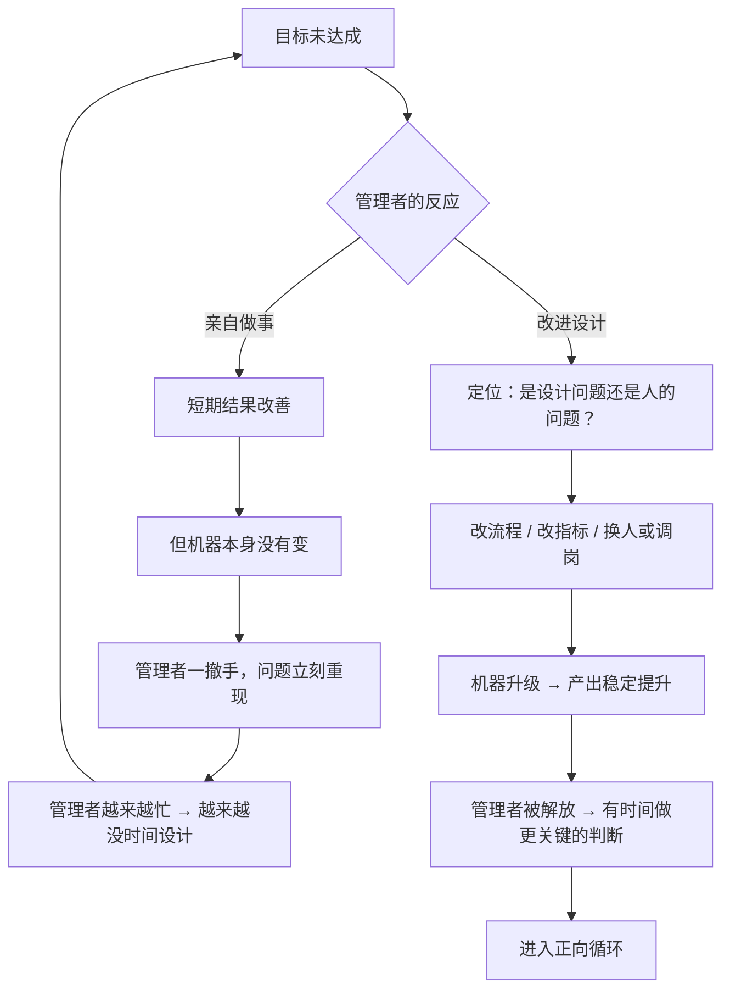

# 19｜组织就是一部机器：设计 + 人 = 结果

> 为什么达利欧说，管理者的工作不是「做事」，而是「改进机器」？

---

## 一、先说结论

达利欧管理思想的中心比喻，是一个公式：

> **结果 = 设计 + 人（Outcomes = Design + People）**

它的意思很直接：如果结果不理想，只有两个地方可能出问题——**要么是设计有问题，要么是人（包括位置搭配）有问题，要么两者都有。**

由此推出的管理原则是：

> **管理者的职责，不是亲自下场把事情做好，而是持续对照「目标」与「产出」，诊断偏差，然后改进设计和人员配置。**

这就是「像操作一部机器那样进行管理，以实现目标」——工作原则里最核心的一条。

---

## 二、我们先理解一个问题

先看一个所有管理者都会遇到的困境。

一个团队连续几个月没达成目标。管理者很努力：加班、开会、亲自盯细节、甚至自己上手补活。

结果：当月的数字好一点，下个月又回去了。

于是问题来了：

> 为什么「越努力地做事」，反而越解决不了团队的问题？

---

## 三、作者到底提出了什么观点？

达利欧的「机器」管理观，可以拆成五点。

**第一，管理有两条路：做事，或者设计。**

- **做事**：亲自把某件事完成；
- **设计**：建立一套机制，让事情被稳定地完成。

达利欧认为，**管理者的主要产出，应该是「一台运转良好的机器」，而不是「自己做的那些活」。**

**第二，管理者必须有一个「流程视角」。**

他在书里用了**流程图（Process Flow Diagram）** 的方式，把组织描述成「谁、在什么环节、基于什么标准、产出什么」。**一旦画出来，问题出在哪一环就变得可见。**

**第三，目标与产出要持续对照。**

达利欧说，管理者要不断比两样东西：**我想要的结果，和我实际得到的结果。** 差距一旦出现，就进入了「发现问题 → 诊断 → 改进」的循环。

**第四，要分清「设计问题」和「人的问题」。**

- 如果是设计问题：改流程、改指标、改授权、改工具；
- 如果是人的问题：换人、培训、调整角色。

**误判这两者，是管理中最昂贵的错误。** 把设计问题当人的问题，会不断换人而无效；把人的问题当设计问题，会不断改流程而无效。

**第五，机器需要持续进化。**

达利欧不认为机器可以一劳永逸。**目标在变、人在变、环境在变，所以机器必须不断被重新设计。**

---

## 四、把这个观点翻译成人话

我们用最通俗的方式说清楚「做事」和「设计」的区别。

**场景一：一个人开了一家小店。**

- **做事型老板**：每天最早到、最晚走，自己收银、自己进货、自己招呼客人。生意还不错，但他一病倒，店就乱了。
- **设计型老板**：把「进货标准」「收银流程」「服务话术」「排班规则」都写清楚，训练一个人能顶班。他可以出去一个月，店照样转。

**注意，做事型老板并不是不努力——他可能比设计型老板更累。** 但他的努力，全部投在了「把今天的事做完」上，没有投在「让未来的事不需要我」上。

**场景二：一个团队的项目总是延期。**

- **做事型管理者**：自己加班把关键部分做完。这个月按时交付了。
- **设计型管理者**：开始问：为什么总是延期？是任务拆解不清楚？是需求变更没有缓冲？是每个人负责的边界模糊？——然后改这些。

**你看，做事型管理者每次都要亲自救火，设计型管理者在消灭火灾的源头。**

达利欧说的「管理者是一部机器的操作者」，就是这个意思：

> **你的工作不是当那个最勤快的消防员，而是当那个画出建筑防火规范的人。**

---

## 五、为什么会这样？

为什么「亲自做事」看起来有效，长期却是个陷阱？用一张图说明。

这里有三个关键机制：

**第一，亲自做事是「用管理者的时间，掩盖系统的问题」。**

它能让数字暂时好看，但**系统本身没有获得任何改善**。而管理者一旦分身，问题就会立刻回来。

**第二，做事会挤占设计的时间。**

管理者的时间有限。如果全部用在做事上，就没有时间画流程图、想指标、诊断根源。**于是陷入「越忙越没设计，越没设计越忙」的死循环。**

**第三，设计是可以复利的。**

一套好的流程会被反复使用、被不断优化。**它带来的收益不在今天，而在接下来的每一天。**

达利欧的赌注是：**短期的「自己干更快」，换不来长期的「系统能自己干」。**

---

## 六、举一个现实生活中的例子

我们看一个特别常见的组织案例：**一家公司的新员工总是在三个月内离职。**

**做事型管理者的做法：**

每一次有人离职，他就亲自去谈、去挽留、去临时补位。忙得焦头烂额，但每次都是补救。

如果是设计型管理者，他会做一次系统的分析：

| 环节 | 事实 | 判断 | 动作 |
|---|---|---|---|
| 招聘 | 招进来的人与岗位需求不匹配 | **人的问题 + 设计问题** | 重写岗位要求，增加场景化面试 |
| 入职第一周 | 新人没有明确的任务和导师 | **设计问题** | 建立入职清单和导师制度 |
| 第一个月 | 新人反馈「没人告诉我做得好不好」 | **设计问题** | 建立双周反馈机制 |
| 第三个月 | 反馈周期长、看不到成长 | **设计问题** | 缩短评估周期，明确晋升路径 |
| 个别离职 | 有人明确表示与管理风格不合 | **人的问题** | 调整管理者风格，或在招聘时筛选 |

请注意这个表格的威力：

- 它把「离职率高」这个模糊的大问题，拆成了**若干个可以被分别处理的环节**；
- 它明确标出了每一环是**设计问题还是人的问题**——**这决定了解法完全不同**；
- 它不依赖管理者「更努力地挽留」，而是让机器本身变得不容易漏人。

**这就是达利欧说的「像操作机器一样管理」：你不是在处理一个个具体的离职事件，你是在修理一个不断产生离职的系统。**

---

## 七、回到书中重新理解

现在回头看达利欧的原话，能抓住几个关键点。

他把这一条放在工作原则第三部分的**开头**，标题就是「像操作一部机器那样进行管理以实现目标」。**这说明它不是一个技巧，而是一个前提——后面所有的原则（发现问题、诊断根源、改进机器、按计划行事）都是在修这台机器。**

他还强调，管理者要有一种「**从机器之上看机器**」的能力。这其实是我们第 10 篇讲过的「从更高层次看自己」的**组织版本**：

- 个人层面：把自己当机器，改设计而不是攻击自己；
- 组织层面：把公司当机器，改系统而不是指责人。

他还提到了一个非常重要、但常被忽略的点：**管理者必须知道「谁是机器里的关键零件」。** 他反复强调「**比做什么事更重要的是找对做事的人**」——**因为机器再好，也要靠人来运转。**

---

## 八、这个观点背后还有什么？

**隐含前提一：组织的行为是可以被设计的。**

达利欧假设「人的行为在很大程度上由制度和环境决定」。这个假设对管理有效，但它容易低估个体的复杂性。

**隐含前提二：管理者有权力改动设计。**

如果一个管理者只有执行的权限，没有改流程、改考核、换人的权力，那「设计型管理」就无从谈起。**这条原则隐含了一定的授权前提。**

**隐含前提三：结果可以被衡量。**

「发现问题」需要产出数据。如果产出无法衡量，那么管理者也无法判断机器是否在变好。

**与其他观点的联系：**
- 第 08、09 篇的五步法是这一条在**个人层面**的应用；
- 第 20 篇的「问题日志」是机器运转的**数据来源**；
- 第 22 篇的「用对人」是「设计 + 人」中**人的那一半**；
- 第 23 篇的「诊断根源」是这台机器**维修的核心工序**。

---

## 九、这个观点有问题吗？

有，这一条的问题也很实际。

**第一，「机器」隐喻会让人变得功能化。**

如果管理者只把团队当机器看，可能会忽略人的情绪、职业诉求、生活状态。**人不是零件，人有离开的权利和理由。**

**第二，「管理者不该做事」在很多时候不成立。**

在资源有限、团队很小的阶段，管理者必须亲自做事。**达利欧的这条原则更适合「已经有一定规模、有明确分工」的组织。**

**第三，设计可能变成「过度管理」。**

如果管理者把每一个环节都流程化、指标化，团队会失去灵活性，变得僵化。**这是很多大公司的通病，也正是达利欧自己批评过的现象。**

**第四，「设计 + 人」这个公式，会系统性地把责任推给管理者。**

它说「结果不好就是设计或人的问题」。但现实中，结果不好也可能是市场变了、竞争对手变强了、政策变了。**把所有偏差都归因于「机器设计」，可能造成过度的自我归咎。**

所以更精确的说法可能是：**在「可控范围内」，用设计思维；在「不可控范围」内，接受现实并调整目标。**

---

## 十、今天再看这个观点

达利欧的「组织即机器」，在今天有了一个直接的现代对应物：**流程自动化与 AI 工作流。**

- 过去需要管理者设计的规则，现在可以写成自动化流程；
- 过去靠人盯的环节，现在可以用系统监控；
- Agent 可以承担一部分「执行」甚至「诊断」的工作。

这带来的变化是深远的：**如果机器可以自己执行、自己监控、甚至自己优化，「管理者的价值」就集中到了两个地方——定义目标和设计规则。**

而这恰恰是达利欧早就说过的：

> **管理者最重要的产出，是一台能自己运转的机器。**

在 AI 时代，这句话从比喻变成了字面意义。

这是**基于达利欧思想的现代延伸**。

---

## 十一、这一篇真正应该记住什么？

1. **结果 = 设计 + 人：结果不理想，只在这两个地方找原因。**
2. **管理者的主要产出是「一台能自己运转的机器」，而不是自己做的事。**
3. **亲自做事能立刻改善数字，但系统没有改变，撤手就反弹。**
4. **误判「设计问题」和「人的问题」，是管理中最昂贵的错误。**
5. **设计具有复利效应——它在未来每一天都在替你工作。**

---

## 十二、留一个问题

> 你目前负责的事情里，有多少「必须由你亲自做」？
>
> 如果把它们一件件拆开看——**其中哪些是你没时间设计，所以才必须自己做？**
>
> 下一篇，我们来看达利欧最实用、也最容易上手的一个工具——**问题日志：如何让每一个错误都变成组织的资产。**
