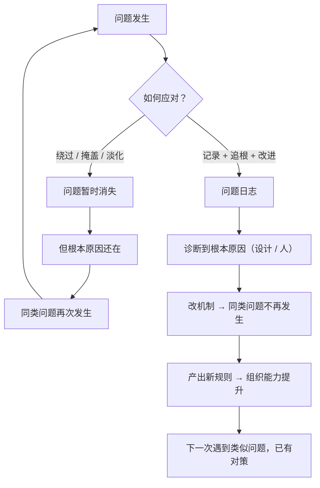

# 20｜问题日志与「不容忍问题」：如何让错误变成资产？

> 为什么桥水把「记录每一个错误」当成一项制度，而不是一次检讨？

---

## 一、先说结论

达利欧有一条工作原则：**「发现问题，且不容忍问题」**（Perceive and Don't Tolerate Problems）。

他不是把它当成一句口号，而是做成了制度：

> **问题日志（Issue Log）**——把每一个问题记录下来，追查根本原因，确保它被解决，而不是被绕过。

这背后的判断是一句很朴素但很锋利的话：

> **错误本身不可怕，重复的错误才可怕。一个组织真正的资产，不是从不犯错，而是能把每一次错误转化为一条新的原则。**

---

## 二、我们先理解一个问题

先看一个几乎在所有公司都会发生的现象。

同一个类型的问题，今年出现一次，明年又出现一次，三年后还在出现。每次开会都有人提，每次都说「下次注意」，然后就过去了。

更奇怪的是：**公司里明明有很多聪明人，为什么同一个坑会反复踩？**

> 是大家记性差吗？显然不是。那到底是什么让「教训」无法被积累？

---

## 三、作者到底提出了什么观点？

达利欧关于「问题管理」的论述，可以拆成五点。

**第一，发现问题是主动的，不是被动的。**

他指出，问题不会自己走到你面前。**大多数问题是「被正常运转掩盖着的」**——只有主动去看、去问、去对照产出与目标，你才能看见它们。

**第二，「容忍问题」是最危险的状态。**

他说，一个问题的真正处理方式不是「先放一放」，而是**立刻进入处理流程**。因为被容忍的问题不会消失，它只是换了个地方生长。

**第三，问题必须被记录。**

这是「问题日志」的核心。**记录的意义在于：它把问题从一个谈话中的模糊印象，变成了一个可以被追踪的对象。** 否则，它会随着会议的结束而消失。

**第四，记录之后必须追到根本原因。**

只记录症状没有用。**日志的价值在于逼你一直往下问，直到找到那个真正的原因。**

**第五，问题最终要变成「原则」。**

这是达利欧体系最关键的一环——**一条被解决的问题，应该产出一条新的规则或机制，从而让同类问题不再发生。**

---

## 四、把这个观点翻译成人话

我们用一个所有人都懂的场景：**一家公司总是出现「客户投诉」的同类问题。**

**没有问题日志的公司：**

客户投诉 → 客服道歉 → 补偿 → 事情结束。过两周，同样的投诉又来了。**每次都是「处理」，从来没有「解决」。**

**有问题日志的公司：**

1. **记录**：把每一次投诉写进日志——时间、客户、具体原因；
2. **分类**：一个月后回看，发现 60% 的投诉都指向同一件事——**「下单后没有告知预计到达时间」**；
3. **诊断**：为什么没有告知？——因为物流信息没有打通到客服系统；
4. **改进**：打通系统，客服端自动显示预计到达时间；
5. **产出规则**：以后所有新功能上线前，必须检查「客户关键信息是否可见」。

你看，第五步产生的那条规则，**才是这次日志真正的成果。** 它不是解决了「这一次投诉」，而是减少了**这一类投诉的未来发生率**。

**这就是「让错误变成资产」的含义：每一次错误都被兑换成一条以后自动生效的规则。**

---

## 五、为什么会这样？

为什么大多数组织无法积累教训？用一张图说明。

关键在于「绕过」这个分支为什么如此普遍。

有几个原因：

**第一，暴露问题会暴露人。**

很多问题追根到底，会指向某个人的失误、某个部门的失职、或者某个决策的错误。**于是大家心照不宣地选择「不深究」。**

**第二，解决问题需要资源，而绕过去不需要。**

真正修改一个流程、打通一个系统，都需要时间和成本。而「先安抚客户」「下次注意」几乎不花钱。

**第三，反馈延迟让绕过显得划算。**

如果同类问题要半年后才重现，那么「今天绕过去」在短期内就是「成功」。**这就是为什么「问题日志」必须记录时间——它把延迟的因果强制显性化。**

达利欧的整套设计，本质上就是在对抗这三个力量：**让记录成为义务、让追根成为流程、让改进成为产出。**

---

## 六、举一个现实生活中的例子

我们看一个个人层面的例子：**一个人总是「在大项目上拖延」。**

**没有日志的做法：**

每一次拖延之后，他痛苦、自责、发誓「下次一定提前」。但只记得那种模糊的羞愧感，**记不住具体是什么导致了拖延。**

**有问题日志的做法：**

他建了一个简单的表格，每次拖延都记一行：

| 日期 | 项目 | 拖延了多少天 | 当时卡在什么环节 | 当时的情绪/状态 |
|---|---|---|---|---|
| 3/2 | 报告 A | 4 天 | 不知道怎么开头 | 焦虑，逃避 |
| 4/15 | 报告 B | 6 天 | 数据不完整，等别人给 | 无力感 |
| 5/20 | 方案 C | 3 天 | 觉得做不好，反复修改 | 完美主义 |

三个月后回看，他会发现一个规律：

**真正的问题不是「我不自律」，而是「我在任务刚开始、需要判断方向时最容易卡住」。**

这时改进的方向就具体了：

- 不是「我要更努力」，而是**「接到任务的第一天，必须花 30 分钟写一个有缺陷的初稿」**——用「先粗糙后完善」来破解「方向不清」的焦虑；
- 或者**「接任务时先确认数据和上下游是否齐备」**。

你看，**日志把「我是个拖延的人」这个无法行动的自我评价，变成了「我在某个特定环节会卡住」这个可以行动的具体问题。**

这正是达利欧的核心方法：**把模糊的痛苦，换成精确的问题。**

---

## 七、回到书中重新理解

现在回头看达利欧的原话，注意他对「不容忍」的强调。

他说的不是「重视问题」，而是**不容忍问题**。这个词是有分量的——它意味着：**在心理上，你不能给问题发一张「可以存在」的通行证。**

因为一旦你接受「这个问题确实存在，但也没办法」，你就已经放弃了它。

他还强调，问题日志的作用不只是记录，而是**让问题一直留在视野里**，直到它被真正解决。**一个还没解决的问题，会一直挂在日志上，这就是它的压力机制。**

他还说过一句很重要的话，大意是：**一个组织是否健康，看它是否愿意面对自己的问题**。如果问题被掩盖得越少，这个组织就越可能在长期胜出。

---

## 八、这个观点背后还有什么？

**隐含前提一：组织允许暴露问题。**

如果暴露问题的人会被追责，那么日志就会变成形式主义——大家只记录无关痛痒的小事。**这是问题日志最常见的死法。**

**隐含前提二：问题可以被分类和量化。**

如果每个问题都很独特，就无法归纳出规律。**日志的价值，依赖于同类问题的重复出现。**

**隐含前提三：有资源去改进。**

记录和诊断之后，需要有人去改。如果组织永远「没时间改」，日志就会变成抱怨清单。

**与其他观点的联系：**
- 第 15 篇「极度求真」是问题日志能运作的**文化前提**；
- 第 19 篇「组织即机器」提供了**诊断框架**（设计 vs 人）；
- 第 23 篇「诊断根源」是问题日志的**核心工序**。

---

## 九、这个观点有问题吗？

有，值得注意的有四点。

**第一，问题日志有可能变成「甩锅清单」。**

如果记录的目的是追责，那么它会迅速变成政治工具——**谁记的多，谁看起来问题多。** 这会让人不敢记，或者只记别人的。

**第二，记录本身需要成本。**

每一个问题都记录、分类、追踪，工作量不小。**如果处理不好，日志会变成另一种形式主义。**

**第三，「不容忍问题」可能变成对团队的高压。**

不是所有问题都必须立刻解决。**有些问题是「可以接受的代价」，有些是「需要时间观察的」。** 一律不容忍，会让人精疲力尽。

**第四，它假设「问题都能被解决」。**

现实中，有些问题只能被管理、被缓解、被承受。**把所有问题都定位成「待修复的故障」，可能会造成不必要的自我否定。**

所以更务实的做法是：**把问题分成「必须解决」「可以缓解」「只能接受」三类，然后只对第一类做严格的追踪。**

---

## 十、今天再看这个观点

「问题日志」在今天有了一个非常自然的技术形态：**工单系统、缺陷追踪、复盘文档、监控告警。**

它们本质上都是达利欧问题日志的现代化版本——**把问题从人的记忆里搬到一个持续存在的系统中。**

而 AI 的加入，让这件事发生了一个质变：**系统不仅能记录，还能自动发现异常、自动分类、自动推测原因。**

这带来一个很有意思的推论：

> **过去，组织的问题日志依赖人的诚实；未来，问题日志可能先于人的意识而存在。**

换句话说，在 AI 时代，「隐藏问题」将变得越来越难——因为数据本身就是证人。

那么新的问题就变成了：**当问题无处可藏时，组织是会更健康，还是会更焦虑？** 这取决于组织处理问题的态度：**是把问题当作要消灭的敌人，还是当作改进的线索。**

这是**基于达利欧思想的现代延伸**。

---

## 十一、这一篇真正应该记住什么？

1. **发现问题是被动的等待，主动的对照才能看见问题。**
2. **「容忍问题」是最危险的状态——它让问题在暗处生长。**
3. **记录是问题管理的第一步：没有记录，问题就随会议一起消失。**
4. **日志的真正产出不是「解决了这一次」，而是「更新了规则，让同类不再发生」。**
5. **问题日志的关键风险是「用来追责」——一旦如此，它就会失效。**

---

## 十二、留一个问题

> 想一个你反复遇到、但每次都「算了、下次注意」的问题。
>
> 如果把它写下来、记录三次、然后追到根本原因——**你会不会发现，它其实从来不是「运气不好」，而是一个一直没被修的设计缺陷？**
>
> 下一篇，我们来讨论达利欧最受争议的一个主张——**「严格的爱」：为什么说真话才是真正的关心？**
