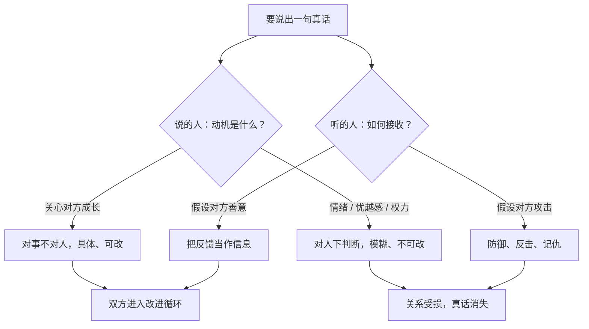

# 21｜严格的爱：为什么说真话才是真正的关心？

> 坦诚到近乎残酷的反馈，和真正的关怀，可以共存吗？

---

## 一、先说结论

达利欧用「**严格的爱**」（tough love）来描述桥水的相处方式。他的主张是：

> **真正的关心，不是让对方舒服，而是让他看清真相、变得更强。**

他还提出了两个他认为比赚钱更重要的目标：

- **有意义的工作**：一项我愿意全身心投入的使命；
- **有意义的人际关系**：我深深地关心对方，对方也深深地关心我。

把这两件事放在一起，就是「严格的爱」全部的张力和全部的危险：

> **它成立的唯一前提，是批评的动机真的出于关心，而不是出于优越感、情绪或者权力。**

---

## 二、我们先理解一个问题

先看一个所有人都经历过的两难。

你的一个好朋友做了一个明显错误的决定。你看得很清楚。

两个选项：

- **说出来**：他可能会难受、会生气、会觉得你不支持他；
- **不说**：他保住了当下的愉快，但会在错误里多走两年。

**你选哪个？**

如果选「不说」，你其实是在说：**「我希望你现在舒服，胜过希望你把事情做对。」**

但如果你选「说出来」，你怎么保证自己不是在借「为你好」的名义，发泄自己的判断欲？

> 这就是问题所在：**「为你好」这三个字，是最容易被滥用的。**

---

## 三、作者到底提出了什么观点？

达利欧关于「严格的爱」的论述，可以拆成五点。

**第一，把「让对方舒服」和「对对方好」分开。**

这两件事经常是相反的。**回避困难的对话，是一种短期的善意、长期的伤害。**

**第二，「严格的爱」要求双方都清楚，最终的目标是共同利益。**

达利欧说，桥水的反馈之所以能被接受，是因为大家（至少在理念上）知道：**批评不是为了打败你，而是为了让整个团队和你本人都更好。**

**第三，反馈要具体、要对事。**

「你这个人不行」不是反馈，是伤害。「你昨天那个方案里的第三个假设没有依据」才是反馈。

**第四，接受反馈的一方也有责任。**

达利欧认为，能不能听到真话，不只是说的人的义务，也是听的人的能力。**如果你一听到反对就防御，那么以后没人会跟你说真话——而这最终是你自己的损失。**

**第五，「有意义的人际关系」是严格的爱能够成立的土壤。**

这一点特别关键：**如果没有真实的关心作为底色，「严格的爱」就会退化成冷酷。**

---

## 四、把这个观点翻译成人话

我们用最直白的方式说清楚「严格的爱」和「伪严格的爱」的区别。

**真正的严格的爱：**

一个教练对运动员说：「你这个动作有问题，所以我们今天要重做两百次。我陪你做完。」

这句话里有三个元素：**指出了问题、提出了要求、并且站在你身边。**

**伪严格的爱：**

同一个教练说：「你这个动作根本不行，你这样一辈子也成不了运动员。」

这句话里有：**指出了问题、加上了对未来的否定、并且没有一起面对。**

两者的区别不在语气，而在**方向**：

- 真严格的爱，指向**「事情可以变好」**；
- 伪严格的爱，指向**「你这个人就这样了」**。

再换一个更生活的例子：

**真严格的爱**是：「你上次答应我的事没做到，这让我很失望，也让我对你的承诺打了折扣。我们聊聊为什么会这样，以及怎么补上。」

**伪严格的爱**是：「你就是这样的人，我早就看透你了。」

**一个在修理问题，一个在给人盖章。** 达利欧要的是前者。

---

## 五、为什么会这样？

为什么「严格的爱」难以推行？用一张图说明它需要的条件。

这里有三个必须同时成立的条件：

**第一，说的人动机要干净。**

如果批评里混进了「我早就说过」「看你出丑」的意味，它就变成了攻击。

**第二，听的人的自我要够稳。**

一个人在自尊不稳的时候，会把任何反馈都当作攻击。**这也是为什么达利欧把「承认自己的弱点」当成一项核心能力。**

**第三，环境要允许犯错。**

达利欧专门讲了一条原则：**「打造允许犯错、但不允许重复犯错的文化」**。因为如果犯错会被惩罚，那么所有人都只会做最安全的事——**而最安全的事，在这个世界上通常也是最没价值的事。**

这三个条件任何一个缺失，「严格的爱」都会退化。**这也是它在现实中如此罕见的原因。**

---

## 六、举一个现实生活中的例子

我们看一个职场里最难的场景：**一个下属能力不达标，要不要直说？**

**不说的版本**：「他态度还不错，先留着吧。」

结果是：

- 这个人一直不知道自己不合格；
- 他在这个岗位上越来越难受，因为总是被暗示、被边缘化；
- 别的同事要替他补漏，对他积怨；
- 最后他被辞退，而且完全不知道自己做错了什么。

**「伪严格的爱」的版本**：「你这人就是不行，我看不到你留在这里的价值。」

结果是：对方感到被羞辱，自尊受挫，但**依然不知道自己具体该改什么。** 因为这句话里没有可执行的信息。

**「严格的爱」的版本**：

> 「我想和你直接聊一件事。过去三个月，你负责的 A 和 B 两项都没有达到预期：A 延期了两次，B 的返工率是团队里最高的。
>
> 我观察到，主要的问题似乎是你在做之前没有把需求确认清楚。这是可以改的。我想给你一个机会：接下来一个月，每个任务开始前，你先把需求复述一遍给我或同事确认。如果一个月后还是这样，我们再讨论这个岗位是不是适合你。
>
> 我很在意你能不能做好，所以我不想用『看你表现』这种模糊的话拖着。我们现在就把话说清楚。」

请注意这段话的结构：

- **事实**（延期两次、返工率高）；
- **原因假设**（需求没确认清楚）——**并且承认这只是假设**；
- **具体的改进方案**（每个任务开始前复述需求）；
- **明确的时间与后果**（一个月后重新评估）；
- **动机的说明**（我很在意你能不能做好）。

这个版本和另外两个版本最大的区别是：**它给了对方一个可以行动的机会，而不是一个判决。**

**这就是「严格的爱」在实践中的样子——它不温柔，但它是建设性的。**

---

## 七、回到书中重新理解

现在回头看达利欧的原话，会注意到他反复强调的一件事：

**「有意义的人际关系」和「严格」并不矛盾，反而是彼此的支撑。**

他的逻辑是：如果两个人之间只有工作、没有关系，那么严格就会显得冷；但如果两个人真的互相在意，那么严格反而是**最负责任的表达方式**——因为你不愿意看着对方在错误里浪费生命。

他还提出一个很实用的标准：**你能不能坦率地指出一个同事的问题，同时不影响你们继续合作？** 如果能，说明你们的关系是健康的；如果不能，说明你们的关系里其实没有多少信任。

另外，他承认这件事很难做好。他提到过自己也曾因为过于直率而让人受伤，甚至被认为「不近人情」。**这说明「严格的爱」在实践中需要不断的校准，而不是一个一次性的立场。**

---

## 八、这个观点背后还有什么？

**隐含前提一：人可以在被批评时不崩溃。**

这需要相对稳定的自我。达利欧的方法隐含了对心理强度的要求，而这本身会筛选出一批人、也劝退一批人。

**隐含前提二：批评者真的了解对方。**

如果批评者只是从自己的角度判断，他的「真话」可能只是他的一种偏见。**「严格的爱」要求批评者足够了解被批评者的处境。**

**隐含前提三：组织不奖励「温和的沉默」。**

如果一个组织里，和气的人更受赏识、说真话的人被边缘化，那么「严格的爱」只能是个人的选择。

**与其他观点的联系：**
- 第 15 篇「极度求真」是「严格的爱」的**文化来源**；
- 第 16 篇「极度透明」是它的**制度载体**；
- 第 22 篇「用对人」与它相互依赖：**没有对的人，严格的爱就会变成伤害。**

---

## 九、这个观点有问题吗？

有，而且这一条的争议非常真实。

**第一，「严格」和「伤害」的界线由谁划定？**

说的人往往认为自己是在「严格」，听的人可能感受到的是「羞辱」。**这条界线不在说话者的意图里，而在接收者的感受里。** 达利欧的体系对这一点处理得不够充分。

**第二，「严格的爱」可能掩盖权力关系。**

在一个权力不对等的环境里，上司的「严格的爱」可能变成持续的压力。**下属没有「不接受」的权利，那么这就不是爱，是权力。** 真正的问题是：**被批评的人能不能反过来批评批评者？**

**第三，它可能变成「文化适配」的筛选。**

能够适应高强度直率反馈的人，往往有特定的性格。**这套文化可能在无意中排斥了内向、敏感、含蓄但有才华的人。**

**第四，它需要一个非常成熟的领导者。**

推行「严格的爱」的人，自己必须是能接受严格反馈的人。**如果领导者自己不能被挑战，那么这套文化就是双标的。**

所以更负责的说法是：**严格的爱只有在「双向、对事、有出口」的前提下才成立。** 一旦变成单向的、人格性的、没有出路的批评，它就不再是爱。

---

## 十、今天再看这个观点

「严格的爱」在今天有一个非常具体的对照：**AI 反馈 vs 人的反馈。**

AI 可以做到「极度求真」，因为它不在乎你的感受。它可以指出你方案里的每一个漏洞，而且不带任何情绪。

但它做不到「严格的爱」的另一半——**它不在乎你会不会变好，它只是指出问题。**

这恰恰反过来说明了一件事：

> **「严格」可以外包给机器，「爱」不能。**

未来最珍贵的人际能力，可能不是「说出真话」（AI 更擅长），而是**「在说出真话之后，还愿意陪着对方一起改」**。

这是**基于达利欧思想的现代延伸**。

---

## 十一、这一篇真正应该记住什么？

1. **真正的关心不是让对方舒服，而是让他看清真相并变得更强。**
2. **「严格的爱」和「伪严格的爱」的区别：前者指向「事情可以变好」，后者指向「你这个人就这样」。**
3. **好的反馈必须具体、对事、可执行，并且给出时间与出口。**
4. **它能成立的条件：说的人动机干净、听的人自我稳定、环境允许犯错。**
5. **如果被批评的人不能反过来批评，那就不是爱，而是权力。**

---

## 十二、留一个问题

> 回想一次你本可以给出，但最终没有给出的真话。
>
> 当时你没有说，是因为**真的为他好**，还是因为**说出来的代价对你来说太高**？
>
> 下一篇，我们来看达利欧如何把「评价人」也系统化——**为什么他坚持「性格比技能重要」，以及那把有名的「棒球卡」是什么。**
