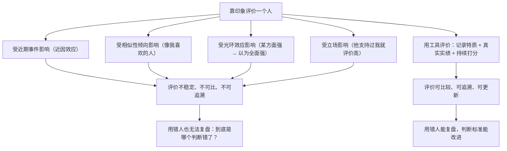

# 22｜用对人：为什么「性格比技能重要」？——棒球卡与集点器

> 招人时看能力还是看性格？达利欧为什么说「谁来做」比「做什么」更重要？

---

## 一、先说结论

达利欧有一条著名的工作原则：**「比做什么事更重要的是找对做事的人」**（Remember that the Who is more important than the What）。

由此推出两个具体判断：

**第一，选人时，价值观和性格比技能更重要。**

因为技能可以培训，而性格极难改变。**一个技能强、但价值观不合的人，会把整个系统带偏。**

**第二，要用工具，把「评价人」从印象变成数据。**

桥水为此做了一组非常有名的管理工具：

- **棒球卡（Baseball Cards）**：像棒球卡一样，记录每个人的特质、强项、弱点和实绩；
- **集点器（Dot Collector）**：在会议中，参与者对彼此的发言实时打分；
- **问题日志 / 分歧解决器等**：用来记录问题、处理分歧。

这些工具的共同目标只有一个：**让「谁在哪方面更可信」这件事，变得可观察、可积累、可检验。**

---

## 二、我们先理解一个问题

先看一个几乎所有管理者都会犯的错误。

招人时，一位候选人履历极好、技能极强、面试表现极其出色。你几乎立刻就决定了：「就是他。」

入职半年后，你发现：

- 他和团队的协作方式完全不合；
- 他坚持自己的做法，从不接受反对意见；
- 他的产出质量很高，但整个团队的氛围变差了。

于是问题来了：

> **明明招到的是「最优秀的人」，为什么结果是「最差的选择」？**

---

## 三、作者到底提出了什么观点？

达利欧关于「用对人」的论述，可以拆成五点。

**第一，技能是可以教的，性格是难改的。**

这是整个逻辑的地基。达利欧认为，在招聘时，你要优先判断的是**这个人的价值观、思维方式、对真相的态度**，因为这些几乎决定了长期协作的成败。

**第二，价值观不合的代价，远超技能不足的代价。**

一个「技能差一点但认同原则」的人，可以被培养；一个「技能很强但不认同原则」的人，会持续制造摩擦和破坏。**而且往往是后者更难处理，因为他有业绩作为护身符。**

**第三，招错人的代价极高。**

达利欧说得很重：**「用错人的代价是巨大的」**——不仅是工资和时间的浪费，更是团队的士气、机会的错过、以及错误决策的连锁影响。所以他主张：**招人必须严格，宁可慢，不能错。**

**第四，要把对人的评价数据化。**

这里出现了桥水最有特色的工具：

- **棒球卡**：给每个人建立一份像球星卡一样的档案，记录特质、能力、实绩、短板。**它的作用是让「这个人在哪方面强」变成可以查阅、可以比较的信息，而不是靠印象。**
- **集点器**：在会议中，参会者可以对彼此的发言（比如「逻辑性」「是否有数据支撑」「是否有建设性」）实时打分，最后汇总成每个人在不同维度的数据。

**第五，要持续培训、测试、评估和调配。**

达利欧不认为一次招聘就能定终身。他强调，用人的过程是一个持续的循环：**培训 → 观察 → 评估 → 调整位置。** 有些人不是不好，而是放错了位置。

---

## 四、把这个观点翻译成人话

我们用一个特别容易理解的类比：**组一支足球队。**

假设你要签一个球员。他的射门技术世界顶级，但他的问题是：**不传球、不听教练、和队友冲突不断。**

**只看技能的判断**：签他！技术这么好，怎么可能不要？

**看性格和价值观的判断**：先想清楚——我们这支球队的踢法需要什么？如果我们的体系依赖团队配合，那么一个不愿传球的天才，会**让整个体系失效**。他的个人数据可能很漂亮，但球队的战绩会下降。

**这就是达利欧说的「Who is more important than the What」。**

再想一层：**为什么「技能容易教，性格难改」？**

因为技能是一套可以直接训练的动作；而性格是一整套**深层的反应模式**——遇到批评时是否防御、遇到失败时是找借口还是找原因、面对规则时是钻空子还是遵守。这些模式是在一个人几十年的经历里形成的，**改起来需要数年，甚至改不掉。**

所以在招聘这个「只有几小时观察窗口」的场景里，**最理性的策略就是：先确保性格和价值观匹配，然后再看技能能不能补上。**

如果你反过来做——先看技能，再指望性格能磨合——**你赌的是一个成功率很低的事件。**

---

## 五、为什么会这样？

为什么「评价人」需要工具？为什么靠印象不行？用一张图说明。

这里的核心是最后两步：**能不能复盘，决定了这套评价体系会不会进化。**

达利欧的「棒球卡」和「集点器」不是为了给员工打分排名（虽然它确实会带来这种效果），而是为了让**「我们对一个人的判断」这件事，本身成为一个可以被检验的对象。**

比如，如果一个人连续两年在集点器里的「逻辑性」得分很高，但实际决策质量很差，那么**就说明这个打分维度本身有问题**，需要修改。这正是我们第 13 篇讲的「把决策写成算法」在人事上的应用。

---

## 六、举一个现实生活中的例子

我们看一个真实的招聘场景：**一家创业公司要招一个技术负责人。**

**只看技能的版本：**

候选人是名校毕业、大厂背景、技术很强、面试能答出所有问题。公司当场决定录用。

半年后：他的技术确实强，但他坚持用自己熟悉的技术栈，拒绝团队已有的方案；他不愿意做代码评审，觉得是浪费时间；他和产品经理的关系紧张。

结果：技术负责人做对了几个技术决定，但团队流失了两个人，产品进度反而更慢。

**看性格和价值观的版本：**

公司在面试时就明确了几条「不可谈判」的特质：

1. **愿意接受反对意见**（用具体场景测试：「讲一次你被下属说服、改变了原计划的经历」）；
2. **愿意让团队变得更强，而不是证明自己最强**（「你如何培养过一个比你更懂某个技术的人？」）；
3. **对真相的态度**（「讲一次你发现自己的技术判断是错的，你当时做了什么」）。

技能依然重要，但**顺序是：先确认这三条，再看技能。**

结果可能相反：招到的人技术不是最顶尖的，但他建立了评审机制、让团队成长、并且愿意在关键决策上听取不同意见。**半年后，团队的交付能力和士气都在提升。**

达利欧的赌注是：**在这个例子中，后者的长期价值远高于前者。**

---

## 七、回到书中重新理解

现在回头看达利欧的原话，会发现一个很有意思的结构。

他在工作原则里，把「用对人」单独作为一大块（第 7-9 条：找对做事的人、要用对人、持续培训与评估），而且位置非常靠前——**在「建造并进化机器」之前。**

这个顺序说明了他的判断：

> **机器是由人组成的。所以「选对零件」比「设计流程」更根本。**

因为**流程是用来约束和放大人性的**，而如果人性本身与系统冲突，再好的流程也会被绕过。

他还强调，「**要用对人，因为用人不当的代价高昂**」——注意是代价，不是风险。**风险是可能发生，代价是一定会付。** 一次错误的招聘，会持续消耗团队数年。

而所有的工具（棒球卡、集点器），本质上都是在为「选对人」和「用对人」服务：**它们让组织有能力不再凭感觉判断一个人，而是凭记录、凭实绩、凭多方视角。**

---

## 八、这个观点背后还有什么？

**隐含前提一：性格可以被描述和识别。**

如果性格完全无法观察，那「性格优先」就无法操作。达利欧依赖性格评估和结构化面试——**而这些工具的有效性本身就有争议。**

**隐含前提二：组织有能力持续评估与调配。**

「棒球卡」「集点器」需要长期的数据积累和组织投入。**没有这个投入，工具就会流于形式。**

**隐含前提三：人愿意接受「被评价」。**

持续被评分、被记录，对很多人来说是压力。**它需要一种愿意被检验的文化——这正是极度透明的一部分。**

**与其他观点的联系：**
- 第 11 篇「人与人天生不同」是这一条的**认知基础**；
- 第 17 篇「可信度加权」是这一条的**决策延伸**；
- 第 19 篇「组织即机器」中的「人」，就是这一条要处理的**零件**。

---

## 九、这个观点有问题吗？

有，而且这一条涉及的问题很敏感。

**第一，「性格评估」可能变成标签化和歧视。**

用一个量表来定义「这个人是什么类型」，可能会固化偏见。**如果评估工具本身带有文化或背景偏向，它就会成为筛掉「不一样的人」的合法借口。**

**第二，「连续打分」可能制造表演型文化。**

当人们知道自己在被实时打分时，他们可能会优化「表现得可信」，而不是「真的做出正确判断」。**这将严重扭曲数据的真实性。**

**第三，「性格比技能重要」在有些岗位不成立。**

对于一个高度专业、难以培训的岗位（比如顶级外科医生、资深算法工程师），**技能本身可能就是硬门槛**，「先看性格」并不现实。

**第四，工具化评价人，可能损害信任。**

不是所有团队都适合用「集点器」这种直白的方式互相打分。**在很多文化里，这会直接摧毁团队的安全感。**

**第五，「用人不当」的责任分配问题。**

如果一个人被招进来、放到错误的位置、表现不佳——**这到底是「他不行」，还是「组织用错了」？** 达利欧倾向于后者，但现实中，代价通常由个人承担。

所以更谨慎的说法是：**用对人非常重要，但「评价人的工具」最容易变成权力的工具。它需要透明、双向、并且允许被质疑。**

---

## 十、今天再看这个观点

达利欧「把对人的评价数据化」的想法，在今天几乎完全实现了——只不过场景换了。

- 招聘平台用算法筛选简历；
- 绩效系统用数据打分；
- 企业用行为数据分析员工；

技术在能力上已经远超「棒球卡」和「集点器」。但它也把达利欧早已存在的风险**放大了十倍**：

> **当评价系统不透明时，被评价的人无法知道「为什么我得到这个结果」，也无法申诉。** 这比达利欧的「公开打分」更糟——**它连「透明」这层保护都失去了。**

所以，达利欧原则在这个话题上有一个非常现实的提醒：

> **评价人的工具，必须对人可见、可讨论、可挑战。否则它就不是管理工具，而是控制工具。**

这是**基于达利欧思想的现代延伸**。

---

## 十一、这一篇真正应该记住什么？

1. **「谁来做」比「做什么」更重要——机器是由人组成的。**
2. **技能可以培训，性格极难改变；所以先匹配，再培养。**
3. **用错人的代价是「一定会付」，而不是「可能发生」。**
4. **把人从印象变成记录（棒球卡、集点器），是为了让「评价」本身也能被检验。**
5. **评价工具最容易变成权力的工具——它必须透明、双向、可质疑。**

---

## 十二、留一个问题

> 回想你身边最难合作的那个人。他的问题，是**技能不足**，还是**性格与价值观不匹配**？
>
> 如果答案是后者——那么反过来问自己：**如果这个人是你招进来的，你当初看的是什么？**
>
> 下一篇，我们来讲达利欧的「维修工序」——**如何诊断问题的根本原因，避免「头痛医头」。**
