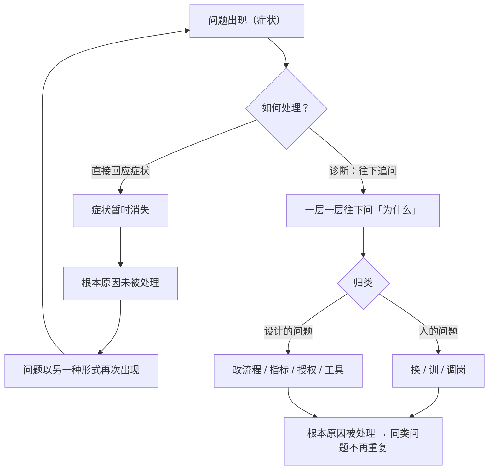

# 23｜诊断根源：如何避免「头痛医头」？

> 为什么大部分「解决问题」的努力，其实只是在压制症状？

---

## 一、先说结论

在达利欧的机器管理里，有一个环节被单独、重点地拎出来：

> **诊断（diagnose）——发现问题之后，不要急着改，先往下追问到根本原因。**

他的核心判断是：

> **一个反复出现的问题，通常不是「执行不力」，而是设计缺陷、岗位错配或文化问题。**

所以在改之前，必须先回答：**这到底是「人的问题」还是「设计的问题」？**

诊断的质量，决定了后面所有改进动作是否有效。**诊断错了，越努力越糟。**

---

## 二、我们先理解一个问题

先看一个几乎每个公司都做过的动作。

业绩下滑 → 开会 → 结论是「要加强管理、提高执行力」→ 增加汇报、增加考核、增加会议。

三个月后：业绩没变，但大家都更累了。

于是问题来了：

> **为什么「加强管理」这种看起来最对的反应，往往完全无效？**

---

## 三、作者到底提出了什么观点？

达利欧关于诊断的论述，可以拆成五点。

**第一，诊断要单独进行，不能和「开药」混在一起。**

他指出，很多人在发现问题后，会直接进入「我该怎么办」。**但如果你对病因的判断是错的，后续所有动作都是浪费。**

**第二，诊断要往下追问，直到触及根本。**

他把这称为「**探究根源**」（get at their root causes）。**症状往往是表面的，根本原因通常在别的层次。**

**第三，要区分「人的问题」和「设计的问题」。**

这是达利欧最实用的一条分类：

- **人的问题**：能力、性格、动机、匹配度 → 解法是换人、培训、调岗；
- **设计的问题**：流程、指标、授权、工具、结构 → 解法是改机制。

**误判这两类，是最常见的昂贵错误。**

**第四，诊断要由「不在问题里」的人来做。**

达利欧强调，**身处问题中的人，往往看不到根本原因**——因为他自己就是原因之一，或者他的视角被局限住了。**可信度高、且相对客观的人来做诊断，质量更高。**

**第五，诊断的结论要落到「机器」层面。**

这意味着：诊断的结果不应该只是「这次怎么补救」，而应该是「这台机器哪里需要改」。**这样同类问题才不会重复发生。**

---

## 四、把这个观点翻译成人话

我们用一个最日常的类比：**一个人反复头疼。**

**不诊断，直接吃止痛药**：头不疼了，但问题还在。
**不诊断，说是「你太累了，多休息」**：听起来很对，但可能完全没抓住病因。

**诊断式的做法**，会这样往下问：

- 头疼（症状）
- ↓ 什么时候疼？——**每天下午三点左右**
- ↓ 那个时间发生了什么？——**通常是我一整天没喝水、也没吃东西**
- ↓ 为什么会这样？——**因为我的工作节奏是「上午连轴转、下午继续硬撑」**
- ↓ 根本原因：**我的工作节奏设计里，没有安排补给和休息的节点**

于是真正的解法不是「吃点药」，而是**在每天的节奏里，硬性插入补水和吃饭的时间**。

**注意这个结论的形状：它是一个「设计问题」，而不是「身体不好」。**

这就是诊断的全部意义：**把一个模糊的、反复出现的痛苦，转变成一个具体的、可以被修改的机制。**

---

## 五、为什么会这样？

为什么人总是停在症状层？用一张图说明。

现在回答「为什么人总是停在症状层」，有三个原因：

**第一，症状最可见、最急、最有压力。**

症状会立刻带来痛苦（客户投诉、老板发火、数据难看），所以你会本能地先去处理它。**处理症状有即时反馈，这让人感觉「有效」。**

**第二，追根需要直面「设计是错的」或「我用错人了」。**

这两个结论都很痛。**承认「我的流程一直有问题」，比买一盒止痛药难得多。**

**第三，诊断需要时间和视角。**

身处其中的人，往往太贴近问题，看不清楚。**这也正是达利欧强调「由不在问题里的人诊断」的原因。**

---

## 六、举一个现实生活中的例子

我们看一个非常典型的团队问题：**「会议太多，效率很低」。**

**症状层的处理**：把会议从 60 分钟压缩到 30 分钟。

结果：会还是那么多，只是每个会更赶，问题依然没解决。

**诊断式的处理**，会这样往下剥：

| 层次 | 追问 | 回答 |
|---|---|---|
| 症状 | 会议太多 | 平均每天 4 小时在开会 |
| 一层原因 | 为什么开这么多会？ | 因为很多事情不确认就推进不下去 |
| 二层原因 | 为什么不确认就推进不下去？ | 因为责任边界不清楚，谁也不敢拍板 |
| 三层原因 | 为什么边界不清楚？ | 因为项目组织是「按职能划分」，没有明确的项目负责人 |
| 根本原因 | **组织设计的缺陷** | 缺少「单一责任主体」 |

现在看结论：**这是一个设计问题，不是「大家沟通不够」的问题。**

于是正确的解法是：设立明确的项目负责人、明确每个决策的归属。**会议数量会自然下降，因为大家不需要反复确认。**

**如果一开始就误判成「人的问题」**（比如「大家没有时间观念」），那么可能会去培训时间管理、强制缩短会议——**而根本原因毫发无伤。**

**这就是达利欧说的：误判「人」和「设计」，是最昂贵的错误。**

---

## 七、回到书中重新理解

现在回头看达利欧的原话，会注意到他在诊断这一步上花了特别多的笔墨。

他把诊断放在了「像操作机器一样管理」这个框架的正中央：**发现问题 → 诊断根源 → 改进机器 → 执行 → 工具**。**诊断是承上启下的那一步，没有它，后面的动作没有方向。**

他还特别强调，诊断要**诚实、深刻、并且愿意承认自己**。因为很多时候，根本原因会指向管理者自己的决策——**比如「我当初的这个设计本身就有问题」。**

另外，他提到一个很实用的方法：**把问题的产出（results）画出来，然后反推「是什么样的机器产生了这个产出」。** 这其实是一种「逆向工程」思维：不是从「我该做什么」出发，而是从「什么机制会产生这个结果」出发。

---

## 八、这个观点背后还有什么？

**隐含前提一：问题有可追溯的因果链。**

如果问题是纯随机的，「追根」就没有意义。达利欧相信组织行为有可分析的因果。

**隐含前提二：有时间做诊断。**

在紧急情况下，你往往必须先处理症状、再回来诊断。**诊断是一种「有资源才能做」的奢侈。** 达利欧的方法更适合那些「可以停下来想」的组织。

**隐含前提三：组织愿意接受「设计是错的」。**

如果诊断的结论总是被理解为「谁的责任」，那么大家会倾向于把诊断做得浅一点。**这也是为什么诊断需要「极度求真」的文化托底。**

**与其他观点的联系：**
- 第 08 篇的五步法里，「诊断」是第三步——**分析层面的操作**；
- 第 19 篇的「设计 + 人」提供了**归类的框架**；
- 第 20 篇的问题日志提供了**诊断的原材料**。

---

## 九、这个观点有问题吗？

有，主要有这几点。

**第一，「追根」可能无限追问下去。**

每件事都可以再往下问「为什么」，追到最后可能是「因为人性如此」「因为市场如此」。**诊断需要知道在哪里停下来——停在那个「你还能够改」的层面。**

**第二，「人的问题」和「设计的问题」往往纠缠在一起。**

最真实的情况通常是：**设计有问题，人也放错了位置，而人的问题又是因为设计造成的。** 二分法在理论上清晰，在实践中常常需要同时处理。

**第三，由「不在问题里的人」诊断，可能失真。**

旁观者更客观，但他可能不了解现场的复杂性，容易做出「何不食肉糜」式的判断。**所以更合理的做法可能是：由「外部客观者 + 内部知情者」共同诊断。**

**第四，「根本原因」这个说法，可能让人过度简化。**

复杂的系统性问题，往往没有单一的根本原因，而是多个因素共同作用。**执着于「找到唯一根源」，可能会漏掉更重要的互动关系。**

---

## 十、今天再看这个观点

达利欧的「诊断根源」，在今天有了一个强大的技术工具：**数据分析。**

过去需要靠人反复追问才能发现的规律，现在可以通过数据挖掘发现：

- 流失率高的真正原因，可能藏在某个不显眼的入职环节；
- 业绩波动的真正原因，可能藏在某类客户的某个特征里；
- 质量问题反复出现，可能指向某个供应商的某个批次。

**AI 极大提高了「发现根本原因」的效率。**

但这里有一个非常达利欧式的提醒：

> **数据能告诉你「相关」，但不能告诉你「该怎么办」。**

在「相关」和「因果」之间，在「发现原因」和「判断这是人的问题还是设计的问题」之间，**仍然需要人的判断。**

而且更重要的是——**当 AI 说「根本原因是 A」时，谁来验证它？** 这又回到了达利欧的核心主张：**任何判断标准，都必须能被质疑和检验。**

这是**基于达利欧思想的现代延伸**。

---

## 十一、这一篇真正应该记住什么？

1. **诊断要单独进行——不要一边诊断一边开药。**
2. **要往下追问到根本，但停在「你还能改」的那一层。**
3. **关键是区分「人的问题」和「设计的问题」——误判是管理中最昂贵的错误。**
4. **诊断最好由「不在问题里的人 + 了解现场的人」共同完成。**
5. **诊断的结论要落到「机器」层面，否则同类问题还会重复。**

---

## 十二、留一个问题

> 挑一个你正在反复处理的麻烦。它的「症状」是什么？往下问五次「为什么」，最后停在哪里？
>
> 那个落点，是**人的问题**，还是**设计的问题**？
>
> 下一篇，我们进入最后一部分——**达利欧的体系有什么问题？为什么它值得学，但不该被当成真理。**
