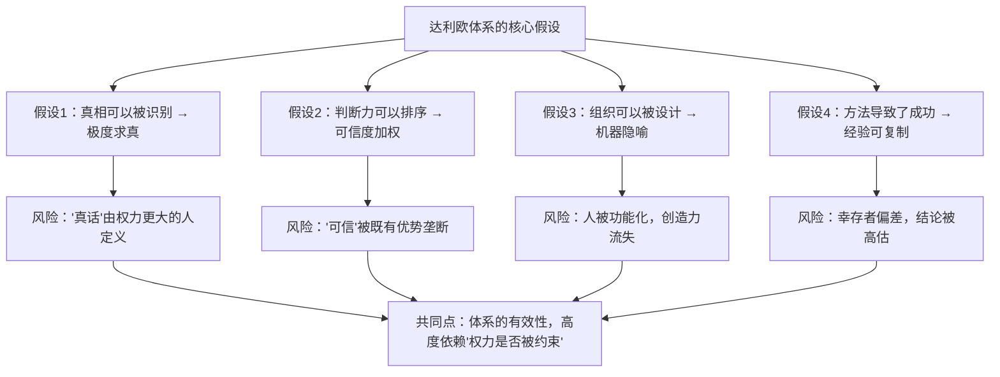

# 24｜达利欧的体系有问题吗？——争议与批评

> 一套被反复宣称「有效」的方法，可能在哪里失效？

---

## 一、先说结论

《原则》是一本值得认真读的书，但它不是一本可以照搬的真理手册。它至少有五个被反复质疑的地方：

1. **极度透明可能演变成监控与高压文化；**
2. **可信度加权可能固化既有的权力与光环效应；**
3. **「机器」隐喻可能过度简化了人的复杂性；**
4. **成功者的后见之明，很难区分「方法有效」和「时代与运气」；**
5. **这套体系高度依赖达利欧本人，它的可继承性本身就是一个疑问。**

所以，这一篇想建立的态度不是「达利欧对不对」，而是：

> **读这类书时，最重要的能力是——既能从中拿走真正有用的东西，又不把作者的光环当成免检证明。**

---

## 二、我们先理解一个问题

先看一个很有意思的现象。

同样一本《原则》：

- 一个刚入职场的年轻人读完，觉得「太复杂了，好像什么都说了，又好像什么都没说」；
- 一个创业者读完，觉得「这就是我要的管理圣经」；
- 一个在高压公司受过伤的人读完，觉得「这不就是在美化控制吗」。

**一本书，三种完全相反的收获。**

> 那么问题是：我们该如何判断，这本书里的哪一部分值得学、哪一部分必须警惕？

---

## 三、作者到底提出了什么观点？

严格来说，这一篇要呈现的不是达利欧的观点，而是**对达利欧观点的几类主要批评**。我们把它整理成五个方向。

### 批评一：极度透明 = 监控？

支持者说：透明让信息不失真、责任更清晰。
批评者说：**当上级可以查看一切、而下属无法查看上级时，透明就变成了单向的监控。**

这个批评很难反驳，因为它的核心是**权力对称性**：透明本身没有方向，但权力有。

### 批评二：可信度加权 = 精英固化？

支持者说：让更可能对的人有更大话语权，决策质量更高。
批评者说：**「可信度」由谁定义？过去的成功会不会自动转化为未来的特权？**

在一个快速变化的行业里，**过去的成功经验，有时恰恰是最需要被挑战的东西。**

### 批评三：「机器」隐喻是否简化了人？

支持者说：把组织当机器，能系统地改进。
批评者说：**人不是零件。人有情绪、有尊严、有离开的自由、有非理性的价值追求。**

当一切都被"功能化"之后，组织可能在可测量的维度上极其高效，在不可测量的维度上极其脆弱。

### 批评四：幸存者偏差

支持者说：达利欧用这套方法成功了四十年。
批评者说：**我们只看到了一个成功的样本。** 同样的方法，可能有很多人用过，只是没有成功，因此没有出书。

而且，达利欧的成功发生在**一个特定的时代、特定的市场、特定的行业**。把它推广到所有人、所有行业，逻辑上并不成立。

### 批评五：可继承性存疑

支持者说：这套体系已经在桥水运行了几十年。
批评者说：**它能运行，很大程度上是因为达利欧本人愿意接受挑战、并且拥有不可动摇的权威。**

一旦创始人离开，同样的制度在别人手里，可能迅速退化成形式主义，甚至变成权力工具。

---

## 四、把这个观点翻译成人话

我们用最直白的语言说清楚这五个批评的意义。

**批评一的意义**：想象一个班级。

如果老师说「我们班要完全透明，所有同学的作业、成绩、评语全部公开」——
- 如果老师的教案、考核标准、对每个学生的评价理由也公开，这是透明；
- 如果只有学生的表现被公开，老师怎么打分完全不说，**这就是监控。**

**批评二的意义**：想象一个公司。

如果「可信度」= 在这个公司做对过很多次，那么新来的人永远拿不到高权重。**久而久之，公司里说话的人，永远是同一批人。** 而颠覆性的判断，往往来自「不在这套体系里」的人。

**批评三的意义**：Imagine 一个团队。

如果一个管理者只把成员当零件：不问「他最近状态怎么样」，只问「产出达标了吗」——**短期可能很高效，但长期会流失那些最需要被理解、也最有创造力的人。**

**批评四的意义**：这就像「成功学」的逻辑——

一个考进名校的人说「我是因为每天 5 点起床才成功的」。但**每天 5 点起床却没考进名校的人，我们看不到。** 达利欧的方法可能确实有效，但「有效」的程度，一定低于从结果反推的印象。

**批评五的意义**：一套制度的生命力，不在于它能在一个强势创始人手里运行，而在于**它能不能在普通人手里继续运行。**

---

## 五、为什么会这样？

为什么一个看起来逻辑严密的体系，会有这么多批评？我们用一张图来看它的结构性张力。

这张图想说明一个核心判断：

> **达利欧的每一个机制，在「权力受约束、信息双向流动」的环境里都很有效；在「权力不受约束」的环境里，都会退化成控制的工具。**

这不是说达利欧的方法错了，而是说——**它是一套「有前提的方法」，而这些前提在现实中经常不成立。**

达利欧自己其实也意识到了这一点。他反复强调「可信度」应该用实绩和逻辑来判断，也承认不同意见的重要性。**问题在于：这些保证，在制度上很难长期维持。**

---

## 六、举一个现实生活中的例子

我们看一个很多人可能听说过的现象：**一家公司模仿桥水文化，然后失败。**

假设有一家互联网公司，创始人读了《原则》之后非常激动，决定推行：

- 所有会议录音；
- 员工可以互相打分；
- 鼓励「极度坦诚」的批评；
- 用「可信度」来分配发言权。

**半年后的结果可能是：**

- 录音让所有人变得谨慎，会上说的都是「安全的话」；
- 互相打分变成了站队工具——**和谁关系好，谁的分就高**；
- 「极度坦诚」变成了几个强势员工的攻击许可证，其他人不敢说话；
- 「可信度」由创始人和他的亲信定义，结果还是他们说了算。

最终：**这套制度没有让公司变得更好，反而让它变得压抑和虚伪。**

**为什么会这样？** 因为这家公司缺少了桥水的一些隐性条件：

- 达利欧本人在文化上是「能被挑战的」；
- 有长期的记录系统来判断「谁真的更可信」；
- 有足够的资源和安全感，让员工可以承受压力。

**这家公司照搬了「制度」，却没有复制「条件」。**

这就是这一篇想说的最关键的一点：**读《原则》，最危险的方式不是反对它，而是把一个「有前提的方法」，当成一把「无条件的万能钥匙」。**

---

## 七、回到书中重新理解

现在回头看达利欧的原话，会发现他其实比很多读者更清醒。

他在开场就说过：他把这些原则写出来，是希望读者**自行判断、各取所需**。

他也说过，这些原则是**他个人和桥水的**，不是普遍规律。

他甚至在书里坦率地写下自己犯过的错误、自己的局限、以及他仍在学习的部分。**这种诚实，恰恰是这本书最值得学习的地方——不是那些条款，而是那种态度。**

所以，我们在这一篇得出的结论不是「本书不可信」，而是：

> **它是一本「经验之书」，不是一本「真理之书」。读它的正确姿势是——拿来用、去检验、允许它错。**

这也正好呼应了达利欧自己的核心主张：**任何原则都必须能被检验，包括他写的这些原则。**

---

## 八、这个观点背后还有什么？

**隐含前提一：批评者也需要有依据。**

不是所有批评都成立。「它太西方了」「它太功利了」这类判断，需要更具体的论证才站得住。

**隐含前提二：不同领域适用性不同。**

这一篇的批评，主要针对「组织管理」层面。在**个人层面**，达利欧的方法（拥抱现实、痛苦+反思、五步法）受到的质疑要小得多，因为它们更接近通用的学习原理。

**隐含前提三：拒绝照搬不等于拒绝学习。**

批评的目的是校准，不是否定。

**与其他观点的联系：**
- 第 18 篇讲「深思熟虑的意见分歧」时，其实就已经给出了处理这些批评的方法：**不要把分歧当成攻击，而要当成信息**；
- 第 25 篇会讨论，如果达利欧的体系在今天被算法化和 AI 化，这些风险会如何变化。

---

## 九、这个观点有问题吗？

这一篇本身也需要被检查。

**第一，把批评集中在一起，可能造成「印象化的否定」。**

列了五条批评，并不等于达利欧的体系「不成立」。**每一条批评都只适用于特定条件，需要在具体场景中判断。**

**第二，批评者也可能有幸存者偏差。**

那些「用了类似方法而失败」的案例，我们同样看不到。**所以批评和辩护，都面临同样的证据问题。**

**第三，把一切都归结为「权力是否被约束」，是一个很高的要求。**

如果前提这么苛刻，那这套方法在现实中几乎无法完整运行。**这可能让讨论变成「既然做不到完美，那就别做了」的虚无。**

**第四，也是最重要的一点：很多批评其实是「对实践的批评」，不是「对思想的批评」。**

达利欧写的是原则，不是制度细则。**「录音」是他对「透明」的一种实现方式，而不是「透明」本身。** 我们可以拒绝录音，但接受透明；可以拒绝打分，但接受可信度判断。

**这个区分非常重要——它让你不必在「全盘照搬」和「全盘否定」之间二选一。**

---

## 十、今天再看这个观点

达利欧体系的这些风险，在今天被技术放大了，同时也被技术暴露了。

**放大了**：当评价、打分、透明都可以由算法自动化执行时，「监控文化」和「精英固化」的成本更低、规模更大。

**暴露了**：当 AI 开始参与管理时，我们被迫回答那些达利欧没有回答清楚的问题——**谁定义可信度？谁设定打分维度？透明是双向的吗？被评价的人能申诉吗？**

某种意义上，达利欧是**第一个把这些问题的日常版本带进主流管理讨论的人**。他给出的答案未必完美，但他提的问题非常真实。

这是**基于达利欧思想的现代延伸**。

---

## 十一、这一篇真正应该记住什么？

1. **《原则》是一本「有前提的方法」，不是「无条件的真理」。**
2. **极度透明、可信度加权、机器隐喻——在权力不受约束的环境里，都会退化成控制工具。**
3. **把达利欧的成功全部归因于方法，存在幸存者偏差。**
4. **要区分「批评实践」和「批评思想」——你可以拒绝录音，同时接受透明。**
5. **读这类书最好的姿态：拿来用、去检验、允许它错。**

---

## 十二、留一个问题

> 如果你所在的团队要引入达利欧的某一条原则，你会选哪一条？又会**坚决拒绝**哪一条？
>
> 你拒绝的那一条，是因为它不适合你们，还是因为——**你们还没有条件让它不变形？**
>
> 下一篇，我们把达利欧的思想放到今天的技术环境里——**当原则遇上 AI 和算法决策。**
