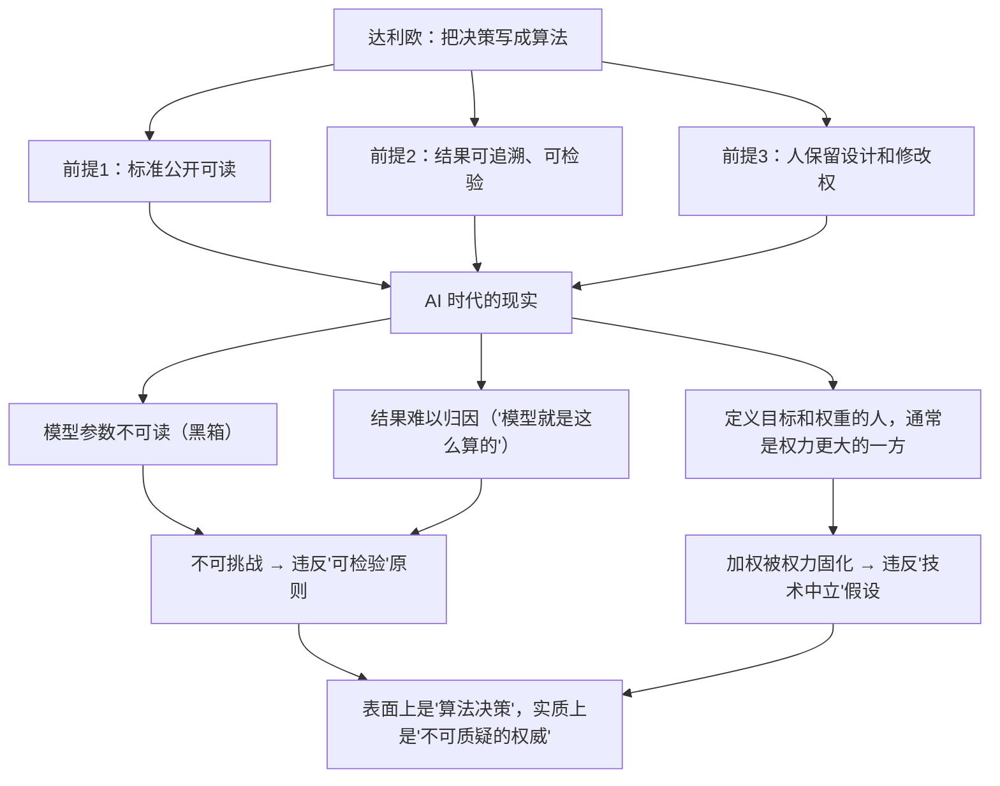

# 25｜当「原则」遇上 AI：算法化决策的今天与未来

> 达利欧二十年前主张的「决策算法化」，在 AI 时代意味着什么？

---

## 一、先说结论

达利欧的核心主张——**把判断标准写清楚、让数据说话、用系统辅助决策**——与今天的大模型、Agent 和数据驱动管理几乎是同一个方向。

但两者之间有一个根本差异：

> **算法可以放大「可信度加权」，却也可能放大偏差；算法可以做到「极度透明」（对所有信息一视同仁），却做不到「严格的爱」。**

所以达利欧思想在 AI 时代真正的问题不是「技术能不能实现」，而是：

> **当决策越来越自动化时，人应该保留什么？**

---

## 二、我们先理解一个问题

先看一个正在发生的现实。

今天，一个推荐系统决定你刷到什么；一个风控模型决定你能不能贷款；一个招聘算法决定你的简历会不会被看到；一个 Agent 可能替你做出一连串的执行决定。

这些系统，本质上都在做达利欧描述的事：**把判断标准明确化，然后交给系统执行，并且用结果来不断修正。**

但达利欧当年有一个前提：**这套系统的判断标准，是人的团队的共识，并且对人的团队可见。**

现在的问题是：

> **当判断标准藏在一个你无法阅读的模型参数里时，你还怎么「极度求真」？**

---

## 三、作者到底提出了什么观点？

严格地说，达利欧的书里**没有讨论 AI**。所以下面这些内容，是把他的原则**延伸到今天的语境**。我们需要明确区分「达利欧说了什么」和「这些思想在今天意味着什么」。

### 达利欧说了什么

**第一，决策可以被写成算法。**

他认为，把「在什么情况下、按什么标准、做什么判断」写清楚，就能让系统辅助甚至代替部分人工判断。他说计算机对他帮助极大。

**第二，可信度加权可以制度化。**

在桥水，这件事是用工具（棒球卡、集点器）完成的——**用记录来分配权重**。

**第三，极度透明是可靠性的前提。**

如果信息是失真的，任何算法都只是在处理垃圾。

**第四，人退到「设计者」的位置。**

当具体判断被系统接管，人的核心工作变成**设计判断标准、定义目标、以及在标准失效时发现它**。

### 这些思想在 AI 时代意味着什么（延伸）

**延伸一：AI 让「决策算法化」变得廉价。**

过去需要组织投入大量人力和时间，才能把判断标准写清楚、并且持续执行。现在，一个模型可以快速地从海量数据中提取规律，**代价极低。**

**延伸二：AI 让「可信度加权」变成一种隐形的排序。**

搜索引擎、推荐系统、风控模型都在做加权。**问题是：权重是谁定的、依据是什么、能不能被质疑。**

**延伸三：AI 让「极度透明」出现了新的形态。**

一方面，AI 可以让信息全部可见；另一方面，**当 AI 自身是黑箱时，最重要的那个判断依据反而变得不透明。**

**延伸四：人被迫回答「保留什么决策权」。**

这是达利欧思想的现代延伸，也是这个时代最核心的管理问题。

---

## 四、把这个观点翻译成人话

我们用最直观的方式说清楚。

**过去（达利欧时代）的算法化：**

一家公司决定「我们提拔人的标准是：连续三个项目达标 + 团队评价稳定 + 能清晰解释自己的判断」。这个标准写在一份文档里，所有人都能看到，也可以讨论、质疑、修改。

**现在的算法化：**

同一家公司用了一个 AI 系统来决定晋升推荐。系统会根据大量数据给出建议，**但没有人知道它具体在权衡哪些变量，也不知道为什么某个人的分数低。**

这两件事，达利欧都会称之为「把决策算法化」，但它们的性质完全不同：

- 前者是**可以被挑战的规则**；
- 后者是**无法被挑战的黑箱**。

而达利欧的整个体系，是建立在「原则必须可检验」之上的——**所以一个不可解释的算法，恰恰违反了达利欧自己的核心要求。**

这是 AI 时代最需要注意的错位：**很多人以为「用 AI 做决策」是达利欧思想的升级，其实它可能是达利欧思想的反面。**

---

## 五、为什么会这样？

我们来看这个错位是怎么产生的。

这里有一个非常尖锐的对照：

> **达利欧反对「老板说了算」，因为老板的判断无法被挑战。**
> **但一个黑箱算法，比老板更难被挑战——因为你连它在想什么都不知道。**

所以，AI 时代真正继承达利欧思想的做法，不是「把决策交给 AI」，而是：

> **要求 AI 的决策依据对人可见、可讨论、可质疑。**

这正好是「极度透明」和「可信度加权」的现代版本。

---

## 六、举一个现实生活中的例子

我们看两个场景，来说明「AI + 原则」的正面与反面。

**场景一（反面）：一家公司用 AI 筛简历。**

公司使用了一套 AI 招聘系统。它会把不符合「历史成功画像」的简历筛掉。

结果：系统系统性地漏掉了一批非常优秀的候选人——**因为历史上成功的人，大多来自特定的学校和背景。**

**这个例子里的问题不是 AI 不准确，而是：**
- 它学习的「成功画像」本身就带有历史偏见；
- 没有人能说清它到底在权衡什么；
- 被筛掉的人，甚至不知道发生了什么。

**从达利欧的角度看，这违反了三条原则：**
- **求真**：它没有告诉你真相，只给了结果；
- **透明**：它的判断依据不公开；
- **可检验**：你无法验证它的判断标准是否合理。

**场景二（正面）：一家公司用 AI 辅助，但保留人对判断的检查和修改。**

同样的场景，但公司做了几件事：

1. **把 AI 的判断依据尽量显性化**（比如列出影响结果的主要变量及其权重）；
2. **允许被评估者要求解释和申诉**；
3. **定期用「人工抽查」检验 AI 的判断，看它是否偏离了公司的价值观**；
4. **明确：AI 只提供建议，最终决定由人负责**。

结果：AI 提高了效率，但它始终处在一个**可被检查和修正**的位置上。

**这两个场景的区别，正是达利欧思想在今天最有价值的地方：**

> **不是「要不要用算法」，而是「算法是否处在可检验、可质疑、有人负责的结构里」。**

---

## 七、回到书中重新理解

现在回头看达利欧的原话，会更能理解他为什么如此执着于「写下来」和「可检验」。

他其实在讨论一件比管理更根本的事：

> **当判断被交给一个系统时，我们凭什么相信它？**

他的答案是：**因为它的标准是公开的，它的结果是可以被回溯的，它的人是愿意承认错误的。**

这三条，在人类组织里已经很难做到，在 AI 系统里更难——**但它的必要性，反而更高了。**

因为一个错误的人类决策，影响范围有限；**一个错误的算法，可以被复制到无限规模。**

达利欧没有预见到这一点，但他的方法论恰好指向了这个问题的解法：**任何判断系统，都必须能够被检验、被推翻、被修改。**

---

## 八、这个观点背后还有什么？

**隐含前提一：AI 的决策依据可以被部分显性化。**

这在技术上并不总是可行，尤其是复杂模型。**但如果无法显性化，那么「人对它负责」就成了一句空话。**

**隐含前提二：人有能力判断「算法的目标是否合理」。**

这需要人对业务、对价值有清晰的认识——**而这恰恰是达利欧强调的「设计者」能力。**

**隐含前提三：组织愿意接受「算法可能是错的」。**

如果算法一旦被使用就不能被质疑，那它就变成了新的独裁。

**与其他观点的联系：**
- 第 13 篇「把决策写成算法」是这一篇的**直接前身**；
- 第 16 篇「极度透明」在 AI 时代变成了**算法透明**；
- 第 17 篇「可信度加权」在 AI 时代变成了**排序与权重**问题；
- 第 24 篇的批评，在 AI 时代被**放大**了。

---

## 九、这个观点有问题吗？

有，主要是这几点。

**第一，「让 AI 透明」在技术上可能不可行。**

大型模型的内部机制极其复杂，完全解释清楚在目前不可能。**要求完全透明，可能是一个不现实的标准。**

**第二，把「AI 决策」类比为「达利欧原则」可能不成立。**

达利欧的原则是「人写的、可读的规则」；AI 是「数据里长出来的统计规律」。**这两者在性质上差别很大，用同一个框架讨论可能会掩盖关键差异。**

**第三，「人保留最终决策权」在实践中可能只是形式。**

如果 AI 的建议准确率很高，人往往只会点头。**所谓「最终由人负责」，可能只是责任的形式转移，而不是判断的实质保留。**

**第四，达利欧思想本身对 AI 时代未必是最优解。**

AI 时代的核心问题之一，是「如何在不确定性中保持适应性」，而达利欧的框架偏向「用规则减少不确定性」。**这两者之间存在张力。**

---

## 十、今天再看这个观点

这一篇本身就是「今天再看」。

如果要给一个总结，大概是这样的：

**达利欧给了我们一套「把判断变成规则」的方法，而 AI 给了我们「执行规则」的强大能力。真正的挑战，在于把这两件事正确地接起来：**

| 达利欧的原则 | 在 AI 时代的对应问题 |
|---|---|
| 拥抱现实 | 数据是否真实、是否被选择性使用？ |
| 极度求真 | 模型是否在输出「你想听的」而不是「真的」？ |
| 极度透明 | 算法的判断依据是否可见？ |
| 可信度加权 | 权重是谁定的？会不会固化偏见？ |
| 从更高层次看自己 | 人是否还在定义目标、承担后果？ |
| 严格的爱 | 算法能给反馈，但给不了关心 |
| 写下原则 | 你写下的是判断标准，还是把判断权交了出去？ |

最后一行可能是最重要的一问。

在 AI 越来越强的时代，**「写下自己的原则」这件事，意义反而变得更大**——因为如果你没有明确的原则，你就无法判断 AI 的答案是不是你想要的，也无法在它出错时知道该改什么。

**没有原则的人，在 AI 时代不只是被别人的原则支配，还可能被一个自己无法理解的系统支配。**

---

## 十一、这一篇真正应该记住什么？

1. **AI 让「决策算法化」变得廉价，但一个黑箱算法违反达利欧的「可检验」原则。**
2. **达利欧反对老板说了算，而黑箱算法比老板更难被挑战。**
3. **可信度加权在 AI 时代的问题变成：权重是谁定的、能不能被质疑。**
4. **算法能提供反馈（严格），但提供不了关心（爱）。**
5. **AI 越强，「写下自己的原则」越重要——否则你无法判断它给的答案是不是你要的。**

---

## 十二、留一个问题

> 如果有一个 AI 系统，能比你更准确地判断你人生中的大多数选择——**你会把决策权交给它吗？**
>
> 你愿意交出去的，是「怎么做的判断」，还是「什么值得追求」？
>
> 下一篇，也是最后一篇——**不照抄达利欧，你该如何写下自己的原则？**
