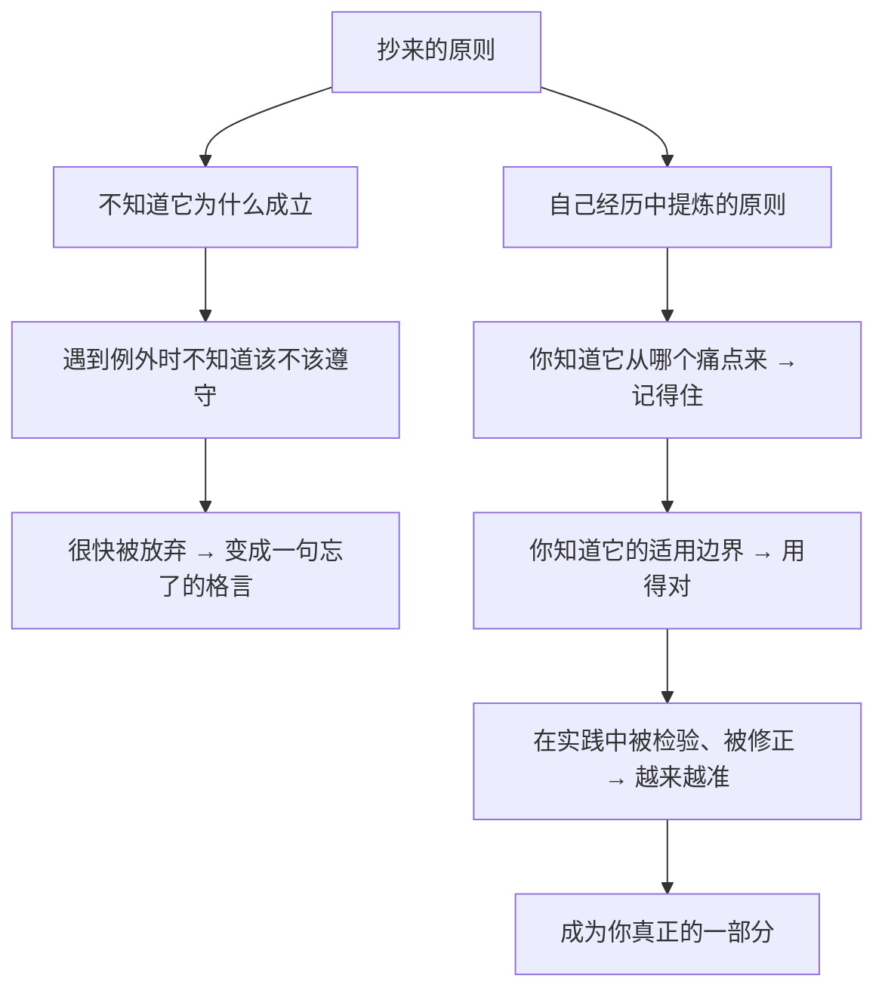

# 26｜最后：你该如何写下自己的原则？

> 如果不照抄达利欧，一个普通人该如何建立自己的原则体系？

---

## 一、先说结论

达利欧真正的贡献，不是那 365 条具体原则，而是**一套方法论**：

> **从真实经历中提炼规则 → 写下来 → 在现实中检验 → 允许它被推翻 → 反复升级。**

写下自己的原则，本质上是一次对「我到底相信什么、我凭什么是这样想的」的诚实审查。

而且它不需要很多：

> **五条经过痛苦检验的原则，胜过一百条抄来的格言。**

这一篇是系列的收尾，我们不再讲达利欧的原则，而是讲**你该怎么开始**。

---

## 二、我们先理解一个问题

先回到最开始那个问题。

读完了这一整个系列，你可能已经理解了达利欧的方法、他那些失败、那些工具、那些争议。

但合上文章之后，有个问题会浮上来：

> **这些和我有什么关系？**

达利欧的原则，是他用四十年的投资生涯、一次几乎破产的失败、一家全球最大的对冲基金换来的。**你未必有类似的经历，也未必需要同样的原则。**

如果只是把他的话背下来，那和你从任何一本成功学书上抄金句没有区别。

**真正的问题是：属于你的原则，该从哪里来？**

---

## 三、作者到底提出了什么观点？

严格说，达利欧并没有专门写「如何建立个人原则」的章节。但把全书的方法论提炼出来，可以总结成一个五步流程——**它和「五步法」是同构的，只不过对象换成了「你自己」**。

**第一步：确定方向——你想成为什么样的人，想要什么。**

这是最容易被跳过、却最关键的一步。达利欧反复强调「清晰的目标」。**在写原则之前，你得先知道自己要去哪。**

**第二步：找出反复出现的落差。**

不是找一次性的失败，而是找**那些重复发生的痛苦**。因为重复意味着结构性的原因，也就意味着它可以被提炼成规则。

> 你总是在什么情况下失控？总是在哪类事情上后悔？总在什么人面前变得不像自己？

**第三步：诊断根本原因。**

用第 23 篇讲的方法：往下追问，直到触及你能改的那一层。**并且分清这是「设计问题」还是「人的问题」。**

**第四步：写下一条具体的规则。**

它不是「我要更有耐心」，而是「当我感到不耐烦想打断别人时，我先在心里数到三，然后问对方一句话」。

**第五步：在现实中检验、修正。**

记录它有效还是无效，什么时候有效、什么时候失效。**一条从不被修改的原则，要么是太模糊，要么是从没被认真使用过。**

---

## 四、把这个观点翻译成人话

我们用一个具体的例子，把「写下自己的原则」这件事变成看得见的动作。

**假设你有一个反复出现的痛苦：每次和某个家人通电话，最后都会吵起来。**

**第一步：确定方向。**

你想要的不是「赢过对方」，也不是「断绝关系」，而是**「能平静地和这个人保持联系」。** 这是你的目标。

**第二步：找出反复出现的落差。**

回看过去几次争吵，你会发现问题不在谈话的内容，而在**某一个特定的时刻**——通常是对方开始评价你的生活方式时。

**第三步：诊断原因。**

继续往下问：
- 为什么那一刻会吵？——因为我感到被否定；
- 为什么被否定会让我失控？——因为我很在意他的认可，而且我早就知道我们价值观不同；
- 根本原因：**我把「他的评价」当成了「对我人生的判决」。**

**第四步：写下一条具体规则。**

> **当对方开始评论我的生活选择时，我不反驳，也不沉默。我会说一句：「我知道我们的想法不同，我们换一个话题吧。」然后主动换话题。**

**第五步：检验与修正。**

执行一个月后，你可能会发现：
- 有效的情况：大多数时候能止住争吵；
- 失效的情况：在**人多的时候**，这句话会显得生硬，反而激化。

于是修正为：

> **如果是私下，就说「我们换个话题」；如果是在饭桌上，就先顺着接一句，事后单独沟通。**

**这就是你自己的原则——它不是抄来的，而是从你真实的痛点里长出来、并且被反复校准的。**

---

## 五、为什么会这样？

为什么「自己写原则」比「抄原则」有效？用一张图说明。



这里有一个非常重要的机制：**原则必须带着「它的来历」才能被真正使用。**

达利欧的 365 条原则，对他来说是「活的」——因为每一条背后都对应着他某次具体的疼痛。但对读者来说，它们是「死的」——因为你不知道它为什么存在，也不知道它的边界在哪里。

**你抄下一条原则，得到的只是那句话；你提炼一条原则，得到的是一个可以继续生长的结构。**

---

## 六、举一个现实生活中的例子

我们看一个更完整的例子：**一个总是「在关键时刻掉链子」的人。**

**他的痛苦：**
每次重要场合——汇报、面试、答辩——他都会发挥失常，事后极度懊悔。

**第一步：方向。** 他想在重要场合稳定发挥，展示真实水平。

**第二步：找出反复的落差。** 他发现自己的模式很一致：**平时准备得很好，一到关键时刻就大脑空白。**

**第三步：诊断。**
- 为什么会空白？——因为极度紧张；
- 为什么紧张？——因为我在意评价；
- 更深的：**因为我把「这次表现」和「我这个人行不行」绑在了一起。**（回到第 10 篇：把事升级成了人）

**第四步：写规则。** 他写下三条：

1. **重要场合前，只准备「开口的第一句话」**——因为卡住通常发生在开始；
2. **在心里提前演练「最坏的结果」**——把「完蛋了」具体化成一个可接受的事实（比如「就算这次没过，我还在原来的岗位」）；
3. **把目标从「表现好」改成「把我要说的话说完」**——**降低目标的评价属性。**

**第五步：检验与修正。** 几次实践后他发现：

- 第 1 条非常有效；
- 第 2 条对他作用有限（因为他不是怕后果，而是怕丢脸）；
- 第 3 条最有效——**它把「评价」换成了「任务」。**

于是他修订：保留 1 和 3，把第 2 条换成了「提前准备一个自嘲的开场，降低对自己的期待」。

**这就是一个人的原则体系开始生长的样子：从痛苦出发，经过诊断，写成规则，再被实践修改。**

---

## 七、回到书中重新理解

现在回头看整本书，你会发现达利欧在最后其实说了一件很朴素的话（大意）：

> **这些原则不是让你照做，而是希望引发你思考自己的原则。**

这句话如果在一开始读，会显得像客套；但读完这 26 篇之后再读，它的分量完全不同——**因为在整本书里，达利欧真正想传递的从来不是那些条款，而是一种「对自己诚实地做记录」的习惯。**

他写了 365 条，是因为他有 40 多年、成千上万次的判断可以提炼。**你不需要 365 条。你需要的是——开始写第一条，并且认真对待它。**

还有一点值得回顾：达利欧说，他之所以能成功，**不是因为他比别人聪明，而是因为他在犯错之后能迅速看清现实并调整。**

这就意味着：**写下原则这件事，真正的门槛不是智力，而是诚实和坚持。**

---

## 八、这个观点背后还有什么？

**隐含前提一：你有改变自己的意愿。**

对不想改变的人来说，原则只是一堆文字。**达利欧的方法需要一种「我愿意承认自己需要改」的姿态。**

**隐含前提二：你的生活中有可重复的模式。**

如果你的人生每件事都完全不同，提炼原则会很困难。**但对绝大多数人来说，反复出现的痛点其实是很多的。**

**隐含前提三：你愿意承担「写得不好」的代价。**

第一条原则大概率是粗糙的、甚至错误的。**但一份粗糙的原则，也比一片空白要好——因为它可以被打磨。**

**与其他观点的联系：**
- 第 02 篇解释了「为什么你必须有自己的原则」；
- 第 04 篇的「痛苦 + 反思 = 进步」是**提炼原则的引擎**；
- 第 08、09 篇的五步法是**这套个人流程的原型**。

---

## 九、这个观点有问题吗？

有，值得注意的有三点。

**第一，不是所有人生问题都能被「原则化」。**

关系、情感、审美、偶然性很强的人生事件——这些用「写规则」的方式来处理，可能会显得机械和用力过猛。**原则是用来处理「反复出现、后果重大」的那些领域的。**

**第二，「写下原则」可能变成一种自我监控的焦虑。**

如果一个人时刻在记录、复盘、优化自己，他会活得很累。**达利欧的方法是工具，不是生活方式。它应该服务于你，而不是你服务于它。**

**第三，也是最重要的一点：不是所有痛苦都值得被兑换成原则。**

有些痛苦来自不公、来自他人的恶意、来自结构性的限制。**把这些都归因为「我该改哪条原则」，是一种残忍的自我压榨。**

所以，写原则之前，先问一句：**这是我该负责的部分吗？** 如果是，就写；如果不是，就承认它、接受它、保护自己，而不是把自己改造成一个能忍受一切的人。

---

## 十、今天再看这个观点

在 AI 时代，「写下自己的原则」这件事的重要性，反而上升了。

原因很简单：

> **当 AI 可以替你做越来越多的判断时，你唯一能用来检验它、驾驭它的东西，就是你自己的原则。**

- 你有一份「金钱原则」，才能判断 AI 给的投资建议是否符合你的风险偏好；
- 你有一份「时间原则」，才能判断哪些自动化是真正帮你、哪些是在消耗你；
- 你有一份「关系原则」，才能在 AI 帮你回复消息时，仍然保留你自己。

从某种意义上说，**原则就是你交给 AI 的那份「指令」背后的价值观。** 如果你自己没有，那么 AI 只会执行平台的、通用的、或者别人的价值观。

达利欧在书里说「你有两个选择：要么自己有原则，要么被别人支配」。在 AI 时代，这句话可以改写成：

> **要么你自己有原则，要么你被一个你无法理解的系统支配。**

这是**基于达利欧思想的现代延伸**，也是这个系列想留下的最后一个观点。

---

## 十一、这一篇真正应该记住什么？

1. **达利欧真正的贡献是方法论，不是那 365 条原则。**
2. **属于你的原则，要从你自己反复出现的痛苦里长出来，而不是从书上抄来。**
3. **写原则的五个动作：定方向 → 找反复的落差 → 诊断原因 → 写下具体规则 → 检验并修正。**
4. **一条原则必须带着它的来历，才能被真正使用。**
5. **不是所有痛苦都值得被兑换成原则——先问「这是我该负责的部分吗」。**

---

## 十二、留一个问题

> 如果这辈子你只能写下三条属于自己的原则——**你会写哪三条？**
>
> 它们分别对应你人生中哪一次具体的疼痛？
>
> 如果现在写不出来，那说明你还没有认真对待过自己反复踩过的那些坑。**那么，从今天开始记录，也不算晚。**

---

## 系列收束

到这里，「《原则》深度解读系列」的 26 篇就全部结束了。

回看整条路径，其实是一个从「认识」到「使用」再到「反思」的完整循环：

```text
原则是什么（01-02）
  ↓
为什么需要拥抱现实与痛苦（03-04）
  ↓
人是怎样骗自己的（05-07）
  ↓
可操作的方法：五步法与决策（08-13）
  ↓
组织如何运转：创意择优（14-18）
  ↓
如何管理这台机器：设计、用人、诊断（19-23）
  ↓
它哪里靠不住，今天还意味着什么（24-25）
  ↓
把它变成你自己的（26）
```

达利欧在书里说，他希望这本书能引发读者去思考自己的原则，而不是照搬他的。**如果这个系列只能留下一句话，那应该是：**

> **不要问「达利欧怎么做」，要问「我从自己的经历里，提炼出了什么，并且它被检验过吗」。**
