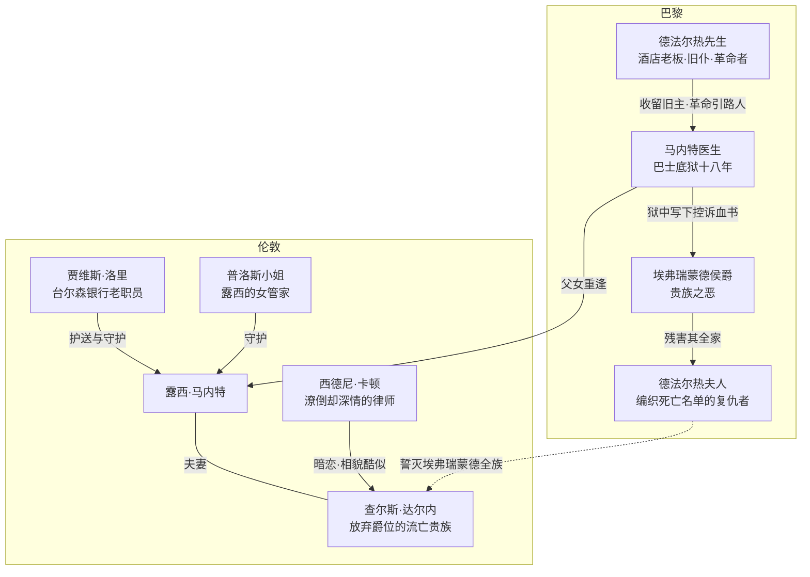

# 00｜系列导读与目录

> 《双城记》深度解读系列：先带你认识这本书，再带你一层层走进去。

## 系列简介

《双城记》是查尔斯·狄更斯一八五九年出版的长篇历史小说，以法国大革命前后的伦敦与巴黎为舞台。故事从一封「复活」的口信开始：被关了十八年的马内特医生走出巴士底狱，他的女儿露西在伦敦与巴黎之间，把一群被时代碾压的人——流亡的贵族、潦倒的律师、复仇的革命者——织进同一张命运之网。这本书最值得读的地方，不是它讲了革命，而是它问了几个到今天仍然锋利的问题：正义为什么会变成恐怖？一个自认无用的人能不能完成最伟大的牺牲？爱和仇恨，究竟哪一个更有韧性？本系列不按原书三卷的顺序走，而是按「故事 → 人物 → 冲突 → 主题 → 写法 → 今天」的递进逻辑，把这本书拆成十三篇文章加一篇总结，每一篇只回答一个问题。

## 作品定位

| 项目 | 内容 |
|---|---|
| 作者 | 查尔斯·狄更斯（Charles Dickens，1812—1870），英国维多利亚时代小说家 |
| 首版时间 | 一八五九年；先于狄更斯自办周刊《一年四季》（All the Year Round）连载（四月三十日至十一月二十六日，共三十一期），同期以月刊分册形式发行，年底出单行本 |
| 文学类型 | 长篇历史小说；狄更斯第二部历史题材长篇（第一部为《巴纳比·拉奇》） |
| 历史背景 | 一七七五至一七九三年间的伦敦与巴黎：大革命爆发、攻占巴士底狱、恐怖统治 |
| 文学地位 | 狄更斯流传最广的作品之一；出版史与接受史上争议极大——恶评与「最成功历史小说」之誉并存 |
| 史实底本 | 主要参考托马斯·卡莱尔《法国大革命史》（1837）；狄更斯在序言中自陈「无人能指望为卡莱尔先生那本杰作增砖添瓦」，但学界近年也在讨论狄更斯对卡莱尔保守史观的偏离 |
| 核心思想 | 复活与救赎；暴力革命中正义的异化；爱与牺牲对仇恨循环的中断 |

## 全书核心问题

| 层次 | 核心问题 |
|---|---|
| 故事层 | 「最好的时代／最坏的时代」这句开场白究竟在说什么？为什么要用伦敦与巴黎两座城市来讲一个故事？ |
| 人物层 | 卡顿为什么自认一无是处，却能做出全书最重的选择？马内特医生被毁掉的是什么、被救回的又是什么？德法尔热夫人的复仇从何而来、走向何处？露西为什么能成为所有人的「金线」？ |
| 社会层 | 大革命为什么从追求正义滑向吞噬无辜的恐怖？狄更斯在贵族与平民之间到底站在哪一边？ |
| 思想层 | 「复活」为什么才是全书真正的主题？卡顿之死为什么成全了整部小说？ |
| 写法与价值层 | 伏笔、对照与象征在这本书里如何运作？它为什么是狄更斯最「不像狄更斯」却又最经久不衰的作品？今天再读，还能得到什么？ |

## 故事与人物地图

人物关系总览（姓名按通行中译名）：

时间线（真实历史与小说事件交织）：

## 剧透策略声明

本系列默认读者是**已经读完（或不在乎剧透）的人**：文学解读无法在不触碰结局的情况下讨论人物与主题。但本导读正文不点破结局的具体方式；目录标题只透露「牺牲」的方向、不透露实现方式。各篇文章开头均有「剧透提示」标明该篇允许动用的情节范围，未读完的读者可按提示自行绕行。

## 全系列目录

### 第一部分：进入故事

#### 01｜「这是最好的时代，也是最坏的时代」到底在说什么？
核心问题：这段被引用到滥熟的开场白，究竟在描述什么？
核心观点：它不是抒情，而是狄更斯给全书定下的方法——用一组悖论让读者站在两个时代、两种真相之间。
理解难度：★☆☆☆☆
关键词：开场白、悖论、一七七五年、英法对照
剧透范围：仅开场与背景设定
---

#### 02｜为什么狄更斯要用「两座城」来讲一个故事？
核心问题：伦敦与巴黎的对位结构到底有什么用？
核心观点：双城不是背景板，而是一组互为镜像的对照装置——一边是被恐惧推着走的社会，一边是自以为安全的旁观者。
理解难度：★★☆☆☆
关键词：双城结构、对照、台尔森银行、洛里
剧透范围：前两卷情节框架
---

### 第二部分：理解人物

#### 03｜西德尼·卡顿：一个自认「一无是处」的人为什么能完成最伟大的牺牲？
核心问题：卡顿的自我厌弃从何而来，它又为什么反而成全了他？
核心观点：卡顿不是被爱情拯救的浪子，而是一个用最后一次行动把「浪费掉的人生」赎回的人。
理解难度：★★★☆☆
关键词：卡顿、自我厌弃、替身、救赎
剧透范围：全书，含结局方向但不展开行刑细节（见第 10 篇）
---

#### 04｜马内特医生：十八年的监禁如何毁掉又重塑一个人？
核心问题：巴士底狱究竟从马内特身上夺走了什么、又留下了什么？
核心观点：他是全书第一个「复活」的人——但他的复活不是痊愈，而是带着创伤学会重新生活。
理解难度：★★☆☆☆
关键词：马内特、巴士底狱、创伤、鞋匠凳、血书
剧透范围：前两卷为主，兼及第三卷审判
---

#### 05｜德法尔热夫人：受害者为什么会变成比压迫者更冷酷的人？
核心问题：她的仇恨从哪里来，又把她带到了哪里？
核心观点：狄更斯把她写成革命最锋利的一把刀——而这把刀本身就是被贵族的罪恶锻造出来的。
理解难度：★★★☆☆
关键词：德法尔热夫人、复仇、编织、仇恨循环
剧透范围：全书含结局
---

#### 06｜露西·马内特：为什么看似柔弱的她成了所有人的「金线」？
核心问题：一个没有行动力的角色，凭什么成为全书的情感中心？
核心观点：露西的力量不在「做什么」而在「连接什么」——第二卷的卷名「金线」说的就是她。
理解难度：★★☆☆☆
关键词：露西、金线、家庭、回声般的脚步声
剧透范围：前两卷为主
---

### 第三部分：冲突与时代

#### 07｜大革命为什么会从追求正义滑向吞噬无辜的恐怖？
核心问题：一场为平等而起的革命，怎么变成了断头台的流水线？
核心观点：狄更斯给出的答案不是「革命错了」，而是「被压迫者的仇恨一旦接管正义，正义就死了」。
理解难度：★★★☆☆
关键词：攻占巴士底狱、恐怖统治、断头台、暴力循环
剧透范围：全书含结局，兼及真实历史
---

#### 08｜面对贵族与平民，狄更斯到底站在哪一边？
核心问题：他同情挨饿的平民，又恐惧杀人的暴民——这种矛盾是立场还是局限？
核心观点：一种可能的读法是，狄更斯拒绝「站队」这个选项本身：他要读者同时看见两笔血账。
理解难度：★★★★☆
关键词：作者立场、侯爵马车、卡莱尔、历史观争议
剧透范围：全书
---

### 第四部分：核心主题

#### 09｜「复活」为什么才是这部小说真正的主题？
核心问题：从第一卷卷名到卡顿临终的经文，「复活」如何统摄全书？
核心观点：「被召回人间」不只是一条情节线，而是狄更斯对「人能不能重新开始」的总回答。
理解难度：★★★☆☆
关键词：复活、被召回人间、盗尸人、重生母题
剧透范围：全书含结局
---

#### 10｜卡顿之死：为什么一场牺牲成全了整部小说？
核心问题：狄更斯为什么让全书以这个走向收尾，而不是以团圆收尾？
核心观点：一种可能的读法是——只有把最重的东西付出去，前面埋下的「复活」与「牺牲」才真正落地。
理解难度：★★★☆☆
关键词：掉包、临终预言、「最好最好的事」、小裁缝
剧透范围：全书含结局（本篇即结局解读）
---

### 第五部分：写法与文学价值

#### 11｜狄更斯如何用伏笔、对照与象征织成这张网？
核心问题：这本书的叙事为什么让初读的人和重读的人看到两本不同的书？
核心观点：回声、编织、影子、泼洒的酒——狄更斯把主题藏进反复出现的意象系统里，让形式本身参与表达。
理解难度：★★★★☆
关键词：伏笔、对照结构、意象系统、叙事技巧
剧透范围：全书
---

#### 12｜《双城记》为什么是狄更斯最「不像狄更斯」却又最经久不衰的作品？
核心问题：一部被名家批为「笨拙」「肤浅」的小说，凭什么活成全世界最知名的英文小说之一？
核心观点：它牺牲了狄更斯标志性的喜剧与闲笔，换来了罕见的情节密度与情感重力——争议的焦点恰恰在这里。
理解难度：★★★★☆
关键词：文学史地位、连载史、批评争议、《一年四季》
剧透范围：全书
---

### 第六部分：连接今天

#### 13｜一百六十多年后重读这本书，它还能告诉我们什么？
核心问题：当「最好的时代」变成口头禅之后，这本书还剩下什么？
核心观点：以下部分是 modern extensions——它对群体正义、舆论审判与「人能不能重来」的追问，今天依然有效。
理解难度：★★☆☆☆
关键词：现代意义、群体暴力、舆论审判、重新开始
剧透范围：全书
---

### 第七部分：收束

#### 99｜系列总结：《双城记》
核心问题：这本书借这个故事，究竟在讨论什么？
核心观点：狄更斯借伦敦与巴黎之间的一张人物之网，追问暴力时代里人如何靠爱与牺牲中断仇恨的循环。
理解难度：★★★☆☆
关键词：总结、人物地图、主题回顾、文学史
剧透范围：全书含结局
---

## 推荐阅读顺序

主线按 **01 → 13 → 99** 顺序读，即本书设计的递进路线：

- **第一段（01–02）**：进书。先懂开场白与双城结构，后面所有讨论都建立在这两块地基上。
- **第二段（03–06）**：看人。四个主要人物各一篇，理解「他们为什么这样做」。
- **第三段（07–08）**：看时代。把人物放回大革命，讨论全书最难的问题——狄更斯的立场。
- **第四段（09–10）**：看主题。「复活」与「牺牲」两条线在这里合拢，触及结局。
- **第五段（11–13）**：看写法与今天。拔高到文学史与现代意义。
- **99**：总结收束，把十三篇收进一张地图。

不同需求的入口：

- **只想抓骨架**：01 → 07 → 09 → 10 → 99。
- **对人物感兴趣**：03 → 04 → 05 → 06。
- **练批判性阅读**：08（立场之争）→ 12（评价之争）→ 13（现代延伸）。
- **没读完原书**：只读 00 与 01，其余各篇开头的「剧透提示」会告诉你该篇会走多远。

## 全系列状态

本系列规划 **13 篇正文 + 00 导读 + 99 总结**，目录如上。回复「开始写」生成正文；回复「直到写完所有篇」一次性写完全部。
