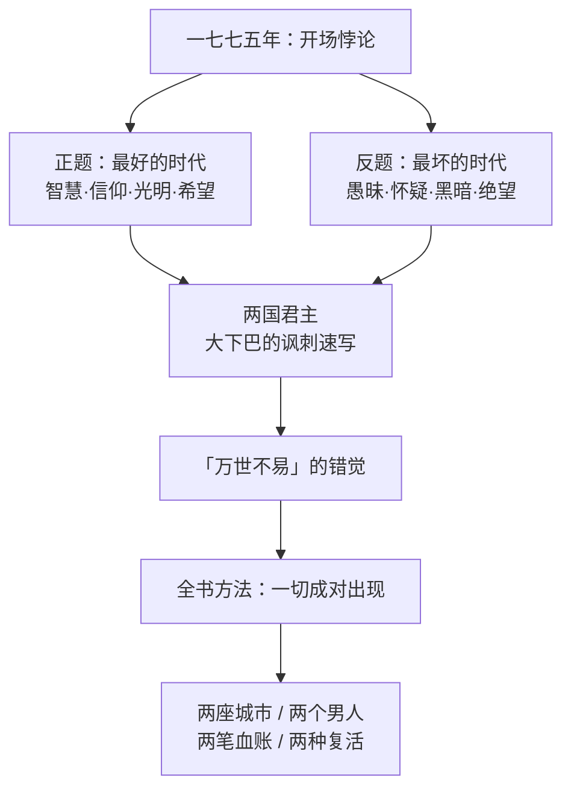

# 01｜「这是最好的时代，也是最坏的时代」到底在说什么？

> 本篇核心问题：这段被引用到滥熟的开场白，究竟在描述什么？

> **剧透提示**：本文只涉及小说开场与背景设定，基本无情节剧透。

---

## 开篇：一个值得思考的问题

「这是最好的时代，这是最坏的时代；这是智慧的岁月，这是愚昧的岁月；这是信仰的时期，这是怀疑的时期；这是光明的季节，这是黑暗的季节；这是希望的春天，这是绝望的冬天；我们面前无所不有，我们面前一无所有；我们都直奔天堂，我们都直奔相反的方向。」

这段话可能是世界文学中被引用次数最多的开场白。它被写进演讲、广告、毕业致辞，被用来形容互联网、形容疫情、形容任何一个让人觉得既兴奋又焦虑的年份。

但一个很少被追问的问题是：狄更斯写下它的时候，脑子里装的到底是哪一年？

答案其实就写在紧接着的第二段：一七七五年。而一七七五年距离攻占巴士底狱还有十四年——狄更斯写的不是革命本身，是革命到来之前那个表面平静、底下早已沸腾的年代。

## 一、从故事开始

小说第一段不讲故事，先讲时代。

在简短的交代里，狄更斯做了两件看上去漫不经心的事。第一件，他点出时间：我们故事开始于一七七五年。第二件，他给两个国家的君主画了一幅极尽嘲讽的速写：英国这边，是一个长着大下巴的国王和一个面容平平的王后；法国那边，也是一个长着大下巴的国王和一个面容姣好的王后——两边配平，谁也不比谁高明。

然后他补了一刀：在这些君主眼里，天下太平是理所当然、万世不易的。

读到这里，当时的英国读者是会心一笑的。一七七五年的法国，贵族在凡尔赛宫里继续着精致而奢靡的仪式，财政却已经烂到根上；同一年的英国，享受着海外贸易和相对安稳的秩序，还天真地以为海峡对岸的火永远烧不到自己。十四年后，巴士底狱的围墙被推倒。

## 二、真正的问题是什么？

这段开场白真正要回答的问题是：

> 当一个时代同时长出最好的东西和最坏的东西，我们该用什么眼光去看它？

普通人看时代，习惯二选一：要么这是盛世，要么这是末世。狄更斯偏不。他用一整段排比把两个选项焊在一起，逼你同时承认：两种说法都对。财富在增长，压迫也在加深；理性在传播，断头台也在铸造；有人在织补生活，有人在编织死亡名单。

这其实是全书方法论的总纲。往后你会发现，这部小说里几乎所有重要的东西都是成对出现的：两座城市、两个相貌酷似的男人、两笔血账、两种「复活」。开场的悖论不是修辞游戏，是说明书。

## 三、人物为什么会这样选择？

开场还没有人物登场，但狄更斯替「时代里的人」做了一个选择预设。

一七七五年的英法两国统治者选择了「看不见」：凡尔赛宫看不见外省农民的锅里煮着什么，伦敦的绅士们看不见海峡对岸积蓄的雷声。这个「看不见」不是信息问题，而是立场问题——看得见的代价是他们无法承受的。

而小人物没有选择「看不见」的权利。圣安东尼区的饥民不需要阅读报纸就知道面包多少钱；被侯爵马车碾过孩子的父亲，不需要理解政治经济学就懂得什么叫命如草芥。开场把「看不见」和「不得不看见」的人摆在天平两端，后面整本书都在为这个倾斜的天平找平衡——或者看着它彻底翻倒。

## 四、作者真正想讨论什么？

文本事实上，这段开场白是一个精心设计的悖论结构：每一句都同时给出正题和反题，不裁决、不排序。

作者明确表达的部分，在第二段的嘲讽里：他对两国君主的「大下巴」一视同仁，说明他讽刺的不是某一个昏君，而是「自以为时代属于他们」的整个统治阶层。

主流解释认为，这段开场确立的是狄更斯对革命的矛盾态度——他承认革命前的世界烂透了（最坏），也害怕革命后到来的东西（未必最好）。也有学者把它读成更普遍的警句：任何时代都同时包含向上和向下的两种势能，取决于你站在哪个位置看。

一种可能的读法是：这段开场其实是对「进步史观」的温和拆台。狄更斯不写「时代会越来越好」也不写「时代会越来越坏」，他写「时代永远在两个方向同时加速」。这不是骑墙，而是预告——往后两卷的平静和第三卷的风暴，本来就在同一个一七七五年里同时孕育。

## 五、把这个问题放回时代

狄更斯为什么在一八五九年回头写一七七五年？

他自己生活的维多利亚中期，正是英国自信膨胀的年代：议会改革过去了，工业革命赢了，伦敦办了万国博览会，帝国有钱有船有秩序。但这种自信底下同样埋着裂缝——贫富差距、选举权之争、对欧洲大陆革命的持久恐惧。一八四八年的革命浪潮刚过去十来年，「海峡对岸着火」在英国人记忆里还很新鲜。

所以「最好／最坏」与其说是写一七七五，不如说是借一七七五问一八五九：你以为的太平，是真的太平，还是火山口上的太平？这种以古喻今的写法，是历史小说最古老也最有效的功能——把读者放进一个他知道结局、书中人却不知道结局的时间里，让那份「书中人看不见的逼近」变成悬在每一页上的张力。

## 六、作品是怎么写出来的？

这段开场在技巧上几乎是用排比堆出来的：六个「这是」起头的对偶句，节奏像钟摆一样在最好与最坏之间来回摆动。

值得注意的是排比的**对等**：狄更斯刻意让好坏两半在句法上完全对称，谁也不压过谁。这种「不裁决」的形式本身就是内容——形式在替主题干活。等到第三卷恐怖统治到来，读者回看这段开场，才会发现狄更斯第一页就告诉你了：别指望这本书替你选边。

还有一个常被忽略的细节：这一段全部用「这是」开头，是全景式的时代陈词；但翻到第二页，叙事立刻缩成多佛邮车在泥泞黑夜里的具体画面。从「时代」到「一辆爬不上坡的马车」，狄更斯只用了一页就完成了从宏观到微观的俯冲——这个俯冲，就是历史小说与历史教科书的分界线。

## 七、如果放到今天

以下部分是基于文本的现代延伸，不是狄更斯原话。

「最好的时代／最坏的时代」之所以成为万能引用，恰恰因为它拒绝被引用者占有。任何一个觉得「机会很多但心里很慌」的年代，都能在这句话里照见自己：技术爆炸与意义匮乏并存，信息丰裕与真相稀缺并存。

但也要警惕它的滥用。这句开场被引用到面目全非之后，常常被读成一句圆滑的和稀泥——「反正好坏都有嘛」。放回文本你会发现狄更斯根本没有这么温和：他紧跟着写的是大下巴国王和即将到来的断头台。悖论不是安慰剂，是警报。它真正说的是：别把「眼下还过得去」当成「这样下去没问题」。

## 八、小结

这段开场白做了三件事。第一，定调：全书写的是革命来临之前的世界，而不是革命本身。第二，定法：成对的悖论结构预告了全书的对照方法——双城、双人、两笔账。第三，定视角：狄更斯同时站在统治者的「看不见」与小人物的「不得不看见」之间，逼读者在两份真相里自己找位置。

所以它不是一句可以随便贴的格言，而是一把钥匙：读懂了「最好／最坏」不是修辞而是方法，后面一百多个伏笔才有地方放。

## 下一篇

既然狄更斯一上来就把「成对」定为全书方法，那么最显眼的一对就来了：为什么他偏偏要用伦敦和巴黎**两座城市**来讲这一个故事？下一篇，我们看「双城」这个结构到底是怎么运转的。
