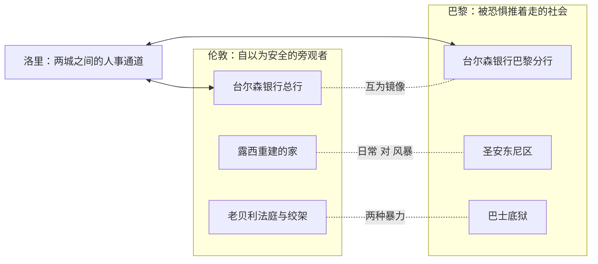

# 02｜为什么狄更斯要用「两座城」来讲一个故事？

> 本篇核心问题：伦敦与巴黎的对位结构到底有什么用？

> **剧透提示**：本文涉及前两卷的情节框架，不涉及结局的具体方式。

---

## 开篇：一个值得思考的问题

这本书叫《双城记》，不叫《法国大革命记》，也不叫《巴黎记事》。

这个书名本身就藏着一个值得追问的选择：狄更斯明明可以把镜头全部对准巴黎——攻占巴士底狱、恐怖统治、断头台，所有真正「好看」的戏都在那边——却偏要把将近一半的篇幅留给相对平静的伦敦：一个银行职员坐着渡船在海峡两岸来回，一个出狱的医生在伦敦近郊重新学着过日子，一个流亡的法国人在伦敦教书谋生。

如果只是为了讲革命，这些伦敦的段落全是闲笔。但狄更斯不仅保留了它们，还把「两座城」直接写进了书名。这说明双城不是背景板，而是整台机器的轴心。

## 一、从故事开始

小说的主要人物，几乎都在那条海峡上走过。

故事开篇是一辆多佛邮车：台尔森银行的老职员贾维斯·洛里在泥泞的夜里赶路，乘客们裹着大衣彼此猜忌——谁都怕身边坐着强盗。洛里渡过多佛—加来航线进入法国，办完整整一桩事后，又把一个「复活」的人护送回伦敦。在没有隧道也没有可靠轮班的年代，这条渡海航线是英法两个首都之间唯一正式的通道：船只有一条，方向却有两个。

台尔森银行是这套结构里最不起眼的枢纽。这家银行老派、昏暗、以不便为荣，却在伦敦和巴黎两边都设有据点。洛里正因为两边都有公事，才得以名正言顺地在海峡上往返，成了全书里替两座城市运送消息、护送人、保存秘密的那个人事通道。

前两卷里，人流的方向几乎一致：离开巴黎，到伦敦去。马内特医生被接回伦敦，在女儿身边慢慢恢复神智；达尔内宁可抛下贵族姓氏在伦敦当法文教师，也不愿留在巴黎。伦敦像一个巨大的收容所，而露西在伦敦一角重建的那个安静的家，就是这个收容所的核心。

## 二、真正的问题是什么？

翻译成人话，这个问题是：

> 一个故事为什么需要两座城市？如果只写巴黎，会丢掉什么？

丢掉的不是戏份，而是参照系。巴黎的火烧得多高，取决于你从多远的距离看。只在巴黎看，革命就是整个世界；站在伦敦看，革命是「对岸正在发生的事」。而「对岸」恰恰是一八五九年英国读者的真实处境——他们隔着一条海峡读这个故事，就像书中人隔着海峡看法国。

狄更斯要的就是这个姿势：让读者先舒舒服服地当一个旁观者，然后慢慢发现，海峡没有他们以为的那么宽。

## 三、人物为什么会这样选择？

洛里是最典型的例子。他逢人就自称「生意人」，仿佛这四个字是一道护身符，能把危险和情感都挡在外面。但小说明确写了：正是这个自称只管生意的老人，一次次踏上那趟渡船，去做护送孤女、安顿出狱医生、保存危险秘密这些和生意毫无关系的事。

这个选择说明一件事：两座城市之间必须有人肯走路。海峡把社会分成「这边的人」和「那边的人」，洛里却拒绝接受这个划分。他用生意人的外壳，偷偷干了一件最不像生意的事——充当两城之间的那条线。没有他，伦敦的露西和巴黎的过去就接不上头，整部小说的人物之网就散了。

达尔内的选择方向相反、道理相同：他称量过巴黎，结论是不值得留下，于是把整个生活搬去了伦敦。前两卷里，几乎每个有选择能力的人都在用脚投票，票的方向全都指向伦敦。这笔账狄更斯记得很清楚——因为等风向倒转，所有「逃出来」的决定都要被重新计价。

## 四、作者真正想讨论什么？

文本事实上，双城是一套严格的对位装置：伦敦有台尔森总行，巴黎就有台尔森分行；伦敦有老贝利法庭和绞架，巴黎有巴士底狱和后来的断头台；伦敦有一个被悄悄重建的家，巴黎就有一个在贫困中酝酿风暴的圣安东尼区。几乎每一样东西，在对岸都有它的对应物。

主流解释认为，狄更斯设双城是为了给英国读者立一面镜子：看，这就是对岸失控的下场。这种读法把伦敦当「秩序」的样板，把巴黎当「混乱」的反面教材。

也有学者指出，这个读法漏掉了一半文本：狄更斯在第一章就把伦敦的暴行一并写了进去——英国为一点小罪就把人吊死，刽子手忙个不停；台尔森银行也被他写成一座体面的监狱，昏暗封闭，把人塞进小格子。一种可能的读法是：双城从来不是「安全」与「危险」的对照，而是「自以为安全」与「已经着火」的对照。伦敦不是巴黎的反面，而是巴黎的预告片。

## 五、把这个问题放回时代

狄更斯为什么在一八五九年写这个结构？因为他那一代英国人，就是看着对岸的火焰长大的。

一八四八年的革命浪潮刚刚扫过欧洲，距此书出版不过十一年；再往前数，从大革命到拿破仑战争，英国和法国缠斗了二十多年，「海峡对岸会出什么事」是英国政治想象里最顽固的一块阴影。维多利亚中期的英国又正好处在自信膨胀的顶峰：议会改革过了，工业革命赢了，帝国觉得自己找到了正确答案。也正因为太自信，「我们不会变成那样」成了最自然、也最需要被戳破的错觉。

所以双城结构不是猎奇的布景，而是一句悄悄话：这本书名义上写法国，眼睛却一直瞟着英国。

## 六、作品是怎么写出来的？

手法上，狄更斯靠的是「对位」而不是「并列」。他不满足于让两座城市轮流出场，而是让每一件东西都在对岸留一个影子：

最妙的一笔是台尔森银行本身。小说明确写道，这家银行以昏暗、窄小、不便为荣，要是有合伙人的儿子胆敢提议改良，就会被剥夺继承权——狄更斯紧接着补了一刀：在这方面，这家银行和这个国家差不了多少。这等于作者亲自认证：台尔森银行就是一个微缩的英格兰。所以洛里每天上班的地方，本身就是一座「伦敦的巴士底狱」，只是关人的方式体面一点。

狄更斯在写给友人福斯特的信里自述，这本书是「每章不断上升的如画故事，人物应由故事而非对话来塑造」（大意）。双城正是这种写法的体现：他没有安排任何人物站出来宣讲「两城何其相似」，而是把相似性砌进结构里，让布景自己说话。

## 七、如果放到今天

以下部分是基于文本的现代延伸，不是狄更斯原话。

「对岸心态」大概是这个结构里最现代的东西。任何一个社会都有自己的「海峡」：地理上的，阶层上的，屏幕上的。我们隔着它看远处的火灾、战争和骚乱，心里默念「幸亏我在这边」——这个姿势，和十九世纪伦敦人读报纸看巴黎的姿势几乎没有区别。

而狄更斯泼的冷水到今天依然冷：旁观者的安全感，往往不是因为自己真的安全，而是因为风还没转向。他让前两卷的伦敦看起来坚如磐石，恰恰是为了让读者和书中人一起，对那块石头产生过度的信心。

## 八、小结

双城结构干了三件活。第一，提供参照系：巴黎的烈度，要靠伦敦的平静来量。第二，提供通道：台尔森银行和洛里让两城之间的人事往来有了正当管道，整张人物之网才织得起来。第三，也是最重要的——它把「旁观」本身变成了被审视的对象：伦敦的「安全」与巴黎的「危险」摆在一起，不是为了让你选边，而是为了让你怀疑自己的安全感。

所以狄更斯必须用两座城。一座城只能讲灾难，两座城才能讲「看灾难的人」。

## 下一篇

在「对岸看戏」的人群里，有一个人看得最久、也最漫不经心——法庭上他瘫在椅子里，像对什么都不在乎。下一篇，我们看西德尼·卡顿：一个自认「一无是处」的人，为什么偏偏是他，完成了全书最重的牺牲。
