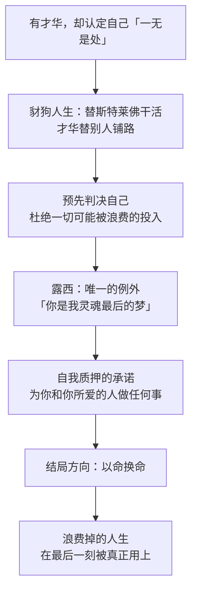

# 03｜西德尼·卡顿：一个自认「一无是处」的人为什么能完成最伟大的牺牲？

> 本篇核心问题：卡顿的自我厌弃从何而来，它又为什么反而成全了他？

> **剧透提示**：本文涉及全书情节，含结局方向，但不展开行刑场面的具体细节。

---

## 开篇：一个值得思考的问题

卡顿第一次出场，姿态就很不体面：法庭上人正襟危坐，他却仰面朝天瘫在椅子里，盯着天花板，像对这个案子、这个世界都毫无兴趣。

就在同一个法庭里，被告命悬一线——证人咬死了「就是这个人」。是卡顿懒洋洋地递了一张纸条出去：让证人看看我，再看看被告。两张几乎一样的脸摆在一起，证人当场不敢咬死了。一桩铁案，被全场最漫不经心的那个人拆穿。

这个开场是狄更斯给读者的第一印象，也是一个谜：一个看起来像废物的人，干了全场最聪明的一件事。整部小说都在解这个谜。

## 一、从故事开始

卡顿是大律师斯特莱佛的助手，小说直接叫他「豺狗」——狮子斯特莱佛冲锋在前、名利双收，豺狗卡顿在夜里裹着湿毛巾替他做案头苦工，把卷宗嚼碎了喂到狮子嘴边。才华是他的，署名是别人的。

他酗酒、失态，庆功宴后对达尔内说：「我是个令人失望的干苦力，我不在乎世上任何人，世上也没有人在乎我。」这话听上去像醉话，后来看更像供词。

然后他做了一件全书最重的事：带着酒气去见露西，告诉她「你是我灵魂最后的梦」。他不求回应，不求怜悯，只求她记住一个承诺——「为了你，也为了你所爱的任何人，我愿意做任何事」，「有一个男人愿意献上自己的生命，保住你所爱之人的生命」。当时听，这是一个潦倒者的情话；多年后这句话被原样兑现：他用自己换回了达尔内的命。

## 二、真正的问题是什么？

卡顿的怪，不在于他坏，而在于他对自己的估价低到反常。

奇怪的是，狄更斯从不解释这个估价从何而来。叙述者只说他是「一个有能力、有情感，却没有能力运用它们、没有能力帮助自己获得幸福的人；他明知自己身上有一片枯焦，却听任它把自己啃食殆尽」（大意）。没有童年创伤，没有失恋前史，没有任何一个事件可以用来结案。这份自我厌弃像是出厂自带的。

于是真正的问题变成：

> 当一个人的自我厌弃找不到病因，它到底是一种病，还是一种诚实？

## 三、人物为什么会这样选择？

先看卡顿要什么。他不要露西——表白时他明说不要她记住他的脸，只要她记住那个承诺。他不要前途——豺狗的活他照干，从不争署名。他也不要体面——醉态、邋遢、刻薄，样样不掩饰。这个人唯一的执念似乎是：不允许自己对任何东西投入「可能被浪费掉」的感情。

一种可能的读法是：自我厌弃是卡顿的预先判决。他抢在世界之前给自己定罪——我反正不行——这样就没人能再让他失望了。这套机制恰好解释了小说里提过的一笔：他少年时就是那种替别人做功课、自己却交不出作业的孩子。替别人活，成了他一辈子的姿势：替斯特莱佛干活，替达尔内挡证词，最后替达尔内去死。

而这套机制恰恰是他能完成牺牲的原因。只有一个真心相信自己不值钱的人，才能把命花得那么果断。他不是在背叛自我厌弃，而是在执行它最彻底的一次——把这枚「贬值的硬币」押在唯一一件他认定值得的事上。这笔交易在他的账本里，居然是唯一赚的一次。

## 四、作者真正想讨论什么？

文本事实上有两点必须先说清。第一，卡顿到死都没有「改过自新」：狄更斯没有给他安排任何浪子回头的桥段，他始终是那个不体面的人。第二，他活着时没有从那个承诺里得到任何回报。

主流解释把这个人物读作「爱情拯救了浪子」——露西是他黑暗里的光。但文本不支持「被拯救」三个字：他没有变好，没有振作，也没有赢得爱情。

一种可能的读法是：成全他的不是爱情，而是「支出」本身。卡顿的悲剧不是他没有价值，而是他坚信自己没有；露西给他的不是光，而是一张合法的账单——终于有了值得把命花上去的地方。注意他承诺的宾语：他爱的是她，肯为之死的对象却是「她所爱的人」。这不是求爱，是立契。

也有学者把卡顿读成狄更斯的自我投射：一个功成名就的作家，内心深处住着一个「本可能被浪费掉」的自己。

## 五、把这个问题放回时代

一八五七年，狄更斯和家人朋友登台演出威尔基·柯林斯的戏剧《冰封深渊》（The Frozen Deep），他扮演理查德·沃德尔（Richard Wardour）——一个有缺陷、失恋、最终以自我牺牲完成救赎的男人。这出戏连维多利亚女王都来看过，轰动一时。两年后，《双城记》开始连载。

学界常认为这段演出经历直接塑造了卡顿——这不难理解：沃德尔和卡顿共享同一副骨架，都是「自认失败的人用死亡赎回人生」。而狄更斯自己在序言里写明，这本书的主要构思就产生于演出此剧期间，他当时「强烈地想要把它化为自己身上的一部分」（大意）。加上一八五八年他正经历婚姻破裂、与结发妻子分居的个人危机，卡顿身上那种「有能力却自我废弃」的焦灼，很难说是纯粹虚构出来的。

一个演员在舞台上把「替死」演过一遍之后，回到书房把它写成了文学史上最著名的替身故事。创作史上很少有回声这么清楚的时刻。

## 六、作品是怎么写出来的？

卡顿这个人物，全靠「替身」这个装置撑着。他和达尔内相貌酷似，这张脸被狄更斯当成一枚定时炸弹埋进全书：第一次引爆在法庭——相貌救了达尔内一命；第二次引爆在结局——相貌又救了达尔内一命，只不过这次付账的是卡顿自己。同一个机关用两次，第一次你以为它只是巧合，第二次才发现它是宿命。

对照组是斯特莱佛。斯特莱佛是卡顿的反面：才华平平，却把自己包装成成功本身——连追求露西都像在颁发奖品，被委婉挡回之后还嘴硬说自己本来也没当真。一个是把铜包装成金的人，一个是把金当成铜的人；狄更斯让这两个人共用一个事务所，就是让读者天天看这两种估价方式擦肩。

叙事上还有一个聪明处：狄更斯迟迟不给卡顿内心戏。前两卷我们只看他的外壳——瘫坐、醉酒、刻薄；直到那场表白，里子才突然翻开。读者和书中人同步体验到「原来如此」——这个人的深，是被他的浅衬出来的。

## 七、如果放到今天

以下部分是基于文本的现代延伸，不是狄更斯原话。

卡顿的「豺狗人生」在今天一点也不陌生：替别人干活、署别人的名、把才华折成别人的梯子，以及那种「我不在乎任何人，任何人也不在乎我」的自我保护式冷漠。预先判决自己不行，以免付出之后再被否掉——这种心理在现代心理学里有的是名字，卡顿算是提前一百六十多年做了病例。

但也要小心一个误读：不要把卡顿读成「自我厌弃也能伟大」的浪漫标本。狄更斯写的是一个悲剧性的补救，不是一条值得效仿的路——他的人生确实被赎回了一部分，但那是在终点线上赎回的。早一点承认自己值钱，本来可以省掉整场牺牲。

## 八、小结

卡顿的自我厌弃没有来路，却有去处：它让他替人活了一辈子，也让他有资格完成最后一次替人——替死。他不是被爱情拯救的浪子，因为他始终没有被「拯救」过；他是一个用最后的行动把「浪费掉的人生」赎回的人——赎回的方式不是变好，而是终于把命花在了一件配得上它的事上。

那张和达尔内一模一样的脸，是狄更斯埋了整本书的问题：复制的人生，能不能比原版更有价值？卡顿用结局回答了。

## 下一篇

卡顿是被「自我判决」毁掉又成全的人；下一篇这位，是被「别人判决」毁掉又艰难重建的人——马内特医生，以及他身后那座关了他十八年的巴士底狱。
