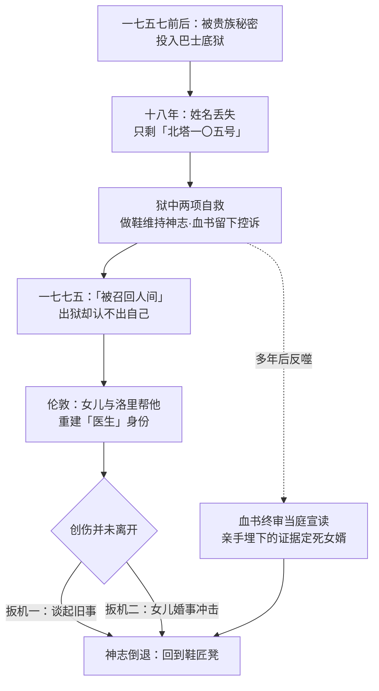

# 04｜马内特医生：十八年的监禁如何毁掉又重塑一个人？

> 本篇核心问题：巴士底狱究竟从马内特身上夺走了什么、又留下了什么？

> **剧透提示**：本文以前两卷情节为主，兼及第三卷审判。

---

## 开篇：一个值得思考的问题

小说里第一个被「复活」的人，拿到的不是奇迹，而是一场漫长的故障。

一七七五年，台尔森银行的洛里接到一句口信：「被召回人间。」被召回的是一位医生——马内特，在巴士底狱里关了整整十八年，所有人都以为他死了。可当女儿终于见到他时，这位「复活」的人说不清自己叫什么。别人问他姓名，他答：「北塔一〇五号。」

这是全书最冷的一笔：监狱从他身上拿走的第一件东西，是名字。出狱之后他学着重新做医生、做父亲、做外公，看起来痊愈了。但狄更斯偏偏不肯写「痊愈」这个词。

## 一、从故事开始

先看监狱还给他留下了什么。

出狱时，马内特只剩一门手艺：做鞋。这是他在牢里学会、用来拽住神志的活儿；出狱后，他仍把那套鞋匠工具当命根子一样守着。小说明确写了他的神志倒退有两种扳机：一种是谈起巴士底旧事，眼神立刻涣散；另一种是重大冲击——女儿婚礼当天早上，达尔内把自己的真实姓氏告诉了他，随后九天，这位医生退回老地方，埋着头给不存在的客人做鞋，醒转后对那九天毫无记忆。

洛里的处理方式值得单独看。这个「生意人」没有把马内特当病人看管，而是登门「请教一个病例」：他说自己有位「朋友」旧病复发，问医生该怎么办。马内特心照不宣地以医生身份开出医嘱——包括「趁病人不在时把那套工具处理掉」。于是洛里和普洛斯小姐趁他出门，把鞋匠凳劈碎烧掉，动手时觉得自己像合谋埋掉一具尸体（大意）。

然后是那封信。马内特在狱中用自己的血写成一封控诉书，控告把他送进监狱的埃弗瑞蒙德兄弟及其后代，藏在北塔一〇五号的烟囱里。巴士底陷落时它被搜了出来；多年后，它在达尔内的终审法庭上被当众宣读——医生十八年前留下的声音，成了给女婿定死罪的铁证。他在法庭上声明自己不记得写过它、也早已放下仇恨，但已经没有人听他的了。

## 二、真正的问题是什么？

把这件事翻译成人话：

> 一个人被毁掉十八年之后出狱，「恢复」到底是指什么？

答案显然不是「回到从前」。巴士底狱拿走了他的姓名、记忆、妻子、半生光阴，以及一个医生原本的社会位置；但它没能拿走三样东西：他在牢里写下的声音（血书）、他用来维持神志的手艺（做鞋），以及他重新爱人的能力（女儿）。

麻烦也正在这里：留下来的三样东西，每一样都是双刃的。做鞋救过他，也一次次把他拽回牢里；血书保存过他的控诉，却在他出狱后被革命的机器拿去，砸向他自己最在乎的人。监狱留下的东西，既可以用来重建，也可以被外人征用。

## 三、人物为什么会这样选择？

马内特一生中最重要的选择，恰恰是在他最没有选择余地的地方做的。

狱中选择写血书，是选择「留下证据」而不是「任凭消失」——他本可以只熬日子，但他偏要花掉宝贵的精力把罪行记成文字，这是一个囚犯仅存的反抗方式。选择做鞋，是选择「维持一点可控的重复」，用手艺给神志留一个抓手。

出狱后他的选择更耐人寻味：他选择不讨账。按说一个被毁掉十八年的人，最正当的诉求就是复仇；可小说明确写了，他出狱后既不追查仇人，也不消费自己的苦难。等到血书在法庭上害到女婿头上时，他声明自己早已宽恕——这不是软弱，这是他主动选择的「不再做受害者」。

这个选择有一个现成的对照组：把那封信当武器继续使用的德法尔热一家。马内特选择让过去过去，革命者选择让过去永远有效——同一份创伤记忆，在两种人手里长出完全不同的东西。

洛里的选择则是另一种守护：他坚持叫马内特「医生」，坚持向他「咨询病例」，本质上是把他被剥夺的社会身份一件件递还给他。治这个人最好的药，原来是把他当医生，而不是当病人。

## 四、作者真正想讨论什么？

文本事实上，狄更斯把「复活」写得极不浪漫：复活者认不出自己的名字，随身带着病，病会复发，而且复发有明确的扳机。到终审那场打击之后，他几乎又被压回鞋匠凳上。

主流解释把马内特读作全书「复活」主题的第一块基石：被召回人间的人，证明了人可以从坟墓里回来。这个读法没错，但只说对了一半。

一种可能的读法是：狄更斯借马内特讨论的不是「能不能复活」，而是「复活之后债怎么算」。马内特的血书是他亲手立下的一笔账——当年写下它，是为了让罪恶不被湮没；多年后它却精准地砸中他最爱的人。创伤记忆一旦写下，就不再只属于写它的人：谁拿到它，谁就有权解释它。巴士底狱从马内特身上夺走的最后一项东西，是他对自己苦难的解释权。

也有学者从这个人物身上读出了时代病灶：他是狄更斯笔下少见的、几乎按医学逻辑写成的创伤病例——诱发、退行、扳机、代偿，一套都齐，比现代创伤理论的术语早了半个多世纪。

## 五、把这个问题放回时代

狄更斯对「监禁毁掉一个人」不是想象，是记忆。一八二四年，他父亲因欠债被关进马歇尔西监狱，十二岁的狄更斯去黑鞋油厂当童工——这段经历他瞒了几乎一辈子，却几乎写进了每一部重要小说。马内特在狱中做鞋的细节，很难不让人联想到那个在鞋油厂里干活的孩子。

放到更大的时代里：「不经审判就把人关进城堡」的密札制度，是英国读者想象旧制度罪恶时最顺手的靶子——它让英国人庆幸自己活在一个有法庭的国度。而维多利亚时代正是「独居监禁」「疯人院改革」争论最热的时候，一个人的神志如何在绝对的孤独里解体，是当时医学与文学共同关心的问题。马内特这个人物，恰好站在这三条线的交点上。

## 六、作品是怎么写出来的？

技巧上最狠的，是那封血书的引信长度。狄更斯在第一卷就把它埋下——藏进烟囱，然后让全书绝大部分篇幅都不再提它；直到第三卷终审，它才被当庭抽出宣读。一条埋了两卷的引信，爆炸时伤到的不是埋它的人所恨的人，而是埋它的人所爱的人。这是全书结构反讽最锋利的一次。

鞋匠凳是另一个设计。它不是普通道具，而是一台「时间机器」：马内特一摸到它，人就回到北塔一〇五号。狄更斯把「创伤倒退」这种极难写的内在状态，物化成了一件家具——读者不需要懂任何心理学，看见他做鞋，就知道他回去了。

## 七、如果放到今天

以下部分是基于文本的现代延伸，不是狄更斯原话。

用今天的眼光看，马内特几乎是一个教科书级的创伤病例：扳机明确（旧事、重大冲击）、退行具体（退回最熟的动作）、对发作期失忆、依赖「安全物」（鞋匠工具），以及最关键的——恢复不等于痊愈，而是学会带着创伤生活。他每次从倒退中回来，都不是因为伤好了，而是因为身边有人把他当「医生」而不是当「病人」来等。

而血书被征用这一笔，放到今天依然刺眼：幸存者的证言一旦进入公共机器，就可能被拿去做幸存者本人不会同意的事。苦难的记忆值得保存，但谁来解释它、拿它去做什么，从来不是写下它的人能决定的。

## 八、小结

巴士底狱从马内特身上拿走了名字、记忆和十八年，没能拿走的是：一门手艺、一封血书，和重新爱人的能力。可这三样遗物全是双刃的——手艺把他往回拽，血书被拿去定罪他的家人，只有女儿和洛里用「把他当医生看」的方式，帮他把人格一件件拼了回去。

所以他是全书第一个「复活」的人，但他的复活不是痊愈，而是带着创伤重新学活。狄更斯借他写下的是一个朴素的判断：人可以从坟墓里回来，但回来的人身上永远带着坟土。

## 下一篇

马内特选择放下血书，可捡起它的人选择了永远不忘。下一篇，我们看德法尔热夫人：一个受害者，为什么会变成比压迫者更冷酷的人。
