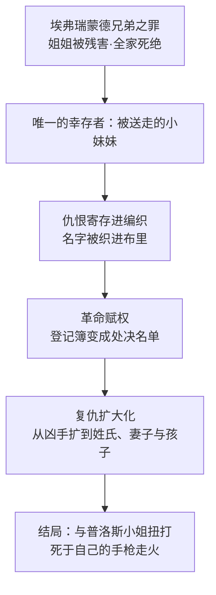

# 05｜德法尔热夫人：受害者为什么会变成比压迫者更冷酷的人？

> 本篇核心问题：她的仇恨从哪里来，又把她带到了哪里？

> **剧透提示**：本文涉及全书情节，包含关键剧情与结局。

---

## 开篇：一个值得思考的问题

巴黎圣安东尼区的酒店里，总有一个女人坐在柜台后面织毛线。她织得极快，眼睛却很少看手里的活，而是像一台安静的登记机器，把进出的每一张脸、每一句话都收进针脚。小说明确写着，那些花纹不是装饰——那是登记簿，织进去的名字，比从世上抹掉这个人还难抹掉。

这就是德法尔热夫人。读者初见她，多半本能地反感；读完全书，却很难简单地说她「坏」。因为狄更斯给了她一笔谁也赖不掉的账：她全家被埃弗瑞蒙德兄弟毁掉，她是那场罪行唯一的幸存者。于是真正的问题变成了：一个受害者，是怎么一步一步变成比压迫者更冷酷的人的？

## 一、从故事开始

她的故事要分两半看。

前半是小说明写的「现在」：德法尔热夫人坐在酒店里编织，旁听革命者议事，在攻占巴士底狱的队伍里挥刀冲在前面，在法庭旁听席上一边织毛衣一边看判决落下。她的编织物是革命最可怕的发明——一本搜不出、烧不掉、删不干净的死亡登记簿。

后半是藏到很后面才揭开的「过去」：马内特医生在狱中写下的血书被当众宣读，里面记着一七五七年埃弗瑞蒙德兄弟犯下的罪行——他们残害了一个农家女子，她的父亲与丈夫相继死去，赶来拼命的哥哥被刺成重伤、死在医生面前，女子本人几天后也咽了气。全家只剩一个被悄悄送走活命的小妹妹。这个小妹妹，就是德法尔热夫人。

这个安排说明什么？说明狄更斯要你先「恨她」，才知道恨是从哪里来的。她不是天生的恶魔，她是贵族之罪锻造出来的成品——一把刀的冷，来自铸刀人的火。

而狄更斯给她的结局同样精确：第三卷结尾，她揣着枪闯进露西的住处——名义上是看这一家有没有为罪犯哀悼（在恐怖的逻辑里，悲伤本身就是罪证），实际上是要把埃弗瑞蒙德家最后几针也织完。她与不会说法语的普洛斯小姐扭打在一起，搏斗中手枪走火，当场毙命。复仇者死于自己的武器——这不是巧合，是狄更斯给仇恨循环画下的句号。

## 二、真正的问题是什么？

把她的故事翻译成普通人的问题，是这样的：

> 当一个人受的伤害足够深，他的复仇还有没有边界？越过边界的复仇，还算不算正义？

日常经验里，我们同情受害者，也默认受害者「有权愤怒」。但德法尔热夫人把这个默认推到了极限：她要杀的不是害她全家的埃弗瑞蒙德兄弟——他们早已死了——而是这个姓氏的最后一脉：一个早已放弃爵位、靠教书自食其力的流亡者，连同他的妻子、幼女和年迈的岳父。她的逻辑是：罪属于整个姓氏，所以姓氏里的每个人都该死。

这说明：她的问题不在于恨错了人，而在于恨的对象从「人」变成了「类」。当她不再区分个体的时候，她就和当年的贵族站到了同一个位置——都是不把人当具体的人看。压迫者当年没看见她姐姐是人，她如今也看不见露西是孩子母亲。

## 三、人物为什么会这样选择？

按人物分析的路子问下去。

她想要什么？表面上是复仇，往深处说是「兑现」——全家死绝这笔账，只有让对方也「绝后」才算两清。对她而言，留下达尔内的妻女，就等于账本上留着没划掉的行。

她怕什么？怕的是账没清完，世界就变了。所以她催促处决、追加株连，一刻不停。小说明写了一个对照：连她丈夫德法尔热先生——同样是受尽压迫的人——都动了「够了」的念头，而她的回答只有一句：「告诉风和火在哪里停吧，别告诉我。」这句话把她自己交代得很清楚：她已经把自己变成了自然力，而自然力没有刹车。

她受到的限制是什么？她看不见「人」。编织这个行为本身就是她的世界观：人在她手里不是脸，是针脚；不是故事，是名字。名字可以追加，可以从一个人扩到一个家族——登记簿从不区分罪责，只登记归属。

选择的后果很清楚：她记下了每一个名字，却丢掉了所有的「人」——包括她自己。狄更斯让她死于走火的手枪，等于让她的武器替她做了总结：这把刀磨到最后，刀口对准的是持刀人。

## 四、作者真正想讨论什么？

文本事实上，狄更斯把德法尔热夫人写成了革命的化身与革命的病灶：她的编织是革命的档案系统，她的冷酷是革命的执行逻辑，她的家史则是革命的起因。她一个人身上，叠着革命的完整因果链。

作者明确表达的部分，可以从他给的结局读出来：他让她死得毫无悲壮感——没有法庭，没有审判，没有遗言，只有一场两个女人扭打出来的走火。这种「不体面的死法」本身就是一种裁决：狄更斯理解她的仇恨，但不宽恕它变成的东西。

主流解释认为，德法尔热夫人是狄更斯「同情革命起因、否定革命手段」这一立场的浓缩载体——这是最常见的读法。也有学者指出，她身上叠着维多利亚时代对「失控的女性」的深层焦虑：她越尽职地织（女性本分），就越危险（织的是死亡），这种性别角色的倒置让当时的读者加倍不安。

一种可能的读法是：她和马内特医生是一对镜像。两人都被埃弗瑞蒙德的罪行毁掉，都被埋进一种「监狱」——一个是巴士底狱的石墙，一个是仇恨的围墙。区别在于：马内特被女儿「织」回了人间，德法尔热夫人却把自己织进了死亡。同样是被害者，一个靠连接复活，一个靠记账活着——这正是「受害者为什么会变成加害者」这个问题，狄更斯给出的两半答案。

## 五、把这个问题放回时代

狄更斯写她的时候，史实底本主要是卡莱尔一八三七年出版的《法国大革命史》。卡莱尔笔下的大革命，既是贵族自取的报应，也是一场吞噬自己的大火。狄更斯在序言里自陈「无人能指望为卡莱尔先生那本杰作增砖添瓦」——德法尔热夫人这个人物，可以说就是那套「报应史观」的人形化：报应来了，但报应自己也会着火。

而一八五九年的英国读者读到她，想到的不只是一七九三年。一八四八年欧洲革命刚过去十来年，英国社会对「暴民」「私刑」「群众当家」的恐惧还很新鲜。一个安静坐在柜台后编织、却掌握生杀名单的女人，恰好把两种恐惧缝在了一起：革命的恐惧，和「看不见的清算」的恐惧——你永远不知道自己的名字什么时候已经被织了进去。

## 六、作品是怎么写出来的？

编织是这部小说里最成功的一个「物」。它同时干三件事。其一，它是有出处的：历史记载显示，大革命时期的巴黎确有坐在断头台下一边织毛衣一边看行刑的「编织妇女」，狄更斯把真实细节挪用成了核心象征。其二，它是情节装置：名单藏在布里，搜不出、烧不掉，比任何文书都可靠。其三，它是神话回声：西方传统里纺织生命之线的从来是女神（希腊的命运三女神纺线、量线、剪线），狄更斯把这份权柄下放给一个酒店老板娘，等于说——革命把「决定生死」的神力，交到了最记仇的人手里。

伐木工的意象是同一思路的配套。那个曾当过修路工的小个子锯木工，成天蹲在街角假装锯木头，管自己的锯子叫「小断头台」，见了露西就用锯子比划砍头的动作。小说明确写出这个人物的可怖不在他做了什么，而在他把杀人演成了游戏——锯木头的吱嘎声，就是断头台落刀声的儿童版。德法尔热夫人在布里记账，锯木工在街角预演：一大一小两个形象，把恐怖从法庭写到了街景。

结局那场对峙的舞台设计，细看也极其讲究：两个女人，一个说法语一个说英语，彼此一个字都听不懂——仇恨的执行根本不需要沟通。扭打中枪走了火，德法尔热夫人倒地，普洛斯小姐被那一声巨响震聋了耳朵。复仇者死了，挡路的无辜者聋了：狄更斯连「代价」都分配得很冷——挡在仇恨路上的人未必死，但一定受损。

## 七、如果放到今天

以下部分是基于文本的现代延伸，不是狄更斯原话。

德法尔热夫人的逻辑今天并不陌生：把罪从「人」扩大到「类」，让复仇从「追凶」变成「追姓氏」。在世代冤冤相报的冲突里，在把某个群体整体定罪的舆论场上，这套逻辑一直在运行——「他们对我们做过什么」一旦替代「这个人做过什么」，名单就开始自动繁殖。

更值得警惕的是她那个「不必沟通」的设定。她和普洛斯小姐语言不通，照样开打——仇恨的执行不需要理解对方是谁。今天的网络审判常常也是这个结构：被挂出来的名字后面是一个你永远不会见面的人，「织进去」只需要一次转发。狄更斯在一八五九年就画出了这条流水线：先有名册，后有正义。

## 八、小结

德法尔热夫人不是反派，她是账单。狄更斯用三层结构写她：先让你看到她的可怕（编织、旁听、催促处决），再让你知道她的来历（血书揭开的灭门之仇），最后让你看到她的终点（死在自己的枪口下）。这个顺序本身就是论证：压迫者的罪行锻造了复仇，复仇接管了正义，正义于是死于自己的武器。

所以「受害者为什么比压迫者更冷酷」这个问题的答案，狄更斯写在了那把走火的手枪上：因为仇恨从不清算仇恨，它只清算人。当记账取代了看见，受害者手里握着的东西，已经和当年贵族手里的是同一件。

## 下一篇

与德法尔热夫人的「死亡编织」正对着的，是另一根线——第二卷的卷名就叫《金线》。下一篇我们看露西·马内特：一个看起来什么都没「做」的女人，为什么成了把所有人缝在一起的那根线。
