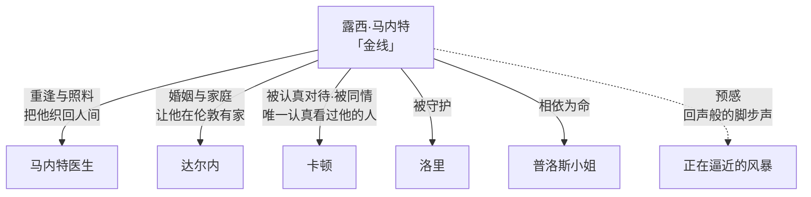

# 06｜露西·马内特：为什么看似柔弱的她成了所有人的「金线」？

> 本篇核心问题：一个没有行动力的角色，凭什么成为全书的情感中心？

> **剧透提示**：本文主要涉及前两卷情节，兼及露西对卡顿的影响，结局方向点到即止。

---

## 开篇：一个值得思考的问题

先说一个对露西很不利的指控，而且是批评史上真实存在的：她是《双城记》里最「扁」的主要人物。她不推动任何关键情节，不卷入任何激烈冲突，遇到大事的标准反应是流泪、昏倒、抱着孩子等待。一代代读者嫌她是狄更斯流水线上那种苍白的「天使型」女主人公——功能完美，血肉稀薄。

但一个古怪的事实是：抽掉她，整部小说立刻散架。马内特没有人可以「回」，卡顿没有人可以爱，达尔内在伦敦没有一个要回来的家，洛里和普洛斯小姐没有要守护的东西。一个「什么都不做」的角色，为什么是所有人的支点？

## 一、从故事开始

狄更斯自己把答案写在了卷名上：第二卷叫《金线》。「金线」明指露西的一头金发，暗指她在整卷里干的那件事——把散落的人织在一起。

她与父亲的重逢是全书第一场「复活」：被关了十八年的马内特医生缩在阁楼上修鞋，已经不会说完整的句子。小说明确写了露西做的事——她没有讲道理，也没有盘问，只是把头靠过去，让父亲抓住她的头发哭。父亲认出的是那头发的颜色，和他狱中贴身保存的一缕亡妻的金发一样；他抓住的是一根真实的线。这场戏说明：她的「能力」不是说服，也不是拯救，而是把自己变成一件可以握住的东西。

对卡顿，她做了另一件看似微小的事：认真地看了他。当这个潦倒的律师袒露自己的无望时，别人都嫌他、笑他，露西的反应是为他掉眼泪。她几乎是他成年以后唯一认真对待过他的人。这一哭在第三卷结出了全书最重的果实；但在第二卷里，它只是她日常做的小事——看见那些别人懒得看见的人。

还有那个著名的意象「回声般的脚步声」：伦敦家里的街角总回荡着路人的足音，露西坐在黄昏里听，对父亲说那像是「将要走进我们生活的人的脚步」。她的预感后来被证明是对的——但在当时，那只是一个安静女人在安静黄昏里的一点不安。

## 二、真正的问题是什么？

露西带来的问题，其实是个衡量标准的问题：

> 一个角色的「力量」，到底该用「做了什么」来量，还是用「连接了什么」来量？

我们习惯用前者：谁推动情节，谁改变局面，谁就是强者。按这个标准，露西几乎不及格——她不越狱，不辩护，不做任何能改变判决的事。但狄更斯换了一把尺子：在一个所有人都将被时代风暴吹散的故事里，能把人拢在一起、让「家」始终存在的那根线，本身就是力量。第二卷里每个人都在围着各自的目标转，只有露西在维护「我们」这个词。

这说明：她的功能不是人物意义上的「主角」，而是结构意义上的「引力中心」。引力不做任何事，但没有它，一切解体。

## 三、人物为什么会这样选择？

严格说，露西几乎没有「选择」的戏——这正是批评者攻击她的地方。但换一个问法：她想要什么，害怕什么？

她想要的很朴素：父亲活着，家不散。她的全部行动——照料父亲、操持家务、善待卡顿、在窗口等丈夫——都指向同一个方向：维持联结。她害怕的也很具体：那些回声般的脚步声，「将要走进我们生活的人」。也就是说她隐约知道风暴正在路上，而她能做的只有一件事：在风暴到达之前，把家织得更密。

选择的结果是：她确实「没做什么」，但她维护的那张网，成了所有人各自选择的意义来源——达尔内的冒险是为了旧仆与家，卡顿后来的牺牲是为了她的家，马内特的忍耐是为了女儿。她不动，但所有人的动都绕着她转。

## 四、作者真正想讨论什么？

文本事实上，狄更斯用卷名亲手给露西定了性：《金线》。这不是评论家的事后追认，而是作者的设计说明书——他明说这个人物的功能是「织」。

主流解释却对她很不客气。常见的批评有两条：其一，她是维多利亚时代「家中天使」理想的标本——温柔、忠贞、善于照料、没有自我，是男性幻想而非真实人物；其二，她几乎没有内心戏，狄更斯不写她想什么，只写她让别人感觉到什么。亨利·詹姆斯一八六五年评狄更斯「不是哲学家」，批评的正是这类人物：一切都对，就是不像活人。

也有学者替她辩护，读法是：她的「扁」是有意的——狄更斯要写一场把一切私人之物碾碎的风暴，就需要一个「纯粹的私人性」作为对立面。她不是一个要塑造的人，而是一样要保卫的东西。她的单薄恰恰是功能的诚实：只有画成符号的天使，才能量出符号之外的世界有多脏。

一种可能的读法是：露西和德法尔热夫人是狄更斯放在天平两端的两种「编织者」——一个用金线把活人织回人间，一个用毛线把活人织进坟墓。全书真正的对决不在法庭也不在街垒，而是这两种「织」。这样读，露西就不是次要人物，而是主题的另一半载体。

## 五、把这个问题放回时代

「家中天使」这个形象有确切的时代出处：与《双城记》几乎同时，考文垂·帕特莫尔的长诗《家中天使》（一八五四年起陆续出版）正把「温柔无私的妻女」封为维多利亚家庭的守护神。露西就是这个时代理想的文学标本——当时的读者并不嫌她「扁」，她正典得近乎模范。

但放回时代还能读出另一层：一八五九年的英国正自信于家庭、秩序、海峡这三重安全感，露西恰是这三样东西的人形集合体。狄更斯让大革命的风暴一路追进她的客厅——街角的脚步声、突然闯进家门的抓捕——等于在问他的同胞：你们引以为傲的「家」，经得起对岸那种风暴吗？露西的柔弱不是缺陷清单上的一项，而是狄更斯故意挑的测试材料：用最软的东西，测最硬的冲击。

## 六、作品是怎么写出来的？

狄更斯写露西的手法，值得注意的不是他写了什么，而是他刻意不写什么：几乎不写她的内心独白。整部小说里，她的内心唯一一次被正面打开，就是「回声般的脚步声」那一场——黄昏，街角，她听着不知是谁的脚步，说那像「要走进我们生活的人」。这是全书最重要的伏笔装置之一，而狄更斯偏偏把它安在全小说最「浅」的人物心里。

这个安排是计算过的：一个从不发表意见的人偶尔说一句预感，分量反而比任何智者的预言都重。而且她预感的方式很「露西」——不是分析时局，而是「听」。她对世界的感知从来不是判断，是接收：脚步声、敲门声、楼下的动静。狄更斯把她写成一个接收器，恰好对应她「连接线」的功能。

金线作为意象还有一层结构作用：第二卷长达二十四章，时间跨度近十年，事件散在伦敦的法庭、银行、街角和巴黎的酒店——是露西这根线把这些散章拢成了「一个家的编年史」。狄更斯把这本书的结构设计成一张网，而金线就是网里唯一从头到尾不断的那根。

## 七、如果放到今天

以下部分是基于文本的现代延伸，不是狄更斯原话。

露西的困境今天有个更专业的名字：照护劳动与情感劳动的不可见性。一个家庭、一个团队、一个社群里，总有一个人在做「连接」的工作——记得每个人的状态，接住每个人的情绪，让「我们」这个词持续成立。这种劳动不产生可见成果，所以按「做了什么」的计量方式，它永远接近零；可一旦这个人停下来，系统会以惊人的速度散掉。

所以「她凭什么当中心」这个问题，今天可以反着问：我们评价一个人的价值时，是不是系统性低估了「连接者」？狄更斯在一八五九年给出的答案是保守的——他把连接者画成天使，供在家庭神龛里。今天更诚实的读法或许是：承认那根金线是真正的劳动，而不是天生的美德。

## 八、小结

回到开头那个指控：露西扁不扁？如果要求她有城府、有挣扎、有弧光，这个指控成立——狄更斯没打算写这些。但她的扁不是失败，是设计：她是一根线，线的意义不在自身，在于它缝住了什么。第二卷里她缝住了一个家，第三卷里所有男人拼了命要保护的，正是这根线缝出来的东西。

所以对她最准确的评价也许是：露西不是全书里最丰富的人，却是全书里最不可或缺的功能。狄更斯把「天使」写成了结构件——你可以嫌这个天使不够人，但拆掉她，小说塌给你看。

## 下一篇

露西预感里的脚步声，终究会走到门口。下一篇离开人物，去看那场风暴本身：一场为平等而起的革命，是怎么一步一步变成断头台的流水线的。
