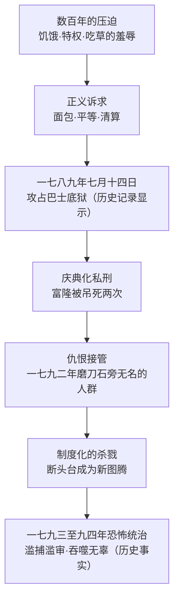

# 07｜大革命为什么会从追求正义滑向吞噬无辜的恐怖？

> 本篇核心问题：一场为平等而起的革命，怎么变成了断头台的流水线？

> **剧透提示**：本文涉及全书情节与结局，并兼及真实历史背景；文中已区分「历史记录显示」与小说虚构。

---

## 开篇：一个值得思考的问题

《双城记》第三卷里有一个细节，初读容易滑过去：断头台流行之后，巴黎人给它起了个绰号，叫「国家剃刀」；人们把它做成小模型挂在胸前，像挂护身符。小说明确写道，它取代了十字架的位置——在十字架被丢弃的地方，人们向它鞠躬，对它顶礼膜拜。

一场以「自由、平等、博爱」为口号的革命，最后造出来的新图腾是一台杀人机器。这中间到底发生了什么？狄更斯用了整整两卷篇幅回答这个问题，而他给出的答案比「革命错了」要冷得多。

## 一、从故事开始

狄更斯写革命的变质，用的是逐级升高的三个温度。

第一级是庆典化的私刑。小说里第一个骇人的群众场面是富隆之死：这个老官僚曾放话说饥民饿了可以吃草——后来他装死逃命，被群众从藏身处拖出来，吊上路灯杆；绳子断了，人摔下来没死，被拖起来「复活」了一次，再吊一次；死后嘴里被塞进草，让他带着自己的名言上路。这场戏可怖之处不在血腥，而在它是一场庆典：杀人被办成了狂欢节，连「复活」都成了笑话的包袱。

第二级是组织化的磨刀。几年后，同样的群众不再需要路灯杆了。一七九二年九月，台尔森银行的院子里立起一块大磨刀石，男男女女围着它磨刀——汗流浃背、满身血污，小说明确写找不出一个身上没有血迹的人，也没有一双眼睛能让人读出任何东西。这个场景的恐怖不在刀，在于人群已经不再是「一群人」，而是一部机器。磨好的刀去哪里？去砍下一批人——然后回来接着磨。

第三级是图腾化的断头台。到了一七九三年，杀人已经有了专用机器、专用程序、专用观众席：台下的编织妇女把每一颗人头记进活计，街头的孩子玩砍头游戏，广场上的卡曼纽拉舞跳到疯狂——小说明写那是一种狂乱的、像生了病的舞，人群围成圈甩动手臂，越转越快，直到有人倒下。杀人的事，至此从私刑变成了行政，从行政变成了信仰。

## 二、真正的问题是什么？

把这三级温度摆在一起，真正的问题浮出来了：

> 正义的诉求，是什么时候、以什么方式，被仇恨接管的？

注意狄更斯没有否定革命的起点。饥饿是真的，吃草的羞辱是真的，巴士底狱里关着无辜者是真的。一七八九年七月十四日，巴黎群众攻陷巴士底狱——历史记录显示，这座当时只关着七名犯人的要塞被攻破，象征意义远大于军事意义：旧制度的墙塌了。小说明写攻占之后，德法尔热直扑医生当年的牢房翻找文书——他们要找的不只是武器，更是罪证：谁来清算那些把人送进去的人？

清算本来可以是正义。但狄更斯让我们看到它变质的三个台阶：第一步，惩罚从「罪」滑向「人」——富隆该不该死另说，重要的是吊死他很好玩；第二步，从「人」滑向「类」——不再问这个人做过什么，只问他姓什么、属于哪个阶层；第三步，从「审判」滑向「流水线」——断头台不问案子，只问今天有几颗头要剃。仇恨走完这三步，正义就只剩一个空壳：法庭还在，程序还在，但判决早已写好。

## 三、人物为什么会这样选择？

这一篇的「人物」不是某一个人，而是群众——狄更斯恰恰是这样处理的。磨刀石旁的人群没有名字、没有面孔，「找不出一双能读出东西的眼睛」。这不是狄更斯偷懒，这是他的论点：暴力一旦开始批量执行，个体就消失了——不是被杀的人先消失，是杀人的人先消失。

群众的「选择」，其实是一连串放弃的累加：放弃分辨（富隆有没有罪不重要，重要的是吊死他很好玩）、放弃边界（孩子围观砍头是娱乐）、放弃停下来的机制（卡曼纽拉舞的唯一动作就是继续转）。等到革命法庭开足马力，连「停止」这个词都消失了——恐怖的逻辑是不革命即反革命，嫌疑人名单像编织物一样只会变长，不会变短。

## 四、作者真正想讨论什么？

文本事实上，狄更斯把革命写成了前后两个完全不同的东西：前半是「报应」——贵族种下的因；后半是「吞噬」——无人幸免的果。让这两半同框，就是他对大革命的核心表态：他不赦免旧制度的罪，也拒绝给新制度的杀戮发许可证。

作者明确表达的部分在序言与史实来源上：他说这部小说主要得益于卡莱尔一八三七年的《法国大革命史》，自陈无人能指望为那本杰作增砖添瓦。卡莱尔的大革命史观本来就是「烈火式的报应史」——压迫积累到极点，必然炸成吞噬一切的大火。狄更斯继承了这套因果，但加了一样卡莱尔着墨较少的东西：对执行恐怖者的近距离凝视——磨刀石、编织妇女、锯木工。

主流解释认为，这体现了狄更斯的「自由派矛盾」：同情受压迫者，恐惧失控的群众，最终把希望押在私人美德（爱与牺牲）而非公共暴力上。近年学者（琼斯、麦克多纳、米主编的研究卷）进一步指出，狄更斯其实常偏离卡莱尔的保守史观——他给恐怖时期的受害者与施害者都留出了人形，而不只是史书里的人群。

一种可能的读法是：狄更斯真正的论敌不是革命，而是「记账式正义」。注意他反复让恐怖以「登记」「名单」「编织物」的形式出现——一旦清算变成文书工作，杀人就从愤怒变成了行政。这个读法能解释一个细节：为什么书中最可怕的场景不是街头的狂暴，而是法庭上按部就班的宣判。

## 五、把这个问题放回时代

先划清真实与虚构的边界。历史记录显示：一七八九年七月十四日巴黎群众攻占巴士底狱，大革命爆发；一七九二年九月发生监狱屠杀；一七九三年至一七九四年雅各宾专政实行恐怖统治，断头台处决的遇难者数以万计，革命法庭的审理日趋草率——这些是大历史，不是狄更斯的发明。小说里，富隆有历史原型（约瑟夫·富隆，曾放言饥民可吃草，一七八九年七月被暴怒的群众处死，嘴里被塞进草——与小说所述大体吻合，细节有加工）；卡曼纽拉舞、革命法庭、大规模逮捕也都是史实元素。虚构的是马内特一家、达尔内与德法尔热夫妇这些具体的人——狄更斯把虚构的人放进真历史里，让真历史从他们身上碾过去。

那么，一八五九年的狄更斯为什么回头写它？他身处的英国刚看完一八四八年的欧洲革命浪潮，对「暴民政治」的警惕是维多利亚中期的空气。而狄更斯又不是简单的保守派——他终生以揭露贫富不公著称。于是《双城记》成了他自我辩论的战场：他比谁都清楚压迫会酿出革命，又比谁都不信任革命能兑现它承诺的正义。

## 六、作品是怎么写出来的？

狄更斯写恐怖的笔法有一个明显的换挡：前两卷多用「人」的视角，第三卷频繁切到「物」与「群」的视角——磨刀石、锯子、路灯杆、断头台、围成圈跳舞的人群。叙事一旦退到全景，人就缩小成零件；这正是恐怖统治的形式本身：把人变成数字。写法在替论点干活。

再说断头台的象征操作。狄更斯给它安排了三重身份：工具（剃头）、绰号（国家剃刀）、图腾（取代十字架）。这三重身份是递进的——一个东西先被使用，再被调侃，最后被膜拜；暴力的正常化走的正是这三步。等到它成了胸前挂的护身符，杀人就完成了从「手段」到「信仰」的升级。

还有卡曼纽拉舞的调度：狄更斯不写战场写舞场——人群围圈、甩臂、旋转，越跳越狂，直到纷纷倒地。舞蹈的意象精准在两点：其一，它没有指挥，每个舞者同时是发动者与跟随者——暴力的责任就此分摊到消失；其二，它没有目的，转圈的唯一意义就是继续转——恐怖的节奏就此自我维持。一支舞，写完了一整套恐怖动力学。

## 七、如果放到今天

以下部分是基于文本的现代延伸，不是狄更斯原话。

「正义被仇恨接管」的三步曲，今天仍然能逐条对号：从惩罚「罪」到惩罚「人」（网络围攻里没人关心罪与非罪的比例）、从「人」到「类」（贴一个标签就能整体定罪）、从审判到流水线（转发即投票，处决即执行，没有上诉）。狄更斯写的磨刀石换了形态——今天的刀不需要磨，名单自己会繁殖。

而断头台变图腾那一幕，是这本书给所有「以正义之名」的运动留的警告牌：当一个运动开始崇拜自己的惩罚工具、把处决办成庆典时，它纪念的就不再是正义，而是它自己的权力。历史记录显示，一七九四年的恐怖最终吃掉了它自己的孩子——罗伯斯庇尔本人也死在了那台「国家剃刀」下。仇恨的机器一旦开动，最后一个乘客往往是司机。

## 八、小结

狄更斯对大革命的答案可以压成一句话：革命的起因是正义的，革命的败局是仇恨的。他用富隆的两次吊死写清算法则的变质，用磨刀石写个体的消失，用断头台写暴力的图腾化，用卡曼纽拉写恐怖的永动机制——四个场面，恰好是从「追求正义」到「吞噬无辜」的四个台阶。

所以这本书最冷的地方，不是写了多少血，而是它写清了那台机器的工作原理：先删除人脸，再替换图腾，然后让一切自己转起来。正义不是被推翻的，是被接管之后慢慢饿死的。

## 下一篇

问题来了：写出这场灾难的狄更斯，自己站在哪一边？他同情挨饿的平民，又恐惧杀人的暴民；他让贵族的罪行历历在目，也让断头台嚼碎无辜。下一篇就处理这个最难的问题：面对贵族与平民，狄更斯到底站在哪一边——或者，他根本拒绝站队。
