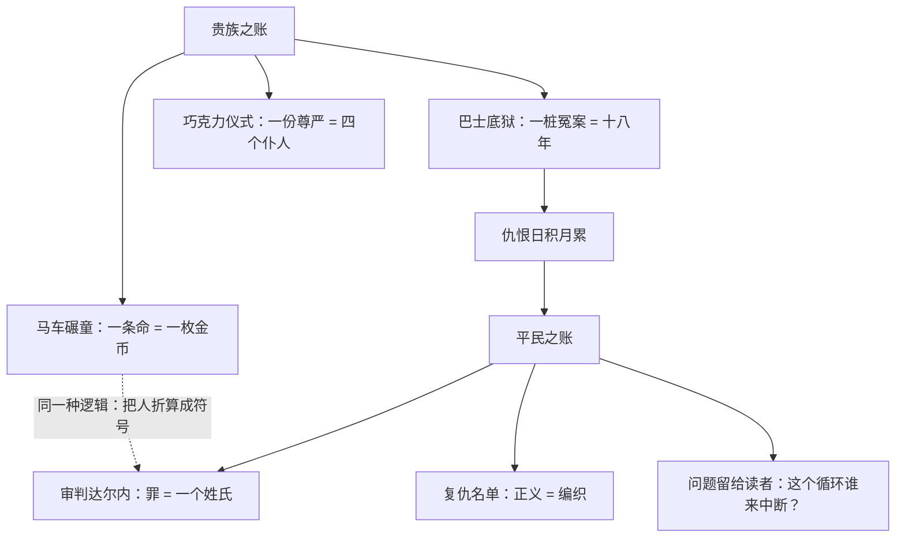

# 08｜面对贵族与平民，狄更斯到底站在哪一边？

> 本篇核心问题：他同情挨饿的平民，又恐惧杀人的暴民——这种矛盾是立场还是局限？

> **剧透提示**：本文涉及全书情节与主题讨论，会触及结局方向，但不展开行刑细节。

---

## 开篇：一个值得思考的问题

大革命爆发前夕的巴黎街头，一辆侯爵的马车在狭窄的巷子里狂奔。车轮碾过一个孩子——孩子当场死了。孩子的父亲加斯帕抱起尸体嚎哭。侯爵从车窗里探出头来，第一句话不是道歉，而是责怪：你们怎么不看住自己的孩子？我的马要是受了惊怎么办？

然后他做了一个动作：从车窗里扔出一枚金币，算是赔偿。

马车开走了，有人把金币扔回车里。不久之后，侯爵在自己的庄园里被人刺死。

这是《双城记》里最著名的场景之一。几乎每个读者读到这里都会想同一个问题：写这本书的人，到底站在哪一边？他写平民挨饿时你恨贵族，他写暴民杀人时你又怕革命——狄更斯自己，究竟站在哪里？

## 一、从故事开始

先看狄更斯替「贵族」这一边记下的账。

马车碾童只是侯爵罪行里最直白的一笔。狄更斯还安排了一场看似好笑的戏：侯爵每天早晨喝一杯巧克力，需要四个仆人同时伺候——一个端杯子，一个扶碟子，一个递餐巾，还有一个专门负责把巧克力送进他嘴里。少一个人在场，这杯巧克力就喝不下去，侯爵的尊严便无法成立。

这段描写是喜剧笔法，但本意不是幽默：一个人高贵到连喝水都需要四个人托举，说明他的「高贵」完全由别人的劳动垫着。喜剧的壳里装的是结构性的残忍——侯爵不需要存心作恶就已经在作恶，因为整套制度替他省掉了「看见穷人」的麻烦。

再看平民这一边的底色。圣安东尼区，一桶红酒在街头泼洒，饥饿的男女老幼扑上去抢喝，有人用手指蘸着泥浆里的残酒往嘴里送（这幅画面藏着一层更深的伏笔，先按下不表）。狄更斯要的是让读者先记住饥饿的形状——账不是凭空来的，是一杯一杯攒出来的。

然后他把镜头对准了一个「好贵族」。查尔斯·达尔内是侯爵的侄子，主动放弃爵位和家产，跑到伦敦教法语自食其力——他用行动与家族切割。可是一七九二年他回到巴黎，仍然被捕，最终被判处死刑。理由只有一个：他姓埃弗瑞蒙德。

这是全书最锋利的一笔讽刺：革命的法庭不审判你做过什么，只审判你姓什么。一个用整个人生拒绝贵族身份的人，死在了贵族身份上。

## 二、真正的问题是什么？

「狄更斯站哪边」这个问题，拆开了其实是两个不同的问题。

第一个问题：他认为旧制度该被推翻吗？从文本看，答案几乎是肯定的——马车、巧克力、巴士底狱，他把贵族的恶写得体无完肤，而且明确把革命写成这些恶行的「果」。

第二个问题：他认为革命者的复仇是正义的吗？答案同样清楚——他让最正直的流亡者被判死刑，让复仇者的名单越织越长，让断头台变成流水线。

所以真正的问题是：**一个人能不能同时反对两样东西？** 同情挨饿的人，和恐惧杀人的暴民，这两件事在逻辑上并不冲突——但在阅读期待里冲突。我们习惯了「作者同情谁，谁就代表正义」的单选题，而狄更斯交上来的答卷是一道双否题。

用普通人的话讲：他不想回答「贵族和平民谁对」，他想让你看见「压迫会生出什么样的仇恨，仇恨又会生出什么样的新压迫」。这是一本账的两页，谁也不能只读其中一页。

## 三、人物为什么会这样选择？

这一篇里值得分析的「选择者」，其实包括狄更斯本人——他作为叙事者，替两类人分配了不同的笔墨。

对贵族，他选择的写法是**让人物自己开口**。侯爵不需要旁白批判，他只要说话——「我的马」「你们的孩子」——就完成了自我审判。狄更斯给贵族的台词几乎全是居高临下的短句，因为在一个不必把平民当人的世界里，长句子是多余的。

对平民，他选择的写法是**先给饥饿特写，再给暴力全景**。泼酒抢饮的人群是具体的、有脸的、让你心疼的；而一旦汇成洪流，他们就成了没有名字的复数。这个顺序很讲究：狄更斯坚持让你先认识作为受害者的人，再面对作为施暴者的众——倒过来写，同情会缺席；只写前一半，恐惧会缺席。

夹在中间的加斯帕和达尔内，是他安排的两块试金石。加斯帕把金币扔回马车，是平民拒绝被定价；达尔内把爵位扔回给家族，是贵族拒绝被豁免。两个「扔回去」的人，一个后来因刺杀侯爵被处死，一个被革命法庭判死——在狄更斯的账本上，**无论出身，凡是还保有个人良知的人，都会被时代的车轮碾到**。这不是站队的写法，这是两边都不讨好的写法。

## 四、作者真正想讨论什么？

先把证据摆清楚。

文本事实：小说对贵族暴行的谴责笔墨（侯爵的全部戏份、马内特医生被囚十八年的冤案）与对革命暴力的恐怖描写（第三卷的审判与处刑场面）在体量上都极重，且没有任何一处旁白替其中一方开脱。

作者观点：狄更斯在一八五九年的序言中自陈，这个故事的构想由来已久，并谦逊表示「无人能指望为卡莱尔先生那本杰作增砖添瓦」——他自认是在卡莱尔《法国大革命史》铺好的史实地基上写小说，而不是另写一部历史。

主流解释：狄更斯的立场是「双重否定」——他承认革命是被压迫逼出来的必然（仇恨有它的账簿），也坚持恐怖统治是对正义的背叛（复仇不等于正义）。在这种读法里，「不站队」恰恰是最清醒的立场：他拒绝的不是判断，而是让读者舒服的单选题。

其他解释：一些学者近年给出了更细的分辨。以琼斯、麦克唐纳与米主编的研究文集及马克·菲利普的相关章节为代表，研究者指出狄更斯常常偏离卡莱尔的保守史观，对恐怖时期表现出一种「自由主义式的矛盾」——他既不像卡莱尔那样把革命写成天谴式的烈焰，也不像激进派那样为暴力辩护，而是停在中间地带。这个中间地带本身，就成了争议的对象。

于是争点落在最后一层：**这种双重否定，究竟是深刻还是逃避？**

支持「深刻」的读法：同时看见两笔血账是对读者诚实。历史从来不是选边题，强迫作家选边才是对小说的误解。

支持「逃避」的读法：把结构性问题摊平成「两边都有错」的道德问题，等于搁置了真问题——压迫该不该被推翻？如果反抗必然滑向恐怖，被压迫者除了忍耐还剩什么？狄更斯没有回答，也未必回答得了。

一种可能的读法是：两种批评各对一半。狄更斯的「不站队」在美学上是深刻——它让小说至今无法被任何一派干净地征用；在政治上是局限——它确实没有给出路。承认后者不损害前者，正如承认前者也不能掩盖后者。

## 五、把这个问题放回时代

狄更斯为什么在一八五九年这样写法国？因为他真正担心的从来不只是法国。

他写作时的英国，是一个自认为已经「免疫」的国家：议会改革过去了，宪章运动平息了，一八四八年席卷欧洲大陆的革命浪潮绕开了英伦三岛——伦敦的绅士们有理由相信自已站在安全的岸上。而狄更斯一辈子都在跟这种自满作对：他写工厂、写济贫院、写小杜丽一家进出监狱的人生，还在同一时期的小说里发明过一个专门拖垮一切政务的官僚衙门。他比同代任何作家都清楚英国底层的锅里煮着什么。

所以《双城记》里的法国更像一面举给英国看的镜子：你们的太平，是真的解决了问题，还是只是把问题推迟了？在这个动机下，「两边各打五十大板」不是骑墙，而是警告——贵族的账不还，平民的账就会变成血账。这是他对一八五九年的读者真正想说的话。

他的史实底本主要是卡莱尔一八三七年的《法国大革命史》，他自称反复研读。卡莱尔把大革命写成一场注定的天火，狄更斯借来了天火，却把镜头压得更低——低到一辆马车碾过孩子的高度。

## 六、作品是怎么写出来的？

「不站队」不是一句口号，狄更斯为它配了一整套写法。

最显眼的是**镜像结构**：小说前半部每一笔贵族之恶，都能在后半部找到一笔平民之恶与之对称。马车碾童对应断头台的流水线；侯爵把孩子的命折算成一枚金币，革命法庭把达尔内的命折算成一个姓氏。两边做的是同一件事——把人折算成符号。

其次是**笔法分工**：写贵族时用喜剧性讽刺——巧克力仪式几乎是一段滑稽戏，讽刺让读者站在高处审判；写暴民时用不带缓冲的写实恐怖，恐怖让读者跌进受害者的位置仰视暴力。两种阅读体位，狄更斯不让你在任何一种里舒服地站着。

最后是**不安排代言人**。达尔内善良但无力，洛里忠诚但只会执行，卡顿超然但选择用行动而非言论作答。狄更斯故意不给小说安排一个「观点正确」的传声筒，逼读者自己去做那道他拒绝代答的题。

## 七、如果放到今天

以下部分是基于文本的现代延伸，不是狄更斯原话。

「你到底站哪边」是今天舆论场里最常被挥舞的问题。任何公共事件之后，沉默是罪，含糊是罪，「两边都有问题」更是大罪——它会被两边同时定性为对方的同谋。

狄更斯的例子给出了一种参照，也给出了一种警示。参照在于：拒绝站队可以是一种诚实——当一个议题真的记着两笔账，硬选一边才是撒谎。警示在于：「两边都错」同样可能是最偷懒的姿态——它免除了发言者回答「那该怎么办」的义务，而真正的难题恰恰在那里。

这本书的一个现代用法也许是：先承认两笔账都存在（这是狄更斯的诚实），再追问哪一笔是因、哪一笔是果（这是狄更斯没替我们做完的题）。只学他的一半，就会学成油滑或偏激。

## 八、小结

回到开头那辆马车。狄更斯写它的时候，心里装的恐怕不是「贵族都是坏人」或「革命都是错的」这类单句判断，而是一条因果链：金币能买断一个孩子的命，是因为制度允许它买断；而当年扔回金币的那只手，多年后握住的会是刺向侯爵的刀。

所以本篇的读法是：狄更斯没有站在贵族与平民之间的任何一端，他站到了「因果」那一边——他要读者同时看见两笔血账，然后自己判断这个循环该不该、能不能被中断。这个选择成就了《双城记》：它让小说无法被任何一派干净地征用，也因此比任何一篇檄文活得都久。但它也有真实的代价：「怎么办」被完整地留给了读者，而狄更斯自己始终没有在政治层面给出答案。

他给出的唯一答案不在政论里，而在一个人的命里。

## 下一篇

狄更斯不肯在政治上给出答案，那他把答案放在了哪里？注意这本书第一卷的卷名——《死人复活》。下一篇我们来看：为什么「复活」才是这部小说真正的主题。
