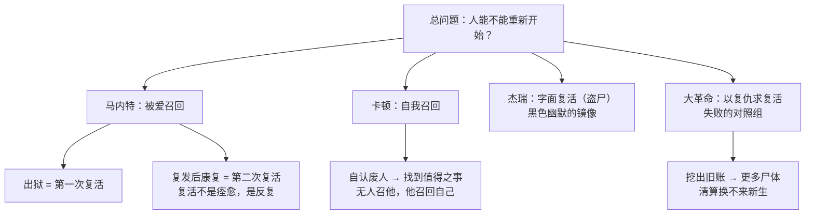

# 09｜「复活」为什么才是这部小说真正的主题？

> 本篇核心问题：从第一卷卷名到卡顿临终的经文，「复活」如何统摄全书？

> **剧透提示**：本文涉及全书情节与结局方向，包含对主题的回溯性讨论。

---

## 开篇：一个值得思考的问题

《双城记》第一卷有一个奇怪的卷名：《死人复活》（Recalled to Life）。

奇怪之处在于：这是一部写大革命的书。翻开之前，你期待的第一卷卷名或许是「风暴将至」之类，而狄更斯给的却是「被召回人间」。更奇怪的是，这个卷名在小说里先以一句口信的形式出现——银行老职员洛里带给马内特小姐的消息只有短短几个字：「被召回人间」。一个被关了十八年的老人要出狱了，送信的人不直说「你父亲还活着」，而是用了一种近乎神迹的说法。

再看一眼替银行跑这趟差的人叫什么：杰瑞·克拉彻。他白天是银行的听差，夜里有一门见不得光的副业——盗尸。当时的行话管这种人叫 resurrection man：复活人。

一个「复活」的卷名，一句「复活」的口信，一个以「复活」为绰号的小丑式人物——狄更斯在第一卷里把同一个词埋了三遍。这不是巧合，是宣告：这本书真正的主题不是革命，是复活。

## 一、从故事开始

先把「复活」在书里出现过的形态清点一遍。

第一次是马内特医生。他在巴士底狱被埋了十八年，出来时已经不算一个完整的人——忘了自己的名字，只会做鞋。女儿露西用陪伴把他一点点拉回人间。这是第一次复活：**靠别人的爱召回**。

但狄更斯没有让复活一次到位。后来，一个与当年冤狱相连的身份真相在露西婚礼前后揭开，触发了旧伤，马内特重新缩回鞋匠凳前，再度忘了自己是谁。几天之后，他又醒转过来——这是第二次复活。这一笔很关键：狄更斯写的复活不是痊愈，是反复。

第二次大的复活属于西德尼·卡顿。这个自认把人生浪费干净的潦倒律师，没有人来召他——他是自己把自己召回的。他找到了一件「值得把命放进去」的事，并决定去做。这是另一种复活：**靠自己回头**。

第三次是反讽的。杰瑞·克拉彻的「复活」是真的从坟墓里挖东西——把刚下葬的尸体偷出来卖给解剖室。狄更斯把一个最低俗的行当和全书最高的主题用同一个词绑在一起，让崇高与滑稽共用一根骨头。

最后一次在结局。卡顿赴死之前，萦绕在他心里的是《约翰福音》的句子：「复活在我，生命也在我。」这句经文的回声在小说里不止一次出现——这是文本事实，不是评论家的发现。刑场上的具体一幕自有它单独的分量，这里只需记住：全书以一句关于复活的经文收尾。

## 二、真正的问题是什么？

清点完会发现，「复活」在这本书里从来不是宗教神迹，而是一个被反复追问的人间问题：

**一个已经「不算活着」的人，能不能重新开始？**

马内特活着，但他有十八年不算活着；卡顿活着，但他自认早就把自己活废了；连盗尸人杰瑞都是个黑色玩笑——他让死人「复出」，自己却从没真正活出过样子。狄更斯把这些人都算作某种意义上的「死人」，然后问：他们还能不能回来？

这个问题之所以锋利，是因为书里同时立着一个反面对照：大革命许诺的也是一次「复活」——把法兰西蒙受的不义从坟墓里挖出来，让一个新的民族从旧世界的尸体上站起来。可小说写到最后，这场社会复活挖出的是更多的尸体。两相对照，狄更斯真正的问题显形了：**复活到底靠什么完成？靠清算旧账，还是靠别的东西？**

## 三、人物为什么会这样选择？

三个「死人」，三条复活的路径。

马内特的路径是**被爱召回**。他自己没有力气回来——十八年监禁毁掉的正是「自己回来」的能力。露西做的不是治疗，是持续在场：让他重新习惯有人等他吃饭、有人喊他父亲。所以他的复活是关系的产物；也正因如此，当关系再次受到威胁，他会复发。第二次复活证明：被召回不等于痊愈，创伤会回访，但人可以带着回访继续活。

卡顿的路径是**自我召回**。没有人来救他，因为连他自己都觉得不值得救。他的转折点不是得到爱，而是找到一个「值得」的对象。一种可能的读法是：卡顿的复活之所以是全书最彻底的一次，恰恰因为它不可逆——别人给的复活可以被夺走，自己挣来的拿不走。

杰瑞的路径是**没有走完的路径**。盗尸人白天鞠躬、夜里掘坟，被儿子撞破、被妻子念叨，末了嚷嚷着要洗手改行——狄更斯给这个小丑留了一条没写完的改过线。这条草草收场的副业线藏着用意：连最不入流的「复活人」都可以盘算重新做人，那么「人能不能重来」这个问题，狄更斯是打算问到最底层的。

## 四、作者真正想讨论什么？

分层说清楚。

文本事实：第一卷卷名是《死人复活》；「被召回人间」是小说原话；杰瑞·克拉彻的副业在原作里就叫 resurrection；《约翰福音》「复活在我，生命也在我」的经文在小说中多次回响，直至结局。这些都是白纸黑字。

主流解释：「复活」是统摄全书的第一主题——它把私人救赎线（马内特、卡顿）与社会动荡线（革命）拧成一股绳：人死而复生，旧秩序死而新秩序生，全书所有大事都可以登记在「死与生」的总账本上。

其他解释：也有研究者指出，狄更斯的「复活」是一次世俗化改写——经文的在场不等于神学的在场。小说里真正完成复活工作的从来不是上帝，而是具体的人：露西的在场、洛里的护送、卡顿的代死。换言之，这是一部用圣经词汇写成的、关于「人与人如何互相救活」的书。

一种可能的读法是：书里的复活其实分两种时态。马内特式是**被动态**——等人来召；卡顿式是**主动态**——自己去应答；而革命展示的是**错误时态**——以为把旧的埋掉就能让新的复活，结果只是在掘坟。杰瑞站在三种时态的交叉口，用一把铁锹把崇高主题挖进了泥地——狄更斯故意让最低贱的人干「复活」的活，仿佛在说：这个词若不落到泥里，就永远是空话。

## 五、把这个问题放回时代

「复活人」不是狄更斯的虚构。维多利亚早期的伦敦真实存在着盗尸行业：医学院与解剖学校对尸体的需求远超合法供给，盗挖新坟卖给解剖室是一门夜间生意；一八二八年爱丁堡的伯克与黑尔案——干脆杀人卖尸——更让「resurrection man」这个词在英国公众耳朵里既滑稽又阴森。狄更斯写杰瑞，是顺手把这段社会记忆编进了主题里。

《约翰福音》的经文则指向另一种公共记忆。「复活在我，生命也在我」出自拉撒路复活一章，是维多利亚时代葬礼上最常被诵读的经文之一——当时的读者听到它，就像听见丧钟的调子。狄更斯把它放进一本革命小说的结尾，等于给满纸血腥安了一个教堂里的回声。

还有一层时代空气：一八五九年正是「自我更新」话语的高产期——同年塞缪尔·斯迈尔斯的《自助》出版，整代英国人都相信「人可以重塑自己」。狄更斯的复活母题与这股空气相通，但他给了一个更苛刻的版本：自助可以救活人，救不活「死人」；已经垮掉的人要回来，需要的不只是意志，还有别人的手，和一条愿意付出去的命。

## 六、作品是怎么写出来的？

狄更斯处理「复活」的手法，核心是一个字：**藏**。

他把最高的主题藏在最低的地方。「复活」不在布道词里，在一句电报式的口信里、在一个盗墓贼的绰号里、在一张鞋匠凳上。读者第一次读，几乎不会注意杰瑞的副业与主题有什么关系；第二次读，才发现这个拎铁锹的小丑是全书最直白的主题发言人——他的行当把「被召回人间」翻译成了字面动作：把埋下去的东西再挖出来。

经文用的是**回声式写法**：狄更斯不让它只出现一次，而是让它在不同时刻、不同场合反复响起，像一段只在关键处露头的旋律。到结局它最后一次响起，读者才意识到整本书都在为它垫音。

结构上还有一个精心的错位：《死人复活》这个卷名只给了第一卷，后两卷叫《金线》和《风暴的轨迹》——仿佛「复活」只是开场。但读完全书回看：第二卷写的正是复活所需要的「线」（人与人之间千丝万缕的连接），第三卷写的是复活必须穿过的「风暴」。三卷卷名连起来，其实是复活工程的三道工序。

## 七、如果放到今天

以下部分是基于文本的现代延伸，不是狄更斯原话。

「人能不能重新开始」在今天有一个更刺耳的版本：一个犯过错的人，社会还允不允许他回来？

我们这个时代擅长「社会性死亡」：一次劣迹、一段黑历史被挖出来，一个人就被永久钉在搜索结果的十字架上。某种意义上，人人都是盗尸人的潜在客户——只要你的过去还埋在那里，就总有人拎着铁锹来挖。

《双城记》的复活观给出的对照很有意思：马内特有案底、有创伤、有随时复发的风险，但露西们不翻他的旧账，只是陪他重新过日子；而书里最执着于「挖旧账」的，恰恰是把复仇当使命的那群人。狄更斯似乎在暗示：挖坟不会让任何人复活——无论挖的是别人的坟，还是自己的。

## 八、小结

「复活」之所以是全书真正的主题，因为它是唯一一个同时贯穿个人线与社会线、贯穿喜剧人物与悲剧英雄、贯穿第一页与最后一页的词。马内特证明人可以被爱召回；卡顿证明人可以把自己召回；杰瑞证明这个主题落进泥地也不损其重；大革命则作为反面证明：靠清算旧账唤不回新生，只会挖出更多尸体。

而所有这些线索，最终都要靠一个动作来兑现：有人愿意把最重的东西付出去。「复活在我，生命也在我」不能只是响在书页上的经文——它需要一个在刑场上把它当真的人。

## 下一篇

这个人出现了。西德尼·卡顿为什么必须死？狄更斯为什么不让故事以团圆收尾？下一篇，我们看那场成全了整部小说的牺牲。
