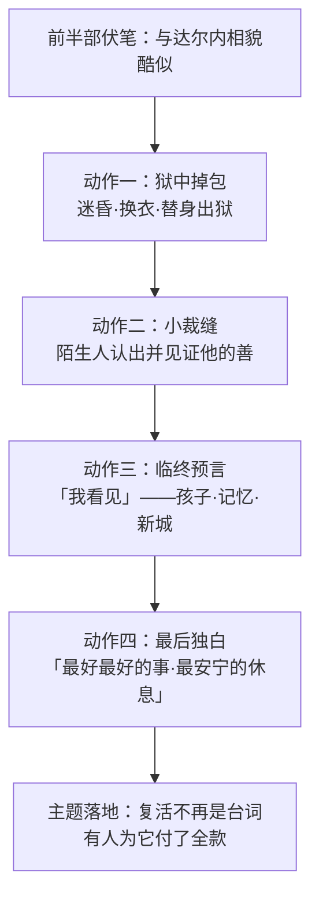

# 10｜卡顿之死：为什么一场牺牲成全了整部小说？

> 本篇核心问题：狄更斯为什么让全书以这个走向收尾，而不是以团圆收尾？

> **剧透提示**：以下内容包含关键剧情与结局，本篇即结局解读。

---

## 开篇：一个值得思考的问题

设想你是狄更斯，连载写到最后一期，手里捏着两种收尾方式。

第一种：掉包计成功，达尔内一家逃回伦敦，而卡顿也设法脱身——皆大欢喜，复仇者失败，好人团圆。以这本书的人气，没有读者会抱怨。

第二种：计划只成功一半。人救出来了，救人的那一个，替被救的那一个走上断头台。

狄更斯选了第二种。这个选择在一八五九年的连载读者中引起的震动，一直持续到今天——《双城记》的结尾是英语文学中最著名的结尾之一。问题是：**为什么一场死亡，比一场团圆更能成全这部小说？**

## 一、从故事开始

最后这几章的情节密度极高，但与本篇有关的只有四个动作。

第一个动作是**掉包**。卡顿利用自己握住的底牌混进监狱——他此前抓住了一个往来英法的双面间谍的把柄，借此打通了进牢房的路。他见到已被判死刑的达尔内，用药物把对方迷昏，换下他的衣服，再让接应的人把昏迷的达尔内当作「探监后瘫倒的卡顿」抬出监狱。两人相貌酷似——这条从小说前半部就埋下的伏线，在最后一刻变成了救命的工具。天亮之后，达尔内一家在出城的马车上醒来，卡顿留在了牢里。

第二个动作是**小裁缝**。押赴刑场的囚车里，卡顿身边是一个素不相识的年轻女裁缝，同样是被冤枉判死的无辜者。她看出了他不是达尔内，也明白了他在做什么。她没有揭穿，反而怯怯地问：路上可不可以握着你的手——她害怕。两人互相认出了彼此心里的那点善。两个都将赴死的陌生人，在囚车里完成了全书最短也最深的一次相识。

第三个动作是**预言**。临刑前，小说给了卡顿一整段内心独白，几乎全以「我看见」起头：他看见露西将来会有一个以他的名字命名的孩子；他看见自己活在这一家人的记忆里，比他们生前更鲜明；他看见那些把他送上死路的人——复仇者们、告密者们——最终被同一台机器吞没；他还看见一座更美的城市、一个更高尚的民族，从这场深渊里升起。

第四个动作是**独白收尾**。全书的最后一句，是卡顿替自己下的判词（通行中译大意）：「我现在做的，是我一生中做过的最好、最最好的事；我将得到的，是我一生中得到过的最安宁、最最安宁的休息。」

## 二、真正的问题是什么？

把情节放一边，狄更斯面对的其实是一个结构问题：**这本书前面许下的愿，怎么兑现？**

前面几十章埋下了两笔账。一笔是主题账：全书反复讲「复活」，讲人能不能重新开始——如果只是卡顿逃了、大家团圆了，那「复活」就只是一句台词，没有人为它付过价钱。另一笔是情感账：卡顿自认一生废掉，他需要的不是「活下去」，而是「值得过」——团圆结局让他活着，却永远欠他一个值得。

所以真正的问题是：**一场牺牲和一场团圆，哪一个才能把前面埋下的东西真正落地？** 狄更斯选牺牲，不是因为他狠，而是因为只有付出最重的东西，「复活」与「值得」这两个词才从修辞变成事实。

## 三、人物为什么会这样选择？

卡顿在结局里的每一步，都符合一套清晰的内心算法。

他为什么不选择逃？因为逃亡解决不了他的问题。他的痛苦从来不是「活不下去」，而是「活了也白活」——一个自认一无是处的人，苟且续命只是延长审判。替死反而是一次结算：用一条他自认没花好的命，买下他认定最值得的东西——露西一家的完整。账面上看是亏，在他的算法里却是平生第一次盈利。

他为什么在囚车里安慰小裁缝？这段戏常被当作插曲，其实它是全篇的锁眼。卡顿一生都在自我怀疑，「我算不算一个好人」这个问题他自己永远回答不了——而小裁缝，一个毫无利害、马上也要死的陌生人，给出了全书的认证：她看出了他的善，并且需要它。**救赎需要见证者。**没有她，卡顿的牺牲只有功能（换一个人活）；有了她，牺牲有了名分（一个好人做了一件好事）。

他为什么要在临终「看见」未来？因为那是对「值得」的最后确认。他预言的不是天堂，而是人间：孩子以他命名，记忆比他鲜活，仇敌被同一场风暴卷走，城市从深渊里升起。这段预言把一场私人死亡接上了历史的地平线——他死得不孤单，也不白费。

## 四、作者真正想讨论什么？

文本事实：小说以卡顿的预言式内心独白收束，最后一句是他对自己行为的评判；「最好、最最好的事」「最安宁、最最安宁的休息」这段独白出自原作结尾，中译各本措辞略有出入，上文用通行大意。小裁缝是小说原有角色，并非后人演绎。

主流解释：卡顿之死是全书的「兑现点」——前半部关于复活、牺牲、替身的一切铺垫，都需要一个把话说成事实的动作。他的死同时完成了三件事：救下达尔内（情节层面）、赎回自己（人物层面）、中断仇恨循环（主题层面）——复仇的机器杀到最后一个无辜者时，书也刚好写完。

其他解释：也有批评声音不那么买账。一种常见的质疑是：这场牺牲太干净了——它用一个文学上无解的伦理困境（爱而不得、生而无力）换来一个情感上完美的解决，而这恰是维多利亚式感伤的极致操作：用死亡逃避「活着的难题」。另一种质疑针对预言段落：卡顿「看见」的新城与高尚民族，等于替革命与恐怖的烂账开了一张远期支票——私人牺牲被包装成历史乐观主义，这份乐观是否廉价，至今有争议。

一种可能的读法是：这些质疑与主流解释可以并存，因为结局真正的机关不在「死」而在「见证」。小裁缝见证了他的善，预言见证了他想象的未来，读者见证了整个过程——狄更斯深知没有人见证的牺牲是纯粹的浪费，于是给这场死亡配了三重见证。这使结局既感人又危险：感人在于它被看见了；危险在于，「被看见的伟大牺牲」正是后世一切动员话术的原型。

## 五、把这个问题放回时代

卡顿不是凭空长出来的。一八五七年，狄更斯亲自出演了他的朋友威尔基·柯林斯编剧的《冰封深渊》（The Frozen Deep），扮演主角理查德·沃尔杜尔——一个在北极探险中牺牲自己、成全情敌的男人。狄更斯为这个角色倾注了罕见的热情，演出轰动一时。学界常认为，这段表演经历直接滋养了两年后卡顿的塑造：狄更斯是先在自己的身体里演过一遍「替死」，才在纸上写出来的。这一点值得强调——卡顿之死不是一个情节机关，而是狄更斯本人反复咀嚼过的执念。

维多利亚时代的读者另有一套接收装置。当时的文学把「善终」当成道德课：一个角色怎么死，是他一生德行的总答辩——《老古玩店》里小耐儿之死曾让整个英国落泪。卡顿的临终独白正是按这个传统写的：判词式、排比式、安详式。今天的读者可能觉得太圆满，当年的读者要的正是这份圆满——死亡场景是他们衡量人物的最后天平。

还有一层：这是一个写革命恐怖的故事，却用一个基督教式的救赎动作收尾。在狄更斯的时代语境里，这不叫回避，叫回答——当政治给不出解，他把解押在了个人伦理上。这个解法今天可以争议，但它是一八五九年的狄更斯能给出的最认真的答案。

## 六、作品是怎么写出来的？

结局之所以有千钧之力，一半靠设计，一半靠克制。

设计上，掉包是全书最大的伏笔回收：「两人相貌酷似」这条线，最早只是法庭上的一个巧合、一句闲笔，狄更斯让它埋了几百页，最后长成结局的承重墙。伏笔的妙处在于读者第一次读时浑然不觉，第二次读时遍体生凉——原来那个「长得像」，从第一天起就是冲着刑场去的。

克制上，最惊人的是**叙事声音的分配**。整本书几乎从不进入卡顿的内心——他的自我厌弃、他的爱意，全靠外部言行侧写。直到最后两章，狄更斯突然把整段第一人称的内心独白交给他，一次性把几百页欠下的内心戏还清。这种「捂到最后才给」的写法，让那段独白带着利息砸下来。

预言段落则是另一种笔法：全部用「我看见」排比推进，句子结构明显是圣经腔。狄更斯故意让一个死囚的临终思绪写成先知口吻——私人之死由此被放大成历史全景，小说的格局在最后一页突然撑开。

## 七、如果放到今天

以下部分是基于文本的现代延伸，不是狄更斯原话。

今天的读者熟悉一种「结局经济学」：圆满结局负责让人舒服，悲剧结局负责让人记住。《双城记》卖了一百六十多年，很大意义上是这套经济学的经典案例——它证明「把最重的东西付出去」比「把所有人带回家」更有长尾价值。

但现代延伸也该包括一句警告。卡顿式的牺牲叙事，今天经常被各种话语挪用：要求个人为集体付账、把「牺牲」包装成道德义务、把「值得」交给别人定义。读这本书时不妨多留个心眼：卡顿的牺牲之所以成立，前提是**他自己选择、自己定价、自己完成**——三者缺一个，崇高的故事就会变成剥削的话术。这恐怕是这场死亡在今天最值得重读的部分。

## 八、小结

回到开篇的两难：为什么不写团圆？

因为团圆只兑现情节，牺牲才兑现主题。这本书前面用几百页讲「复活」、讲「人能不能重新开始」、讲一个自认废掉的人怎么找回自己——这些话如果没有一条命去付账，就永远只是话。卡顿的掉包解决了情节（救出人），小裁缝解决了名分（见证善），预言解决了格局（接上历史），独白解决了判词（他自己宣布值得）。四步走完，前面埋的一切落地，小说才敢说「完」。

所以与其说狄更斯让卡顿死，不如说他让卡顿把全书欠的账一次结清。这场牺牲不是结局的装饰，是结局之所以为结局的原因。

## 下一篇

读到这里你可能已经意识到：这本小说的每一个结局细节，都在几百页前埋好了引线。相貌酷似、泼洒的红酒、回环的脚步声、编织的手——狄更斯是怎么把伏笔、对照与象征织成这一整张网的？下一篇，我们拆开这台机器看构造。
