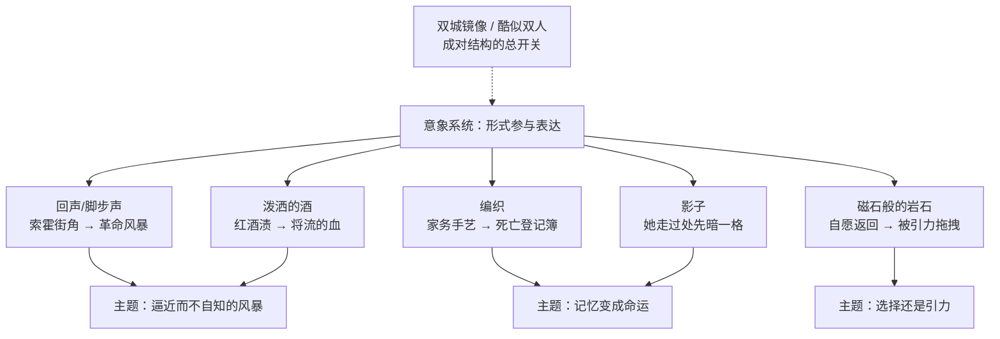

# 11｜狄更斯如何用伏笔、对照与象征织成这张网？

> 本篇核心问题：这本书的叙事为什么让初读的人和重读的人看到两本不同的书？

> **剧透提示**：本文涉及全书情节与结局，将逐一拆解贯穿始终的意象系统。

---

## 开篇：一个值得思考的问题

重读《双城记》的人常有同一种体验：第一遍读的是另一本书。

初读时，圣安东尼区那桶泼翻的红酒只是一段精彩的街头速写：酒桶摔碎，红酒淌满街石，饥饿的居民跪在地上，用手捧、用破布蘸，把每一滴都抢回嘴里。写法漂亮，看完也就翻页了。

读完结局再翻回来，同一段文字完全是另一种东西：那些沾着酒渍的手、脚、脸全是红的，一个爱开玩笑的人用手指蘸着酒泥，在墙上写下一个字——血。你这才意识到，狄更斯在第一卷就把结局泼在了你眼前，只是你当时不认识它的颜色。

为什么同一本书，初读和重读会看到两本？

## 一、从故事开始

先把这个场景看仔细。

泼酒发生在第一卷，巴黎近郊圣安东尼区，德法尔热酒店门口。一桶红酒摔碎在街心，整条街的人扑上去抢酒：有人跪地掬饮，有人把酒槽边沾泥的残渣都刮走，妇女把浸了酒的破布塞进孩子嘴里。等酒被抢干、人散去，街石上、手上、脚上、脸上，到处是一片片红。

然后小说明确写了两件事：一是那个高个子爱开玩笑的人，蘸着酒泥在墙上写下一个字——血；二是叙事者亲自下场预告，大意是：等时候一到，这种酒还会再泼到这些街石上，到那时把它染红的，将是在场许多人的血。

这说明了什么？狄更斯从不指望你第一次就读懂。他把谜底直接写在谜面上，用的却是当时还不成立的时态——「等时候一到」。初读者以为那是修辞，重读者知道那是日程表。

## 二、真正的问题是什么？

有象征手法的小说很多。这本书的问题不在于「某个意象是什么意思」，而在于：

> 为什么这些意象全部联网？

零散的伏笔是装饰，联网的伏笔是结构。酒渍、回声、编织、影子、磁石——它们各自反复出现，每次出现都变一点，最后在同一场风暴里全部兑现。初读的人跟着情节往前跑，顾不上看这些记号；重读的人不再被悬念推着走，才看见整张网的形状。

所以真正的问题翻译过来是：形式怎么参与表达？当「什么东西在反复出现」本身就在讲述「这个故事在说什么」，叙事技巧就不是包装，而是内容的一部分。

## 三、人物为什么会这样选择？

更有意思的是，书中人自己就活在这张网里，却看不见网——只有几个瞬间，他们恍惚感觉到了。

露西选择「听」。索霍小屋外的街角回声特别好，她常坐在那里听脚步声。小说明确写了她对回声的理解，大意是：那些回声是「将要走进我们生活的所有人的脚步」。她不是听见，是提前感到。她的选择是允许自己害怕——而这份害怕后来被证明是全书最准确的天气预报。

德法尔热夫人选择「织」。她的武器是一门安静的家务手艺。编织有三个属性：无声、耐心、不可拆——毛线一旦织进去，要抹掉一针就得拆掉整片。她把名字和罪行织进毛线，等于把复仇织进日常。她的选择说明，她的仇恨不是情绪爆发，而是编制工程：慢、准、不打算原谅。

达尔内选择「回去」——但狄更斯给他那一章起的名字是「被吸向磁石」。老水手的传说里有一种磁力礁石，能把船上的铁钉都吸出来，把船拖向毁灭。这个意象直接质问了「选择」本身：回巴黎究竟是他的良心在决定，还是他的姓氏在拖拽？

## 四、作者真正想讨论什么？

文本事实上，这套意象全部贯穿两卷以上，并在第三卷逐一兑现：回声变成真的风暴，酒渍变成真的血，编织的名单真的杀人，磁石真的把船拖上了礁石。

常见的读法是：狄更斯借此把「历史的不可逃避」织进叙事形式——读者被迫与书中人同处一种状态：能感觉到风暴在逼近，却不知道它砸下来时是什么形状。悬念不在「会不会发生」，在「兑现时你认不认得出」。

也有学者从更实用的角度解释：连载小说需要反复出现的记号帮读者维持记忆，意象系统首先是周刊连载的技术装置。这解释有其道理，但解释不了为什么这些记号彼此呼应、层层变形——那不是备忘录，是设计图。

一种可能的读法是：这套系统模拟的是「记忆如何变成命运」。编织登记的是过去的罪，回声预告的是未来的脚步，酒渍写的是还没流的血——过去、现在、未来被同一种材料织在一起，谁都别想从网里干净脱身：贵族不能，复仇者也不能。

## 五、把这个问题放回时代

一八五九年的狄更斯为什么需要这样一张网？

最实际的原因是连载。《双城记》在他自办周刊《一年四季》上分三十一期刊登，读者每周读一小段，前后相隔大半年。要在这种碎片节奏里维持「一件事正在逼近」的感觉，反复出现的意象就是最适合的装置——它不靠读者翻回去查证，靠的是耳朵和皮肤的记忆。

文学上的来源也值得提一句：狄更斯写这本书的主要史实底本是卡莱尔的《法国大革命史》，他在序言里也向卡莱尔致意。卡莱尔写革命，用的正是火、海、风暴这类自然力意象。狄更斯很可能从那里学到了一招——把历史写成天气，让读者用身体而不是理智去接住它。

## 六、作品是怎么写出来的？

现在把这张网拆开，逐个看每个意象是怎么工作的。

**回声／脚步声**：出现在第二卷前半，索霍小屋外那个「回声特别好」的街角。起初是家常的好奇，后来随着日子一年年过，回声越来越密集，小说明确写它变成了「一面红旗下骚动的人群的脚步」（大意）——声音先于画面抵达。它和露西的关系就是她全书的角色定义：她不行动，她接收。另一种读法是：回声其实是「群众」这个词的声音版——无数无名者的脚步先在伦敦的街角被听见，然后才在巴黎的街上被看见。

**编织**：从酒店里日复一日的毛线活开始，到揭晓它是革命的死亡登记簿，再到断头台下一排边织边数人头的女人。每出现一次，它的语义就恶化一次。它把「家务」和「死刑」缝在同一件织物里——这正是德法尔热夫人这个人物的全部构造。常见的读法是把她比作希腊神话里纺线量命的命运女神；也有读者注意到更朴素的一层：编织是不识字者的档案，是被历史排除在外的人自己发明的记录方式。

**影子**：第三卷有一章的章名干脆就叫「影子」。小说明确写了：德法尔热夫人一行走过时，影子落在露西母女身上，阴森而带有威胁（大意）。影子是她动手之前先到场的东西——她不必做什么，她经过本身就足以改变光的形状。另一种读法是：落在孩子身上的影子，其实是上一代的仇恨投向还没犯罪的人——这正是全书暴力逻辑的缩影。

**酒与血**：第一卷泼酒，第三卷流血，中间隔着几百页。它的变化是纯时间性的：同一个颜色，先是无心的事故，后是兑现的预言。它和主题的关系几乎等于全书的道德算术：饥饿和流血是同一种液体，稀缺放久了就变成暴力。也有读者认为这一笔太露骨——狄更斯确实不怕露骨，他要的是读者多年以后还记得那桶酒。

**磁石般的岩石**：第二卷最后一章的章名「被吸向磁石」，典出水手传说中能吸出船钉的磁力礁石。小说明确写了达尔内感到一股看不见的力量在拉他，他必须向前航行，直到撞上（大意）。它把达尔内的「自愿返回」重新翻译成物理问题：你以为你在掌舵，其实你在引力场里。这是全书对「自由意志」最冷的一次表态。

最后是统摄这一切的镜像结构：伦敦与巴黎互为倒影——两边各有法庭、密探、银行和随时能变成暴民的人群；而相貌酷似的达尔内与卡顿，是把「成对」做进了血肉：同一张脸，两种人生，一个替另一个去死。开场那段排比其实就是这张网的总开关：最好与最坏、天堂与相反方向，一切都成对出现。

## 七、如果放到今天

以下部分是基于文本的现代延伸，不是狄更斯原话。

今天的读者其实已经很熟悉这套玩法：好的剧集和电影到处埋「二刷才懂」的细节，彩蛋文化、考据帖、逐帧分析，都是在奖励重看。狄更斯一八五九年就在做同一件事，只是他的工具是连载周刊和墨水。

但有一个区别值得注意。今天的伏笔多是信息型的：藏一个名字、一个道具、一句双关，二刷时认出来，快感在「原来早有提示」。狄更斯的意象是另一型：它们不藏信息，它们提前给你情绪——你在还不知道会发生什么的时候，就已经被酒渍、回声和影子训练出了一种不祥的体质。信息型伏笔剧透的是事件，意象型伏笔剧透的是预感。后者更难做，也更难被剧透毁掉。

## 八、小结

回到开头的问题：为什么初读和重读是两本书？

因为这本书有两个叙事层同时运转：情节层负责推着你往前跑，意象层负责在你身后记账。回声让你先听见，编织让你先记录，影子让你先感到，酒让你先看见，磁石让你先被拉动——所有重要的结局，狄更斯都提前用意象的形式给过你了，只是第一次读的时候，你不知道自己手里拿的是什么。

所谓「形式参与表达」，说穿了就是：他不只在告诉你一个故事，他还在训练你感受这个故事的方式。初读时你消费情节，重读时才发现自己早已被那张网织了进去。

## 下一篇

这套高度浓缩的写法不是没有代价：它几乎榨干了狄更斯最出名的喜剧天才和闲笔趣味。下一篇要回答的就是这笔交易划算不划算——《双城记》为什么是狄更斯最「不像狄更斯」却又最经久不衰的作品？
