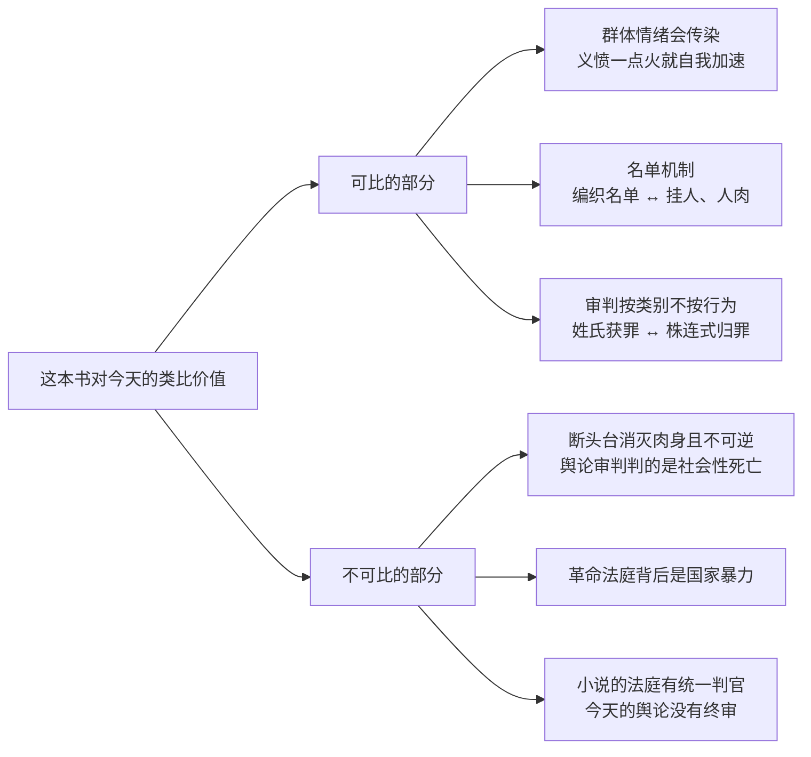

# 13｜一百六十多年后重读这本书，它还能告诉我们什么？

> 本篇核心问题：当「最好的时代」变成口头禅之后，这本书还剩下什么？

> **剧透提示**：本文涉及全书情节与结局。

---

## 开篇：一个值得思考的问题

「这是最好的时代，这是最坏的时代」已经成了一种公共装饰品：印在马克杯上，写进年终致辞，贴进任何一篇想显得有分量的评论开头。一句话万能到可以形容一切的时候，往往也失去了形容任何具体事物的能力。

那么，把这句格言拿掉，把「世界名著」的光环拿掉，这本书剩下的东西还锋利吗？这是收束之前的最后一个问题。

## 一、从故事开始

有两件事，一百六十多年过去仍然硌手。

第一件：查尔斯·达尔内早就放弃了爵位，离开法国，在英国教书自食其力，与家族的罪行切割得干干净净。可当他被押上革命法庭，判他死刑的核心依据不是他做过什么，而是他姓什么——埃弗瑞蒙德家的人。小说明确写了这套审判逻辑：叔叔们的罪要算在整个家族的账上，而他就是那个姓氏最后的活靶子。

第二件：西德尼·卡顿，一个自认把人生过得一团糟的律师，最终替达尔内走上了断头台。通行中译里，他临终的内心独白大意是：「我现在做的，是我一生中做过的最好、最最好的事。」

这说明了什么？这两条线各自顶着一个今天仍然活着的问题：人能不能只按「做了什么」被审判，而不按「是谁」被审判？一个自认浪费掉的人生，还有没有重开一局的权利？

## 二、真正的问题是什么？

剥掉被引用滥了的外壳，这本书至少留下三个仍然发烫的问题，外加一个提醒。

三个问题：群体拿到正义的名义之后，什么能拦住它变成复仇？人能不能逃离「他是谁」，只按「他做了什么」被对待？一个自认失败的人，重新开始的权利从哪里来？

一个提醒：我们对法国大革命的「印象」，有多少是历史给的，有多少是狄更斯给的？有学者指出，英语世界公众对法国革命的想象，很大程度上是被这本书塑造的——断头台、编织的女人、死亡囚车，这些画面进入公共记忆的渠道是小说，不是档案。

## 三、人物为什么会这样选择？

把三个问题落到人身上，每个人物都是一种回答。

达尔内选择的是「切割式重来」：辞掉爵位、改名换姓、远走他乡、靠劳动吃饭。他几乎做完了一个现代人能想到的全部自我赎买动作——然后发现没用。因为审判他的逻辑根本不看履历，只看类别：你是哪家的人，比你是什么人重要。他的遭遇说明，身份审判的可怕之处在于它预先没收了你的辩护权——你的自辩材料，人家根本不收。

德法尔热夫人选择的是「永不结账」。她的痛苦是真的——全家毁于侯爵兄弟之手，这本账铁证如山。但她把「我受过害」兑换成了「我可以无限索赔」的许可证，从复仇有理一路开到连孩子都不放过。她的轨迹说明：受害者身份一旦变成不可质疑的道德资本，就成了革命法庭里最无法反驳、也最危险的证词。

卡顿选择的是「替代式重来」。他的重新开始最不合常理：不是改过自新过好日子，而是用自己废掉的前半生，去换别人的后半生——他甚至没活成自己救赎的受益者。这个选择说明，在狄更斯的价值表里，「重来」的计量单位不是你后来活得怎样，而是你最后交出去的东西有多重。

## 四、作者真正想讨论什么？

文本事实上，这部小说里所有「正义变成复仇」的环节，都靠记忆的载体推进：马内特狱中的控诉是一封信，德法尔热夫人的名单是一团毛线，达尔内的罪状是一个姓氏——每一种载体都忠实地保存了罪行，也忠实地封死了原谅的入口。

作者明确表达的部分不多：序言里他向卡莱尔致意，说这个故事的构思是完整到来的；书信里他要的是故事的上升力。他从未说过自己写的是革命史。

常见的读法是双重警告：既警告压迫者（侯爵们的下场），也警告复仇者（断头台的下场），狄更斯拒绝只记一边的账。也有学者指出，他对恐怖时期的态度比底本卡莱尔更矛盾、更偏向自由主义式的复杂。

一种可能的读法是：这本书最深的怀疑对象其实是「记忆」本身。书中每一份正义的诉求，都寄存在一种无法区分正义与复仇的介质里——信、毛线、家谱。记忆能存住罪，却存不住「到此为止」。如果这个读法成立，那么小说真正的问题不是「革命对不对」，而是：一个只会记账、不会销账的社会，还有没有可能回到正义？

## 五、把这个问题放回时代

先泼一盆必要的冷水：这本书不是法国大革命的历史，是一八五九年一个英国人想象的法国大革命。

距离本身说明问题：狄更斯落笔时，攻占巴士底狱已过去七十年，隔着三代人、一道海峡和一整段维多利亚式的英国自信。他写革命的笔触里既有警告——一八四八年欧洲革命浪潮才过去十一年，「海峡对岸着火」记忆犹新——也有一种英国式的自我宽慰：那种事发生在巴黎，我们伦敦不一样。「双城」这个结构本身，就是这种既恐惧又侥幸的国民心理的投影。

所以学者的提醒要记牢：英语世界对那场革命的公共想象，很大程度上是这本书给的。它写的是维多利亚英国人心中的法国革命，过滤了卡莱尔的史观、情节剧的语法和狄更斯的道德算术。它可以教你群体如何思考正义，但不能告诉你一七八九年的巴黎究竟发生了什么——那是历史学家的工作。

## 六、作品是怎么写出来的？

为什么偏偏是这本书殖民了公共想象，而不是汗牛充栋的史学著作？答案在写法里。

历史书给你原因，狄更斯给你画面：一桶泼翻的红酒、一个织毛线的女人、一封狱中血书。这些画面有身体感——你能看见、听见、几乎摸到，于是它们绕过了记忆里的「史实区」，直接住进了「常识区」。

情节剧式的压缩也是关键：财政崩溃、派系斗争、热月政变，这些复杂的历史肌理全被压缩成「谁有罪、谁偿命」的道德账目。失真吗？当然。但公共记忆从来不按学术精度挑选东西，它按可携带性挑——一幅画面永远比一份档案走得远。

再加上两个可以背下来的框：开头的悖论和结尾的牺牲，像两枚书钉，把整本书钉进了文化的墙里。

## 七、如果放到今天

以下部分是基于文本的现代延伸，不是狄更斯原话。

**舆论审判与网络公审**。可比的地方是机制：义愤的传染性；名单的存在——当年的编织登记簿，今天的挂人帖和人肉搜索，都是「把名字写进一份死亡名单」，只是一份判肉身、一份判社会身份；还有围观惩罚的快感，断头台下的织针和屏幕前的吃瓜，是同一种观众席。不可比的地方同样要说清：断头台消灭的是肉身、不可逆，且有国家暴力背书；网络公审没有统一法庭，来得快去得也快——虽然对被审判的人未必快。这本书能帮我们看清「群体义愤如何运作」，但不能拿来给今天任何一场具体争议直接判刑。

**株连式归罪**。达尔内因姓氏获罪的逻辑，今天换了装还在：因为「你属于某个群体」而被归罪，而不是因为「你做了什么」。家族连坐、地域连坐、身份连坐，审判按类别而不按行为——这套逻辑的可怕，在一八五九年和今天是一样的：它预先没收了你的辩护权。

**卡顿式重新开始**。今天我们活在「重启人生」的叙事工业里：转行、翻红、自我提升，重启被包装成一门生意。卡顿是这套叙事的反例：他的重来没有观众、没有品牌、没有他活着看到的回报，甚至受益者都不是他自己。一种可能的读法是：在一个把「重新开始」做成商品的时代，卡顿提醒我们，最彻底的重来往往无法上架。

最后必须再划一次边界：以上所有类比，借的是这本书对「群体与正义」的洞察力；但洞察不是史实，类比不是判词。别拿它当历史教科书，也别拿它当今天的判决书。

## 八、小结

剥掉那句被用滥的格言，这本书剩下的是一套压力测试，可以递给任何一个自认处在「最好时代」的社会：你的人群在义愤时，分不分得清「他做了什么」和「他是谁」？你的文化给一个自认废掉的人，留了什么样的重来之门？还有——你以为自己知道的那些「历史」，有多少其实是狄更斯？

一百六十多年过去，这三个问题没有变老。一本书最好的归宿不是被供起来，而是被它追问的每一代人，都感到被问住了。

## 下一篇

十三篇到此走完。下一篇，我们把整个系列收拢成一张完整的地图：《双城记》借伦敦与巴黎之间的一张人物之网，究竟在讨论什么——《99｜系列总结》见。
