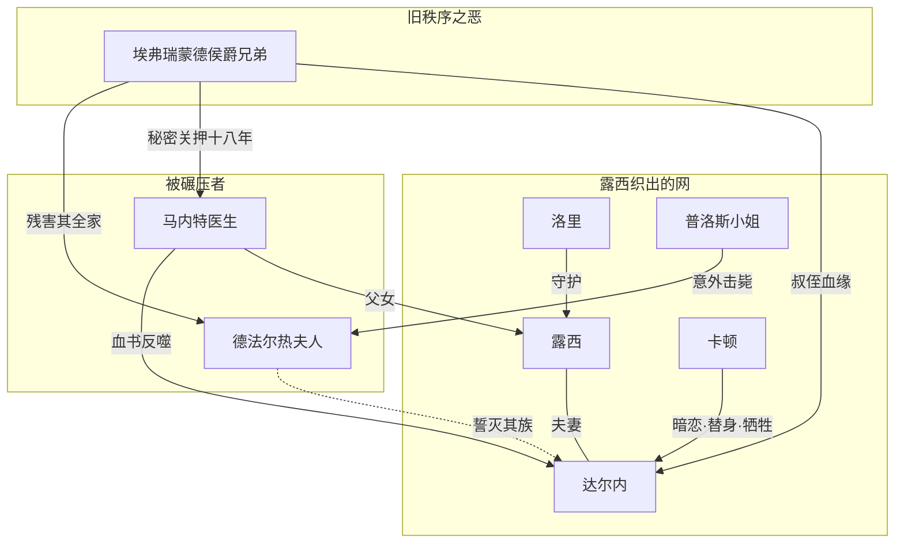

# 99｜系列总结：《双城记》

> 十三篇文章走完，回到最初的问题：狄更斯借伦敦与巴黎之间的一张人物之网，追问的是暴力时代里，人如何靠爱与牺牲中断仇恨的循环。

## 一、故事地图

整个故事可以用三句话讲完，但每一句都压着一块巨石。

第一句：一个人回来了。一七七五年，被秘密关押十八年的马内特医生获释，女儿露西把他从巴黎接回伦敦——这是第一卷《死人复活》。

第二句：一家人被织进网里。露西嫁给放弃爵位的法国流亡贵族查尔斯·达尔内，潦倒的律师卡顿暗恋着她；海峡对岸，德法尔热夫妇的酒店里正编织着另一张网——这是第二卷《金线》。

第三句：风暴收网。一七八九年后革命吞没巴黎，达尔内返法被捕，马内特的狱中血书反而成了定罪证据，卡顿用相貌酷似完成掉包——这是第三卷《风暴的轨迹》。

## 二、人物地图

按「人物想要什么」给全书人物排一次队：

| 人物 | 想要什么 | 得到什么 |
|---|---|---|
| 西德尼·卡顿 | 最初什么都不要，后来要「让所爱的人活下去」 | 用生命换来意义——他是唯一求仁得仁的人 |
| 露西·马内特 | 把碎掉的人重新连接起来 | 她做到了，代价是毫不知情地成为别人牺牲的理由 |
| 马内特医生 | 忘掉巴士底狱，做一个普通父亲 | 历史不许他忘：血书被宣读那一刻，他同时是受害者和加害链条的一环 |
| 查尔斯·达尔内 | 逃离姓氏，靠自己活着 | 姓氏比双脚跑得快——他逃到伦敦，还是被拖回断头台下 |
| 德法尔热夫人 | 为被残害的全家讨还血债 | 她得到了仇人的血，但债永远还不完——复仇没有结账日 |
| 德法尔热先生 | 革命成功，保留一点旧日人情 | 夹在妻子与旧主之间，革命比他想要的更激进 |
| 洛里 / 普洛斯小姐 | 守护自己在乎的人 | 全书的「稳压器」：风暴里唯二始终知道自己该做什么的人 |

## 三、人物关系图

这张图暴露了一个残酷结构：达尔内同时是「侯爵的侄子」和「露西的丈夫」——他站在两张网的交点上，往哪边走都是死。

## 四、核心冲突

表层冲突是人与制度：流亡贵族对革命法庭，个体对历史车轮。

深层冲突是两种正义对撞：贵族欠平民的血债是真的，革命法庭欠无辜者的血债也是真的——狄更斯让两笔账同时成立，不让任何一笔抵消另一笔。

最深的冲突藏在人心里：卡顿与自己（一个自认无物可献的人，献出的是命），德法尔热夫人与自己（一个最有理由恨的人，被恨耗尽成武器），马内特医生与自己（写下血书的人，不得不看血书杀死女婿）。

## 五、核心主题

**复活与救赎**：「被召回人间」从第一卷卷名贯穿到结尾经文。马内特被召回身体，卡顿被召回灵魂——狄更斯的回答是：人可以重新开始，但重新开始往往要付账。

**暴力循环与其中断**：侯爵制造仇恨，仇恨制造革命，革命制造新的仇恨。全书唯一打断这条链的不是正义，是牺牲——卡顿的死没有推翻任何制度，但它在循环里插进了一个「不以其人之道还治其人」的断点。

**最好与最坏的同时性**：开场的悖论是方法论也是世界观——同一时代既在分娩也在掘墓，取决于你站在哪个位置。

## 六、作者思想

可以确认的作者表达：序言中他把史实底本归功于卡莱尔《法国大革命史》，自谦「无人能指望为卡莱尔先生那本杰作增砖添瓦」；致福斯特的信中自述这是一部「由故事而非对话塑造人物」的作品。

从这些自述与文本推得的思想轮廓：狄更斯不是革命的赞美者也不是反动派，他是一个「改良主义者面对革命的困局」——他承认压迫必然引爆反抗，又不肯为反抗中的杀戮开脱。一些学者认为这种矛盾是局限；也有学者（如 Jones、McDonagh、Mee 主编的研究卷所指出的）认为他对卡莱尔保守史观的偏离本身，就是一种更复杂的自由主义式历史观。

## 七、时代背景

故事时间：一七七五至一七九三年——从革命前夜到恐怖统治顶峰。真实历史锚点：一七八九年七月十四日攻占巴士底狱；一七九三至九四年雅各宾专政下断头台处决数以万计。

写作时间：一八五九年。维多利亚英国刚经历过一八四八年欧洲革命的惊吓，又沉浸在帝国鼎盛的自信里。狄更斯借五十年前的法国问当下的英国：你以为的太平，是真的太平，还是火山口上的太平？

资料底子：主要来自卡莱尔《法国大革命史》（一八三七年出版），狄更斯自称反复研读；卡莱尔还曾从伦敦图书馆给他寄去两车参考书。所以这本书的「历史」一半是史料，一半是经过两代英国人之手的历史想象——读它时最好记得这条边界。

## 八、写作技巧

全书技法可以收成四句话：

- **悖论开场定调**：「最好/最坏」的排比让形式替主题干活——不裁决，就是立场。
- **意象系统埋雷**：回声、编织、影子、泼洒的酒，都是先当背景再当伏笔的延时装置。
- **对照结构贯穿**：双城、双人、两笔血账——全书是「最好/最坏」的方法论放大版。
- **视角控制**：多数场面经由旁观者的眼睛过滤（洛里、普洛斯、小裁缝），读者与书中人共享「看不见的逼近」。

代价也明显：狄更斯标志性的喜剧感和闲笔被大幅压缩，换来了他全部作品里罕见的情节密度——这正是「最不像狄更斯」与「最广为流传」的同一枚硬币。

## 九、文学史意义

出版史：一八五九年作为《一年四季》创刊号开篇连载，三十一期、每期销超十万册，月刊分册并行，年底出单行本；H.K. Browne 最后一次为狄更斯配图。

接受史：初版评论两极——Fitzjames Stephen 讥其结构笨拙，Henry James 断言狄更斯「不是哲学家」，卢卡奇批评人物命运未有机生于时代；Newlin 则誉其为英语中「最成功的历史小说」。读者一侧的态度简单得多：从连载第一天起就没有冷淡过。

影响面：有学者提醒，英语世界公众对法国革命的想象，很大程度上是被这本小说塑造的——一部「历史小说」反过来参与了历史记忆的塑造，这是它能进入文学史的理由之一。

## 十、作品的局限与争议

如实摆开三件事：

- **人物厚度之争**：露西常被批「功能化的天使」，达尔内被批「苍白的正派」——狄更斯把人性深度几乎全给了卡顿和德法尔热夫人，这是选择还是失衡，学界有不同读法。
- **历史观之争**：他究竟有没有理解革命？认为他「同情苦难但恐惧改变」的读法，与认为他「写出了革命内在逻辑」的读法，至今并存。
- **史实与虚构的边界**：小说让公众「记住了」一个被文学加工过的革命。把它当历史读物会失真，把它当历史想象读物反而更诚实——这也是本系列反复提醒的原因。

## 十一、今天为什么值得阅读

以下部分是现代延伸，不是狄更斯原话。

三个今天仍然锋利的切口：其一，「集体正义」滑向「集体报复」的临界点长什么样——书里写得很具体，具体到让人不安。其二，姓氏与标签的罪：达尔内什么都没做，只是生错了家族——这个逻辑今天换了很多外衣，内核没变。其三，「重新开始」的价目表：卡顿式的救赎在任何时代都不打折，都得用真东西去换。

## 十二、只记住 10 句话

1. 「这是最好的时代，也是最坏的时代」不是抒情，是全书的方法论：一切成对出现，不做裁决。
2. 双城结构是镜子：伦敦照见的「安全」，正是巴黎的「危险」在别处的倒影。
3. 马内特的复活教会我们：被救回来的人，仍要带着创伤学走路——复活不是撤销，是重新开始。
4. 德法尔热夫人证明：最锋利的刀往往是由被害人的血淬出来的——正义的怒火也有燃点，过了就是恐怖。
5. 露西的价值不在「做什么」而在「连接什么」——金线不抡锤子，但没有它网就散了。
6. 大革命在书里不是从正义直接跳到恐怖的，中间隔着一整套「仇恨接管正义」的传动装置。
7. 狄更斯不站队，是因为他让读者同时捧着两笔血账——这不是逃避，是他认为唯一诚实的立场。
8. 「复活」是全书总纲：第一卷复活身体，第三卷复活灵魂，中间隔着整部小说。
9. 卡顿的死之所以成全全书，是因为它是唯一「不以其人之道」的行动——循环在此断开。
10. 这既是狄更斯最不像狄更斯的书，也是他流传最广的书：砍掉闲笔换来重力，读者用一百六十多年投了票。

## 十三、与其他作品的关联

往前看，它接的是司各特开创、卡莱尔推进的历史叙事传统——用小说给历史装上血肉；同辈里，与雨果《九三年》对照最有趣：同写革命恐怖，雨果把矛盾写成三声部辩论，狄更斯把它写成一场家庭悲剧。

往后看，「个人牺牲对集体暴力」的结构在无数后来的作品里复活——从《双城记》到《活着》到各种反乌托邦叙事，「时代车轮下一个人能不能守住另一个人」始终是文学不肯放下的问题。

系列到这里收束。十三篇正文按「故事 → 人物 → 冲突 → 主题 → 写法 → 今天」走完了一圈，但文学作品的好处在于它不接受最终裁决——如果哪一篇的读法让你想反驳，恭喜你，那正是狄更斯想要的读者。
