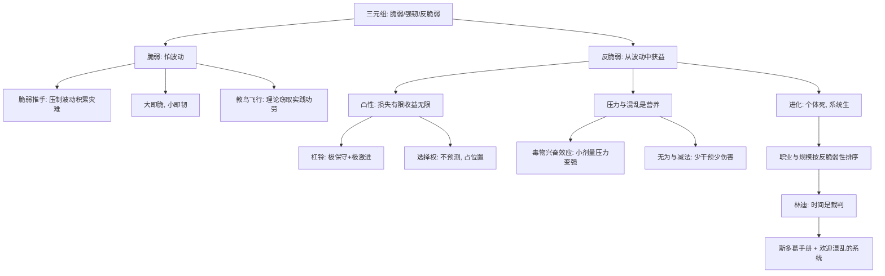

# 00｜系列拆解与目录

> 《反脆弱》（Antifragile: Things That Gain from Disorder）深度解读系列的总目录与知识地图。

## 系列简介

《反脆弱》是塔勒布「不确定性」系列的集大成之作。《黑天鹅》告诉我们世界充满无法预测的意外，而《反脆弱》追问下一步：**既然意外不可避免，有没有一种东西能从意外中获益？**

塔勒布发明了「反脆弱」这个词，因为它在语言里不存在——脆弱的对立面不是坚固（扛住冲击不动），而是越被冲击越强的第三种性质。肌肉在撕裂后生长，物种靠个体死亡进化，餐馆业靠每一家餐馆的倒闭变得繁荣。这本书的核心公式是「凸性」：当收益无限、损失有限时，混乱不再是敌人，是燃料。

沿着这条主线，塔勒布几乎翻新了我们的全部常识：稳定会积累风险，大的会脆、小的会韧，干预常常比问题本身更伤人，知识多是从实践倒着长出来的，而斯多葛派早就给出了反脆弱的操作手册。本系列按「三元世界 → 反脆弱的引擎 → 脆弱从何而来 → 系统与个体 → 活出反脆弱」五段递进，拆成 15 篇，每篇只讲清一个问题。

## 全书核心问题

| 层次 | 核心问题 |
|---|---|
| 概念层 | 什么是反脆弱？三元组（脆弱/强韧/反脆弱）如何划分世界？ |
| 机制层 | 凸性、杠铃、减法、「无为」分别是怎样让系统从波动中获益的？ |
| 批判层 | 脆弱推手为什么越稳定越危险？为什么大脆小韧？知识真的是从理论来的吗？ |
| 结构层 | 为什么个体的牺牲能换来系统的强韧？职业与规模的反脆弱性怎么排序？ |
| 生存层 | 林迪效应、斯多葛手册如何把反脆弱落到日常？怎样设计一个欢迎混乱的系统？ |

## 全书知识地图

## 全系列目录

### 第一部分：三元世界——脆弱、强韧、反脆弱

#### 01｜什么是「反脆弱」，为什么它比坚韧更进一步？

核心问题：脆弱的对立面到底是什么？
核心观点：脆弱的对立面不是坚固，而是「反脆弱」——从波动、混乱、压力中获益的性质；风灭蜡烛，却助燃火。
理解难度：★★☆☆☆
关键词：反脆弱、三元组、波动、获益

---

#### 02｜达摩克利斯、凤凰与九头蛇：三元组里你属于哪一个？

核心问题：塔勒布用三个神话形象划分世界，你更像谁？
核心观点：达摩克利斯头顶悬剑是脆弱，凤凰浴火重生是强韧，九头蛇砍一头长两头是反脆弱；识别自己在哪一格，是改造的第一步。
理解难度：★★☆☆☆
关键词：达摩克利斯、凤凰、九头蛇、自我定位

---

#### 03｜为什么小小的压力反而让你更强？

核心问题：为什么疫苗、举重、饥饿这些「坏事」反而有益？
核心观点：毒物兴奋效应——小剂量压力激活身体的超额修复，反脆弱不是忍耐压力，而是从压力里长出余量；舒适才是慢性损耗。
理解难度：★★★☆☆
关键词：毒物兴奋效应、压力、修复余量、舒适陷阱

---

### 第二部分：反脆弱的引擎

#### 04｜凸性与选择权：为什么「亏损有限、收益无限」是反脆弱的本质？

核心问题：反脆弱在数学上到底长什么样？
核心观点：反脆弱的本质是凸性函数——坏结果有下限，好结果无上限；有了凸性，你不需要预测，只需要把自己摆在「赌错代价小、赌对赚翻天」的位置上。
理解难度：★★★★☆
关键词：凸性、选择权、期权、不对称收益

---

#### 05｜杠铃策略：为什么两头极端比温和中庸更安全？

核心问题：为什么「极保守＋极激进」反而比「中等风险」抗打击？
核心观点：杠铃避开最危险的中间地带——中等风险既不够安全扛住黑天鹅，也不够激进抓住惊喜；把风险集中在两头，脆弱和反脆弱同时可控。
理解难度：★★★☆☆
关键词：杠铃、双峰、中间陷阱、配置

---

#### 06｜减法的力量：为什么「少」比「多」更接近智慧？

核心问题：为什么去掉坏东西常常比增加好东西更有效？
核心观点：via negativa——我们知道什么有害远比知道什么有益确定；戒烟、减药、删掉坏习惯的收益，胜过多数「新加法」。
理解难度：★★★☆☆
关键词：否定法、减法、医源性伤害、知识不对称

---

#### 07｜什么时候「什么都不做」是最好的干预？

核心问题：为什么医生、官员、管理者的「有所作为」常常帮倒忙？
核心观点：医源性伤害——干预的副作用常超过收益；在复杂系统里，「等一下」本身就是决策，无为不是懒，是给系统的自愈留时间。
理解难度：★★★☆☆
关键词：医源性伤害、干预、拖延的信号、无为

---

### 第三部分：脆弱从何而来

#### 08｜脆弱推手：为什么过度稳定反而积累灾难？

核心问题：为什么消灭小波动，会招来大崩盘？
核心观点：压制小波动让压力无从释放——扑灭森林小火积累了燃料，央行平滑周期积累了崩盘；脆弱的系统渴望噪声，稳定是它的慢性毒药。
理解难度：★★★★☆
关键词：脆弱推手、波动压制、燃料积累、稳定幻觉

---

#### 09｜为什么「大」是脆弱的，「小」才是反脆弱的？

核心问题：为什么大公司、大项目、大系统更容易猝死？
核心观点：规模与脆弱正相关——小动物摔不死，大象摔一次就完；大项目超支、大公司猝死，小而多的结构让错误可承受、让局部失败供养整体。
理解难度：★★★☆☆
关键词：规模、脆弱性、瑞士模式、小而多

---

#### 10｜教鸟飞行的教授：为什么知识常常从实践倒着长出来？

核心问题：为什么教科书的「理论→应用」顺序在现实中常常颠倒？
核心观点：绿木材谬误——靠绿木材发财的交易员根本不知道它是什么；试错先于理论，真正推动技术的是工匠的瞎鼓捣，大学教授事后才给鸟上飞行课。
理解难度：★★★☆☆
关键词：绿木材谬误、试错、实践先于理论、工匠

---

### 第四部分：系统与个体的分工

#### 11｜进化为什么是终极的反脆弱系统？

核心问题：为什么个体的死亡恰恰造就了系统的繁荣？
核心观点：自然选择牺牲个体换取基因库的强韧；餐馆业靠每家餐馆的倒闭变得繁荣——系统的反脆弱以个体的脆弱为代价，两层不能混为一谈。
理解难度：★★★★☆
关键词：进化、自然选择、个体牺牲、系统层反脆弱

---

#### 12｜为什么出租车司机比银行职员更反脆弱？

核心问题：为什么收入波动的工作反而比「铁饭碗」扛得住危机？
核心观点：银行职员的高薪建立在一个雇主身上，裁员即归零；出租车司机的波动分散在每天，收入低但不可被单点击杀——脆弱与否不看收入高低，看收入对单点的依赖。
理解难度：★★★☆☆
关键词：职业反脆弱、单点依赖、收入结构、雇员

---

#### 13｜林迪效应：为什么时间是反脆弱的裁判？

核心问题：为什么活得越久的东西越可能继续活下去？
核心观点：会消亡的事物每过一天离死更近，经时间筛选的事物每过一年预期寿命更长；反脆弱的终极测试是时间——活到今天的东西已经通过了上千次混乱的考试。
理解难度：★★★☆☆
关键词：林迪效应、时间筛选、经典、老化与抗老化

---

### 第五部分：活出反脆弱

#### 14｜斯多葛派手册：为什么「先想象失去」让你更强？

核心问题：塞内卡式的练习如何把心理也变成反脆弱的？
核心观点：斯多葛派睡前预演失去——把「失去」从恐惧变成已经演练过的场景；心理上先亏损，现实里就再无可失，这就是对情绪的杠铃。
理解难度：★★★☆☆
关键词：斯多葛、塞内卡、心理减法、预演失去

---

#### 15｜如何设计一个欢迎混乱的系统？

核心问题：把全书收拢成一句话——怎样让混乱为你工作？
核心观点：反脆弱的设计原则：给系统留冗余而非满负荷、用杠铃代替中庸、用小而多代替大而全、让局部失败供养整体、把时间当裁判——混乱不是要避免的，是要利用的。
理解难度：★★★☆☆
关键词：系统设计、冗余、收束、利用混乱

---

## 推荐阅读顺序

**主线顺序**：01 → 15，按认知难度分五段。

- **第一段（01–03）**：建立三元组直觉——反脆弱是什么、你在哪一格、压力为什么是营养。
- **第二段（04–07）**：反脆弱的四大引擎：凸性、杠铃、减法、无为。
- **第三段（08–10）**：反转视角看脆弱——稳定积累灾难、大脆小韧、知识从实践倒着长。
- **第四段（11–13）**：系统层逻辑——进化、职业结构、林迪效应。
- **第五段（14–15）**：落地——斯多葛心理练习与设计欢迎混乱的系统。

**不同读者的入口**：

- 想抓骨架：01 → 04 → 08 → 11 → 15。
- 对个人成长/职业感兴趣：03 → 12 → 14。
- 对商业与组织感兴趣：08 → 09 → 11 → 15。
- 练习批判阅读：每篇第九节「这个观点有问题吗？」集中呈现了观点的边界与争议。

## 全系列状态

全系列共 **15 篇**，已全部写完。
