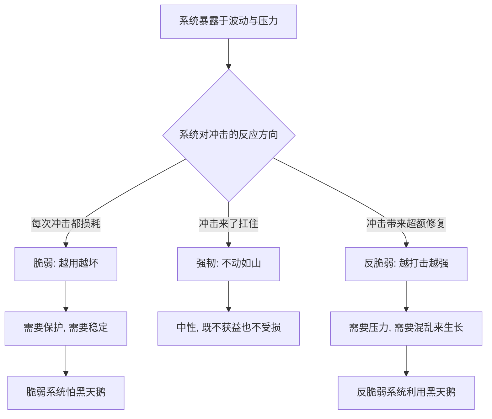

# 01｜什么是「反脆弱」，为什么它比坚韧更进一步？

> 本文要解决的问题：塔勒布发明的「反脆弱」到底指什么？为什么他认为脆弱的对立面根本不是我们以为的「坚固」？

---

## 一、先说结论

脆弱的东西怕波动，坚固的东西不怕波动——但真正厉害的是第三种：**从波动中获益**的东西。塔勒布称之为「反脆弱」：被冲击不仅不受损，反而变更强。风可以吹灭蜡烛，却会助燃烈火。这个概念之所以重要，是因为语言里缺了它——我们习惯把世界分成「会坏的」和「不会坏的」，漏掉了整整一类「越打击越强大」的存在：你的肌肉、免疫系统、创业生态，乃至某些思想，都属于这一类。

## 二、我们先理解一个问题

假设你要寄一个包裹，里面装着怕摔的东西，你会写上「易碎，小心轻放」。

现在反过来想：如果包裹里的东西不但不怕摔，还越摔越好，你该写什么？「请粗暴对待」？「越多越好地摔打」？

语言里根本没有这个词。这就是塔勒布要解决的第一个问题：我们有一个现成的词汇光谱——脆弱的一端是「易碎」，另一端是「坚固」，但中间跳过了一格。那一格里的东西不但不讨厌混乱，还需要混乱来生存。没有名字，我们就不认识它；不认识它，我们就在用对待脆弱物的方式毁掉反脆弱物——比如把该摔打的孩子裹在棉花里。

## 三、作者到底提出了什么观点？

塔勒布的核心主张是：世界的事物可以按「对波动的反应」分成三类。

第一类是**脆弱的**：怕意外、怕波动、怕压力。玻璃杯是典型——摔一次就完。脆弱的东西需要的是「别碰我」。

第二类是**坚固的（或强韧的）**：不怕波动，摔了也不坏。石头、铁块、冗余设计的大桥。坚固的东西无所谓波动，但也不会从波动里得到什么。

第三类就是**反脆弱的**：波动是它的食物。每次冲击都让它留下点什么、长出点什么。塔勒布强调这不是文学修辞，而是一个可操作的性质——只要一个系统「收益大于损失」于波动，它就是反脆弱的。

他还指出一个关键不对称：脆弱和反脆弱不是程度差别，是方向差别。脆弱的东西被冲击一次少一块，反脆弱的东西被冲击一次多一块——两者都在被时间消耗，但方向相反。

## 四、把这个观点翻译成人话

用大白话说：**脆弱的东西会被打垮，坚固的东西能扛住，反脆弱的东西是「你打我一下，我强一分」。**

最生活化的例子是健身。举重就是在撕肌纤维——一次「破坏」。身体会慌吗？不会，它会超额修复，长出比原来更粗的肌纤维。这就是反脆弱的标准动作：受一次可控的损伤，换一份加倍的回报。

反过来，整天躺着不动才是慢性损耗。没有压力的身体不「坚固」，是持续变脆。

## 五、为什么会这样？

塔勒布的推理链条大致是：

关键在「超额修复」这个机制：反脆弱系统不是简单地扛住损伤，而是对损伤做出**过度补偿**——修复量比损失量大一点，于是每次冲击都在账户里存钱。塔勒布认为这个性质遍布自然：骨骼在承重后增密、免疫系统在接触病原体后建立记忆、物种在淘汰中优化基因库。

而脆弱的隐蔽性恰恰在于：它不需要被攻击，只需要**没有压力**。长期无波动的系统会像不承重的骨头一样慢慢废掉——这为后面批判「过度稳定」埋下伏笔。

## 六、举一个现实生活中的例子

蜡烛和火是塔勒布反复使用的对照。

同一阵风，吹向蜡烛，蜡烛灭；吹向篝火，火苗蹿得更高。风的性质没变，变的是系统对风的反应。蜡烛是脆弱的：它只能待在无风的环境里，一阵风就是死刑。篝火是反脆弱的：风是它的氧气，平静反而让它萎缩。

这个对照放到现实里随处可见。一家靠持续广告续命的公司是蜡烛——预算一停就灭；一家靠口碑发酵的产品是火——争议和批评反而给它氧气。一个靠不断被照顾才能运转的人是蜡烛；一个被拒绝激发的人是火。

脆弱与反脆弱的分界，从来不在「环境多恶劣」，而在「恶劣对你意味着什么」。

## 七、回到书中重新理解

现在我们再看塔勒布开篇那句「风灭蜡烛，却助燃烈火」，就明白它不是比喻，是全书的世界观宣言。

他在做一件语言工程：把「反脆弱」从「坚固」里撕出来单独立类，是为了让我们看见一条被忽视的性质——**混乱对某些系统是资源而非威胁**。一旦有了这个词，很多现象忽然有了统一解释：为什么过度保护的孩子脆弱，为什么免疫要建立在接触之上，为什么经济体的「平滑」比波动更危险。

这也解释了为什么这本书叫《反脆弱》而不叫《强韧》——强韧是「不怕」，反脆弱是「利用」。两者看上去只差一步，性质上却是天地：不怕混乱的系统最多自保，利用混乱的系统能从黑天鹅里抽身获利。

## 八、这个观点背后还有什么？

反脆弱背后有三层更深的结构。

第一，它把《黑天鹅》从诊断升级成了处方。《黑天鹅》说世界不可预测、意外统治历史；《反脆弱》问：既然如此，与其费劲去预测意外，为什么不干脆把自己改造成「欢迎意外」的结构？预测的破产在这里变成了设计的起点。

第二，反脆弱暗含一种时间观。脆弱的东西随时间变差（老化、磨损），反脆弱的东西随时间变好（学习、进化）。时间对脆弱者是敌人，对反脆弱者是盟友——这一条会在林迪效应那里被展开。

第三，它预定了伦理问题：如果一个系统靠个体牺牲变强（餐馆倒闭造就餐饮业繁荣），那反脆弱到底是好事还是只把代价转移给了弱者？这个问题会在「进化」和「系统与个体」那几篇里正面撞上来。

## 九、这个观点有问题吗？

有说服力的地方很明显：反脆弱确实命名了一类真实存在却被无视的性质；从健身到免疫系统到创业生态，「从压力获益」的现象俯拾皆是；作为决策启发式，「主动暴露在可控的小混乱里」有扎实的现实效果。

但边界同样清楚。第一，「反脆弱」的判定高度依赖剂量和范围：压力在阈值内是营养，超阈值就是摧毁——疫苗能免疫，感染也能致死。区分「有益的压力」和「有害的压力」本身就需要知识，而塔勒布对这条线的刻画是原则性的，不是可操作的公式。第二，把反脆弱套到社会系统时，容易忽略代价的分配：系统从波动中获益，波动中的个体可能实实在在在受损——反脆弱的红利常常不是均分的。第三，一些学者认为「反脆弱」作为概念在形式上不够严格：它是对一类现象的统称，而非可测量的量，何时一个系统算「反脆弱」、何时只是「能扛」，边界模糊。第四，塔勒布把「波动是好东西」的立场推得很远，而对波动真实造成的不可逆伤害（破产、精神疾病、生态崩溃）的讨论相对少——反脆弱叙事有一种「凡不能摧毁我的使我更强大」的浪漫色彩，但不是每一次跌倒都能爬起来。

所以更准确的读法是：反脆弱是**一种值得追求的性质，但不是万物的默认状态**。先判断你在哪个格子里，再决定要不要主动拥抱混乱。

## 十、今天再看这个观点

以下部分是基于作者思想的现代延伸，不是作者原话。

放到今天，反脆弱的概念比成书时更有解释力。疫情是教科书案例：疫苗让人体免疫系统在受控压力下建立记忆；远程办公让许多公司发现「办公室缺席」不是崩溃而是冗余测试；供应链中断逼着企业从「极致效率」转向「留冗余」。反脆弱框架给这些现象提供了统一语言。

AI 时代又多了一层：模型的迭代越来越像进化——大量尝试、快速淘汰、从错误中学习。一家把所有工作押在一个供应商、一个模型、一个流程上的公司，是蜡烛；同时跑多个方案、快速切换的公司，是火。反脆弱在数字时代的名字，就叫「架构的可替换性」。

## 十一、这一篇真正应该记住什么？

1. 世界分三类：脆弱怕波动、强韧扛波动、反脆弱从波动获益。
2. 反脆弱 = 每次冲击换来超额修复——你打我一下，我强一分。
3. 蜡烛被风灭，火被风助：系统的性质取决于它对混乱的反应，不是混乱本身。
4. 脆弱的对立面不是坚固，是反脆弱——语言缺了这个词，我们就一直在用错方法保护反脆弱的东西。
5. 反脆弱是性质不是口号：剂量超限就从营养变伤害，红利也常常不均分。

## 十二、留一个问题

下一次你准备「保护」一样东西——一个孩子、一个团队、一套流程——先问一句：它是脆弱的还是反脆弱的？如果它是反脆弱的，你的保护会不会恰恰是在抽走它生长所需要的压力？

而要判断一样东西属于哪一格，塔勒布给了三个形象的对照：头顶悬剑的达摩克利斯、浴火重生的凤凰、砍一头长两头的九头蛇。下一篇，我们来看这三位各自代表什么。
