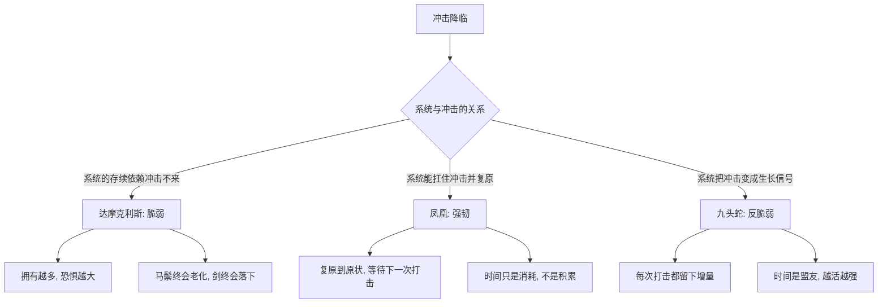

# 02｜达摩克利斯、凤凰与九头蛇：三元组里你属于哪一个？

> 本文要解决的问题：塔勒布用达摩克利斯、凤凰、九头蛇三个神话形象给世界分类，这三格分别意味着什么？你又该把自己放进哪一格？

---

## 一、先说结论

塔勒布用三个神话形象把「脆弱—强韧—反脆弱」三元组画成了三张脸：**达摩克利斯**头顶悬着一把只用一根马鬃吊着的剑，荣华富贵之下是随时降临的毁灭——这是脆弱；**凤凰**每次被烧毁都能从灰烬里复活，恢复到原来的样子——这是强韧；**九头蛇**许德拉每被砍掉一个头，就长出两个新头——这是反脆弱。三张脸的分水岭不在「遭遇什么」，而在「遭遇之后变成什么」：受损、复原、还是变得更强。而这张图最大的用处，是拿来照自己——先看清你此刻站在哪一格，改造才有起点。

## 二、我们先理解一个问题

上一篇说了，语言里缺少「脆弱的对立面」这个词。但塔勒布发现，人类的神话其实早就把这三格画出来了，只是我们没把它们排成一排看。

问题就在这里：概念如果停留在抽象层面，「反脆弱」三个字永远只是一句口号。你说你的工作是脆弱的、你的公司是强韧的，凭什么？你需要一张能对照的图谱——每个格子里站一个具体形象，有脸、有故事、有下场。把自己的处境拿去和三个形象逐一比对，答案才会浮现：你是那个在盛宴上不敢抬头的人，还是那只烧不死的鸟，还是那个越砍越多的怪物？

这就是三元组的第二个功能：它不只是分类学，是一面镜子。

## 三、作者到底提出了什么观点？

塔勒布在书中明确借用了三个古典形象来命名三元组的三格。

**达摩克利斯**代表脆弱。叙拉古的暴君狄奥尼修斯让羡慕王权的达摩克利斯坐上王位，享用盛宴——但头顶上用一根马鬃悬着一把利剑。塔勒布借此指出脆弱的本质：不是已经被摧毁，而是**时刻活在被摧毁的可能性之下**。剑没落下来，恐惧却从不缺席；拥有的一切越是丰盛，头顶那根马鬃显得越细。

**凤凰**代表强韧。这只神鸟每五百年自焚一次，又从灰烬中重生——重点是：重生后的凤凰还是原来那只凤凰。塔勒布强调，能复原不等于变强，凤凰只是「回到原状」。这是强韧的上限：扛得住，但不增长。

**九头蛇**许德拉代表反脆弱。大力神赫拉克勒斯砍它的头，每砍掉一个，原地长出两个。塔勒布说这是他要找的形象：伤害不但没有损耗它，反而让它增殖——**攻击成了它的生长方式**。

三个形象给出三种命运：等着被毁、恢复原样、因毁而增。

## 四、把这个观点翻译成人话

用大白话说：**达摩克利斯是「风光但提心吊胆」，凤凰是「打不死但也没变强」，九头蛇是「你越打我越多」。**

对应到人的处境就更清楚了。一个全靠单一客户、单一雇主、单一收入来源活着的人，就是达摩克利斯——收入可能很高，日子可能很体面，但那根马鬃随时会断，他自己也清楚，所以失眠。一个被裁员后好不容易找到同级别岗位、恢复原有生活水平的人，是凤凰——值得敬佩，但他只是回到了悬剑之下。而一个每次失败都让他多一门技能、多一条退路、多一层认知的人，是九头蛇——打击在他这里是生产资料。

所以三元组问的不是「你过得好不好」，而是「下一次打击来临时，你是会少一块、原地不动、还是多一块」。

## 五、为什么会这样？

塔勒布的逻辑是这样的：

关键点有三个。

第一，脆弱的可怕不在剑，在**结构**。达摩克利斯的问题不是运气差，是他的处境被设计成了「一切取决于那根马鬃」。塔勒布认为，凡是「繁荣建立在某个脆弱支点之上」的状态，都是达摩克利斯式——高薪但单一的收入、稳定但不可替代性差的岗位、表面平静但全靠某个条件维持的局面。

第二，强韧的局限在于**没有增量**。凤凰重生多少次，还是那只凤凰。塔勒布提醒，把「能恢复」当成终点是一种隐蔽的浪费：你承受了打击的全部成本，却只换回了原价。

第三，反脆弱的本质是**打击带来净增量**。九头蛇每受一次攻击，头数加一。这要求系统内部有某种机制，能把「损伤」翻译成「生长指令」——这个机制是什么，是后面要回答的问题。

## 六、举一个现实生活中的例子

先看达摩克利斯之剑。历史上的达摩克利斯坐在王座上，美酒佳肴、仆人环绕，但只要一抬头，就看见那把靠一根马鬃吊着的剑。塔勒布借这个故事点破一种生存状态：**荣华即恐惧**。放到今天，一个背着巨额房贷、全靠一份高薪硬撑的中产，就是宴席上的达摩克利斯——餐桌上什么都有，就是不敢抬头。他的脆弱不在收入低，而在那根「马鬃」：只要雇主、行业、健康里任何一环断掉，整个生活结构立刻崩塌。

再看凤凰。埃及与希腊神话里，凤凰在火中焚身，又从灰烬中飞出——复原是它的荣耀，也是它的天花板。一个公司被危机打垮后艰难重建、回到原有规模，是凤凰式的胜利：值得鼓掌，但危机本身什么也没留给它。

最后是九头蛇许德拉。赫拉克勒斯与它搏斗，每砍下一颗头，断口处蹿出两颗新头——攻击者成了它的助产士。塔勒布要的就是这个画面：**有些系统遇到打击不但不减员，还扩编**。放到现实里，一个每次被否定都逼自己多练一项本事的人、一家每次被竞争对手攻击都顺势补一块短板的公司，都在做九头蛇式的事——把对方的刀，变成自己的肥料。

## 七、回到书中重新理解

理解了三个形象，再回来看三元组，会发现塔勒布藏了一个更尖锐的判断：**达摩克利斯和九头蛇可能遭遇同一种处境，区别全在内部结构。**

剑悬在头顶这件事本身是中性的——九头蛇也会被砍。差别是达摩克利斯的处境里，冲击只能带来损失（最好结果是剑不落），九头蛇的处境里，冲击必然带来收益（最坏结果才是没长新头）。塔勒布实际上在说：三元组不是命运抽签，是**收益结构的描述**。你的处境对「坏事件」的暴露面有多大、对「坏事件」的获益通道有没有，决定了你站在哪一格。

这也让「自我定位」有了操作性：别问「我抗不抗打击」，问「我的处境里，打击只会减分，还是也能加分」。如果只会减分，你在达摩克利斯那格，不管此刻过得多风光。

## 八、这个观点背后还有什么？

三个形象背后还有三层东西。

第一，塔勒布在暗示一种**不对称的时间观**。达摩克利斯的时间在倒计时（马鬃在老化），凤凰的时间在循环（回到原点），只有九头蛇的时间在积累（头数在增加）。所以「你在哪一格」可以翻译成「时间是你的敌人、路人还是盟友」。

第二，九头蛇神话本身还埋了一个警示。赫拉克勒斯最终是用火烧断口、阻止新头长出，才杀了许德拉。塔勒布没有展开这一半，但它提示：反脆弱不是无敌，存在能绕过增殖机制的攻击方式——这对应着「剂量」与「攻击类型」的问题。

第三，三元组的真正用途是**诊断先于改造**。塔勒布全书的立场是：反脆弱可以被建造，但建造之前必须先诚实定位——一个不肯承认自己是达摩克利斯的人，不会去做九头蛇该做的事。

## 九、这个观点有问题吗？

有说服力的地方：三个神话形象确实把抽象的「对波动的反应」变成了可对照的图谱，「识别自己在哪一格」作为自我诊断的起点非常实用；「荣华即恐惧」对一类高收入高脆弱处境的刻画，也精准得近乎残酷。

但边界也要说清。第一，形象是简化的：现实里的系统很少纯粹属于一格——同一个人，财务上可能是达摩克利斯，技能上是九头蛇；三元组是切片工具，不是人格标签。第二，「砍一头长两头」听着鼓舞人心，但神话里九头蛇的死穴恰恰提示了反脆弱的局限：当攻击强度超过增殖速度，或者攻击方式绕开增殖机制（火烧断口），再强的反脆弱系统也会崩。第三，一些学者认为，用神话做分类学存在循环论证的风险——你把谁归进哪一格，取决于你怎么读他的处境，而读法本身已经带了三元组的预设。第四，关于「复原只是回到原点所以不够好」这一判断，学界存在不同看法：在生态学与韧性研究里，「恢复力」（resilience）本身就被视为重要目标，「恢复原状」在不可逆损伤频发的领域已经是高标准，未必如塔勒布暗示的那样是「不上不下的中间格」。

所以更稳妥的用法是：三元组当镜子照，别当笼子关——它是用来定位「此刻这个维度上的你」，不是给你贴终身标签。

## 十、今天再看这个观点

以下部分是基于作者思想的现代延伸，不是作者原话。

放到今天，三个形象的分辨率反而更高了。平台经济里的从业者——靠单一平台流量吃饭的博主、靠一家公司的订单活着的供应商——是当代达摩克利斯的群像：数据越好看，头顶那根马鬃绷得越紧，算法一改就是剑落之时。

九头蛇也有了新形态：开源社区和去中心化网络是「砍掉一个节点长出两个」的结构——封杀一个镜像站，冒出三个；驱逐一个核心开发者，社区分叉成两支。反脆弱在数字时代的典型长相，就是「无法被单点击杀的分布式增殖」。

而凤凰一格提醒我们：很多企业做的「灾难恢复」「业务连续性」方案，本质是凤凰计划——目标只是烧完之后回到原样。如果一家公司的全部预案都只规划到「复原」，它在塔勒布的图谱里就还没有进第三格。

## 十一、这一篇真正应该记住什么？

1. 三元组的三张脸：达摩克利斯（脆弱：繁荣悬于一根马鬃）、凤凰（强韧：能复原、无增量）、九头蛇（反脆弱：打击即增殖）。
2. 三格的分水岭不在遭遇什么打击，在打击之后是少一块、不变、还是多一块。
3. 「荣华即恐惧」——凡是一切取决于某个脆弱支点的繁荣，都是达摩克利斯式的。
4. 复原不是终点：承受了打击的全部成本只换回原价，是隐蔽的浪费。
5. 定位先于改造：先诚实承认自己在哪一格、哪个维度，才谈得上去做九头蛇该做的事。

## 十二、留一个问题

盘点一下你自己：收入结构、技能组合、健康、关键关系——逐项问一句「这一项遭到打击后，我会少一块、原地复原、还是多一块」。你身上达摩克利斯、凤凰、九头蛇各占几分？

而九头蛇那种「砍一头长两头」的生长，背后靠的是一个具体机制：小剂量的伤害激活了超额的修复。这个机制有个名字，叫毒物兴奋效应——为什么疫苗、举重、饥饿这些「坏事」反而让你更强？下一篇来拆。
