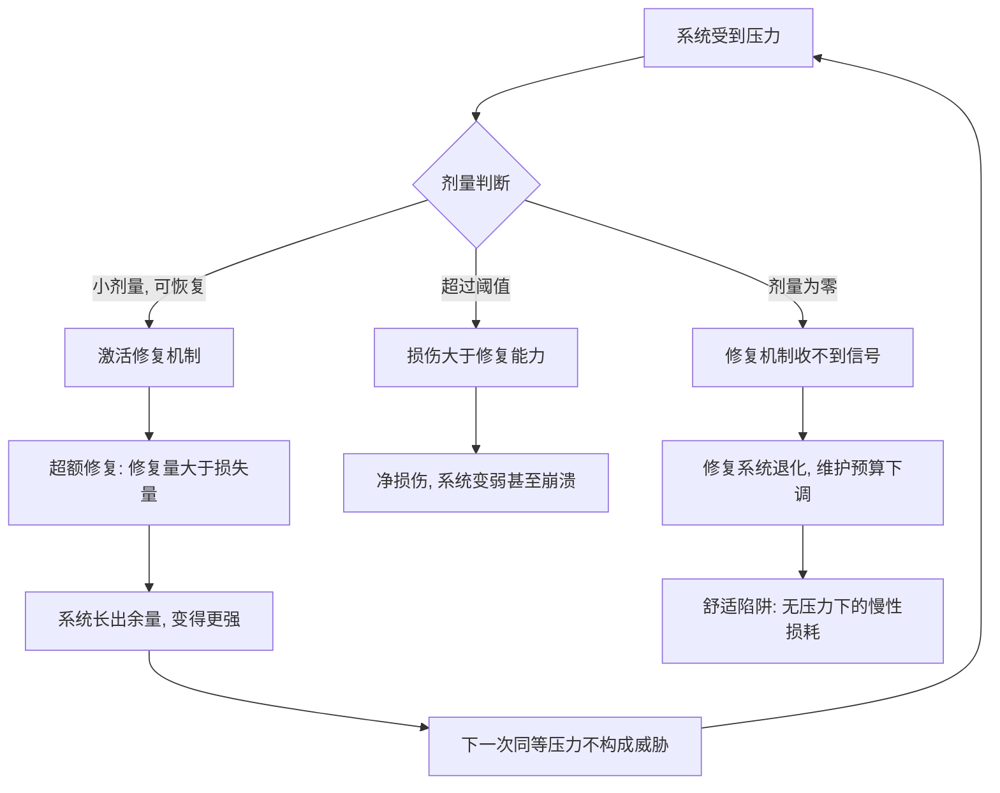

# 03｜为什么小小的压力反而让你更强？

> 本文要解决的问题：为什么疫苗、举重、饥饿这些听起来是「坏事」的东西反而有益？塔勒布说的毒物兴奋效应到底是怎么运转的？

---

## 一、先说结论

小剂量的压力不但无害，还是营养——这个机制叫**毒物兴奋效应**（hormesis）：身体受到可控的小损伤后，不会只修回原样，而是超额修复，长出比原来更多的余量。疫苗用一点点抗原换来整套免疫记忆，举重撕裂肌纤维换来更粗的肌肉。塔勒布据此修正了一个常识：**反脆弱不是「忍耐压力」，而是「从压力里长出余量」**——压力在这里不是代价，是投入。反过来说，真正的慢性损耗不是来自压力，而是来自舒适：长期没有压力的系统，会像不承重的骨头一样慢慢废掉。

## 二、我们先理解一个问题

先想一个日常直觉：生病了要休息，受伤了要静养，累了要放松。这些都没错——但它们合起来给人一种默认印象：**压力是损耗，零压力是保养**。

现在看一组矛盾的事实。打疫苗是往身体里注射病原体（减毒或灭活的），按「压力是损耗」的逻辑，这是故意伤害自己——可它恰恰是最成功的预防医学。举重本质是把肌纤维撕裂，可健身者靠它变强。饥饿按直觉是亏空，可限制热量在大量动物实验里延长了寿命。

如果「压力有害」是普适规律，这些现象一个都不该存在。显然有一条更细的规律藏在下面：压力和压力不一样——决定结果的不是「有没有压力」，而是「多大的压力、以什么方式作用在什么系统上」。塔勒布要给这条规律一个名字。

## 三、作者到底提出了什么观点？

塔勒布借用药理学的概念「毒物兴奋效应」来描述这个机制：**小剂量毒物对生物体产生有益作用，大剂量则有毒**。低剂量触发的是超补偿——系统修复时不是刚好补回损失，而是多修一点，修出一个「余量」。

他把这一点和反脆弱直接挂钩：反脆弱系统与一般系统的区别，在于它能从压力中提取**净收益**。强韧是压力来了扛住、回到原状；反脆弱是压力来了、修复超额完成、系统变得比受冲击前更强。所以塔勒布说，反脆弱性偏好随机性和压力——不是它能忍，而是它需要。

他同时划出边界：毒物兴奋效应是剂量函数，不是「受苦光荣」。能激活超补偿的是「小剂量、可恢复」的压力；一旦越过阈值，同一压力从营养变成纯粹的破坏。而比「压力太大」更隐蔽、也更普遍的问题是**压力为零**：塔勒布认为现代人的许多脆弱，恰恰是被无微不至的舒适养出来的——身体、免疫系统、心智，都在「毫无压力」的环境里悄悄退化。

## 四、把这个观点翻译成人话

用大白话说：**身体是个小心眼的会计——你让它亏一点，它会加倍补回来，顺手还存一笔。**

举重在生物账本上是这样记的：你撕裂了几根肌纤维（记一笔损耗），身体的修复系统接到警报，不但把纤维补好，还多铺一层（记一笔盈余），下次同样的重量就不再是威胁。肌肉就是这么「骗」出来的——用一次可控的小亏，换一份超额的大赚。

舒适则是另一种记账方式：没有损耗发生，修复系统收不到警报，于是维护预算逐年下调。肌肉不用就萎缩，骨头不承重就疏松，免疫系统没事干就迟钝甚至误伤自己（过敏与自身免疫疾病在卫生条件最好的社会反而高发）。**舒适不是保养，是系统在削减编制。**

所以毒物兴奋效应翻译过来就一句话：压力是发给修复系统的订单——没有订单，工厂就关门。

## 五、为什么会这样？

塔勒布描述的机制链条大致是：

链条里有两个关键齿轮。

第一个是**超额修复**。为什么身体要「多修一点」而不是刚好修好？进化上的解释是：压力是环境的预报——这次撕裂说明环境里存在这种负荷，下次可能更大，于是修复系统按「略高于本次」的标准重建。塔勒布认为这就是反脆弱的微观引擎：**每次冲击都在账户里存进一小笔余量**。

第二个是**用进废退**。修复系统本身也要成本维持，长期没有订单，系统就把它裁掉。这就是为什么舒适不是中性状态，而是负向状态——你以为自己在「静止保存」，其实身体在「缩表」。塔勒布把这一点看得很重：现代人极力消除一切不适，等于系统性撤走了让组织保持活力的信号。

## 六、举一个现实生活中的例子

最典型的例子是疫苗。疫苗的原理就是把「小剂量毒物兴奋效应」做成了产品：往身体里送一份减毒、灭活或片段化的抗原——剂量小到不足以致病，却足以让免疫系统识别「敌人长什么样」。免疫系统被这次小型入侵激活，建立抗体和记忆细胞。等真正的病原体杀过来时，身体不是在第一次迎战，而是在动用一份早已写好的作战档案。一次可控的小暴露，换来长期的免疫余量——这是教科书级的「从压力获益」。

第二个例子是举重。肌纤维在负重下产生微损伤，身体随后超额修复，肌肉横截面积增大。健身的全部精髓就在剂量的拿捏：重量太小，刺激不够，白练；重量太大，肌腱断裂，真伤。增长发生在「勉强能完成的最后几下」里——恰好在损伤可恢复的窗口上沿。

第三个例子更激进：间歇性禁食与寒冷暴露。禁食让身体在营养短缺下启动细胞自噬（清理受损细胞组件），冷水浴激活应激反应与代谢调节。需要说明的是，关于禁食与寒冷暴露的获益幅度、适用人群与长期安全性，学界存在不同解释，这也是塔勒布观点中被讨论较多的延伸之一——机制方向大体有支持，但具体到「谁该饿多久、冻多久」，远未到开处方的地步。

## 七、回到书中重新理解

现在再看九头蛇「砍一头长两头」，机制就清楚了：断头处不是简单愈合，而是增殖——伤口触发的修复反应超出了损失本身。毒物兴奋效应就是神话背后的生理学：**损伤是信号，修复是生产，超额是利润**。

这也让上一篇的三元组多了一层可读性。凤凰式的复原是「修复量=损失量」，九头蛇式的反脆弱是「修复量>损失量」——一格之差，全在这个大于号上。而判定一个系统反不反脆弱，操作上就变成：给它一次可承受的压力，看它恢复后是回到原状还是超过原状。

塔勒布还顺势翻了个案：既然压力是营养，那么「把压力从系统里抽走」就不是保护，是断粮。过度保护的育儿、过度平滑的经济政策、过度精细的健康管理，在这个框架里共享同一个错误——它们把系统的口粮当成威胁给没收了。

## 八、这个观点背后还有什么？

第一，毒物兴奋效应解释了反脆弱的「主动」面。反脆弱不是躺平等着被冲击获益，而是可以主动、有节制地给自己施加小压力——健身、学习新技能时的受挫、刻意练习，本质上都是给自己开「压力处方」。这把反脆弱从一种被动性质变成了一种可操作的训练方法。

第二，它重新定义了「休息」。在该框架下，休息的价值不是消除压力，而是**让超额修复完成**——压力与恢复交替才是节奏，只有压力没有恢复是透支，只有恢复没有压力是萎缩。增长的单位不是「压力」，是「压力+恢复」这个周期。

第三，它暗示了「剂量」将成为全书反复出现的关键词。有益与有害之间没有性质之别，只有剂量之别——这条原则后面会在医源性伤害、脆弱推手那里一再回来：许多干预的问题不在方向，在剂量。

## 九、这个观点有问题吗？

有说服力的地方很扎实：毒物兴奋效应不是塔勒布的发明，是毒理学和运动生理学里有实证基础的现象；疫苗与超量恢复是可大规模验证的实例；「缺乏压力导致退化」在失重导致骨流失、长期卧床导致肌萎缩等医学事实里有硬证据。

但争议同样不少。第一，剂量的窗口难以把握：同样的压力对不同个体、不同状态可能是营养也可能是伤害，而塔勒布给出的更多是原则而非剂量表——「小压力有益」落到操作层面，「小」到底多小，常常只能试错。第二，毒物兴奋效应的证据强度并不均匀：在植物和低等生物中证据较强，在人类复杂疾病层面（禁食、寒冷暴露延寿等）不少研究基于动物模型，向人群外推存在争议，一些学者认为把这些包装成普适健康建议是证据超前的。第三，把生理机制类比到心理和社会层面要格外小心：心理创伤并不遵守「小剂量有益」的规律，童年逆境研究恰恰显示累积压力与负面结局相关——关于压力能否简单类比到心理层面，学界存在不同解释。第四，「舒适有害」的立场容易过度推远：慢性压力（长期加班、持续焦虑）与毒物兴奋效应描述的可恢复性短压力是两回事，现实中大量人的问题不是「太舒适」而是「压力超阈且恢复不足」——用这个理论去要求已经过劳的人「多扛点」，是用错了方向。

所以准确的读法是：毒物兴奋效应成立，但它是**关于剂量的学说**，不是「受苦有益」的许可证。先确认压力在可恢复窗口内、且恢复时间充足，它才是营养。

## 十、今天再看这个观点

以下部分是基于作者思想的现代延伸，不是作者原话。

今天毒物兴奋效应的概念已经从药理学扩散成了一整套生活方式产业：冷水浴、间歇性禁食、高强度间歇训练、桑拿热暴露，都在「主动小压力」的逻辑下被推广。流行度本身既是验证也是风险——补剂式地把 hormesis 当万能钥匙，恰恰容易跳过「剂量因人而异」这条核心限制。

更有解释力的是在组织与技术领域。混沌工程（Netflix 的 Chaos Monkey 随机关掉生产服务器）就是毒物兴奋效应的软件版：主动注入小故障，逼系统长出免疫能力。疫苗式安全演练、红队攻防、灾难演习，都是同一个动作——用可承受的小冲击，换系统级的余量。

而「舒适陷阱」在算法时代有了新形态：推荐系统把信息摩擦降到零，导航把找路能力废掉，外卖把做饭能力废掉——每一次便利升级都在悄悄削减一项系统的「承重骨」。按塔勒布的账本，这是用短期舒适置换长期脆化。

## 十一、这一篇真正应该记住什么？

1. 毒物兴奋效应：小剂量压力激活超额修复——修复量大于损失量，系统长出余量。
2. 反脆弱不是忍耐压力，是从压力里提取净收益；压力不是代价，是发给修复系统的订单。
3. 增长的基本单位是「压力+恢复」这个周期，不是压力本身——只有恢复没有压力是萎缩，只有压力没有恢复是透支。
4. 舒适不是中性，是负向：长期零压力等于撤走维护信号，系统在安逸中缩表。
5. 一切取决于剂量：可恢复窗口内是营养，超阈是摧毁——这把钥匙开不了「受苦光荣」的门。

## 十二、留一个问题

盘点一下你给自己的「压力处方」：身体上有没有规律的承重与负荷？技能上有没有刻意把自己放到会失败的处境？还是说你所有的生活设计都在朝「零摩擦」收敛——而每一项便利，都在替你裁掉一块承重骨？

下一个问题自然浮出来：为什么「小亏换大赚」这笔账总能算赢？背后有一个更普遍的数学结构——当损失有下限、收益没上限时，波动越大你越赚。这个结构叫凸性，它是反脆弱的正式定义。下一篇来看。
