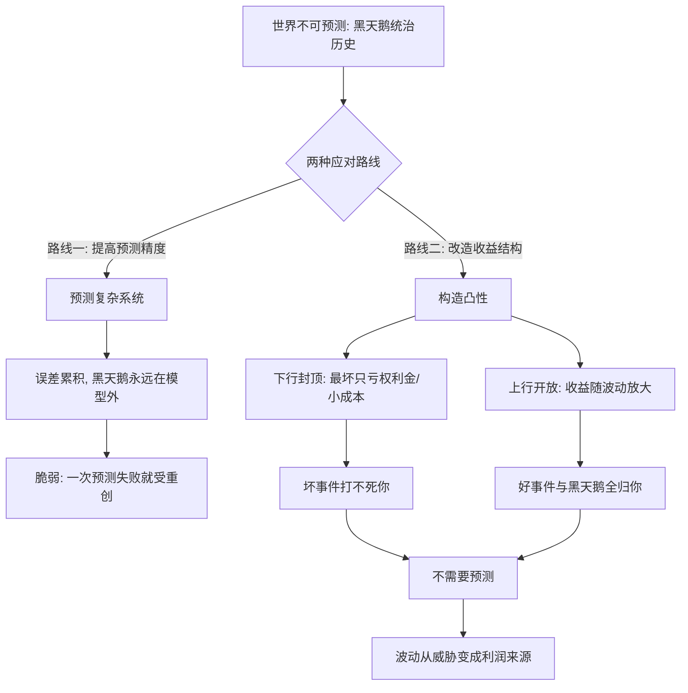

# 04｜凸性与选择权：为什么「亏损有限、收益无限」是反脆弱的本质？

> 本文要解决的问题：反脆弱在数学上到底长什么样？为什么塔勒布说「凸性」才是它的正式定义，而「选择权」是凸性在现实中的名字？

---

## 一、先说结论

反脆弱的本质是一个数学形状，叫**凸性**：坏结果有下限，好结果没上限——亏最多亏这一点，赚却可以翻无数倍。金融期权是最干净的标本：买入一份期权，最坏情况是亏掉权利金，最好情况上不封顶。塔勒布的推论极具颠覆性：**只要你站在凸性的位置上，预测就变得不必要**——你不需要知道未来会发生什么，只需要保证「赌错了代价小、赌对了赚翻天」，然后让波动和意外替你干活。预测问题是认识论难题，凸性问题是结构设计问题；塔勒布把前者整个绕开了。

## 二、我们先理解一个问题

前面两篇说了，反脆弱系统能从冲击和波动中获益。但「获益」到底是一种什么形状的获益？这个问题不问清楚，反脆弱就还是个形容词。

再想一层：主流应对不确定性的办法是预测——预测明年经济、预测项目风险、预测哪个方向会成。但《黑天鹅》已经论证过，真正改变世界的事件恰恰是不可预测的那些。如果预测这条路从根本上靠不住，那面对不确定性还剩什么操作空间？

塔勒布的答案是：还剩**结构**。你可能算不准未来，但你可以设计自己「对未来的暴露方式」——让坏事件来了你只掉层皮，好事件来了你吃到饱。这是一种不依赖任何预测的获利方式。它的数学形状，就是凸性。

## 三、作者到底提出了什么观点？

塔勒布给出反脆弱的正式定义：**对随机性、不确定性和波动性，暴露出凸的收益函数**。用函数图像说：横轴是环境的变化（冲击、波动），纵轴是你的损益。脆弱者的曲线是凹的——好处涨得越来越慢，坏处跌得越来越快；反脆弱者的曲线是凸的——坏处有底，好处没顶。

凸性的关键性质是**不对称**：向下有限，向上无限。塔勒布用了一个简明的表述——如果你喜欢波动，说明你的收益函数是凸的；如果你讨厌波动，说明它是凹的。波动本身是中性的，是你的曲线形状决定了它对你意味着什么。

由此推出他反复强调的操作性结论：**选择权（optionality）是凸性在现实世界中的名字**。期权、选择权、可反悔的安排、低成本的试错——它们的共同结构都是「付出一个小的、封顶的代价，保留一个大的、不封顶的收益」。有了选择权，你对未来的态度就从「必须猜对」变成「猜错也亏得起、猜对就发大财」。塔勒布甚至说，凸性让你对波动的态度发生质变：你不再是「容忍」不确定性，而是希望它越多越好——因为大波动在你的曲线上只会放大右侧的收益，左侧的亏损被下限封住了。

## 四、把这个观点翻译成人话

用大白话说：**凸性就是「输了丢块肉，赢了吃头牛」——只要你把赌桌摆成这样，你连牌都不用看。**

凹性是反过来的形状：「赢了加个鸡腿，输了输掉房子」。大多数人的生活曲线其实是凹的而不自知——稳定工资（收益封顶）配上房贷车贷和单一收入（亏损敞口大开），好年份多攒一点，坏年份可能清零。

凸性思维的精髓是：先别问「未来会怎样」，先问「我这个位置，未来怎么变我才能赚」。如果答案是「它得恰好按我预测的来」，那是凹位置；如果答案是「它怎么变都行，变越凶越好」，那是凸位置。**预测服务于凹位置的人，凸位置的人只需要波动。**

## 五、为什么会这样？

凸性为什么能绕开预测？塔勒布的推理是：

数学上的原因可以用一句话抓住：**凸函数在「平均环境」里的收益，低于它在「有波动的环境」里的平均收益**。也就是说，对凸位置的你，波动不是噪声，是赠礼——震荡越剧烈，右侧的肥尾贡献越大，而左侧亏损被封在下限。凹函数恰好相反：平均环境还行，一有波动，左侧深亏就把期望值拖垮。

这就解释了为什么塔勒布把凸性放在全书中心：它把「反脆弱」从一种性质描述变成了可检验的几何——拿你的收益函数出来，看它弯向哪边。它也解释了「选择权」为什么等价于反脆弱：每一份「低成本保留的权利」，都是往你的曲线上加一段凸性。

## 六、举一个现实生活中的例子

最干净的例子是**金融期权**。你花一笔权利金买一份看涨期权：到期时如果标的暴涨，你的收益跟着涨，理论上没有上限；如果标的大跌甚至归零，你最多亏掉那笔权利金——亏完拉倒，不会再多。这就是一条标准的凸曲线：下行被权利金焊死，上行随市场无限打开。塔勒布长期做期权交易，《反脆弱》里的凸性直觉很大程度上就来自交易台——**期权交易员是唯一一群「波动越大越开心」的人**，因为波动只放大他们的右侧。

更漂亮的例子是他反复讲的**泰勒斯的故事**。古希腊哲学家泰勒斯被嘲笑「哲学不能当饭吃」，于是他用天文学知识预测来年橄榄会丰收——但注意，他没有去赌「一定丰收」，而是提前用极低的定金**租下了当地所有橄榄榨油机的使用权**。如果丰收，榨油机供不应求，他转手抬价，大赚；如果歉收，他损失的只是那点定金。亚里士多德记载此事时说泰勒斯证明了「哲学家想赚钱很容易」。塔勒布却点出更深的一层：泰勒斯真正靠的不是预测准确，而是**买了一个便宜的凸性**——就算预测错了，他亏的也只是定金；预测对了，他赚的是整个榨油季的垄断利润。知识在这个故事里只是锦上添花的由头，真正赚钱的结构是「下行有限、上行无限」的选择权。塔勒布借这个故事说了全书最锋利的话之一：**致富靠的不是知识，是选择权——是不对称的凸性。**

## 七、回到书中重新理解

现在回看前三篇，凸性给它们全部做了一次数学化。

三元组在凸性语言下变成了：达摩克利斯的收益函数是凹的（最好情况是剑不落——收益封顶为零，最坏情况是失去一切），凤凰是平的（冲击前后回到原点，期望为零），九头蛇是凸的（每次冲击的期望收益为正）。「你在哪一格」翻译成「你的曲线弯向哪边」，自我诊断立刻从感觉变成了结构分析。

毒物兴奋效应也获得了新读法：小剂量压力之所以是营养，是因为在可恢复窗口内，你的收益函数是凸的——成本（小损伤）封顶，收益（超额修复）开放。而一旦超阈，函数翻转成凹的——这也解释了「剂量」为什么是全书的总开关：**同一个行为在阈值内是凸的，出了阈值是凹的。**

凸性还顺带回答了「为什么反脆弱者欢迎波动」这个反直觉命题：对凸曲线，波动是把钱从「均值世界」搬运到你口袋里的传送带——黑天鹅不再是敌人名单上的头号通缉犯，而是快递员。

## 八、这个观点背后还有什么？

第一，凸性把「成功学」从运气问题改写成了几何问题。多数成功叙事纠结于「他做对了什么判断」，凸性框架问的是「他站在什么形状上」——很多看似神准的判断，事后看只是当事人恰好站在凸位置，对了大赚、错了小亏，活下来被记住。塔勒布因此怀疑大量关于「远见」的叙事是事后归因。

第二，选择权在这里获得了正式地位：试错、可逆决策、保留退路、低成本的多样化，这些看似「不聚焦」的安排，本质都是购买凸性。塔勒布后面会用「杠铃策略」把这一点操作化——凸性是原理，杠铃是摆法。

第三，凸性暗含一种认识论的降级：它承认「我们不知道未来」，并且不需要假装知道。这在方法论上是对整个预测工业的釜底抽薪——风险管理、战略规划、经济预测，大量行业的立身之本被改写成「先检查你的曲线形状，再谈你的模型」。

## 九、这个观点有问题吗？

有说服力的地方：凸性在数学上是严格的，期权收益结构是可验证的实例，「下行有限上行无限」作为决策启发式在创业（有限责任）、科研（小投入博大发现）、内容创作（一次爆款覆盖全部成本）中确实反复兑现。「先改结构再谈预测」对不可预测系统的应对，也比「把模型修得更准」诚实。

但争议与简化同样明显。第一，凸性不是免费的：期权要付权利金，试错要付时间和机会成本，「低成本保留的权利」在资源受限时并不便宜——塔勒布对「凸性价格」的讨论远少于对「凸性收益」的颂扬，一些学者认为他低估了普通人购买选择权的门槛。第二，「不需要预测」被他说得过满：现实中构造凸性本身就需要判断——买什么期权、付多少权利金、哪个方向值得保留权利，全是带预测性质的决策；凸性降低了对预测的依赖精度，但没有消灭预测。第三，凸性框架对个人命运的解释有过度的幸存者偏差嫌疑：站在凸位置的人多了，赚翻的少数被讲述、亏掉权利金的多数沉默——「摆对位置」与「摆对位置且活下来」不是一回事。第四，关于泰勒斯的解读，学界存在不同意见：有经济史学者认为该故事被亚里士多德和塔勒布各自按需要剪裁过，它作为「选择权优于知识」的论据，说服力更多在修辞而非史实。

所以更稳的读法是：凸性是**判断处境好坏的尺子**，不是「闭眼买凸性就赢」的咒语——先量自己的曲线，再谈怎么把它掰弯。

## 十、今天再看这个观点

以下部分是基于作者思想的现代延伸，不是作者原话。

今天凸性语言已经渗进创业与投资的主流话语：风投的「幂律回报」本质就是凸性——多数项目亏光本金（亏损封顶），少数项目回报百倍（收益无顶）；「有限责任」「最小可行产品」「快速试错」都是凸性采购话术。期权思维甚至成了职业建议：一份工资保底下限，副业与作品保留上不封顶的右侧。

科技行业把选择权玩到了极致：平台型公司保留对无数方向的「期权」（内部孵化、小额投资、收购选择权），行权只在右侧兑现后发生。开源与创作经济也是凸性结构：作品发布的边际成本趋零，传播收益无上限——写作者、独立开发者天然站在凸位置。

反过来，凸性也成了一面照妖镜：凡是「收益封顶、亏损不封顶」的安排——高杠杆、刚性承诺、不可逆的重注——在这个框架下一眼就能认出是凹位置，不管它被包装成多稳健。

## 十一、这一篇真正应该记住什么？

1. 反脆弱的数学本质：收益函数是凸的——坏结果有下限，好结果无上限。
2. 选择权是凸性在现实里的名字：付出封顶的小代价，保留不封顶的大收益。
3. 有了凸性就不需要预测：你只要保证「错了小亏、对了大赚」，剩下的交给波动。
4. 波动对凸位置的人是利润，对凹位置的人是威胁——先查自己的曲线，再定对不确定性的态度。
5. 凸性有价格且不免费：权利金、试错成本、机会成本都要付——它是尺子，不是咒语。

## 十二、留一个问题

拿你现在最大的一项押注（职业、资产、项目）画一条收益曲线：最好的情况你能得到什么？最坏的情况你会失去什么？如果答案是「最好也就那样、最坏不堪设想」，你站在凹侧——那么哪一笔「小代价、大开口」的选择权，是你现在就能买下的？

凸性告诉你要买选择权，但选择权具体怎么摆进生活——多少放保底、多少放大开口？塔勒布给了一个直观到近乎粗暴的摆法：杠铃策略——一头极保守、一头极激进，中间地带整个清空。为什么两头极端反而比温和中庸更安全？下一篇来拆。
