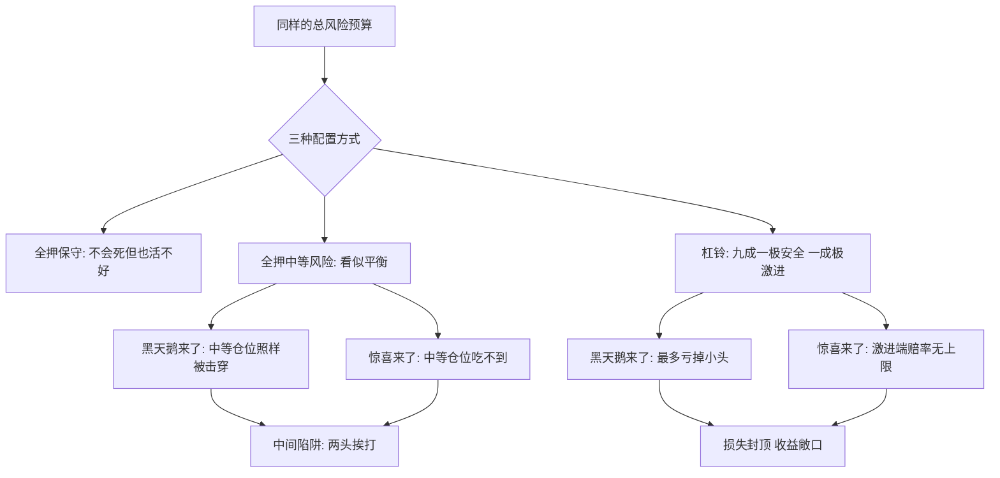

# 05｜杠铃策略：为什么两头极端比温和中庸更安全？

> 本文要解决的问题：为什么把资源押在「极保守＋极激进」两头，反而比四平八稳的中等风险更能扛住意外？

---

## 一、先说结论

中等风险是最危险的位置：它不够安全，扛不住黑天鹅；也不够激进，抓不住意外的好处。塔勒布给出的替代方案叫「杠铃策略」——把绝大部分资源放在极端安全的一端，把一小撮资源押在极端冒险的一端，让中间地带归零。损失被锁定在小头，收益在大头敞口；温和中庸看似平衡，实则两头挨打。

## 二、我们先理解一个问题

假设你有一笔钱要安放，理财顾问给了三个方案：全部存银行（安全但跑不赢通胀）、全部拿去投机（可能翻倍也可能腰斩）、或者「稳健型」——一半保守一半进取，风险「中等」。

第三个听起来最合理，也几乎是所有人会选的答案。但塔勒布会问一句：中等风险到底防住了什么？崩盘来了，「中等」的组合照样被打穿；大行情来了，「中等」的仓位又吃不到多少。它防不住最坏，也接不住最好——只是把「确定的平庸」包装成了「平衡」。

真正的问题因此变成：有没有一种结构，让最坏的情况锁死、最好的情况敞开？

## 三、作者到底提出了什么观点？

塔勒布的答案是：不要平均分配风险，要把风险推到两个极端。

杠铃策略得名于健身房的杠铃——重量集中在两端，中间是空的。对应到配置上：一端是极度保守，占约 85%～90%，放在「怎么都不会出事」的地方；另一端是极度激进，占约 10%～15%，押进高风险、高赔率的投机。中间那些「不上不下」的部分，全部砍掉。

关键在不对称的数学。激进那一端，最多亏掉这 10%～15%——损失有底；但一旦押中，回报可能是几倍几十倍——收益无顶。保守那一端保证你无论发生什么都不会出局。两头合起来：最坏情况是有界的，最好情况是无界的——这正是凸性在资产配置上的形态。

塔勒布还强调，杠铃不是「一半一半的对冲」，而是「双峰结构」：中间地带必须真的清空。因为中等风险资产恰恰最容易被黑天鹅击穿——它给你安全的幻觉，却不给你极端的赔率。

## 四、把这个观点翻译成人话

用大白话说：**与其温吞地赌一把，不如一手攥紧保命钱，一手攥紧彩票。**

温和中庸的逻辑是「不要把鸡蛋放在一个篮子里」，于是把鸡蛋分到一堆差不多的篮子里。杠铃的逻辑是：把鸡蛋分成两堆——一堆焊死在保险柜里，一堆扔去搏一把大的。中间那些「比上不足、比下有余」的篮子，才是真正的陷阱：你以为是稳妥，其实是两头不占。

## 五、为什么会这样？

塔勒布的解释在于「非线性」。中等风险头寸面对极端事件时，损失不是中等的，是被放大的——你自以为买了「中庸」，实际上买的是一个对黑天鹅完全暴露的头寸。而杠铃把损失函数掰弯了：左边的地板是混凝土，右边的天花板被拆掉。

历史事实层面有两个参照。其一是塔勒布自己的交易员经历：他长期把大部分身家放在极保守的资产里，同时持续买入便宜的、深度虚值的期权这类「彩票」，在 1987 年股灾等极端行情中获益——这段经历他反复自述，也是杠铃策略的原型。其二是 2008 年金融危机中，大量标榜「中等风险」「平衡型」的产品和基金被打穿，常被引为中间地带脆弱性的佐证。

## 六、举一个现实生活中的例子

资产杠铃是最直接的版本。按塔勒布的讲法，一个人可以把大约 85%～90% 的钱放在极安全的地方——短期国债、随取随用的存款，这些资产几乎不增值，但也几乎不会消失；剩下 10%～15% 全部押进高风险、高赔率的投机——风投、冷门赌注、赔率悬殊的期权，赔光也无所谓，押中一次就够。

注意这不是「分散投资」。分散投资是把钱铺在中等风险的平面上；杠铃是把中间抽干，让风险只存在于一个你亏得起的格子里。

塔勒布在书里还给过职业版本的杠铃，是他很偏爱的一个结构：一些作家白天做一份清闲、稳定、几乎不用动脑的工作，晚上全力写作。白天那一端是极保守——收入稳定、风险为零、不消耗创造力；晚上那一端是极激进——写作可能一文不值，也可能名留青史，赔率没有上限。

这个结构比「全职写作但时刻担心生计」更稳，也比「做一份耗尽精力的职业、业余随便写写」更激进。那份清闲工作不是妥协，是杠铃的安全端：它保住了底线，人才放得开上限。

## 七、回到书中重新理解

回到《反脆弱》的整体框架，杠铃是「凸性」的操作化。前面说过，反脆弱的本质是损失有限、收益无限——杠铃就是把这句话翻译成配置语言：安全端负责「损失有限」，激进端负责「收益无限」。

这也解释了塔勒布为什么对「预测」不屑一顾。杠铃成立的前提是承认不可预测：因为不知道黑天鹅什么时候来，所以左端必须保险到不需要预测；因为不知道惊喜从哪里冒出来，所以右端要敞着口等。杠铃不是赌方向的策略，是放弃赌方向的策略。

## 八、这个观点背后还有什么？

杠铃背后有三层东西。

第一，它是一种认识论立场：承认自己不知道未来，然后设计一个「不需要知道也死不了」的结构。这与依赖预测的中间路线在哲学上相反——中间路线假装风险可以被计算，杠铃承认极端事件根本不可计算。

第二，杠铃不限于钱。塔勒布自己把它扩展到阅读（要么读经典要么读闲书，不读平庸之作）、锻炼（要么高强度要么散步，不做温吞的中等强度）、写作（要么写给极少数懂的人要么写给大众，不讨好中间读者）。它是一种通用的「双峰」思维。

第三，杠铃暗含对「中庸美德」的质疑。我们被教育「过犹不及」「凡事适度」，但塔勒布指出，在不对称的世界里，适度恰恰是两头不占的位置。顺着这条思路往下走，会通向一条更安静的路线——不只是怎么摆放资源，而是怎么动手删除。

## 九、这个观点有问题吗？

说服力是明显的：杠铃在数学上确实把损失封顶；2008 年危机里大量「中等风险」产品的崩溃给了它历史注脚；作为个人策略，「保底＋押注」也比「全押中庸」更符合普通人对风险的真实承受力。

但边界同样要说清。第一，两端的具体比例（85 比 15 还是 90 比 10）塔勒布没有给出可操作的公式，它更像方向性原则而非精确配方，落到实操仍需个人判断。第二，「极安全」端本身是个脆弱的假设：所谓绝对安全的资产在恶性通胀、主权债务危机里未必安全——塔勒布对此有讨论，但读者容易把安全端当成无需思考的结论。第三，一些学者认为，如果风险可以被合理定价，分散化的中间配置在期望收益上未必劣于杠铃；关于「中等风险是否注定被黑天鹅击穿」，学界存在不同解释——杠铃的优势高度依赖「极端事件不可定价」这个前提，而这个前提本身就有争议。第四，职业杠铃对多数人有现实门槛：「清闲而稳定的工作」本身就是稀缺品，塔勒布的例子更接近幸运者的选择，而非人人可复制的方案。

所以更准确的读法是：杠铃是一种「承认无知」的结构，而不是「稳赢」的结构——它保证你不死于未知，不保证你战胜已知。

## 十、今天再看这个观点

以下部分是基于作者思想的现代延伸，不是作者原话。

今天杠铃策略的影子比成书时更广。个人理财里的「核心—卫星」配置、公司战略里的「主营保底＋创新押注」、个人技能结构里的「一门深到不可替代的手艺＋若干低成本试错的小项目」，都是杠铃的变体。零工经济在某种意义上天然是杠铃的：一份保底收入加几个高风险尝试，比起把全部身家押在一个职业上，结构上更接近反脆弱。

但也要警惕「伪杠铃」：把中等风险换个名字叫「稳健配置」，本质还是赖在中间地带。判断是不是杠铃，不看有没有两头，看中间是不是真的空了。

## 十一、这一篇真正应该记住什么？

1. 杠铃 = 极保守的一端＋极激进的一端，中间清空。
2. 中等风险是最危险的位置：扛不住黑天鹅，也抓不住惊喜。
3. 杠铃的数学本质：损失封顶（亏得起的只有小头），收益敞口（赔率无上限）。
4. 杠铃不限于钱：职业、阅读、锻炼都可以双峰化。
5. 杠铃的前提是无知——它不预测，只占位；保证不死，不保证赢。

## 十二、留一个问题

看看你现在的资源配置——钱、时间、精力——是摊在一片「中等」上，还是清清楚楚地分成了「保命的一头」和「搏一把的一头」？

杠铃是在结构上布置反脆弱：不靠预测，靠位置。但塔勒布还有一条更安静的路线——不是研究怎么摆，而是研究怎么删。知道该拿掉什么，往往比知道该加什么更可靠。下一篇，我们看「减法」为什么比「加法」更接近智慧。
