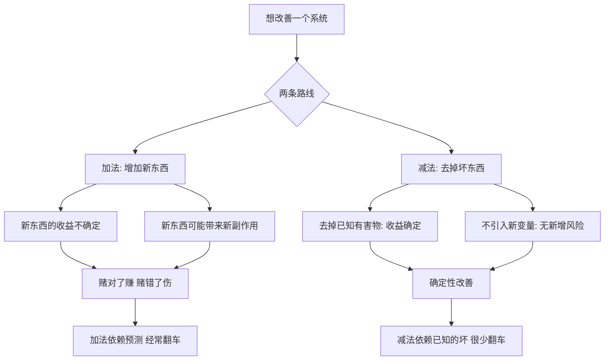

# 06｜减法的力量：为什么「少」比「多」更接近智慧？

> 本文要解决的问题：为什么塔勒布认为，去掉坏东西常常比增加好东西更有效？「否定法」这条古老路线对今天的决策意味着什么？

---

## 一、先说结论

我们对「什么有害」的了解，远比对「什么有益」的了解确定。因此塔勒布推崇 via negativa（否定法）：与其不断做加法——吃保健品、上新疗法、加新流程——不如先做减法：戒烟、减药、删掉坏习惯。减法的收益是确定的，加法的收益是赌的；智慧往往藏在「少」里，不在「多」里。

## 二、我们先理解一个问题

想象一个人想「变得更健康」。他的第一反应通常是加法：买保健品、办健身卡、补充维生素、下载冥想应用。很少有人第一反应是：先把烟戒了。

为什么？因为「加一个东西」有明确的产品可买、动作可做、努力可晒；而「去掉一个东西」没有新东西可炫耀，只是「不再做」某件事。加法看起来像在做事，减法看起来像什么都没做。

但从收益的确定性看，顺序完全相反：戒烟带来的好处，是医学史上最确定的结论之一；而大部分保健品的收益，至今仍在争论里打转。这里藏着一个深刻的不对称——**我们知道什么会杀死我们，远比知道什么会拯救我们清楚。**

## 三、作者到底提出了什么观点？

塔勒布在书里用的拉丁词是 via negativa——否定法。这个思路在神学里很古老：描述终极存在，与其说他「是什么」，不如说他「不是什么」。塔勒布把它搬到决策上：**改善一个系统，优先手段是移除，不是添加。**

他的理由是知识的不对称。正面知识（什么有益）积累慢、易翻车：今天的「健康食品」明天可能被证伪，过去几十年膳食建议的反复反转就是现成例子。负面知识（什么有害）积累稳、不易翻车：吸烟有害、酗酒有害，这类结论经受了时间和几十个国家数据的检验，几乎没有反转过。

所以塔勒布的处方是：面对不确定，先做减法，再做加法。因为新加进来的东西可能带着看不见的坏处——他把这类由「治疗或干预本身」造成的伤害叫医源性伤害，这个概念会在「无为」那里继续展开。

## 四、把这个观点翻译成人话

用大白话说：**先把坑填了，再谈盖楼。**

加法思维问「我还能多做点什么」，减法思维问「我现在做的哪件事在害我」。前者永远有新答案，后者常常一个答案就值回票价。一个人熬夜、抽烟、久坐，然后认真询问「该买什么保健品」——在塔勒布看来，这不是养生，是给坏习惯买保险。

## 五、为什么会这样？

为什么负面知识比正面知识可靠？塔勒布给出的解释之一是证伪比证实容易：要证明「X 有益」，需要排除所有替代解释、跟踪足够长的时间；而确认「X 有害」，往往一次事故就够了。另一个原因是时间筛选：活了几千年的禁忌——别酗酒、别暴食——是通过了漫长生存检验的，而刚上市的「有益新事物」还没经过这场考试。

历史事实层面，营养学的反复是现成的例子：黄油、鸡蛋、脂肪、碳水在过去半个世纪里轮流被宣判和赦免；而「吸烟有害」自二十世纪中叶大规模流行病学研究以来从未动摇。一些学者认为这恰好说明：正面建议的保质期短，负面警告的保质期长。

## 六、举一个现实生活中的例子

第一个例子是戒烟戒酒。一个长期吸烟者把烟戒掉，换来的好处——心血管风险下降、肺癌风险下降、预期寿命延长——是现代医学确定性最高的一批结论，有大规模长期追踪数据支撑。相比之下，市面上绝大多数保健品、抗氧化剂、补剂，收益要么微小、要么仍在争论、要么只对特定人群成立。塔勒布式的排序很清楚：确定的大收益（戒掉已知的坏），永远排在不确定的小收益（加上未知的好）前面。

第二个例子是吃药。塔勒布反复批评现代医学的加法倾向：病人已经在吃五种药，医生再加第六种时，很少认真计算药物之间的相互作用——而「减掉一种药」常常比「加上一种药」更安全、收益更确定。多药并用在老年医学里是公认的风险源，这是医学文献中的事实而非塔勒布的私见；「精简处方」在老年病学实践中已被证明能减少跌倒、住院等不良事件。减掉一种确定不必要的药，胜过加上一种也许有用的药。

## 七、回到书中重新理解

在《反脆弱》里，via negativa 不是孤立的养生建议，而是「无知管理」的一部分。塔勒布的整体立场是：我们对世界的正面知识远没有自以为的多，但负面知识相当扎实。减法就是把这个不对称变成行动——既然不知道什么是最好的，至少知道什么是最坏的；先除掉最坏的，系统自己会长出好的。

这也呼应了他的反脆弱定义：一个去掉了明显脆弱源的系统，不需要你继续「优化」它——剩下的部分会自己在波动里改进。加法是你替系统做决定，减法是给系统腾地方。

## 八、这个观点背后还有什么？

第一，via negativa 是一种「反向定义智慧」的思路。幸福难以定义，但痛苦很具体；好生活难以规划，但坏习惯一目了然。塔勒布认为，试图正向定义「好」往往徒劳，而负向清除「坏」立刻可操作——这和杠铃一样，都是「承认无知然后行动」的策略。

第二，它颠覆了「进步等于积累」的直觉。文明的很多进步是删除：删除放血疗法、删除食物中的有毒物质、删除危险的习俗。「做了更多」不等于「做得更好」，有时恰恰相反。

第三，减法预定了下一步的问题：如果删除常常优于增加，那「什么都不删、什么都不加」呢？减法推到极限就是不干预——什么时候「无为」本身就是最好的处方，这是医源性伤害要正面回答的问题。

## 九、这个观点有问题吗？

说服力很实：负面知识确实更稳定——吸烟有害的结论半个世纪未反转；多药并用的风险是医学界公认事实；「先除坏、再谈好」作为个人决策启发式几乎零成本。

但问题同样清楚。第一，减法不是万能的：有些改善只能靠「加」——疫苗是往身体里加东西，抗生素是加东西，骨折复位是加干预；如果只在有害性已确认时才行动，会错过只有加法能抓住的收益。第二，「确定什么有害」本身也有翻车史：一些曾被当作禁忌的东西后来被平反，负面知识只是比正面知识稳，不是不会错。第三，一些学者认为 via negativa 在医学上是过度简化：循证医学并不区分「加药」和「减药」的认识论地位，只看证据强度——减掉一种「其实有用」的药同样害人。第四，塔勒布对现代医学加法倾向的批评，容易滑向对治疗本身的普遍怀疑；关于何时该干预、何时该减，学界存在不同解释，减法的边界需要专业判断，而不是一句口号。

所以更准确的读法是：减法是优先级，不是排他律——先删确定的坏，再谈加不确定的好，但不是永远不加了。

## 十、今天再看这个观点

以下部分是基于作者思想的现代延伸，不是作者原话。

今天的「减法热」——数字极简主义、断舍离、信息戒断、组织里的砍流程运动——都是 via negativa 的世俗版本。工作场景里，「删掉一个例会」比「加一个效率工具」更常带来确定改善；产品设计上，「删掉一个功能」比「堆一个功能」更常提升体验。健康领域也有呼应：戒掉深夜刷手机对睡眠的确定性好处，胜过任何助眠产品的广告词。减法的现代对手不是别人，正是「总得有新产品可卖」的商业逻辑——没人能靠卖「别做某事」发大财，所以减法永远缺乏代言人。

## 十一、这一篇真正应该记住什么？

1. via negativa：改进系统，优先移除而非添加。
2. 知识不对称：什么有害比什么有益确定得多——负面知识更扛时间。
3. 戒烟戒酒、减掉多余的药物：确定的大收益胜过不确定的小收益。
4. 加法引入新变量和新副作用；减法不引入新风险。
5. 减法是优先级不是排他律——先删坏，再谈加好。

## 十二、留一个问题

列一张「我正在做的事」的清单，只问一句：哪一件如果明天停掉，我几乎确定会变好？

减法的尽头是一个更激进的问题：如果去掉坏东西如此有效，那干脆「什么都不做」呢？什么时候医生不治疗、官员不出手、管理者不调整，反而是最好的选择？下一篇，我们谈「无为」——以及它为什么不是懒。
