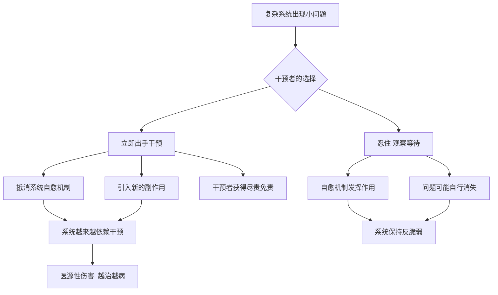

# 07｜什么时候「什么都不做」是最好的干预？

> 本文要解决的问题：为什么医生、官员、管理者的「有所作为」常常帮倒忙？塔勒布说的「医源性伤害」和「拖延的智慧」到底指什么？

---

## 一、先说结论

干预的副作用常常超过收益——塔勒布称之为「医源性伤害」。在复杂系统里，「等一下」本身就是决策：身体有自愈力，团队有自组织力，市场有自我调节力。无为不是懒，是给系统的自愈留时间；真正需要勇气的，常常不是出手，是忍住不出手。

## 二、我们先理解一个问题

想象一个医生面对病人。病人不舒服，家属在催，同行都在开药，而医生心里其实没把握这药到底帮不帮得上忙。开药，他「尽到了职责」；不开药，他要独自承担「不作为」的指责。

注意这里的不对称：开错了药，责任可以推给「按指南办事」；没开药出了问题，责任全在医生个人。于是系统性地，医生倾向于过度治疗——不一定因为药有效，而是因为「出手」在职业上更安全。塔勒布要拆穿的正是这一点：**有些「作为」是为病人做的，更多「作为」是为干预者自己免责做的。**

那么问题就成了：怎么区分「该出手」和「该忍住」？

## 三、作者到底提出了什么观点？

塔勒布借用了医学术语 iatrogenics——医源性伤害，即治疗本身造成的伤害。他的主张是：这个词不该只留在医院，要扩展到一切干预——政府的、管理的、教育的、育儿的。只要一个复杂系统本身有恢复能力，外部干预就可能在三个地方帮倒忙：抵消系统的自愈、引入系统没见过的新风险、把干预者的利益错当成系统的利益。

由此他给出一条判断线：**当伤害来自「看不见的小毛病」而非「生死攸关的大问题」时，干预的期望值是负的。** 反过来说，真正的紧急情况——大出血、系统性崩溃的边缘——该出手还是要出手。他反对的不是干预本身，是「为了显得在做事而干预」。

塔勒布还为「拖延」翻了案：拖延常常是身体或系统发出的自然信号——还没准备好、信息还不够、问题可能自己消失。把拖延一律当病治，是现代人对自然信号的系统性强拆。

## 四、把这个观点翻译成人话

用大白话说：**不是所有问题都等你解决，大部分问题等你别添乱。**

「有为」的幻觉在于：出手了就感觉尽了力，结果好坏都有交代。但系统的账本不这么算——自愈被干扰一次，下次就更依赖干预；小毛病被过度治疗，治出来的大毛病又得靠更多干预去压。雪球滚到最后，干预者忙个不停，系统的病越来越重。

## 五、为什么会这样？

为什么系统倾向于被越治越坏？塔勒布的解释有两层。一是激励不对称：干预的收益归干预者——免责、存在感、收入；干预的代价归系统——副作用、依赖、脆弱化。决策者不必为副作用埋单，过度干预就成了理性选择。二是复杂系统的不可预测性：系统内部关联多到任何干预都有二阶、三阶效应，而这些效应在出手之前根本看不见。

历史事实层面，医学史是医源性伤害的重灾区：放血疗法盛行近两千年才退场；二十世纪中叶大量儿童被常规切除扁桃体，后来回顾发现多数手术并无必要——这些在医学史文献中都有明确记载。塔勒布引用这些，不是说医学无用，而是说干预的账本里，「副作用」那一栏长期被少记了。

## 六、举一个现实生活中的例子

扁桃体切除潮是塔勒布反复点名的案例。二十世纪中叶，欧美医生把扁桃体当成「多余的麻烦制造者」：孩子嗓子稍微发炎，方案就是切掉。手术量巨大，扁桃体切除一度是最常见的儿童手术之一。后来的研究和回顾发现，其中相当大比例的手术并无必要——许多孩子本来会自愈，扁桃体也并非无用器官，它是免疫系统的一部分。一批孩子的正常腺体，换来的是手术风险、麻醉风险和免疫结构的人为改动。这就是教科书级的医源性伤害：治疗确实存在，收益可疑，代价确定。

管理的版本每天都在发生。一个运转正常的团队，新领导上任想「做点事」：调架构、换流程、加汇报。每个调整单独看都「合理」，合起来的效果是——团队被迫花时间适应干预而非做正事，原本的自组织节奏被打断，半年后效率反而下降。塔勒布式的判断是：管理者真正的测试不是「能不能改」，是「能不能忍住不改一个运转正常的系统」。

拖延的信号则是更个人的例子。有些拖延确实是病理性的逃避，但相当多拖延是身体在说「还没准备好」：信息不够、方案不成熟、问题可能自己化解。塔勒布自己的做法是让拖延做筛选器——那些「不拖到最后一刻其实就不必做」的事，很多时候确实不必急着做。

## 七、回到书中重新理解

在《反脆弱》的脉络里，无为不是消极，而是减法的极限形态：减法说「删掉坏东西」，无为说「有时候连删都别急着删」。两者共享同一个前提——复杂系统有自己的恢复力，而人对这个恢复力的信任，远不如对自己干预能力的信任。

塔勒布把「不干预」放进反脆弱框架的理路是：反脆弱系统需要波动来生长，而干预恰恰是波动最大的敌人。忍住不干预，就是让系统继续暴露在它需要的小压力里——顺着这条线走下去，会遇到比过度干预更隐蔽的对手：那些专门消灭一切小波动的人。

## 八、这个观点背后还有什么？

第一，医源性伤害本质上是代理问题：做决策的人和承担代价的人不是同一个。医生开药，病人吃药；官员出政策，社会消化后果；管理者调架构，团队埋单。只要代价可以转嫁，过度干预就永远是理性选择——这是制度问题，不只是医学问题。

第二，「等一下」在认识论上的地位被低估了。等待不是「没决策」，而是用时间换更多信息、让不确定性自己消散的决策。塔勒布认为，现代文化把「立即行动」等同于「负责任」，是对时间价值的系统性误读。

第三，无为有古老的谱系：老子的「无为而治」、希波克拉底誓言里的「首先，不伤害」、医学里的观察等待传统。塔勒布做的事是把这条古老的线，接进现代复杂系统的语言里。

## 九、这个观点有问题吗？

说服力方面：扁桃体切除潮、放血疗法是白纸黑字的医学史；过度医疗和多药滥用在现代卫生经济学里有大量数据；管理上的「折腾」几乎每个上班族都有体感。「首先，不伤害」作为第一原则，几乎无法反驳。

但边界同样明显。第一，「无为」在真正的紧急情况下是灾难——心梗病人需要的不是观察等待；塔勒布自己也划了「生死攸关」这条线，但这条线在实践中并不好画，事后一目了然的「过度干预」，事前常常难以识别。第二，拖延作为「自然信号」的辩护容易被滥用：有些拖延就是该治的拖延症，「智慧的等待」和「逃避」之间没有客观的分界线，这个框架可能被拿来美化不行动。第三，一些学者认为医源性伤害的叙事有选择性：它列举了干预的失败史，却对干预的巨大成功——疫苗、抗生素、外科、公共卫生——着墨很少；关于「人类健康改善中干预的净贡献是正还是负」，学界存在不同解释，主流观点显然认为现代医疗的净收益为正。第四，「系统有自愈力」这个前提在社会系统里不总成立：腐败、结构性不平等这类问题，不干预只会恶化，不会自己消失。

所以更准确的读法是：无为是一种需要论证的干预，而不是默认正确的不干预——「忍住」和「出手」一样，都要为后果负责。

## 十、今天再看这个观点

以下部分是基于作者思想的现代延伸，不是作者原话。

今天医源性伤害的概念已经扩展到更广的战场：筛查普及时代的「过度诊断」——把本来不会伤害人的早期病变激进治疗；育儿领域的「直升机父母」——用过度安排消灭孩子的自主恢复力；组织里的「改革疲劳」——每任领导一套新流程。现代医学内部也在纠偏：减少不必要检查、对某些癌症采用观察等待而非立即手术，已是部分国家的正规选项。塔勒布的提醒在今天依然成立：评估任何干预时，把「干预者的免责收益」和「系统承担的真实代价」分开记账。

## 十一、这一篇真正应该记住什么？

1. 医源性伤害：治疗或干预本身造成的伤害，适用于一切复杂系统。
2. 干预的激励不对称：出手者免责，系统埋单——于是系统性过度干预。
3. 「等一下」是决策：给自愈留时间，让信息长出来。
4. 拖延有时是信号：身体在说还没准备好，问题可能自己消失。
5. 无为不是不负责的借口——紧急情况该出手仍要出手。

## 十二、留一个问题

回想你最近一次「忍不住出手」——改了一份其实没问题的方案、替孩子解决了他自己能解决的事、给运转正常的团队加了一条新规矩——它的收益和副作用，你分开记过账吗？

而比「过度干预」更隐蔽的危险还在后面：有一类人专门做的事，是系统性地消灭小波动、小噪声、小混乱——他们扑灭每一场小火，于是燃料在森林里堆积成山。塔勒布叫他们「脆弱推手」。下一篇，我们看「稳定」为什么是最贵的幻觉。
